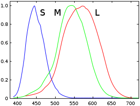

# Color Basics and Channels

Raster Images, which is what ImageMagick deals with (in general) basically consists of an array of individual points or pixels of color.
Modifying the individual points and how they are represented is what we will look at in this section.

In the next section we will look at more general global modification of the colors in an image as a whole.

------------------------------------------------------------------------

## What is Color? {#intro}

To really understand color, you need to know exactly what color is.

In the physical world color is actually an illusion.
We see color because our eyes sense the physical world in very special limited way.
Basically in our eyes we have special sensors for Red, Green, Blue, and a minor lesser sensor for peripheral and low light conditions.
The later is why we see only grey colors at night.

For more info see [Wikipedia, Cone Cells](http://en.wikipedia.org/wiki/Cone_cell), the graph right which is the response of a typical human eye to different wavelengths of light.

Because of this we only sense the world in terms of Red, Green and Blue electromagnetic wave lengths, and this is why images and image processing is generally all about Red, Green, and Blue, or RGB.

 However it isn't quite as simple as that either.
Each of our color sensors actually respond to a range of wavelengths.
For example when we see a yellow light, we actually sense the light using both red and green sensors.
If our color sensors were strictly pure red and green detectors, we would not see any yellow colors at all.
Rainbows would in fact show 'gaps' in it.

That means a TV or computer display is actually fooling us into seeing yellow by the monitor emitting just the right mix of red and green light, rather than actual yellow light.
Our color sensors see the same intensity as it would for a pure yellow light, and as a result we see yellow, even though in reality we are really seeing two different color frequencies.
We just can not tell the difference between a pure yellow, and a mix of red and green light.
In a similar way blue-red (purple) colors do not actually exist as a single specific wavelength, but only as a mix of at least two color frequencies, though strictly speaking violet is a specific frequency we do react to, mostly by blue, and very slightly by the other two sensors.

Note we actually have a forth vision sensor, but it is not color, but a low light detector, which is used for night vision, when cone sensors no longer work very well.
This is why night time looks monocromatic, and moon light is all grays.
This sensor is also probably the reason why sRGB colorspace (see below) has a odd linear component for very dark colors in it.

ASIDE: Other animals have different sensors to us.
Bees and most other insects have sensors for ultra violet, as such to them our printed images, TVs, and billboards would probably make very little sense.
More than likely these artificial images would probably look more like a rather horrible false color image, than the near perfect color we humans are fooled into seeing.
Some animals have 4 color sensors, while others only have one (black and white) or two.
Also some animals see movement far better than any specific color (such as a bull, who contrary to popular belief can not see red, but blue-violet and green wavelenths).
As such a monitors 50/60Hz update cycle may look like a blaze of movement rather then some sensible image!

For more information see [Wikipedia, Color Vision](http://en.wikipedia.org/wiki/Color_vision) and [Wikipedia, Color](http://en.wikipedia.org/wiki/Color).

### RGB Color Space, and Channels {#rgb}

So RGB color space is really a way of representing images using three values Red, Green, and Blue, that will fool us into thinking we are seeing something in the real world.
Images can thus be stored as an 3 arrays values, with each of the three values forming a single pixel, or point of color, to be displayed.

Each of the three arrays of values are known as a channel, which is simply a gray-scale image representing the amount of light to create for just one of our color sensors.

For example here are the red, green, and blue components of a rose image.
  
[![\[IM Output\]](rose.gif)](rose.gif)  
Rose
  

  
[![\[IM Output\]](separate_RGB_0.gif)](separate_RGB_0.gif)  
Red
  
[![\[IM Output\]](separate_RGB_1.gif)](separate_RGB_1.gif)  
Green
  
[![\[IM Output\]](separate_RGB_2.gif)](separate_RGB_2.gif)  
Blue

Note how the 'Red' image is much brighter to display a rose, than the other two color components.
But all three images are bright for the white patch near the bottom.

**RGB are Additive Colors**

Now Red, Green, and Blue colors are termed 'additive' colors.
That is the colors are added together to form the final color image.
This is because those are the dominant colors our eyes see, and by combining them together we can effectively generate almost every color our eyes can see.

They are additive in that starting with black, such as a blank monitor, you would then add red, green, and blue light to generate the appropriate colors for the image we see.
The key to this is that you start with a black, or the absence of light, and then add appropriate amounts of red, green, and blue.

You can also get the same effect by shining three torches with red, green and blue cellophane taped over the ends, in a dark room.
When the three colors shine on the same spot say on a white wall, we see white.

It is because of how our eyes actually see these 'primary' colors, that color images are generally expressed in terms of RGB values, which are also termed 'color channels'.

### CMY color space {#cmy}

When you are printing you have a different problem.
A piece of paper can not generate light, only reflect it.
As such you need to start with a surface that reflects all the light that hits it, in all directions.
That is what a white surface is.
Hopefully the light it is reflecting is itself a pure white light either from the sun shining in the window, or being generated by the lights in our artificially lit rooms.

Now to create an image on that paper you need to apply ink to that surface, which actually removes particular wavelengths of light.
As we 'sense' red, green, and blue colors, those are the colors we want to selectively remove from the light reflecting from that white piece of paper.
Consequently we use a cyan ink to remove red light, magenta to remove green light, and yellow to remove blue light.
The amount of Cyan, Magenta, and Yellow ink needed to generate a specific color produces what is termed CMY colorspace.

Here I generate a ink masks is needed to generate a rose image using just cyan, magenta and yellow inks (assuming the inks are 'linear')

]
]

That is the brighter the cyan mask values, the more cyan ink will be needed to remove more of the red.
In other words a cyan mask is the exact negative of the mount of red light we want the paper to reflect.

In fact all three of the above channel images are the exact negative of what was generated for RGB color-space.

So really to convert a RGB image to a CMK image all that you need to do is [Negate the Image](../color_mods/#negate) and then declare the image to be in CMY color-space.

As we are selectively removing wavelengths, Cyan, magenta, and Yellow are known as 'subtractive colors'.

### CMYK color space {#cmyk}

The major problem with selectively removing wavelengths, is that just removing all red, green, and blue light, by applying all three cyan, magenta, and yellow inks, does not actually remove all the light that is being reflected.
As a result you will be left not with a black color, but a horrible looking muddy brown color.

The inks (or light filters) are not perfect, just as our own eyes are not perfect.
As I mentioned before, each of our color sensors does not see just one wavelength of light, but a range of wavelengths that we interpret as being 'red' 'green' or 'blue' (or a mix of those colors).
So much so that our 'blue' light sensor can actually see (though not very well) a little ultra violet, which is why we can just sense 'black light lamps' in a perfectly dark room.

It is because of this 'leakage' of color from the CMY inks, and our own imperfect eyes, that we also add a pure black ink to the mix, allowing it to be used to wipe out ALL light that could be reflected from paper.
To prevent it being confused with blue the black ink or channel is assigned the letter K.
As such for printing we use four colored inks: Cyan, Magenta, Yellow, and blacK; and define images using these inks, to form a CMYK color space.

For example here are the appropriate CMYK components separated out from this image.
  

Note how the amount of cyan, magenta, and yellow has been reduced and is now darker than in CMY colorspace, as there use was replaced by an appropriate amount of black.
That is when all three inks are present for a particular pixel, black is used instead.
As such to print say pure black, you only use pure black ink, and no other inks.

Remember the 'blacK' in the above is the amount of black ink to apply to a piece of paper, so the brighter the greyscale channel image is, the more black ink should be used.
As such it is also a negative looking image, just like the other three images.

Of course adding a pure black in a color printer makes printing black text, a lot simpler, as you no longer need to print three different inks, overlaid perfectly on the same spot, to generate pure black lines, letters, and shapes.
This means far less ink, with the paper becoming less 'wet' and less likely to run or smuge, which is especially good for printers.

For another similar discussion of how RGB and CMYK colors work see the introduction page of.
[XaraXone Workbook, Defining Color](http://www.xaraxone.com/webxealot/workbook40/page_1.htm).

### Other Color Spaces {#other}

Other colorspaces are just other ways of representing those same colors, or some of the others beyond strict RGB that our imperfect eyes can also make out.
However such color spaces have little bearing on either displaying those colors using a monitor, or in printing.

They basically represent other ways of handling and/or processing the colors of an image, so as to enhance or highlight specific things such as...

-   Better non-linear handling of Dark Colors ([sRGB](http://en.wikipedia.org/wiki/SRGB))
-   Color rainbows and hues ([HSB,HSL,HSI,OTHA](http://en.wikipedia.org/wiki/HSL_and_HSV) color spaces - intensity not preserved)
-   Standardized definition colors ([XYZ](http://en.wikipedia.org/wiki/CIE_1931_color_space))
-   Precise or Perceptual Color Differences ([LAB](http://en.wikipedia.org/wiki/Lab_color_space) and [LUV](http://en.wikipedia.org/wiki/Luv_color_space) colorspace, and their LCHab and LCHuv cyclic hue equiv)
-   Expanded High-Dynamic Ranges (for use with HDRI images) ([scRGB](http://en.wikipedia.org/wiki/ScRGB))
-   Better compression of color values (such as in [YIQ](http://en.wikipedia.org/wiki/YIQ) and [YUV](http://en.wikipedia.org/wiki/YUV))
-   Transmission for TVs (YCbCr, YPbPr, where Y = BW signal)

One final colorspace I have yet to mention is 'GrayScale', but that is just a simple single array of pixel values.
Ho you interpret these values is variable as they could represent many different things.
Typically such an image is considered to be Linear-Grayscale and similar to linear RGB, (as apposed to non-linear sRGB).

IM version 6 actually does not have such a color space, and only fakes, it with linear RGB color space, setting all RGB settings to the same value.
If the three values are not the same, the image is no longer grayscale.

IM version 7 Greyscale is a single channel image (much smaller memory usage).

> 
> The above changes to the 'colorspace' of an image is only a gross arrangement of the colors of an image within memory.
> It also provides very basic (simplistic) color conversions between different colorspaces.
>
> For exact color specifications and color conversions [Color Profiles](../formats/#color_profile) should be used instead, but only works when using image file formats that can handle color profiles.

------------------------------------------------------------------------

## Gamma Correction and sRGB Colorspace

### Human Color Perception {#perception}

In the above we saw that you can represent images in many different ways.
All the color-spaces we looked at above are known as 'linear' colorspaces, which means that the actual value used represents the actual 'intensity' values of the color in an image.
  
However real life is never quite so simple.
It never is!
  
For example lets generate and save an image with a simple a linear sequence of gray values...

~~~
convert -size 100x100 gradient:'gray(100%)-gray(0)' \
        -set colorspace sRGB gradient.gif
~~~

[![\[IM Output\]](gradient.gif)](gradient.gif)

Notes...

-   The use of "`gradient:'gray(100%)-gray(0)'`" ensures IM generates a gradient of linear RGB data, which will be in linear RGB colorspace.
-   The "-set colorspace sRGB" tells IM that this 'linear' gradient is actually in "sRGB" and thus does not need 'correction' when saving into a GIF image file format that can only store sRGB colorspace values.

Now the actual color values used in this image are a linear gradient that should smoothly change from white at the top to black at the bottom, with a perfect mathematically exact 50% gray in the middle.
However if you look at the image you will see that the image actually seems to contain a lot more dark (near black) colors than light (near white) colors.

Why?
Well human vision when given a light intensity that is only half of its maximum range ('white') does not see the pure mid-tone grey that the color value indicates, but a much darker color.
As a result the above linear gradient does not look like a uniform linear spread of colors from white to black, but has far more darker colors than it should.

The actual image value to perceived value is roughly a 'power function' of the form...

$$
{perceived\_grey}  =  {value}^{2.2}
$$

The value '`2.2`' is the average gamma function value, typical of most human beings.

### Gamma Correction {#gamma}

Gamma Correction is a way of adjusting the color values that are actually saved, so that the final image looks much more uniform in its spread of colors.

Basically while human vision makes light look darker using a power factor of `2.2`, to make a linear image 'look' linear we need to reverse that power function, using a value of `1/2.2`.
That is to make an image look linear, we need to correct it using the following formula...

$$
{gamma\_corrected\_value}  =  {value}^{\frac{1}{2.2}}
$$

IM provides Gamma correction via either the [Level Operator, Gamma Argument](../color_mods/#level), or more specifically using the [Gamma Operator](../color_mods/#gamma).
However you could also directly modify the image values using the [Evaluate POW function](../transform/#evaluate_pow).

  
So lets apply it and see the result of a 'gamma corrected image'..

~~~
convert -size 100x100 gradient:'gray(100%)-gray(0)' -gamma 2.2 \
        -set colorspace sRGB gradient_gamma.gif
~~~

[![\[IM Output\]](gradient_gamma.gif)](gradient_gamma.gif)

Note how the image now has far more equal amounts of light and dark colors.
However the actual values within the image is no longer 'linear', which can cause problems when processing this image later.

Gamma correction is only a rough 'quick' method of adjusting the colors to make an image 'look' correct.
It is not the usual or even the best method of correcting a image for human response.

For a more specific examples of doing gamma correction for image processing see [Resize with Gamma Correction](../#resize_gamma)

For more information on Gamma Correction see

-   [Gamma Correction (Wikipedia)](http://en.wikipedia.org/wiki/Gamma_correction)
-   [Gamma error in picture scaling](http://www.4p8.com/eric.brasseur/gamma.html) (includes a section IM usage)
-   [Gamma FAQ, Image Processing](http://www.poynton.com/notes/colour_and_gamma/GammaFAQ.html#linear)

You may also like to look at the "`-auto-gamma`" operator, which tries to adjust gamma to produce a linear-RGB image, with equal amounts of light and dark (in linear space).

### sRGB Colorspace Correction {#srgb}

Saving an image using a sRGB Colorspace is very similar to Gamma correcting an image, but is slightly more complicated so as to better reproduce the actual response of the human eye, specifically with very dark shades of color.
  
So lets save our linear gradient in a sRGB corrected colorspace.

~~~
convert -size 100x100 gradient:'gray(100%)-gray(0)' \
        -set colorspace RGB -colorspace sRGB    gradient_sRGB.gif
~~~

[![\[IM Output\]](gradient_sRGB.gif)](gradient_sRGB.gif)

> 
> As of IM v6.7.7 the above is simplified to just
  

~~~
convert -size 100x100 gradient:white-black gradient_sRGB.gif
~~~

  
This is because the linear gradient will always be generated in a linear (RGB) colorspace (which is the only sensible way for the operator to work).
  
However as sRGB colors 'white-black' is being requested, the linear-data gradient will be automatically converted to sRGB colorspace, producing non-linear data values, and a perceptually linear gradient.

> 
> Before IM version 6.7.5 the above would have failed as IM had the meanings of 'sRGB' and 'RGB' colorspace reversed.
> As such on older versions of IM the two colorspace names needed to be swapped.
> For example...

~~~
convert -size 100x100 gradient: -set colorspace sRGB \
        -colorspace RGB gradient_sRGB.gif
~~~

This colorspace handling weirdness was considered a long time IMv6 bug, though was ment to be fixed in IMv7 only, it was backported to IMv6.

Note that the above (or any other gradient) is not a perfect, as perfection is simply impossible, everyone sees things in there own way with slight differences.
Simply put: *what you see, is never exactly what other people see* (its actually very Zen).
All sRGB is, is a very good approximation for the majority people, according to numerious surveys, and a lot of print/paint/color experts.

For details of the exact sRGB formula see [Wikipedia, sRGB Colorspace](http://en.wikipedia.org/wiki/SRGB_color_space).
A more complete an accurite 'human luminance response was developed, and can be seen on line in the thesis [Human Vision, Just Noticeable Difference](http://www.cg.tuwien.ac.at/research/theses/matkovic/node16.html).
This includes adaptive response in situations of major lighting changes.

The World Wide Web has standardized on the use of [sRGB](#sRGB) as the recommended (and still reasonably simple) default color space, and should thus be used for all images that do not contain any colorspace profile information.
That is for images such as GIF, PNG, JPEG and TIFF.

All these formats (except GIF) allow the use of [Color Profiles](../formats/#color_profile) to definitivally specify the colorspace the image.

However image file formats such as [PbmPlus](../formats/#pbmplus) are typically not regarded as being in sRGB colorspace.
As such when working with such file formats it is typically a good idea to use "`-set colorspace ...`" to ensure the colorspace is as you are expecting.

And here are all three images together so you can compare them.

[![\[IM Output\]](gradient.gif)](gradient.gif)  
Linear
[![\[IM Output\]](gradient_gamma.gif)](gradient_gamma.gif)  
Gamma
[![\[IM Output\]](gradient_sRGB.gif)](gradient_sRGB.gif)  
sRGB

As you can see Gamma and sRGB corrected images are nearly identical, and the difference when graphed is actually extremely minor.
As such while using [sRGB](#sRGB) is the more correct method, using [Gamma Correction](#gamma) is probably easier to apply.

The biggest differences between sRGB and Gamma image are in extreme dark pictures.
For a 8-bit Gray value of 1, sRGB is 60 times brighter than the equivalent Gamma.
A value of 8 is 5 times brighter.
This will not make any noticeable difference in most cases but it can, when a very dark picture is handled.
  
### Processing Real Images {#processing}

** Under Construction **

Most image processing operators do not care what colorspace an image is using, it just applies its operations to the channel data regardless of its colorspace.
Though some have to make special effort for handling the extra channel data for 'Black', and as you will see later 'Matte' (or inverted 'Alpha' transparency).

However the colorspace of an image can greatly influence the final result of many operations.
As such doing image processing in a different color space can generate improved results than if you directly applied the operation in the normal linear RGB colorspace (or worse sRGB colorspace).

This is especially true of [Color Quantization](../quantize/#quantize) (color reduction), but also in [Image Resizing](../resize/) and more generatally [Image Distorting](../distorts/).

> 
> Cristy, the ImageMagick Coordinator, recommends '`YIQ`' colorspace for color quantization.
> Basically as this color space emphasizes mid-tones and pastel colors, which is more suitable for skin-tones, rather than the less common primary colors.
> This is espeically useful for GIF and palette PNG images, used for generating image thumbnails.
>
> Helmut Dersch (of Barrel Distortion and Len Correction fame) recommends that you should consider using the linear '`LAB`' colorspace for processing images, especially for resizing and image distortions.
>
> I only recommend that you move from the 'input' sRGB colorspace to some other 'linear' colorspace, when doing drawing, compositions, resizing or distortions of images.
> Whether this is linear-RGB or LAB should not matter that much.

For examples of processing images with reagrd to colorspace see [Resizing with Colorspace Correction](../resize/#resize_colorspace).

Also see warnings about colornames and drawing in linear colorspace, in [Drawing with Gamma and Colorspace Correction](../draw/#colorspace)

One of the best external references to this is [gamma error in picture scaling](http://www.4p8.com/eric.brasseur/gamma.html) and even has a [Section on ImageMagick](http://www.4p8.com/eric.brasseur/gamma.html#ImageMagick).
This includes the latest update, as well as references back to these pages.
  
### Gamma of your Monitor {#monitor}

  
Stand back from your monitor a few meters (yards) and look at the image to the left.
  
If your monitor (and web browser) is displaying the sRGB image correctly, the point where the central 'hash' pattern is about equal brightness to the surrounding sRGB gradient should be in the very middle.
  
Most computer monitors fail this test!
  
However HDMI TV's should come out perfect.
  
The image was created using...

~~~
convert -size 45x256 gradient: -size 10x256 pattern:gray50 \
        -duplicate 1,0 +append -set colorspace sRGB -colorspace RGB \
        monitor_sRGB.png
~~~

[![\[IM Output\]](monitor_sRGB.png)](monitor_sRGB.png)

Here are some similar images with differnent 'gamma' levels so you can see how close your monitor is to a correct '2.2' gamma display for human perception.

~~~
for gamma in 1.6 1.8 2.0 2.2 2.4
do
  convert -size 45x256 gradient: -size 10x256 pattern:gray50 \
          -duplicate 1,0 +append -gamma $gamma monitor_g$gamma.png
done
~~~

[![\[IM Output\]](monitor_g1.6.png)](monitor_g1.6.png)  
Gamma 1.6
[![\[IM Output\]](monitor_g1.8.png)](monitor_g1.8.png)  
Gamma 1.8
[![\[IM Output\]](monitor_g2.0.png)](monitor_g2.0.png)  
Gamma 2.0
[![\[IM Output\]](monitor_g2.0.png)](monitor_g2.0.png)  
Gamma 2.2
[![\[IM Output\]](monitor_g2.4.png)](monitor_g2.4.png)  
Gamma 2.4

The image that (when you stand back) where the point of equal brightness is about the 50% mark, tells you about the rough gamma level of your monitor.
If properly tuned, your monitor should have a gamma level of 2.2 which very closely matches that of sRGB colorspace.

My work provided computer monitor (provided by work) is extremely poor.
It has a Gamma setting of about 1.8, and actually has a different Gamma at the top of the display (darker) than that at the bottom of the display (lighter).
Something that has caused me problems when comparing images at different locations on the screen, as the same image looks different, when placed vertically!

On the other hand my personal laptop as a very uniform display, with a reasonable 2.0 gamma setting according to the above.
  

------------------------------------------------------------------------

## Color Specification {#colors}

Colors in IM can be specified in many ways.
The best guide on this is on the Official IM Website [Color Names](http://www.imagemagick.org/script/color.php).

### Colors by Name {#color_names}

Many colors have been given specific names, which make then easier to use.
For example "`RoyalBlue`" is a very nice bright off blue color.

[![\[IM Output\]](named_colors.png)](named_colors.png) To the right is a image containing all the named colors, including those with numbers, that is available in ImageMagick.
The colors were first sorted into 3 groups, Off-Whites, Mid-Tones, and Dark Colors, and then plotted in three separate HSL color-wheels, each with a different vertical offset.
Pure white and black colors appear as there own separate spots at the very top and bottom of the chart, to form the extremes of the vertical range.

The script that generated it is "`hsl_named_colors`" and follows a technique looked at in [Programmed Positioning of Layered Images](../layers/#example).

> 
> Technically as I draw the HSL colors in the 3-dimensional form of a 'bi-cone' rather than a 'cylinder', the radius of each color spot has been set equal to the 'Chroma' of the color ('Saturation'/'Brightness'), rather than just its 'Saturation'.
> See [Wikipeadia: HSL and HSV](http://en.wikipedia.org/wiki/HSL_and_HSV#Basic_idea).
>
> To be even more correct, Hexagonal Pyramids should also have be used instead of Cones, though that is much harder to calculate, for little gain.

As you can see you there a lot of color names associated with red to yellow and a smaller group in the cyan to green hues.
With a similar cluster in off-white yellows and cyans.
But there is little in the way of named off-green colors.
Essentially there are some areas of the HSL color space that have very few named colors.

It can be difficult to find a specific named color to use.
But by loading the image to the right in the IM "`display`" program you can use the middle mouse button to look at the ImageMagick color name for the specific color that has been plotted.

### Special Color Names {#color_specials}

There are a few special colors, which are used for special purposes within ImageMagick.

'`None`' or '`Transparent`', is a fully transparent black color, and generally used to specify background transparency, such as when creating a [Solid Color Canvas](../canvas/#solid), or when using [Image Layers](../layers/#flatten).

'`Opaque`' is just an alias for '`Black`', and as such is rarely used.
It is typically only used when want to mean ANY opaque color, such as when doing Alpha Channel Processing.

### Color Name Conflicts {#color_conflicts}

Color Names can come from three different sources, SVG, X11, and XPM, and most names produce the same color regardless of the defining source.
But there are a few colornames which produce different colors, depending on the color specification being used.

The biggest problem is the SVG color '`Green`' (half bright green) which is is different to the X11/XPM color '`Green`' (pure RGB green).
If you want a pure green, you are better off using the SVG color name '`Lime`' which has no conflict.

Wikipedia has a excellent article on the color name conflicts, as well as a good table of the actual color names, in [X11 color names](http://en.wikipedia.org/wiki/X11_color_names).
You may also like to look at the article [Web Colors](http://en.wikipedia.org/wiki/Web_colors), which provide a set of nicely ordered table of some color ranges.

The most notable conflicts are in four specific colors.
Here is a table of the known color name conflicts.
Remember the SVG color is what IM will use bu default.

| Conflict Color Name | SVG Result (IM default) | X11 Result for Name | X11 Equivalent Name | Alternative Color Name |
|:--------------------|:------------------------|:--------------------|:--------------------|:-----------------------|
| Green               | \#008000                | \#00FF00            |                     | Lime                   |
| Maroon              | \#800000                | \#B03060            | FireBrick           |                        |
| Purple              | \#FF00FF                | \#A020F0            | Magenta             |                        |
| Gray                | \#7E7E7E                | \#BEBEBE            |                     | Grey                   |

Notes about the above...

-   The X11 '`Grey`' is a visual mid-gray color.
    It is also very close (but not exactly the same) as the X11 color '`Gray74`' and SVG color '`Silver`' ('`gray(192)`').
-   The default (SVG) '`Gray`' is very close to a perfect mathematical gray which is better specified using the color names '`Gray50`' or '`gray(128)`' (for 8-bit use).
-   As all named colors are specified using 8-bit (0-255) values, none of them will generate a perfect 16-bit pure gray color!
    As such when a gray is needed for mathematical processing such as [FFT DC Phase](../fourier/#fft_constant) [Edge Detection](../convolve/#edgedet), [Shade Images](../transform/#shade), [Composition Lighting Effects](../compose/#light), and [Relative Displacement Maps](../mapping/#displacement_maps) you are much better off using the color formula '`gray(50%)`' which does generate a perfect mathematic mid-tone gray at any color bit depth.

**Caution is recommended when selecting a color for a specifc purpose**.

### Colors and Colorspace {#color_colorspace}

While many colors have names, most colors found in images do not, they are just a set of values, usually 3, that specify a specific color.
However three values on there own does not fully define a color, you also need to specify the 'colorspace' or 'color system' that those values belong.

All the above 'named' colors are in sRGB colorspace, which is the colorspace they were defined in.
But sometimes you want to define a color in a different colorspace.
For example, in HSL, or CYMK, or even as a XYZ color.
Imagemagick can do this and you can see the details of these specifications in [ImageMagick Color Names](http://www.imagemagick.org/script/color.php#models).

*Future: Examples of using other colorspaces (still in development)*

> 
> While RGB in ImageMagick represents a linear-RGB colorspace, it is an accepted practice that a colorname of '`rgb(value,value,value)`' is actually defining a **sRGB color**.
>
> To actually define a linear-RGB color instead of sRGB color use the color formula, '`icc-color(RGB,value,value,value)`' (see next).

As of IM v6.7.8-3, you can use the function '`icc-color(colorspace,color...)`' to define a color, or re-define the colorspace, of a specific color.

*Future: Examples of use*

### Semi-Transparent Colors {#color_semitrans}

You can directly specify semi-transparent colors directly in only two different ways.

The most common method of setting a semi-transparent color is to use a hex value.

For example here are some color specifications showing various levels of color transparency.
I have displayed the generated color images on a background pattern so that you can see that pattern though the image transparency.

~~~
convert -size 50x50    xc:'#00FF00FF'   color_hex_1.png
convert -size 50x50    xc:'#00FF00C0'   color_hex_2.png
convert -size 50x50    xc:'#00FF0090'   color_hex_3.png
convert -size 50x50    xc:'#00FF0060'   color_hex_4.png
convert -size 50x50    xc:'#00FF0030'   color_hex_5.png
convert -size 50x50    xc:'#00FF0000'   color_hex_6.png
~~~

[![\[IM Output\]](color_hex_1.png)](color_hex_1.png) [![\[IM Output\]](color_hex_2.png)](color_hex_2.png) [![\[IM Output\]](color_hex_3.png)](color_hex_3.png) [![\[IM Output\]](color_hex_4.png)](color_hex_4.png) [![\[IM Output\]](color_hex_5.png)](color_hex_5.png) [![\[IM Output\]](color_hex_6.png)](color_hex_6.png)

> 
> Before IM v6.3.0, the last set of hex digits contained the colors transparency in the form of a 'matte' or 'opacity' value.
> That is the final hexadecimal '`00`' represented 'opaque' and '`FF`' was transparent.
>
> However after IM v6.3.0, this value was inverted so as to represent an 'alpha' transparency value, to bring IM in line with SVG standards and other graphics packages.
> In other words '`FF`' now represented fully-opaque and '`00`' is fully transparent.

You can also specify colors using the special '`rgba()`' color function.
Where RGB values goes from 0 to 255, and the alpha channel is specified as a decimal fraction between 0.0 (transparent) to 1.0 (opaque).

~~~
convert -size 50x50   xc:'rgba(255,0,0, 1.0)'   color_rgba_1.png
convert -size 50x50   xc:'rgba(255,0,0, 0.8)'   color_rgba_2.png
convert -size 50x50   xc:'rgba(255,0,0, 0.6)'   color_rgba_3.png
convert -size 50x50   xc:'rgba(255,0,0, 0.4)'   color_rgba_4.png
convert -size 50x50   xc:'rgba(255,0,0, 0.2)'   color_rgba_5.png
convert -size 50x50   xc:'rgba(255,0,0, 0.0)'   color_rgba_6.png
~~~

[![\[IM Output\]](color_rgba_1.png)](color_rgba_1.png) [![\[IM Output\]](color_rgba_2.png)](color_rgba_2.png) [![\[IM Output\]](color_rgba_3.png)](color_rgba_3.png) [![\[IM Output\]](color_rgba_4.png)](color_rgba_4.png) [![\[IM Output\]](color_rgba_5.png)](color_rgba_5.png) [![\[IM Output\]](color_rgba_6.png)](color_rgba_6.png)

> 
> Before IM version 6.2.7, the '`rgba()`' also used a matte value for the alpha channel value.
> That is a value of 0 for fully opaque and 255 for fully-transparent.
> This was changed as defined by the "W3C CSS3 Color Module recommendation for specifying colors", as part of IM becoming more compliant with other image standards, particularly for WWW and SVG use.

It is currently impossible to directly specify a semi-transparent color by name, with an extra alpha value setting.
However you can fudge it by generating that named color, then modifying the transparency of the image.
You also have the added complication that you must [Set the Alpha Channel](../masking/#alpha_set), before you can actually set the colors transparency.

~~~
convert -size 50x50   xc:RoyalBlue                   color_name_1.png
convert -size 50x50   xc:RoyalBlue -alpha set \
                      -channel A -evaluate set 80%   color_name_2.png
convert -size 50x50   xc:RoyalBlue -alpha set \
                      -channel A -evaluate set 60%   color_name_3.png
convert -size 50x50   xc:RoyalBlue -alpha set \
                      -channel A -evaluate set 40%   color_name_4.png
convert -size 50x50   xc:RoyalBlue -alpha set \
                      -channel A -evaluate set 20%   color_name_5.png
convert -size 50x50   xc:RoyalBlue -alpha set \
                      -channel A -evaluate set  0    color_name_6.png
~~~

[![\[IM Output\]](color_name_1.png)](color_name_1.png) [![\[IM Output\]](color_name_2.png)](color_name_2.png) [![\[IM Output\]](color_name_3.png)](color_name_3.png) [![\[IM Output\]](color_name_4.png)](color_name_4.png) [![\[IM Output\]](color_name_5.png)](color_name_5.png) [![\[IM Output\]](color_name_6.png)](color_name_6.png)

Yes this is a pain, and it would be nice if transparency could set as part of the color name specification.
If you like to see this make a request on the [IM Developers Forum](../forum_link.cgi?f=2).

It is also posible to draw a named fill color using [MVG Drawing Settings](../draw/#mvg_settings), though you will need a transparent starting canvas for this to work correctly.
For example...

~~~
convert -size 50x50 xc:none \
        -draw "fill Tomato fill-opacity 0.5 rectangle 0,0 49,49" \
        color_name_draw.png
~~~

[![\[IM Output\]](color_name_draw.png)](color_name_draw.png)

> 
> Note that a fully-transparent colors while completely invisible, still has a color.
> However most IM operators recognise that any color that is fully-transparent, is the same as any other fully-transparent color.
> Because of this and the way the internal mathematics works, many operators will often replace a fully-transparent color with fully-transparent black, (also known as the special color '`none`').

------------------------------------------------------------------------

## Color Channels {#channels}

The actual color data of an image is stored as arrays of values, known as channels.
Typically an image will have at least 3 channels, representing red, green, and blue color values.
But as you saw above the values stored could represent other colorspaces.

### Colorspace, and Channel Naming {#colorspace}

The primary purpose of "`-colorspace`" operator is to change the way IM stores the colors of an image within memory.

Normally each image has 3 (or 4) channels of image data.
The current 'color space' of an image determines what the data of each channel represents.
Now normally the channels are named 'Red', 'Green', 'Blue', as that is normally the type of image data that is stored in those channels.
However that is not always the case.

Don't think of the 'R' or 'Red' channel as being red, think of it as 'channel 1' which could contain data for 'red', 'hue', 'cyan', or other things depending on the colorspace of the the image.
'Red' is just a label for the channel typically used for 'red', or the first channel.

The second most common colorspace used is '`CMYK`', which defines the amount of color 'ink' that should be applied to a darken a 'white' piece of paper (a subtractive colorspace).
Note that K is short for "blacK", which a negated intensity values of the image.

As this is very common the 'RGB' channels also have an alternative naming of 'Cyan', 'Magenta', and 'Yellow', or just the letters 'C', 'M' and 'Y', though in reality they refer to the same set of channels that is used for '`RGB`' images.
A special fourth color channel is also added for the 'Black' or 'K' color channel.

This basically means that the color channel for "`Green`" actually refers to the exact same color channel as would be used for "`Magenta`".
Whether the data itself is 'green' or 'magenta' depends NOT on the name of the channel, but the 'colorspace' of the image in memory.

The same thing happens for other colorspaces.
For example using a '`LAB`' color space means the 'Red' channel contains the 'Lightness' value, while 'Green' channel holds the 'A' (or red-green) value, and 'Blue' channel holds the 'B' (or blue-yellow) value.
  
In a similar way, the channel names '`Alpha`' ('`A`'), '`Opacity`' ('`O`'), and '`Matte`', are all aliases for the "`-channel`" setting referring to the images transparency information.
It does not matter that an 'alpha' channel is the inverse of a 'matte' channel, it still refers to the same channel, and produces the same result, the [Internal Matte Channel](../masking/#matte) of the image.

Whether an operator treates the internal matte channel data as a 'matte' or and 'alpha' value depends of the operator.
Low level channel operators like "`-threshold`" work on the raw 'matte' data of the channel in memory.
However most higher level operators like "`-fx`" and "`-composite`" treat that data as representing 'alpha' data, for operation purposes.
There is one another method of controlling the colorspace of the stored image data.

The "`-set colorspace`" (Added IM v6.4.3-7) will change just the in-memory 'colorspace' setting.
That is it can convert a RGB image into a HSL image but without changing or modifying the actual pixel data that the image is using.
The most typical use of this is when you are manually [Combining Channel Data](#combine) to set what is the final colorspace of the combined image.
  
So lets look at how we can manipulate color channels.
Remember each channel is just an array of values.
All the channels would then combine together to represent that actual color of each pixel within the image.

### Separating Channel Images {#separate}

The easiest way separating out the individual color channels is to use the "`-separate`" operator to extract the current contents of each channel as a gray-scale image.

~~~
convert rose: -channel R -separate separate_red.gif
convert rose: -channel G -separate separate_green.gif
convert rose: -channel B -separate separate_blue.gif
~~~

[![\[IM Output\]](rose.gif)](rose.gif)  [![\[IM Output\]](separate_red.gif)](separate_red.gif) [![\[IM Output\]](separate_green.gif)](separate_green.gif) [![\[IM Output\]](separate_blue.gif)](separate_blue.gif)

Notice how the red rose is prominent in the red channel image, while it is quite dark in the blue and green channels.
On the other hand the green leaves are prominent in the green channel but not the others.
The white near the bottom of the image is bright in all the channels.

> 
> In IM v5 and before "[`-channel`](../option_link.cgi?channel)" was not only a setting for later image operations but also on occasion an 'image operator' that converted the specified channel into a grey scale image.
> Very confusing!
>
> The IM v6 the "[`-separate`](../option_link.cgi?separate)", was created to 'separate' these two very different different tasks.
> The "[`-channel`](../option_link.cgi?channel)" option is only a setting that is used by later image operations, while "[`-separate`](../option_link.cgi?separate)" will extract the specified channels into separate gray-scale and fully opaque images.

As of IM v6.2.9-3, the "[`-separate`](../option_link.cgi?separate)" operator will let you separate multiple color channels according to the "[`-channel`](../option_link.cgi?channel)" setting.
The number of items in the "[`-channel`](../option_link.cgi?channel)" setting will determine the number of images created (in RGBA order).

For example as the default "[`-channel`](../option_link.cgi?channel)" setting is '`RGB`' the default action is to create three images, which I output below.

~~~
convert rose: -separate separate_RGB_%d.gif
~~~

[![\[IM Output\]](rose.gif)](rose.gif)  [![\[IM Output\]](separate_RGB_0.gif)](separate_RGB_0.gif) [![\[IM Output\]](separate_RGB_1.gif)](separate_RGB_1.gif) [![\[IM Output\]](separate_RGB_2.gif)](separate_RGB_2.gif)

And here we use the "[`-colorspace`](../option_link.cgi?colorspace)" operator to convert the way IM is storing the color data of the image into a [CMYK color representation](#cmyk).
Then we extract the four color channels involved.

~~~
convert rose: -colorspace CMYK -separate separate_CMYK_%d.gif
~~~

[![\[IM Output\]](rose.gif)](rose.gif)  [![\[IM Output\]](separate_CMYK_0.gif)](separate_CMYK_0.gif) [![\[IM Output\]](separate_CMYK_1.gif)](separate_CMYK_1.gif) [![\[IM Output\]](separate_CMYK_2.gif)](separate_CMYK_2.gif) [![\[IM Output\]](separate_CMYK_3.gif)](separate_CMYK_3.gif)

The last image (the '`Black`' or '`K`' channel) is especially interesting as it appears to be a negated gray-scale image of the original image.
In reality it represents the amount of 'ink' a CMYK printer should deposit on the paper, reducing the amount of color needed by the other color channels.

Note that by default the "[`-channel`](../option_link.cgi?channel)" setting does not include the special [Matte Transparency Channel](../masking/#matte) of the image.
If you want to always generate all channels that is present, you can use a "`-channel ALL`" channel setting, or use '`RGBA`' or '`CMYKA`' "[`-channel`](../option_link.cgi?channel)" setting.

### Grayscale Channels from Colorspace Representations {#grayscale}

You can extract specific channel values from colorspaces for special purposes.
For example here we extract the images grayscale brightness or intensity from the rose image, using a number of different representations.

~~~
convert rose: -colorspace Gray                      channel_gray.gif
convert rose: -grayscale Rec709Luma                 channel_luma709.gif
convert rose: -grayscale Rec601Luma                 channel_luma601.gif
convert rose: -colorspace HSI  -channel B -separate channel_average.gif
convert rose: -colorspace HSL  -channel B -separate channel_lightness.gif
convert rose: -colorspace HSB  -channel B -separate channel_brilliance.gif
convert rose: -colorspace CMYK -channel K -negate -separate channel_black.gif
convert rose: -colorspace LAB  -channel R -separate channel_lab_light.gif
~~~

[![\[IM Output\]](channel_gray.gif)](channel_gray.gif)  
Gray  
Gray
  
[![\[IM Output\]](channel_luma709.gif)](channel_luma709.gif)  
Rec709Luma  
  
[![\[IM Output\]](channel_luma601.gif)](channel_luma601.gif)  
Rec601Luma (Y)  
YUV/YIQ
  
[![\[IM Output\]](channel_average.gif)](channel_average.gif)  
Average (I)  
HSI/OHTA
  
[![\[IM Output\]](channel_lightness.gif)](channel_lightness.gif)  
Lightness  
HSL
  
[![\[IM Output\]](channel_brilliance.gif)](channel_brilliance.gif)  
Brightness  
HSB
  
[![\[IM Output\]](channel_black.gif)](channel_black.gif)  
Neg Black  
CMYK
  
[![\[IM Output\]](channel_luma709.gif)](channel_lab_light.gif)  
Luminance\*  
LAB / LUV

For the actual formulas see, the official reference to the "`-colorspace`" option.

Note as of IM v6.7.7 the grayscale images stored without gamma or sRGB modifications, both in memory and when saved.
As such they tend to be darker than they did before this version.

Note that 'Gray' (also known as 'Intensity' or more exactly 'Luminance') and the 'Luma' of the YUV colorspace are equivalent.
Similarly 'Brightness' of HSB colorspace, and the Negated 'blacK' channel of CMYK colorspace, are equivalent (and typically overly bright for grey-scale usage).

Note the 'Lightness\*' channel from the LAB (and also LUV) colorspace (not to be confused with 'Lightness' from HSL) is thought to be best match to the human visual perception, though it is not commonly used for generating grayscale images.

Note that if given a grayscale image, all the colorspace grayscale images produce exactly the same image as the input greyscale image, with the exception of 'Lightness\*' ('`R`') channel image for a LAB / LUV colorspace.

### Other Channel Separation Methods {#channel_other}

One method is to copy one channel to all the other channels, to generate a grayscale gray-scale image, just as what the [Separate Operator](#separate) generates.
A simple, but slow, method is to use the [FX DIY Operator](../transform/#fx).

~~~
convert  rose: -fx R channel_red.gif
convert  rose: -fx G channel_green.gif
convert  rose: -fx B channel_blue.gif
~~~

[![\[IM Output\]](rose.gif)](rose.gif)  [![\[IM Output\]](channel_red.gif)](channel_red.gif) [![\[IM Output\]](channel_green.gif)](channel_green.gif) [![\[IM Output\]](channel_blue.gif)](channel_blue.gif)

This is often regarded as the 'simplest' solution to understand, and has been used in other IM tutorials.

Other methods involve using a multitude of techniques to 'zero' out the unwanted channels.
These are listed in [Zeroing Color Channels](#zeroing) below, and are usally a lot faster that using "`-fx`".

### Combining RGB Channel Images {#combine}

Once you have separated out all the image color channels, and processed them, you will also need to be able to rejoin the images back together again.

This can be done using the special list operator "`-combine`", which is basically exactly the reverse of "[`-separate`](../option_link.cgi?separate)".

~~~
convert  separate_red.gif separate_green.gif separate_blue.gif \
         -set colorspace RGB -combine -set colorspace sRGB rose_combined.gif
~~~

[![\[IM Output\]](separate_red.gif)](separate_red.gif) [![\[IM Output\]](separate_green.gif)](separate_green.gif) [![\[IM Output\]](separate_blue.gif)](separate_blue.gif)  [![\[IM Output\]](rose_combined.gif)](rose_combined.gif)

The "`-colorspace`" setting in the above is to ensure that IM thinks of the incomming data as being linear greyscale (actually linear-RGB) values rather than a non-linear sRGB greyscale image.
These then "`-combine`" to create an image that is declared as being a sRGB colorspace image.
This is required for Im versions later than IM v6.7.7

A user on the [ImageMagick Mailing List](http://www.imagemagick.org/script/mailing-list.php) wanted to be able to swap the red and blue channels of an image, this makes it easy, separate the channels, swap, and re-combine.

~~~
convert rose: -separate -swap 0,2 -combine rose_rb_swap.gif
~~~

[![\[IM Output\]](rose_rb_swap.gif)](rose_rb_swap.gif)

Remember the default "`-channel`" setting is '`RGB`', and can be used to define what images channel images are being joined together.
If not all the channels being combined together are defined, the other channels are set using the color values from the current "[`-background`](../option_link.cgi?background)" setting.

You should however note that both "`-combine`" and "[`-separate`](../option_link.cgi?separate)" will ignore the order in which channels are defined by the "`-channel`".
Channels will always be processed and generated in the standard '`Red,Green,Blue,Matte`' channel order, for each channel set in the "`-channel`" setting.

As such, even if you use a "`-channel BR`" setting or just "`blue,red`", the "[`-combine`](../option_link.cgi?combine)" operator will still expect the two images be red first then the blue.
The green and alpha values (if images have transparency) will be set from the current "[`-background`](../option_link.cgi?background)" setting values.
For Example...

~~~
convert  separate_red.gif separate_blue.gif -background black \
         -channel blue,red  -combine    rose_red_blue.gif
~~~

[![\[IM Output\]](separate_red.gif)](separate_red.gif) [![\[IM Output\]](separate_blue.gif)](separate_blue.gif)  [![\[IM Output\]](rose_red_blue.gif)](rose_red_blue.gif)

### Combining non-RGB Channel Images {#combine_other}

As of IM v6.4.3-7, you can also "`-combine`" channel images that represent other colorspaces, but you need to tell IM what colorspace the resulting image should be.

This is done by using the special "`-set colorspace`" operator.
This basically changes the colorspace of an image in memory but without mapping the images pixel data, leaving it as is.

Once the image has been combined in the right colorspace you can use a normal "`-colorspace`" operator to map the pixel data back to normal RGB data.

~~~
convert separate_HSB_?.gif  -set colorspace HSB  -combine  \
        -colorspace RGB  rose_HSB_combined.gif
~~~

[![\[IM Output\]](rose_HSB_combined.gif)](rose_HSB_combined.gif)

This method also works for CMYK images, which is often difficult to handle due to the need for a fourth color channel.

~~~
convert separate_CMYK_?.gif  -set colorspace CMYK  -combine  \
        -colorspace RGB  rose_CMYK_combined.gif
~~~

[![\[IM Output\]](rose_CMYK_combined.gif)](rose_CMYK_combined.gif)

An alternative workaround (for earlier versions of IM) is to load one image (the red channel) and changing it so that it is in the right colorspace.
After that each individual channel image can be loaded and [Channel Copied](../compose/#channel) into that pre-prepared image.

~~~
convert separate_HSB_0.gif -colorspace HSB \
        separate_HSB_0.gif -compose CopyRed   -composite \
        separate_HSB_1.gif -compose CopyGreen -composite \
        separate_HSB_2.gif -compose CopyBlue  -composite \
        -colorspace RGB   rose_HSB_combined_alt.gif
~~~

[![\[IM Output\]](rose_HSB_combined_alt.gif)](rose_HSB_combined_alt.gif)

Of course if you used "`-set colorspace`" operation, the data for the first channel will already be in place, as this does not change the actual pixel data, only the way the data is interpreted.

> 
> The last example will not work for '`CMYK`' images, as the '`Black`' channel image does not actually contain a black channel!
> As such "`-compose CopyBlack`" will fail to find valid data to copy.
> I regarded this as a bug, but is currently unlikely to be fixed.

Using other colorspaces can be useful.
For example here I take the built-in rose image and want to negate the luminance channel of the image in '`Lab`' colorspace.
When finished I re-combine to build a sRGB image again.

~~~
convert rose: -colorspace Lab -separate \
        \( -clone 0 -negate \) -swap 0 +delete \
        -combine -set colorspace Lab \
        -colorspace sRGB   rose_light_neg.gif
~~~

[![\[IM Output\]](rose_light_neg.gif)](rose_light_neg.gif)

> 
> Previously this example used '`HSL`' colorspace, but that is a linear colorspace, and we want to negate in a 'perceptual colorspace' as provided by '`Lab`'.

Note that the image still has the same colors, but the brightness (lightness) of the colors were reversed, producing a weird effect.
You can replace the "[`-negate`](../option_link.cgi?negate)" with your own set of operations to adjust an images brightness levels.

However as "[`-negate`](../option_link.cgi?negate)" is itself a channel controlled operator we did not have to "[`-separate`](../option_link.cgi?separate)" out the luminance channel in order to negate it.

~~~
convert rose: -colorspace Lab \
        -channel R   -negate   +channel \
        -colorspace sRGB rose_light_neg2.gif
~~~

[![\[IM Output\]](rose_light_neg2.gif)](rose_light_neg2.gif)

As you can see this simplifies things, but it may not always be practical, for the effect you want to achieve.

### Zeroing Color Channels {#zeroing}

Sometimes you have an image (RGB or some other colorspace) where you just want to clear or 'zero' one or two of the color channels but leave all the other channels as is.

For example, to make a greyscale image without using a RGB [Gray-Scaling Techniques](../color_mods/#grayscale), you could 'zero' the Saturation channel ('`G`') in a HSL colorspace so as to make a gray scale image.
The 'Hue' value has no meaning when saturation is zero, so you are left with a greyscale image.

The most direct technique, is often to use the [Evaluate Operator](../transform/#evaluate) to zero all the values in the unwanted channel...

~~~
convert rose: -colorspace HSL \
        -channel G  -evaluate set 0  +channel \
        -colorspace sRGB rose_grey.gif
~~~

[![\[IM Output\]](rose_grey.gif)](rose_grey.gif)

However there are many not so obvious ways you can do this...
  

      # Evaluate (fast and direct)
        -channel G -evaluate set 0 +channel

      # FX zeroing (direct simple, but slow)
        -channel G -fx 0 +channel

      # Separate the channels you want to keep,
      # then combine using a background color to set the other channels
        -channel RB -separate -background black -combine +channel

      # Gamma which is a miss-use of the operator, but works VERY well!
      # ( 1 = leave alone;  0 = zero channel;  -1 = maximize channel )
      # This is short, simple , needs no channel setting, but very obtuse!
        -gamma 1,0,1

      # Threshold channels to zero
        -channel G -threshold 101% +channel

      # Threshold to maximum value then negate to zero
        -channel G -threshold -1 -negate +channel

      # Multiply with an appropriate primary/secondary color
      # The color specifies the channels to preserve!  'magenta' = 'red'+'blue'
        \( +clone +level-colors magenta \) -compose multiply -composite

      # Colorize specific channels to black
      # (0 = leave alone;   100% set from fill (black) )
        -fill black -colorize 0,100%,0

*Can you think of another ways or zeroing (or maximizing) a color channel which I have not listed above? -- mail me*

------------------------------------------------------------------------

## Colorspaces {#colorspaces}

So far we have concentrated on the '`sRGB`', '`RGB`' and '`CMYK`' colorspaces.
That is because these are the colorspaces that is typically used for display, printing and traditional storage of images in files.

But while these colorspaces are practical, they are not representive of how we as humans actually view the world.
Our eyes may see in red, green and blue wavelengths, but our brains interpret these as: color hue (what color), grayness (how colorful), and intensity (how bright/dark).

Because of this many colorspaces and color systems have been developed, often from completely indepenant requirements.
Painters for example developed a system of colors (based on color sources like lapus luzuli), shades and tinting.
Later computer systems using RGB, needed better ways for users to select or modify colors, in ways that was not to computationally intensive.

### Hue Based Colorspaces {#hue_colorspaces}

Probably one of the most well known alternative is the cyclic-hue, based system, which was developed as a color selection interface for RGB colors.

Basically the RGB color cube was rotated in 3 dimentions so that the black-gray-white diagonal axis of the cube became on axis of the colorspace.
And this specified how dark or light a color was.

The key feature of this change was a a simple conversion from RGB values that spaced the primary colors equally around this axis, so as to form a Hue that cycles from red, though green, then blue and back to red.

How far away the color was from this axis (radially) was known as saturation or chroma.

For example lets [Separate](#separate) the channels of the builtin '`rose:`' image afetr transforming it into the '`HSB`' (Hue, Saturation, Brilliance, also known as HSV, with V for Value), colorspace.

~~~
convert rose: -colorspace HSB -separate separate_HSB_%d.gif
~~~

[![\[IM Output\]](rose.gif)](rose.gif)  [![\[IM Output\]](separate_HSB_0.gif)](separate_HSB_0.gif) [![\[IM Output\]](separate_HSB_1.gif)](separate_HSB_1.gif) [![\[IM Output\]](separate_HSB_2.gif)](separate_HSB_2.gif)

Or a similar but not quite the same '`HSL`' (Hue, Saturation, Lightness).

~~~
convert rose: -colorspace HSL -separate separate_HSL_%d.gif
~~~

[![\[IM Output\]](rose.gif)](rose.gif)  [![\[IM Output\]](separate_HSL_0.gif)](separate_HSL_0.gif) [![\[IM Output\]](separate_HSL_1.gif)](separate_HSL_1.gif) [![\[IM Output\]](separate_HSL_2.gif)](separate_HSL_2.gif)

Note that how 'Hue' channel image in both colorspaces is the same mottle of almost pure black and white colors.
That is because a Hue is actually circular.
That is both black and white in the above channel image are actually representations of a 'Red' Hue, and slight variations cause the hue to flip from one side of red (producing white) to the other (producing black).
If this is a problem you can rotate the hue setting using the [Modulate Operator](../color_mods/#modulate) so that red becomes represented by some other hue value.

The real difference between '`HSL`' and '`HSB`' is how bright the primary colors are defined.
But to see this we are better off looking at more practical represntations of the colorspace, using colorwheels.

If you look at the last 'brightness/lightness' images in the above separations, you will see that '`HSB`' treats a strong (near primary) 'red' color as almost white, while '`HSL`' treats it as more like a mid-tone gray intensity.

### Generating a HSL Color Wheel {#colorwheel}

The above raw separations of the color from an image is still difficult to understand.
To better understand the colorspace, we need to try and view it The colorspace is more usually represented as a circular polar gradient, showing some part of the colorspace.

You can generate the separate channel value images, and [Combine](#combine) them images to generate specific types of images which are hard to generate in other ways.
For example here we generate perfect '`HSL`' color wheel.

~~~
convert -size 100x300 gradient: -rotate 90 \
        -distort Arc '360 -90.1 50' +repage \
        -gravity center -crop 100x100+0+0 +repage  angular.png
convert -size 100x100 xc:white                     solid.png
convert -size 100x100 radial-gradient: -negate     radial.png

convert angular.png solid.png radial.png \
        -combine -set colorspace HSL \
        -colorspace sRGB colorwheel_HSL.png
~~~

[![\[IM Output\]](angular.png)](angular.png)  
Hue
  
[![\[IM Output\]](solid.png)](solid.png)  
Saturation
  
[![\[IM Output\]](radial.png)](radial.png)  
Luminance
  

  
[![\[IM Output\]](colorwheel_HSL.png)](colorwheel_HSL.png)  
HSL Colorwheel

> 
> The grey scale images are generated as a linear gradient using sRGB values.
> As such the gradients tend to look a little darker than they should.
> It is however tha values in the input images that is important here, not the viewing colorspace.
>
> On the other hand the resulting image while generated in linear RGB colorspace, is being saved as sRGB colorspace to ensure that browsers and other image display programs, display the gradient in a way that works well visually.

Also note that the Hue is a 'modulus' value, that wraps around at red (hue value = 0).
This can be a pain when doing image processing as you have two red colors that visually are identical, but in terms of value are a maximum hue distance apart.
This is not a good colorspace to use when working on color differences.

Actually the lightness/brilliance channels of HSB and HSL colorspaces is not very useful as the various Hue's are not handled equally.
Basically it 'equalizes' the intensity of primary colors.
For example Rotating a 'yellow' hue to become a 'blue' hue for example will make the very bright color, very dark, and visa-versa.

For more details see [HSL Disadvantages](http://en.wikipedia.org/wiki/HSL_and_HSV#Disadvantages).
Caution is advised.
  
There are a number of colorpsaces that also use this same 'hex cone' based, hue system.
HSB, HCL and HCLp (perceptual HCL) .
Here are colorwheels of all four of these 'hex-cone' colorspaces.

~~~
convert angular.png solid.png radial.png \
        -combine -set colorspace HSL \
        -colorspace sRGB colorwheel_HSL.png
convert angular.png solid.png radial.png \
        -combine -set colorspace HSB \
        -colorspace sRGB colorwheel_HSB.png
convert angular.png solid.png radial.png \
        -combine -set colorspace HCL \
        -colorspace sRGB colorwheel_HCL.png
convert angular.png solid.png radial.png \
        -combine -set colorspace HCLp \
        -colorspace sRGB colorwheel_HCLp.png
~~~

[![\[IM Output\]](colorwheel_HSL.png)](colorwheel_HSL.png)  
HSL
  
[![\[IM Output\]](colorwheel_HSB.png)](colorwheel_HSB.png)  
HSB
  
[![\[IM Output\]](colorwheel_HCL.png)](colorwheel_HCL.png)  
HCL
  
[![\[IM Output\]](colorwheel_HCLp.png)](colorwheel_HCLp.png)  
HCLp

Remember all colors shown in the above are generated at a maximum color saturation.
However the '`HSB`' colorspace will produce primary colors at maximim lightness (HSL generated these at half intensity).
Because of this white can only be generated when saturation is zero.
As a result instead of a white area around the edges, you get fully-saturated colors, instead.

The '`HCL`' colorspace uses the same 'hex-cone' hue calculations but it adjusts the 'lightness' channel so as to use color intensity, rather than direct linear RGB values.
As a result when using a the '`HCL`' The primary colors are located at different intensity levels, with blue closer toward the central black color, and red colors much brighter and further out.

The 50% intensity area of the '`HCL`' colorspace does not produce strong colors but instead generates more natural pastel colors.

For example, here is a comparison of the saturated hues between HSL and HCL colorspaces at a 50% intensity.

~~~
convert -size 100x100 xc:black \
        -fill white  -draw 'circle 49.5,49.5 40,4' \
        -fill black  -draw 'circle 49.5,49.5 40,30' \
        -alpha copy -channel A -morphology dilate diamond anulus.png
convert hue_angular.png -size 100x100 xc:white xc:gray50 \
        -combine -set colorspace HSL -colorspace RGB \
        anulus.png -alpha off -compose Multiply -composite \
        anulus.png -alpha on  -compose DstIn -composite \
        -colorspace sRGB hues_HSL.png
convert hue_angular.png -size 100x100 xc:white xc:gray50 \
        -combine -set colorspace HCL -colorspace RGB \
        anulus.png -alpha off -compose Multiply -composite \
        anulus.png -alpha on  -compose DstIn -composite \
        -colorspace sRGB hues_HCL.png
~~~

[![\[IM Output\]](hues_HSL.png)](hues_HSL.png)  
HSL/HSB
  
[![\[IM Output\]](hues_HCL.png)](hues_HCL.png)  
HCL

That is not to say '`HCL`' does not contain pure colors, they are just not 'forced' into a common plane as they are in '`HSL`' colorspace.
In particular note how all the shades in HCL have the same 50% intensity (as requested), unlike the results of the HSL colorspace hues.
Green is probably the closest of all the main colors to a 50% intensity, so has a good response in 50% hues.

It is recommended you use this colorspace for hue rotations, so as to preserve the general brightness of all the colors in the image.
See the examples in [Modulate in HCL Colorspace](../color_mods/#modulate_HCL).

*HWB Colorspace ???*

### Perceptual Colorspaces {#colorspace_LAB}

The colorspaces '`Lab`' and '`Luv`' are designed, such that they fully separate the greyscale intensity from the color components of an image.
Unlike '`RGB`' and '`sRGB`' colorspaces.
This makes the colorspace a lot easier to process and modify in general, once you get the hang of it.

More specifically '`Luv`' was designed to be 'perceptually linear'.
That is that a a small change in color in one part of the colorspace looks to be about the same, as a similar change in another part of the colorspace.
This make LUV colorspace much better suited for image difference comparisions.

The two colorspaces are very similar, and generaly produce similar results when processing image.
Here we separate the channels for the colorspaces LAB and LUV, just to show just how similar the two colorspaces actually are.

~~~
convert rose: \( -clone 0 -colorspace LAB -separate +append \) \
              \( -clone 0 -colorspace LUV -separate +append \) \
        -delete 0 -append -set colorspace sRGB separate_lab_luv.png
~~~

[![\[IM Output\]](rose.gif)](rose.gif)
  

  
[![\[IM Output\]](separate_lab_luv.png)](separate_lab_luv.png)
  
Lab  
  
  
Luv

Other better examples of the '`Lab`' and '`Luv`' colorspace can be seen using its cylindrical '`LCHab`' '`LCHvu`' varation, in [The LCH Color Wheel](#colorwheel_LCH) below.

For practical example of using these colorspace see [Resizing in Lab colorspace](../resize/#resize_lab).

### Lab and Luv, based Color Spaces {#colorwheel_LCH}

The '`HCL`' colorspace is based on the '`LCHuv`' colorspace, which is a cylindrical representation of the '`Luv`' colorspace, though with a simpler formula for the lightness channel, so as to generte pure white at maximum lightness.

For completeneed here are the cylindrical representations of the '`Lab`' and '`Luv`' colorspaces, which are known as '`LCHab`' and '`LCHuv`' respectively.

However note that the order of the channels is the reverse of the equivalent '`HCL`' colorspace shown above.

~~~
convert radial.png solid.png angular.png \
        -combine -set colorspace LCHab \
        -colorspace sRGB colorwheel_LCHab.png
convert radial.png solid.png angular.png \
        -combine -set colorspace LCHuv \
        -colorspace sRGB colorwheel_LCHuv.png
~~~

[![\[IM Output\]](radial.png)](radial.png)  
Lightness\*
  
[![\[IM Output\]](solid.png)](solid.png)  
Chroma
  
[![\[IM Output\]](angular.png)](angular.png)  
Hue
  

  
[![\[IM Output\]](colorwheel_LCHab.png)](colorwheel_LCHab.png)  
LCHab
  
[![\[IM Output\]](colorwheel_LCHuv.png)](colorwheel_LCHuv.png)  
LCHuv

Note that '`LCH`' colorspace is an alias for '`LCHab`'.
In the above you can see that '`LCHuv`' has a discontinuity where unrealistic colors are being set using the colorwheel process.
Normal conversions of images will not generate these colors.

### scRGB High-DynamicRange Colorspace

    Wikiepedia:  http://en.wikipedia.org/wiki/ScRGB

    This is essentially a method of storing a High dynamic range color
    (with negatives and up to 10 times linear RGB range) in a 16 bit integer,
    with only 1/2 the color resolution of a normal 16-bit sRGB image.

    As it is using 16bit integers it can be stored in image files formats that can
    save such images (PNG, PPM, MIFF), though a color profile, or some other
    method should be used to mark those images as holding scRGB colorspace data.

    You would have to be very careful, with many image processing operators in
    this colorspace as it has an 'offset' to allow it to handle negative numbers.
    And while some operators like resize and distort can be used directly on this
    colorspace, it is probably a better idea to use a HDRI version of ImageMagick,
    and convert to linear RGB (with negatives), for more general image processing.

    Examples and more information on using this colorspace would be good

------------------------------------------------------------------------

## Replacing Colors in Images {#replace}

ImageMagick naturally provides a number of options to replacing a specific and near match colors with another color.
This is great when dealing with icons and 'bitmap' type images that contain very few colors, but tends to fail when dealing with images containing shades of colors or anti-aliasing edge pixels.

Basically you need to remember that colors are replaced by a single shade.
So if you replace a set or neighbourhood of colors, all those colors are replaced by one specific single color and not by a matching range of colors.
That is not to say it is impossible to do a shaded color replacement, just not simple to do at this time, without a lot of work.

Even so, GIF images does not allow the use of semi-transparency, so replacing colors in this way is a good method for controlling GIF background transparency (See [GIFs on a Background Pattern](../formats/#bg_pattern) for examples)

The other aspect is that while you can map all 'close colors' to a given colormap, using [Pre-Defined Color Maps](../quantize/#map), you cannot currently do a global remapping of one set of colors to another completely different set.
This is a short coming that may change in a future version of IM.

With that caveat, lets look at the ways IM does provide for the direct replacement of specific colors with another color.

### Replace a Specific Color {#opaque}

The "`-opaque`" and "`-transparent`" operators are designed for replacing one color in an image with another.

For example to replace a '`blue`' color with say '`white`' you would use a command like this...

~~~
convert balloon.gif  -fill white -opaque blue   balloon_white.gif
~~~

[![\[IM Output\]](balloon.gif)](balloon.gif)  [![\[IM Output\]](balloon_white.gif)](balloon_white.gif)

Basically any color that was 'blue' has been replaced with the current "`-fill`" color.

However as of IM v6.2.7, this operator is limited by the "`-channel`" setting.
As such, to convert a color (say blue) to transparency, you will need to specify a "`-channel`" to include the alpha channel to make colors transparent.
You will also need to ensure the image has a 'matte' or [alpha channel](../basics/#alpha) enabled, to hold the transparency information.

~~~
convert balloon.gif   -alpha set  -channel RGBA \
                      -fill none -opaque blue   balloon_none.gif
~~~

[![\[IM Output\]](balloon.gif)](balloon.gif)  [![\[IM Output\]](balloon_none.gif)](balloon_none.gif)

Because replacing a color with transparency is such a common operation the above has its own special replace with transparency operator "`-transparent`".

~~~
convert balloon.gif  -transparent blue   balloon_trans.gif
~~~

[![\[IM Output\]](balloon.gif)](balloon.gif)  [![\[IM Output\]](balloon_trans.gif)](balloon_trans.gif)

As of IM version 6.3.7-10, the 'plus' versions of these operators inverts the color selection.
That is, the colors that do NOT match the given color will be replaced.
For example here I replace any color that is NOT pure-black, with white, leaving just the pure black borders of the image.

~~~
convert balloon.gif  -fill white +opaque black   balloon_borders.gif
~~~

[![\[IM Output\]](balloon.gif)](balloon.gif)  [![\[IM Output\]](balloon_borders.gif)](balloon_borders.gif)

This may not seem like much, but when you combine it with a [Fuzz Factor](#fuzz) (see below), this becomes a very powerful tool.

> 
> Before IM v6.3.7-10, the inverse operation required the use of some trickiness using image masks.
> Basically you replace the color you want to preserve with transparency, then "`-colorize`" all the other colors to the desired color to create an overlay mask.
> This is then overlaid on the original image to 'mask out' the colors that did not match!

~~~
convert balloon.gif \
        \( +clone -matte -transparent black \
           -fill white  -colorize 100% \) \
        -composite    balloon_mask_non-black.gif
~~~

[![\[IM Output\]](balloon.gif)](balloon.gif)  [![\[IM Output\]](balloon_mask_non-black.gif)](balloon_mask_non-black.gif)
  
*As you can see the 'plus' form of the operator simplified the 'not this color' replacement operation enormously.*

For more advanced replacement techniques, I suggest you look at [Background Removal](../masking/#bg_remove).

> 
> Be warned that as all matching colors (especially 'fuzzy matched colors', see below) is replaced with a single uniform color, you will not get any anti-aliasing of the edges of the colored areas.
> And you will lose any an all shadow or other shading effects that may be present.
> This can have a seriously detrimental effect to the look off any non-simple non-cartoon like images.
>
> This type of color replacement is not designed with practical real world images in mind, but more for image masking effects.
> Caution is advised.

The "`-opaque`" color replacement cannot replace a color with a tiled pattern.
It will only replace colors with another single specific color.
However both the "`-draw`" and "`-floodfill`" color replacement methods can (see below).

### Replace using a Color in the Image {#replace_draw}

You can also use [Draw Color Replacement](../draw/#color) to recolor images based on colors present in the image itself, rather than a specific color.

~~~
convert present.gif -fill red -draw 'color 0,0 replace' present_blue.gif
~~~

[![\[IM Output\]](present.gif)](present.gif)  [![\[IM Output\]](present_blue.gif)](present_blue.gif)

Note that I never specified the color to be replaced, only the location of the color to be replaced.
It is the color at that location that is used for 'matching' what areas is to be filled, regardless of what that color is.

You can see in the above example the problem with color replacement, the specific color may appear in other places that you intend, giving us a line of red pixels within the 'present' image above.

Transparency also presents no problem, though some internal parts of the image was also made transparent just as they became red in the above...

~~~
convert present.gif -matte -fill none \
                    -draw 'color 0,0 replace' present_none.gif
~~~

[![\[IM Output\]](present.gif)](present.gif)  [![\[IM Output\]](present_none.gif)](present_none.gif)

Note however that unlike "`-opaque`" and "`-transparent`" the [Draw Color Replacement](../draw/#color), does not let you invert the 'matching colors' to be replaced.

Draw also has a special [Matte Replacement](../draw/#matte), where only the transparency of the fill color is replaced.
That is, you can make all matching colors transparent, or semi-transparent, without actually changing the color of the pixel itself.
With the appropriate file format of course.

~~~
convert present.gif -matte -fill '#00000080' \
          -draw 'matte 0,0 replace' present_semi.png
~~~

[![\[IM Output\]](present.gif)](present.gif)  [![\[IM Output\]](present_semi.png)](present_semi.png)

This becomes much more useful when a [Fuzz Factor](#fuzz) is also specified.

The biggest advantage of using "`-draw`" is that you can also replace the color with a tile pattern.
For example..

~~~
convert present.gif -tile pattern:right30 \
              -draw 'color 0,0 replace' present_tile.gif
~~~

[![\[IM Output\]](present.gif)](present.gif)  [![\[IM Output\]](present_tile.gif)](present_tile.gif)

For more advanced replacement techniques, I suggest you look at [Background Removal](../masking/#bg_remove).

### Floodfill Draw {#floodfill_draw}

The [Draw Color](../draw/#color) methods also provide you with a simple method of replacing a color by 'floodfilling'.
That is, rather than replacing ALL the matching colors within the image, you can select just the colors which are 'connected to' or 'attached' to the specified point in the image.

The specified point will not only specify the stating (seed point) but also the color that you are trying to replace.

~~~
convert present.gif -fill red -draw 'color 0,0 floodfill' present_fill.gif
~~~

[![\[IM Output\]](present.gif)](present.gif)  [![\[IM Output\]](present_fill.gif)](present_fill.gif)

Note that the red areas which was not 'attached' to the 0,0 pixel was note replaced.

For background replacing that can be a problem, but the solution is just as easy.
Expand the image slightly so the floodfill can 'leak' into the image from all directions, then remove that extra space when finished.

~~~
convert present.gif -bordercolor white -border 1x1 \
        -fill red     -draw 'color 0,0 floodfill' \
        -shave 1x1               present_bgnd.gif
~~~

[![\[IM Output\]](present.gif)](present.gif)  [![\[IM Output\]](present_bgnd.gif)](present_bgnd.gif)

Of course you can adjust what colors are 'matched' using the [Fuzz Factor](#fuzz) control setting below, which is especially important for [JPEG](../formats/#jpeg) images.

### Floodfill Operator {#floodfill}

The "`-floodfill`" operator was added to make floodfilling slightly easier, especially when you what to exactly specify the color that you specifically want to replace.
This can be especially important when using [Fuzz Factor](#fuzz) color matching.

However be warned that if that seed point is not within a [Fuzz Factor](#fuzz) match of the color you are looking for then "`-floodfill`" does nothing.
This can be regarded as the operators feature as well as its curse.

**A small [Fuzz Factor](#fuzz) is recommened for flood filling.
Or ensure seed point exactly matches looked for color.**

For example, add a border of known color to flood fill from edges...

~~~
convert present.gif -bordercolor white -border 1x1 \
        -fill red    -floodfill +0+0 white \
        -shave 1x1              present_floodfill.gif
~~~

[![\[IM Output\]](present.gif)](present.gif)  [![\[IM Output\]](present_floodfill.gif)](present_floodfill.gif)

This will replace any color that is 'white' to 'red' that is directly part of the area surrounding the seed pixel starting at +0+0, which is guranteed to be 'white' due to the added border.

You can also floodfill with a tile pattern.

~~~
convert present.gif -bordercolor white -border 1x1 \
              -tile pattern:left30   -floodfill +0+0 white \
              -shave 1x1           present_pattern.gif
~~~

[![\[IM Output\]](present.gif)](present.gif)  [![\[IM Output\]](present_pattern.gif)](present_pattern.gif)

The '*color*' argument can sometimes be a pain, in that it must match color of the seed point, or no action will take place.
But this can also be useful, as it will ensure the floodfill does exactly what you wanted, and not the unexpected.
For example, here I try to fill white disks with various colors...

~~~
convert disks.gif \
        -fill Red   -floodfill +30+50 white \
        -fill Green -floodfill +60+60 white \
        -fill Blue  -floodfill +10+40 white \
        floodfill_hit_miss.gif
~~~

[![\[IM Output\]](floodfill_hit_miss.gif)](floodfill_hit_miss.gif)

In this case only the '`Green`' and '`Blue`' flood-fill operations 'hit a disk' (and filled it), while the '`Red`' flood-fill, did not match a disk, so no disk was filled, without accidentally filling the background of the image.

It also means that if you already filled a specific area, later fills will not 're-fill' the same area if two points hit that area.
that can save a lot of time.

### Fuzz Factor - Matching Similar/Multiple Colors {#fuzz}

The overall results of just selecting a single color to replace, as shown in the previous examples is usually not very nice.
The edges or areas of solid colors generally have a mix of colors at the edge, due to anti-aliasing (See [Anti-Aliasing](../antialiasing/) for more information).
As such you should avoid direct color replace if possible.

For example here I take what looks like a simple black and white 'cow' and try to make it a red cow.

~~~
convert cow.gif -fill red -opaque black  cow_replace_red.gif
~~~

[![\[IM Output\]](cow.gif)](cow.gif)  [![\[IM Output\]](cow_replace_red.gif)](cow_replace_red.gif)

As you can see only the center parts of the 'black' areas actually became red.
That is because, while the image appears to be black and white it is really a gray-scale image with almost all the edges various shades of gray.
That is, they are not exactly pure-black in color.

The fuzz factor, ("`-fuzz`") represents a 'similarity' match in multi-dimensional spherical distance between colors, using whatever color space the image is using.

Well okay lets try that in plain English.
You have a specific color.
Another color will be treated as being *same* as the color being looked for, if the difference between these colors is less than the fuzz factor setting.
The larger the 'fuzz factor' and more 'near' colors will match and be replaced.

So lets try that on our cow image so as to convert not only pure-black but also near-black colors to red.

~~~
convert cow.gif -fuzz 40%  -fill red -opaque black  cow_replace_fuzz.gif
~~~

[![\[IM Output\]](cow.gif)](cow.gif)  [![\[IM Output\]](cow_replace_fuzz.gif)](cow_replace_fuzz.gif)

As you can see we now replaced all the 'dark' pixels of the image to red.
But the result is still very bad, with a grayish tinge to the edge, and strong [Aliasing effects](../filter/#aliasing).
Direct color replacement is not a good solution for this image, even though you can make it work using a large 'fuzz factor'.
See the examples in [Level adjustments by Color](../color_mods/#level-colors) for the ideal solution for this image.

This problem is even worse for images where you are trying to replace a background color with transparency.
You basically end up with a 'halo' around the object on that background color.
This is very difficult to solve, and problems like this are looked at in detail in [Background Removal](../masking/#bg_remove).

**What operations use fuzz factor**

The "`-fuzz`" operator effects just about any operator which compares specific colors within an image.
This includes: "`-opaque`", "`-transparent`", "`-floodfill`", "`-trim`", "`-deconstruct`", "`-draw 'color'`", "`-draw 'matte'`", and probably others.
It also effects GIF "`-layers        OptimizeTransparency`", and "`-compose        ChangeMask`" handling.

It also effects the results of "`compare`" and specifically the "`-metric AE`" or Absolute Error Pixel Count.

### Fuzz Factor Distance {#fuzz_distance}

The "`-fuzz`" setting is actually a form of color 'distance' setting.
Any color that is within the given distance of the color being looked for, will match that color, even though it is not an exact match.

A value of '`200`' represents a distance of 200 color units in the current color depth of the IM being used.
For a IM Q16 ([16 bit quality](../basics/#quality) for color store) this is quite small, for a IM Q8 this is VERY large, and will cause a lot of colors to match each other.
  
Here for example I change all the colors that are within 30,000 color units (for IM Q16) of '`blue`' to white.
With my Q16 ImageMagick programs, that represents approximately the distance from '`blue` to '`navy`' (half dark blue),

~~~
convert colorwheel.png -fuzz 30000 -fill white -opaque blue opaque_blue.jpg
~~~

[![\[IM Output\]](opaque_blue.jpg)](opaque_blue.jpg)
  
To make this easier to understand here I invert the matched colors turning the unmatched colors to white.

~~~
convert colorwheel.png \
        -fuzz 30000 -fill white +opaque blue \
        opaque_blue_not.png
~~~

[![\[IM Output\]](opaque_blue_not.png)](opaque_blue_not.png)
  
If your IM is older than version 6.3.7-10 when the 'plus' form of the "`-opaque`" operator was added, you can use this masking method to invert the result of the color match...

~~~
convert colorwheel.png \
        \( +clone  -fuzz 30000 -transparent blue \
           -channel RGB +level-colors white +channel \) \
        -composite   opaque_blue_inv.png
~~~

[![\[IM Output\]](opaque_blue_inv.png)](opaque_blue_inv.png)
  
Or this method that limits all modifications to just the 'alpha channel', so that all the original colors, are left as is.
That is, you create a negated mask from the color selection, so as to make all non-selected colors fully-transparent.
They remain present, just transparent!

~~~
convert colorwheel.png -fuzz 30000 -transparent blue \
        -channel A -negate +channel   opaque_blue_inv_alpha.png
~~~

[![\[IM Output\]](opaque_blue_inv_alpha.png)](opaque_blue_inv_alpha.png)
  
An advantage of these alternative methods, is that you can expand them to generate a '*not multiple colors*' technique.
All that you need to do is add more colors to the list being made transparent, before negating the mask, and posibly removing the negated transparency.

~~~
convert colorwheel.png \
        -fuzz 25000 -transparent blue -transparent red -transparent lime \
        -channel A -negate +channel \
        -background white -alpha remove   opaque_multi_inv.png
~~~

[![\[IM Output\]](opaque_multi_inv.png)](opaque_multi_inv.png)

> 
> As a matter of interest, in a IM with a Q8 compilation setting, a "`-fuzz`" factor of 256 (28) will make the colors '`black`' and '`blue`' equivalent.
> For a IM with a Q16 setting this number is 65536 (216).
>
> To make '`blue`' and '`red`' colors match this number must be multiplied by the square root of 2, or 362 for IM Q8, and with 92682 for IM Q16.
>
> To make all colors match (eg colors '`black`' and '`white`') you will need to multiply by the square root of 3.
> In other words, a fuzz factor setting of 444 for IM Q8 and 113512 for IM Q16.
>
> 
> It is likely that better and more realistic color distances can be defined using a 'perceptual' colorspace, such as '`LAB`', or '`LUV`'.
> Just convert images into that colorspace before performing fuzzy color matching.
> This will make colors like pure-blue and black much closer, and yellow and white closer, than they are in '`sRGB`' or 'linear-`RGB`' colorpsaces.*

As you can see from the above formulas, direct color distances is definitely not a nice way of setting the fuzz factor to use, as it is also dependant on exactly what compile time [Quality Setting](../basics/#quality) is used.

Setting the "`-fuzz`" factor as a percentage, makes its use a lot simpler.
In this case '`100%`' represents a large enough fuzz factor to cover all colors.
That is, it represents the color distance from '`black`' to '`white`', across the 3 dimensional diagonal of the RGB color cube.
  
Here we replace any color within 90% of the distance from white to black, with white.
This should result in only the last 10% colors near '`black`' to be left on the image, as black is on the opposite side of the RGB color cube.

~~~
convert colorwheel.png -fuzz 90% -fill white -opaque white  opaque_w90.jpg
~~~

[![\[IM Output\]](opaque_w90.jpg)](opaque_w90.jpg)
  
Note that this 90% represents a sphere of colors around 'white' in the RGB color cube.
However this is is not the same as replacing the colors that are not within a 10% sphere of black.

~~~
convert colorwheel.png -fuzz 10% -fill white +opaque black  opaque_k10.jpg
~~~

[![\[IM Output\]](opaque_k10.jpg)](opaque_k10.jpg)

As you can see 10% sphere of colors near the black is much more uniform, than selecting a 90% sphere of the colors around white.

> 
> A "`-fuzz`" factor of 100%, equates to the RGB color cube distance from '`black`' to '`white`'.
> From this we can calculate that a percentage of about 57.7% is the distance between '`black`' and '`blue`', and 81.6% is the distance from '`blue`' to '`red`' or from either of those colors to '`white`'.
>
> In summary, anything larger than about 25%, (just short of the RGB distance from '`blue`' to '`navy blue`' represents a very large color change.

To demonstrate the color distances more, lets use a progressively larger fuzz factor percentage around the blue colors...

~~~
convert colorwheel.png -fuzz 10% -fill white -opaque blue opaque_b10.jpg
convert colorwheel.png -fuzz 25% -fill white -opaque blue opaque_b25.jpg
convert colorwheel.png -fuzz 57% -fill white -opaque blue opaque_b57.jpg
convert colorwheel.png -fuzz 81% -fill white -opaque blue opaque_b81.jpg
convert colorwheel.png -fuzz 95% -fill white -opaque blue opaque_b95.jpg
~~~

[![\[IM Output\]](opaque_b10.jpg)](opaque_b10.jpg) [![\[IM Output\]](opaque_b25.jpg)](opaque_b25.jpg) [![\[IM Output\]](opaque_b57.jpg)](opaque_b57.jpg) [![\[IM Output\]](opaque_b81.jpg)](opaque_b81.jpg) [![\[IM Output\]](opaque_b95.jpg)](opaque_b95.jpg)

From this you can clearly see that it isn't '`black`', or '`white`' that is the most distant color from '`blue`', but that it is actually '`yellow`' that is most distant within RGB color space.

Also note that a 81% color difference will just miss matching a pure '`red`' color, however while pure red does not match other reds, (excluding orange-red colors) do match.
That is again due the to 'spherical' nature of the color matching.
The moral is that you are probably better off either using multiple small "`-fuzz`" factored matches or a smaller 'inverted match', than a single large value.

Here we compare the colors in the image with another color, the 'near-perfect gray' color, changing similar colors to that same gray color, as the 'fuzz factor' increases.

~~~
convert colorwheel.png -fuzz 25% -fill gray50 -opaque gray50 opaque_g25.jpg
convert colorwheel.png -fuzz 30% -fill gray50 -opaque gray50 opaque_g30.jpg
convert colorwheel.png -fuzz 35% -fill gray50 -opaque gray50 opaque_g35.jpg
convert colorwheel.png -fuzz 45% -fill gray50 -opaque gray50 opaque_g45.jpg
convert colorwheel.png -fuzz 51% -fill gray50 -opaque gray50 opaque_g51.jpg
~~~

[![\[IM Output\]](opaque_g25.jpg)](opaque_g25.jpg) [![\[IM Output\]](opaque_g30.jpg)](opaque_g30.jpg) [![\[IM Output\]](opaque_g35.jpg)](opaque_g35.jpg) [![\[IM Output\]](opaque_g45.jpg)](opaque_g45.jpg) [![\[IM Output\]](opaque_g51.jpg)](opaque_g51.jpg)

As you can see colors in the colorwheel image only just start to match at a fuzz factor just before 30%, and slowly increase until at 45% all but the most extreme colors have disappeared.
By 51% all the colors in the image has matched the near-perfect gray.

What you are seeing is the result of the way RGB colors are arranged into a cube in 3-dimensional space.
The 'color wheel' image however only contains 'fully saturated colors', which basically means all the extreme colors that are located on the outside faces of the RGB color cube.

A perfect gray is however located in the center of the cube, quite distant from all the 'saturated colors'.
As such it is not until you reach a large fuzz factor of 28%, that the color in the middle of the cube faces start to match.

As the fuzz factor gets larger more and more colors will match until only the colors at the extreme corners of the color cube remain.
At around 50% the corner colors will also start to match, and so at 51% every opaque RGB color will have matched.

### Fuzz Factor and Transparent colors {#fuzz_alpha}

Using a "`-fuzz`" factor becomes more complicated when matching involves transparent and semi-transparent colors.

For example here I create a gradient between black and white, across the image, but then add a transparent gradient vertically.
I then do a fuzzy color match for a perfect gray color (that is 50% gray).
In later images I make the color being match more transparent until it is fully-transparent, however the [Fuzz Factor](#fuzz) remains a constant 20%.

~~~
convert -size 100x100 gradient: \( +clone -rotate 90 \) +swap \
        -compose CopyOpacity -composite  trans_gradient.png
convert trans_gradient.png -channel RGBA \
        -fuzz 20% -fill Gray50 -opaque 'GrayA(50%,1.0)' fuzz_trans_100.png
convert trans_gradient.png -channel RGBA \
        -fuzz 20% -fill Gray50 -opaque 'GrayA(50%,.75)' fuzz_trans_75.png
convert trans_gradient.png -channel RGBA \
        -fuzz 20% -fill Gray50 -opaque 'GrayA(50%,.40)' fuzz_trans_40.png
convert trans_gradient.png -channel RGBA \
        -fuzz 20% -fill Gray50 -opaque 'GrayA(50%,0.0)' fuzz_trans_00.png
~~~

[![\[IM Output\]](trans_gradient.png)](trans_gradient.png)  [![\[IM Output\]](fuzz_trans_100.png)](fuzz_trans_100.png) [![\[IM Output\]](fuzz_trans_75.png)](fuzz_trans_75.png) [![\[IM Output\]](fuzz_trans_40.png)](fuzz_trans_40.png) [![\[IM Output\]](fuzz_trans_00.png)](fuzz_trans_00.png)

Note the use of "`-channel RGBA`" in the above is not for color matching, but for specifying the color channels to be 'filled'.
That is without it, the above will still match the same colors, but gray 'fill' will remain semi-transparent, and not be set to a opaque gray color.

If you want to match all colors regardless of their transparency, then you will need to [Turn Off Transparent Channel](../masking/#alpha_off) of the image, at least temporarilly.
You can turn it back on again afterward, though your fill color will again have the same transparency as the original color.

In the first image matching with a fully-opaque gray color (alpha='`1.0`') you get a very spherical match of all the near opaque gray colors.
However as the color being matched gets more semi-transparent, the number of matching semi-transparent colors that match will seem to become larger, until a fully-transparent grey will match any near-transparent color.

What is happening is that as transparency increases, the distance between the semi-transparent colors decreases.
The more transparent two colors are the closer the colors will be, compared to their opaque counterparts.
When both colors are fully transparent, the two colors will be regarded as a perfect, or '0' distance, match.

The other thing to notice is that (as of IM v6.6.6-4) the distance from a fully-transparent color (grey or otherwise) is purely a function of the colors transparency (alpha value).
The last image in the above matched all pixels that was within 20% of being fully-transparent, regardless of actual color.
  
This also means that a large [Fuzz Factor](#fuzz) with a fully-transparent color (like 'none'), can be used to match all, or almost-all semi-transparent colors.
For example...

~~~
convert trans_gradient.png -channel RGBA \
        -fuzz 95% -fill Gray50 -opaque None \
        -alpha off  fuzz_trans.jpg
~~~

[![\[IM Output\]](fuzz_trans.jpg)](fuzz_trans.jpg)

Notice that only the top 5% of the near opaque colors in the above did not match, while all the other semi-transparent colors, was turned grey.
The final "`-alpha off`" removes the last bit of semi-transparency from the image.
Because of this the "`-channel RGBA`" setting is not actually needed, but is recommended for completeness.

This example is essentially equivalent to a threshold of the alpha channel, before adding a gray color underlay (to make transparent colors grey)

> 
> Before IM v6.6.6-4 fuzz color matching did not match fully-transparent with opaque colors equally.
> In fact Black was much closer match than White.
> As such the last example will fail.
> See [Fuzz Distance and Transparent Colors Bug](../bugs/fuzz_distance/) for more details.*
>
> 
> Worse still before IM v6.2.6-2 fuzz color matching did not regard all fully-transparent colors as being the same color.
> That is fully-transparent black (also known as 'None') was not the same as fully-transparent white (or color '\#FFF0'), even though they are both fully-transparent.*

------------------------------------------------------------------------

** Under Construction **

    Color maths (get the average of two or more colors)....

      Example Averaging two colors... Say '#000000'  and  '#DDDDDD'

      Generally the colors are added to images, and the result output as a
      single pixel 'txt:-' image, which which the color can be extracted.

      * use -resize to merge the colors

          convert -size 2x1 xc:'#000000' -fill '#DDDDDD' \
                  -draw 'point 0,0'  -resize 1x1  txt:-

      * Use -average on them!

          convert -size 1x1 xc:'#000000' xc:'#DDDDDD' \
                  -average  txt:-

        Or for a lot of colors you can use the 'Box' resize filter
          convert rose: -filter Box -resize 1x1\! txt:
          # ImageMagick pixel enumeration: 1,1,255,RGB
          0,0: (145, 89, 80) #915950

      * Use -fx to apply whatever formula you want

          convert -size 1x1 xc:'#000000' xc:'#DDDDDD' \
                  -fx '(u+v)/2'  txt:-

      With a ImageMagick API the results can be more directly retrieved from the
      image.

---
created: 1 December 2010  
updated: 9 March 2011  
author: "[Anthony Thyssen](http://www.ict.griffith.edu.au/anthony/anthony.html), &lt;[A.Thyssen@griffith.edu.au](http://www.ict.griffith.edu.au/anthony/mail.shtml)&gt;"
version: 6.7.0-9
url: http://www.imagemagick.org/Usage/color_basics/
---
