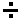
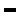
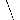

# Compositing Images

Image Composition is the technique of combining images that have, or do not have, transparency or an alpha channel
This is usually performed using the IM "`composite`" command.
It may also be performed as either part of a larger sequence of operations or internally by other image operators.

------------------------------------------------------------------------

## Image Composition in IM {#compose}

Image Composition is the process of merging two (and only two) images in a variety of ways.
It is associated with **Alpha Composition** which describes the result based on which part of the overlay is transparent.
Image Composition is used for blending and averaging images, transfering image channels, cutting, joining, or layering odd shaped segments of images.
Or, as part of complex mathematical operations.

A good alternate introduction on Image Composition is [SVG Compositing in 30 Minutes](http://www.svgopen.org/2005/papers/abstractsvgopen/).
Or you can discover precise mathematical details by reading the [SVG Alpha Compositing](http://www.w3.org/TR/2009/WD-SVGCompositing-20090430/) page, which describes the more important image composition methods.

The following commands are the two direct image 'composite' methods available in ImageMagick...

~~~
composite {overlay} {background} [{mask}] [-compose {method}]   {result}

convert  {background} {overlay} [{mask}] [-compose {method}] -composite   {result}
~~~

The "`composite`" command is the conventional method of compositing in IM.
Having a dedicated command demonstrates just how important Image Composition is.

The "`convert`" operator "`-composite`" can also do Image Composition as part of a larger image processing task.
&lt;/&gt; Note the reversed order of the images when using "`convert`".
The order is practical as you are generally working with a primary canvas over which you prepare and merge images forming a new image.
The order of the images is important.

Practical examples of both techniques (and more) can be reviewed in [Layers of Multiple Images](../layers/#composite), and is recomended reading before continuing.

### Definition and Terms {#compose_terms}

The more important image is the *background* image often called the *destination* image as this image is the one which is modified by Image Composition.
The *background* sets not only the final size of the Image Composition but *meta-data*, such as 'comments', 'labels', 'density', 'profiles' and so on, are also preserved.
It's position is fixed and usually forms the canvas which you are building, thus the name *background*.
Remember this!

The *overlay* image is often called the *source* image as it controls how the "`-compose`" method should modify the fixed *background* or *destination* image.
The image can be re-positioned relative to the fixed *background* (usually using "`-geometry`" and "`-gravity`" settings).
However, both the image and any meta-data it contains, is destroyed when the composite operation is finished.

Sometimes a third *mask* image is added to the command.
This image is used to define and control what parts of the *background* will be modified and to what degree by the resulting composition.
For more details see [Composite Masking](#mask) below.

As of IM v6.5.3-4, the special [Define Setting](../basics/#define) "`compose:outside-overlay`", can be set to a value of '`false`' to disable any modification to the *background* image outside the rectangular area that the *overlay* image covers.

For examples of its use see the [Copy](#copy) and [Clear](#clear) compose methods, as well as [PageCurl Corner Overlays](../thumbnails/#pagecurl).

This is equivalent to (but negated) from the [SVG "clip-to-self" attribute](http://www.svgopen.org/2005/papers/abstractsvgopen/index.html#S10.).

The actual composition *method* is controlled by the "`-compose`" setting, which defaults to a value of '[`Over`](#over)'.
That is, the source image is drawn **Over** the *background* image, which is what most people think of when they perform image composition.

Most of this section of IM Examples is used to detail what the various composition 'methods' do and how you can make use of them.

To view the results of the compose methods see [Tables of Compose Methods](tables/).
The tables do not illustrate the method's intended use, just the raw output from various test images.

The compose method is case-insensitive and the '`_`' or '`-`' characters are optional.
As such the compose method "`Dst_Over`" can also be specified as: "`dst_over`", "`dst-over`", "`DstOver`", "`dstover`", or even "`dstOVER`".
They all mean the same thing.

Also, the compose methods: '`Over`', '`ATop`', '`In`' and '`Out`' are short for the more verbose compose method names: '`Src_Over`', '`Src_ATop`', '`Src_In`' and '`Src_Out`'.

On top of the long list of "`-compose`" methods there are some that require extra numerical arguments to work correctly.

In the "`composite`" command these arguments are passed using the special options: "`-dissolve`", "`-blend`", "`-watermark`" ('`modulate`'), "`-displace`" and "`-distort`".

As of IM v6.5.3-4, the "`convert`" command can pass special arguments to the "`-composite`" operator by using the [Define Setting](../basics/#define), "`compose:args`".
For examples, see the special [Dissolve](#dissolve) and [Blend](#blend) methods below.

### Image Composition Operators {#compose_operators}

Apart from the direct two image compositing styles shown above, there are a number of other image operations that also use alpha compositing as part of their internal image processing.
These operations are affected by the current "`-compose`" setting, though they will use either their own internal positioning, or a [Layered Image](../layers/#flatten) virtual canvas offset positioning technique.

Here is a list of all operators that are known to be affected by the compose setting...

**[Composition of Pairs of Images](../layers/#composition)**

Practical examples using the primary image composition operators, both the primative "`composite`" command, as well as the [-composite](../option_link.cgi?composite)" operator for "`convert`".

This low-level methods uses [Geometry/Gravity Settings](#geometry) to determine the position of the overlay image.

**[Layering Operators](../layers/#flatten)**

The image 'layerimage' operators "`flatten`", "`mosaic`", and "`-layers     merge`" overlay all multiple images in the current image sequence, onto a single new canvas, the size and position of which is determined by the layering operator chosen.

This uses [Virtual Canvas/Page Offset Settings](#page) to determine the position of the overlay image.

**[Edge Expansion Operators](../crop/#border)**

Operators that overlay each individual image on internally prepared canvases.
This includes operators such as "`-border`", "`-frame`", and "`-extent`".
(See [Adding/Removing Image Edges](../crop/#border)).

No positioning information is used, though "`-extent`" will make use of gravity and geometry offsets, to overlay on a solid color background image.

**[Draw Images](../anim_mods/#compose_draw)**

The "`-draw 'image...'`" image overlay method will overlay a single external *source* image over a list of destination images.

It is the only image composition technique available to "`mogrify`".
It gets the 'overlay' image from an external source allowing it to overcome that command's no-list-operator limitation.

Resize and Position information is also given by the user, and these may be gravity effected.

**[Multi-List Layers Composite](../anim_mods/#composite)**

The "`-layers composite`" operator will let you compose two separate multiple image lists together, one pair of images at a time, to form a new merged multi-image sequence.
It also composes a sequence of images with a single image (which can be either a static 'overlay' image, or a static 'destination' image).
It is also the ONLY composition operator to allow you to use BOTH the universal "`-gravity`" affected "`-geometry`" offset (globally), and the virtual canvas "`-page`" offsets of individual images, from that global position.

This composition operator is especially important for composing [Image Animations](../anim_mods/#merge), or other image sequences, as a whole, rather than needing a script to process each pair of images at a time.

  

------------------------------------------------------------------------

## Positioning The Overlay Image {#geometry}

### Composite Geometry/Gravity Settings {#geometry_composite}

In normal Alpha Composition the "`-geometry`" setting is used with "`-gravity`" to position the source image relative to the destination image.
Using these settings is covered in great detail in [Image Positioning using Gravity](../annotating/#image_gravity).

Note that the size component of "`-geometry`" is special in that it will [Resize an Image (geometry)](../resize/#geometry).
In "`composite`" it resizes the source image but for "`convert`" the last image in the image sequence is resized.
This is technically a separate aspect to [Image Composition](#compose).
See [Geometry Resize](../resize/#geometry) and [Layering images with Composite](../layers/#composite).

In Alpha Composition only two images are involved, the 'source' and the 'destination' (or 'background'), though a third [Masking Image](#mask) may also be provided limiting the affected area of the composition.

### Layer Canvas/Page Offsets {#page}

The composition of Layered Images use a very different philosophy.
All the images (as many as you like) are treated equally in the order given.
They all have a "`-page`" or [Page Offset](../basic/#page) that position each image's top-left corner relative to a virtual canvas 'origin' (the default offset) but without gravity.

To process multiple images a new background image is generated using the current "`-background`" color with a size that is dependent on the operation being performed.
This is assumed to be the 'destination' image (canvas).
ALL the images are composited onto this new canvas one at a time in sequence.

Even if only two images are given a new image is still created and two separate compositions are applied.
That is, it can be slow.
All the images are treated as 'source' images and the order they are listed determines the result.

The 'layer' offset however is NOT gravity affected.
As each image can have a separate 'canvas offset' multiple image composition is better applied using [Image Layering Operators](../layers/#flatten) as well as [Multi-Image Sequence Composition](../anim_mods/#composite) for animations.

The two styles are very different positioning techniques and it is important you use the right style for the composition techniques you plan to use.

### Both positioning Techniques {#both}

Only one composition technique, the multi-image list [Layers Composition](../anim_mods/#composite) operator, allows you to use BOTH positioning methods simultaneously.

First the two lists are globally geometry positioned, using the virtual canvas size of the first image in each list (with gravity).
Then the layer offset is applied from that global position, for each individual image to determine the final position.

Of course if a overlay image does not fit into a specific destination image on the virtual canvas, then it will be clipped.
As such it is generally a good idea to only use fully-coalesced images for the destination image(s).

------------------------------------------------------------------------

## Duff-Porter Alpha Composition Methods {#duff-porter}

The Duff-Porter image composition methods are a traditional set of 12 methods which are very well defined.
They are known as Alpha Composition as the images are merged according to some aspect of the image transparency or 'Alpha Channel'.
You can find the mathematical definitions for these in the [SVG Alpha Compositing](http://www.w3.org/TR/2009/WD-SVGCompositing-20090430/) document.

Here is a classical table showing the results of these 12 methods with two triangular images.

[![\[IM Output\]](tables/montage_triangles.jpg)](tables/montage_triangles.jpg)

Also see [Raw Tables of Compose Methods](tables/) with diagrams showing more composition methods with different image shapes and gradients.

The default compose method (when completely undefined) is '[`Over`](#over)', and is what most people normally want when composing images.

To understand, and remember what each of the above compose methods do, the resulting image would be the same as if you said...

~~~
{Source} --{compose_method}--> {background}
~~~

That is, the resulting image for method 'ATop' is equivalent to "the overlay image 'ATop' of the background image".
Meaning, the background image will keep its 'shape' but the colors of the source image will sit 'on top' of the background.

However remember the image order is reversed when using the "convert -composite" operator.
In that case it is  'last_overlay_image'  OP  'older_background_image'.

These 12 methods define not only which of the two images are 'visible' in the result,  but also how it affects the part of the image which is NOT overlaid by the source image.
That is, whether the original 'background' is left as is or completely cleared.
I purposefully made the 'destination' image in the above table larger so that you can see if the rest of the image was cleared or not.

These 'clearing' methods are: 'Src', 'In', 'Dst_In', 'Out', 'Dst_ATop', and 'Clear'.
As of IM v6.5.3-4 you can use a Define Setting "compose:outside-overlay=false" to prevent Duff-Porter composition clearing the destination image outside the overlaid area.
See examples in 'Copy' and 'Clear' composition methods below.

Note that 'Copy' is a special '13th' composition method provided by IM.
Basically is equivalent to an 'Over' composition, but with background clearing in the overlayed area.
However in implementation terms it is a 'Src' compostion with outside-overlay (or background clearing) disabled.

ImageMagick v5 and before did not clear any area not overlaid by the source image.
This was incorrect handling of the Duff-Porter Composition operators, and was corrected during IM v6 development.

The IM 'outside-overlay' setting is known in SVG graphics language as the 'clip-to-self' attribute, but has the negative effect.
That a SVG 'clip-to-self' being set to true is equivalent to IM's 'outside-overlay' setting being set to false, and visa-versa.

One of the most important aspects of Duff-Porter Alpha Composition methods is that they will never make any 'fully transparent colored pixel' visible.
This is important as a fully transparent part of the image has an undefined color.
It could actually contain ANY color value without effecting the visible result of the image.
See Controlling Image Transparency for details about 'handling the transparency channel'.

This is why Duff-Porter composition is often the preferred masking method, rather than the alternative 'CopyOpacity' which completely replaces the Alpha Channel of an image, and can make the undefined invisible colors, visible.

### Over (overlay image over background) {#over}

This is the default compose method, the one everyone thinks of when overlaying an image on top of another image.
The overlay image is placed 'over' the background image in the same way as an 'animation cell' or 'overhead transparency' can be placed over a background scene or image.

It is so common that I doubt I really need to say much more.
So lets present a example of overlaying a single letter image over a background image.

~~~
convert -background none  -fill white \
        -font Ravie  -pointsize 36   label:A   label_A_white.png
composite -gravity center label_A_white.png   rose:   compose_over.gif
~~~

[![\[IM Output\]](label_A_white.png)](label_A_white.png)
[![\[IM Output\]](compose_over.gif)](compose_over.gif)

The overlay can be centered with gravity as above, or positioned exactly using a "`-geometry`" setting.
If it is positioned outside the bounds of the background it will be clipped, or ignored, as appropriate.

In this example, the image is overlaid using the "`convert -composite`" operator, but positioned half way above the background.
Note the reversal of the image order.

~~~
convert  rose:   label_A_white.png \
        -geometry +5-15   -composite   convert_over.gif
~~~

[![\[IM Output\]](convert_over.gif)](convert_over.gif)

### Dst\_Over (put image 'under' background) {#dstover}

Like other 'Dst\_' methods, this works almost exactly like the 'Src\_' version of the method, but with the overlay and background images swapped.
As such '`Dst_Over`' is equivalent to placing the source overlay image 'under' the destination.
The result is that only the parts of our source or overlay image not hidden by the destination or background image will be visible as they peek out from underneath.

This is NOT exactly the same as '`Over`' with argument images swapped, as the size, positioning and other image meta-data, still comes from the background or destination image.
Remember the output image size is the same as the 'background' image, and position of the source image is relative to the background (using "`-geometry`" and "`-gravity`").

For example, here we overlay a black 'A; label 'under' our original white A.
We can reposition the black A, relative to the white A background.
As you can see this is great for adding a hard shadow, without needing to worry about expanding the image size.

~~~
convert -background none  -fill black \
        -font Ravie  -pointsize 36   label:A   label_A_black.png
composite -compose Dst_Over  -geometry +5+5 \
        label_A_black.png  label_A_white.png   compose_under.png
~~~

[![\[IM Output\]](label_A_black.png)](label_A_black.png)
[![\[IM Output\]](compose_under.png)](compose_under.png)

The important thing to note is that the size of the background is preserved while the overlay's position, relative to the background, can be modified and is clipped by the background.
This is what makes this operator such an important and useful operator.

The "`-tile`" setting of "`composite`" also makes this form of 'over' very useful as a way to tile underneath an image.
For example, tile the built in checkerboard pattern underneath the shadowed letter we just created.

~~~
composite  -compose Dst_Over -tile pattern:checkerboard \
           compose_under.png   compose_under_tiled.jpg
~~~

[![\[IM Output\]](compose_under_tiled.jpg)](compose_under_tiled.jpg)

### Src ('crop' to background image dimensions) {#src}

This operator completely replaces the background image with the overlay image.
The colors and transparency in the background are completely junked leaving a blank image the same size as the original destination over which is applied the source image.

But what good is that?
Well, two things.

First, you are effectively replacing the background image with the source image but preserving all the meta-data associated with the original background image.
That is, the image changes but the meta-data does not.

Second, the size of the final image does not change even though the image content does.
That is, the resulting image has the same size as the original background.
As such you can effectively use this operator to either crop or add a border to the source or overlay image so that it becomes the same size as the given background image (along with the background meta-data).

For example, suppose you want to make a plasma image and clip it so it is the same size at the built-in rose image.
This will let you do it without needing to know just how big the rose image is.

~~~
composite -compose Src  -size 100x100  plasma:tomato-dodgerblue \
          rose:   compose_crop.gif
~~~

[![\[IM Output\]](compose_crop.gif)](compose_crop.gif)

Of course the above is equivalent to a "`-crop`" of the plasma image, not a 'resize'.
The original image's meta-data is also preserved.
That is even though this is now a plasma image, the image meta-data says it is still a 'rose' image and came from the "rose:" image source.
  
If the overlay is smaller then the rest of the background image is replaced with transparency to fill it out.
Please note however that the background must have an alpha channel, or it will fill the extra space with black (the color that '`none`' or '`transparent`' has without any alpha channel).

~~~
composite -compose Src -gravity South \
          hand_point.gif   rose:   -alpha set   compose_expand.gif
~~~

[![\[IM Output\]](hand_point.gif)](hand_point.gif)  
[![\[IM Output\]](compose_expand.gif)](compose_expand.gif)

### Copy (copy or replace image) {#copy}

This operator is not one of the 12 'Duff-Porter' compose methods which is why it was not on the chart above.
It is very important nevertheless.
It works exactly like the "`Src`" compose method, but it does not touch the background image outside the overlaid area.
That is, it limits its copying abilities to just the area overlaid and nothing else.

This allows you to crop a small section of a larger image, work on the smaller image for speed, then 'copy' the results back onto the larger image without touching the other areas of that image.
This in turn allows you to optimize image processing of very large images.

Here is the same example I used above, but using '`Copy`' instead of '`Src`', showing how IM will not waste time clearing out the rest of the background as demanded by the 'Duff-Porter' algorithm.

~~~
composite -compose Copy -gravity South \
          hand_point.gif   rose:   -alpha set   compose_copy.gif
~~~

[![\[IM Output\]](compose_copy.gif)](compose_copy.gif)

This operator is also very similar to '`Over`', except that the transparency of the source image is also copied, replacing the background image completely.
If there is no transparency it would perform exactly like '`Over`'.

Internally, it uses a special composition control setting that tells IM not to modify the parts that are not overlaid.

#### Outside-Overlay Control {#outside-overlay}

As of IM v6.5.3-4 the ability to control if a composition method will effect also areas outside the area overlaid was made user controlable by [Defining](../basics/#define) "`compose:outside-overlay`".
It is 'on' by default but you can turn it off by setting it's value to "`false`".
For example, here is an equivalent to the [Copy Composition Method](#copy) but using the more traditional [Src Composition Method](#src)..

~~~
convert rose:  hand_point.gif -alpha set -gravity South \
        -define compose:outside-overlay=false \
        -compose Src -composite    compose_copy_src.gif
~~~

[![\[IM Output\]](compose_copy_src.gif)](compose_copy_src.gif)

The "`compose:outside-overlay`" define is in many ways the inverse of the SVG 'clip-to-self' attribute.
That is when enabled, composition is restricted to just the overlaid region, and does not effect rest of the destination image.

For more information see [SVG Composition 'clip-to-self' property](http://www.w3.org/TR/SVGCompositing/#clip-to-self-property) or [Understanding SVG 1.2 composition, clip-to-self](http://www.svgopen.org/2005/papers/abstractsvgopen/index.html#S10.).

Note that the use of a [Write Mask](../masking/#write_mask) can also be used to achieve this type of control, but using shaped areas according to the mask that is given.

### Dst (a 'no-op' compose) {#dst}

This operator does nothing.
The source, or overlay image, is completely ignored and the destination, or background image, is left unchanged.

The method's real use is as a means of 'turning off' an alpha composition operation in other image operators.

For example, we use the [Frame Operator](../crop/#frame) to frame our rose image (with a transparent background) but then use "`-compose Dst`" to prevent the image from being added to the frame.
In other words, we only use the rose to set the size of the internal frame of the result.
The frame, and only the frame, is the result.

~~~
convert rose:   -alpha set  -mattecolor Gold  -bordercolor none \
        -compose Dst   -frame 7x7+3+2   compose_frame_dst.gif
~~~

[![\[IM Output\]](compose_frame_dst.gif)](compose_frame_dst.gif)

The special [Alpha Set](../basics/#alpha_set) operation assures an [Alpha Channel](../basics/#alpha) is available in the image or you will end up with a black middle rather than a transparent one.
The "`-bordercolor`" defines the color inside the frame which is usually placed underneath the source image.

The '`Dst`' method can also be useful in a script to disable an alpha composition in a large an complex command without needing to create two different IM commands.

### Dst\_In (or 'mask' the background with source) {#dstin}

The '`Dst_In`' method is like using the source image as a '[`Copy_Opacity`](#copyopacity)' mask for the background image.
It will remove the overlay image's shape from the background image like a cookie cutter which cuts out a cookie's shape from cookie dough.

For example, let's use the fancy 'A' from above as a mask to cut out its shape from the rose image.

~~~
composite -compose Dst_In  -gravity center \
          label_A_white.png  rose: -alpha Set  compose_mask.png
~~~

[![\[IM Output\]](compose_mask.png)](compose_mask.png)

Unlike the '`Copy_Opacity`' method you can NOT use a greyscale image as the mask as only the overlay image's alpha channel is used in this operation.
Any color in the overlay is completely ignored.

> 
> All '`Dst_In` and '`Src_In`' methods actually does is multiply the alpha channels of the two images.
> The color of the appropriate image (according to the method) is preserved.

### Dst\_Out (or a 'erase' operation) {#dstout}

Using the 'cookie dough' metaphor of '`Dst_In`' the result of the '`Dst_Out`' method is the dough that was left behind once a cookie has been cut out.

It can be used to cut holes, or take bites out of the background image, using the shape of the overlay.
Any color in the overlay is again completely ignored.

~~~
composite -compose Dst_Out  -gravity center \
          label_A_white.png  rose: -alpha Set  compose_erase.png
~~~

[![\[IM Output\]](compose_erase.png)](compose_erase.png)

The mathematical formulae of these two compose methods are designed explicitly so that if you use '`Dst_In`' and '`Dst_Out`' on the same set of images, you can fit them back together (using '`Plus`' method) just like a jigsaw puzzle.

For example here we 'add' (using '`Plus`' composition) the last two images we generated above.
This image is exactly the same (to the pixel) as the original '`rose:`' image.

~~~
composite -compose Plus  compose_mask.png  compose_erase.png \
          compose_rejoin.png
~~~

[![\[IM Output\]](compose_rejoin.png)](compose_rejoin.png)

Erasing part of an image is not an easy task in any graphics program.
For example a "`-draw`" operation can only add color to an image.
It will not remove color once it has been applied to your canvas.
Think of a painter who is painting some advertising on a glass door or window.
He, or she, can add paint, but can't remove paint, by painting over it.

By drawing the shape you want to erase onto a transparent canvas, you can then use '`Dst_Out`' to remove it from your working image.
It's a bit like our painter carefully wiping off wet paint with a specially shaped rag.
The shape can be used to remove all or some of the color making it either fully or semi-transparent.

For example, suppose you want to draw a crescent moon symbol on a transparent canvas.
This alpha composition method makes this difficult shape easy to draw by overlaying two circles.

~~~
convert -size 70x70 xc:none -fill white -draw 'circle 35,35 35,5' \
        \( -size 70x70 xc:none -fill black -draw 'circle 28,30 35,5' \) \
        -alpha Set -compose Dst_Out  -composite   moon_crescent.png
~~~

[![\[IM Output\]](moon_crescent.png)](moon_crescent.png)

>
> The second image must be created and drawn in parenthesis.
> If you don't you will find that "`-draw`" will draw onto BOTH the overlay image AND your original background which is obviously wrong.
>
> If you did not use parentheses you will find a circle of semi-transparent black pixels around the erased part of the image.
> I know, it happened to me while creating this example much to my own annoyance.

### ATop ('Over', but clip to background image) {#atop}

Like '`Over`' but limit the result to the original shape of the background image.
In other words, the alpha channel on the destination is unchanged but the image colors are overlaid by any non-transparent parts of the source image.

If the background image is fully opaque (no transparency), this operation will act exactly like the normal '`Over`' composition.
It only differs when the background contains transparency which also clips the overlay.

What makes this useful is for overlaying lighting and shading effects that are limited to the object (shape) of the destination.
  
For example, say we have a red circle and want to add a highlight as if it is a 3 dimensional ball.
We can create the circle, and the highlight, then overlay the highlight using '`ATop`' to limit it to the circle.

~~~
convert -size 70x70 xc:none \
          -fill red -draw 'circle 35,35 10,30'  red_circle.png

convert -size 70x70 xc:none -draw 'circle 35,35 35,20' \
        -negate  -channel A -blur 0x8    red_highlight.png

composite -compose ATop -geometry -13-17 red_highlight.png \
          red_circle.png red_ball.png
~~~

[![\[IM Output\]](red_circle.png)](red_circle.png) [![\[IM Output\]](red_highlight.png)](red_highlight.png) [![\[IM Output\]](red_ball.png)](red_ball.png)

> 
> The creation of the white highlight was done using "[`-negate`](../option_link.cgi?negate)" to ensure the whole image is actually white.
> This was used to avoid a bug in the "[`-blur`](../option_link.cgi?blur)" operator, which has now been fixed in IM version 6.2.4.
> See [Blur with Transparency Bug](../bugs/blur_trans/) for more details of this old bug.

In a similar way we can add a fuzzy shadow to our ball clipped to the boundaries of the ball itself so that it looks even more 3-D like.
I'll leave it as an exercise to the reader to figure out how the following command achieves this result.

~~~
convert  moon_crescent.png -fx 0 -channel A -blur 0x7 \
         red_ball.png  +swap -compose ATop -composite  red_ball2.png
~~~

[![\[IM Output\]](red_ball2.png)](red_ball2.png)

With a little more care with preparatory images the above image can be made even more realistic.
For showing the usage of this compose method, it isn't bad.

Further examples of using '`ATop`' compose method, can be seen in [Generating 3-D Logos](../advanced/#3d-logos).

### Clear (Clear the Background. Ignore overlay image) {#clear}

This is an unusual compose method that essentially ignores the overlay image completely, and just clears the background image.

This makes it an ideal method of creating a transparent or black canvas, the same size as the background image, for complex projects.
As the overlay image is not used, a single pixel "`null:`" image is a good overlay to use.

~~~
composite -compose Clear null:  rose: -alpha Set compose_clear.png
~~~

[![\[IM Output\]](compose_clear.png)](compose_clear.png)

Of course the [Alpha Set](../basics/#alpha_set) operaton (while not needed in this case) assures the destination has an alpha channel that can be used when clearing the image to transparency.

If you specifically [turn off the alpha channel](#alpha_off), then the operator will clear the image to black, due to the mathematics involved.

~~~
composite -compose Clear null:  rose: -alpha Off compose_black.png
~~~

[![\[IM Output\]](compose_black.png)](compose_black.png)

The special [Define Setting](../basics/#define) "`compose:outside-overlay`" allows you limit this clearing to just the area overlaid regardless if the overlay image contains transparency or not.
For example:

~~~
convert rose:  hand_point.gif -alpha Set -gravity South \
        -define compose:outside-overlay=false \
        -compose Clear -composite   compose_clear_limited.gif
~~~

[![\[IM Output\]](compose_clear_limited.gif)](compose_clear_limited.gif)

### Xor (Clear the area shared) {#xor}

This is a very strange and little used composition method.
It overlays two images then clears the overlapped area to transparency.

~~~
convert -size 60x60 \
        \( xc:none -fill blue   -draw 'circle 21,39 24,57' \) \
        \( xc:none -fill red    -draw 'circle 39,39 36,57' \) \
        -compose Xor   -composite   compose_xor_2.png
~~~

[![\[IM Output\]](compose_xor_2.png)](compose_xor_2.png)

Things get even more interesting when a third image is xor'ed on the above result.

~~~
convert -size 60x60  compose_xor_2.png  \
        \( xc:none -fill green  -draw 'circle 30,21 30,3'  \) \
        -compose Xor   -composite   compose_xor_3.png
~~~

[![\[IM Output\]](compose_xor_3.png)](compose_xor_3.png)

As you can see overlapping multiple images can produce some wonderful effects where any even number of images overlapping will be clear, while any odd number of overlapping images will result in the last image overlaid showing through.
    FUTURE:  Xor effects on semi-transparent images get extremely weird.
    Explore this and create an example demonstrating this weirdness.

------------------------------------------------------------------------

## Mathematical Compose Methods {#math}

This group of compose methods lets you perform mathematics with the images.
This may not seem very useful but for low level manipulation of images the methods allow you to do things which you may not normally think of.

Unlike the previous [Duff-Porter](#duff) image composition methods they are generally greyscale methods.
That is they are usually applied to images were either one or both images are greyscale, and usually do not contain transparency.
That is not to say transparency can not be used (see [Mathematical Composition and Alpha](#math_blending) below), but it is not a very common practice.

The default usage of Math Compositions is defined by the SVG image file format specification.
You can read more about them in [SVG composition guide (2009)](http://www.w3.org/TR/2009/WD-SVGCompositing-20090430/), also in [Pegtop Blend Modes](http://www.pegtop.net/delphi/articles/blendmodes/) and [SimpelFilter: Photoshop Blend Modes](http://www.simplefilter.de/en/basics/mixmods.html).

The special gradient image you see adjacent to each of the following operators visualizes the operator in terms of how it affects color values.
The result is produced by composing two gradient images as in the following...

~~~
convert -size 64x64 gradient:             gradient_src.png
convert -size 64x64 gradient: -rotate 90  gradient_dst.png
composite gradient_src.png -compose Multiply gradient_dst.png \
          gradient_result.png
~~~

Basically, if you use the color value of the overlay (source) pixel vertically, and the background (destination) pixel horizontally, you can look up the value that will result from applying that operator with those values.

In the above example, you will see that '`Multiply`' will generally make images darker, and that any black value (0) in either input image will produce a black result.
Something that can be very useful.

[![\[IM Output\]](gradient_op_multiply.png)](gradient_op_multiply.png)

### Multiply   (  ) (make white transparent for diagrams/text) {#multiply}

Is one of the more useful, but under-rated, compose methods and is a simple multiply of the two images.

Its formula is of course:   $Src*Dest$

This means that if one of the images is pure white, the result will be the other image.
On the other hand if one image is black the result will be black.
Between these extremes one image will darken the destination image by the amount given.

Note that '`Multiply`' will only darken an image, it will never brighten it.
That is, it 'attenuates' an image toward black, which makes this compose method a '*Burn*' style of composition.
(See [Lighting Composition Methods](#light) below)

~~~
convert label:Rose label_white.gif
composite -compose Multiply -gravity center \
          label_white.gif  rose:  compose_multiply.gif
~~~

[![\[IM Output\]](label_white.gif)](label_white.gif)  

[![\[IM Output\]](compose_multiply.gif)](compose_multiply.gif)

This method works very well in a lot of situations, but is especially good when one of the images images has black (or greyscale) lines on a mostly white background, such as text images.
If both images contain regions of color, then you may get unusual results.

In other words.
this technique is perfect for overlaying images and other diagrams directly onto line drawings with a white or very light colored background.

For example, I want to add some diagrams to a page of text which will be included in a ray-traced image.
You can see this 'page of text' in the image resulting images of my [Studies in Polyhedra](http://www.ict.griffith.edu.au/anthony/graphics/polyhedra/).

Given two grey scale image masks, multiply is also a good way to erase parts of an image to black based on some mask.
It does this linearly, so the mask can be a greyscale image rather than a purely Boolean on/off image.
See [Mathematical Composition](../masking/#compose).

Multiplying an image with itself is actually a useful technique to produce a squared darkening of an image, so bright colors remain prominent, but other colors become darker.
Actually this is equivalent to a [Gamma](../color_mods/#gamma) operator with a value of "`0.5`", or an [Evaluate PowerOf](../transform/#evaluate_pow) operation with a value of "`2.0`".

For example see a [Star Generator](../advanced/#stars), to produce a more realistic distribution of star intensities.
Or it can be used on satellite cloud images before overlaying the result on a geographical map.

[![\[IM Output\]](gradient_op_screen.png)](gradient_op_screen.png)

### Screen (make black transparent for diagrams/text) {#screen}

This is almost exactly like '`Multiply`' except both input images are negated before the compose, and the final result is also then negated again to return the image to normal.
In technical terms the two methods are 'Duals' of each other.

That makes its formula:   $1-(1-Src)*(1-Dest)$

This means that if one of the images is pure black, the result will be the other image.
On the other hand if one image is white the result will be white.
Between these extremes one image will lighten the destination image by the amount given.

Note that a '`Screen`' composition will only make an image brighter, never darker.
This is a style of composition known as '*Dodge*' composition.
(See [Lighting Composition Methods](#light) below)

This composition method is perfect for overlaying white text on a black background, then onto other images...

~~~
convert -background black -fill white label:Rose label_black.gif
composite -compose Screen -gravity center \
          label_black.gif  rose:  compose_screen.gif
~~~

[![\[IM Output\]](label_black.gif)](label_black.gif)  
[![\[IM Output\]](compose_screen.gif)](compose_screen.gif)

See [Mathematical Masking](../masking/#compose) for an example of using this to overlay a white shape on an image.

[![\[IM Output\]](gradient_op_bumpmap.png)](gradient_op_bumpmap.png)

### Bumpmap (greyscale multiply) {#bumpmap}

The '`Bumpmap`' method is essentially the same as '`Multiply`', except that the source image is converted into grey-scale before being overlaid.
In other words, it will darken the image anywhere the source image is dark.

You could think of this as a 'multiply by intensity' type operator.

For example...

~~~
composite -compose Bumpmap -gravity SouthEast -geometry +3+3 \
          hand_point.gif   cyclops.gif   -alpha Set   compose_bumpmap.gif
~~~

[![\[IM Output\]](compose_bumpmap.gif)](compose_bumpmap.gif)

Note how the "`hand_point.gif`" image is grayscaled before applying.

Its original purpose is to add texture (like a paper or fabric texture) to images.
However as it can only darken images, it is not as useful as the '`HardLight`' method which can both lighten and darken images (see below).

[![\[IM Output\]](gradient_op_divide.png)](gradient_op_divide.png)

### Divide, Divide\_Dst, Divide\_Src   (  ) (removing shading effects) {#divide}

The two images are divided from each other.
Which image divides which depends on if '`Divide_Src`' or '`Divide_Dst`' is applied.

The formula for '`Divide_Dst`' is $\frac{Src} {Dest}$ and for '`Divide_Src`' is   $\frac{Dest} {Src}$

Due to the order of images normally defined in image composition, and the "`composite` command, the original method '`Divide` meant...

~~~
{Source} Divide {background}
~~~

That is to say the original method name "Divide' is a synonym for "Divide_Dst" meaning  "divide by destination".
It is also the operator used to define the displayed gradient chart.

Note that the order of the images is very important as you get very different results if the images, or the operator are swapped.
This is especially the case with the "convert" command, which has the destination image before the source image.

Remember it is the destination image will define the actual final size, and the meta-data in the resulting composition of the two images.
Also remember it is the source image that is positioned relative to the destination image.

This composition method is of greatest practical use in the Removal of Vignette from Photographs.
In the next example I will use it as a means of background removal.

As normalized color values are used and these normally range from 0.0 (black) to 1.0 (white), division will in fact brighten the numerator image, by the amount of 'black' that appears within the image you are 'dividing by'.

Now dividing to images, so the 'numerator' image (the one not specified by the operator) is brightened, may sound weird.
It is however a very useful operation.
It means you can effectively remove dark patches from an image caused either by lens vignetting, bad scanning, or tinting caused by age.

For example, I have an image of hand written text which was very roughly scanned (using a digital camera without flash, then reduced in size to remove digital noise).
The paper has faded edges, and as a flash was not used the background is very dark, and has shading effects because the paper wasn't completely flat.

Just normalizing the image to enhance the contrast of the image doesn't help to remove the edge coloring or other shading effects.

~~~
convert text_scan.png -normalize text_scan_norm.png
~~~

[![\[IM Output\]](text_scan_norm.png)](text_scan_norm.png)

However by blurring the image to remove the lines, and then dividing that from the original, we effectively remove all the gross shading effects from the image.

~~~
convert text_scan.png \( +clone -blur 0x20 \) \
        -compose Divide_Src -composite  text_scan_divide.png
~~~

[![\[IM Output\]](text_scan_divide.png)](text_scan_divide.png)

The result of the division is that the background color is turned white, while the thin lines of the text remain clear, though slightly 'thinner'.

As you can see it is a lot clearer than just normalizing it though some of the anti-aliasing was also removed.
Some extra adjustments could have been made to the divisor image, but it is very close to what is expected.

Using smaller blurs can produce an alternative means of generating artistic outline images, such as shown in [Coloring In Outline Images](../photos/#color-in).

This operator could be combined with a background gradient generator, such as [Sparse Color Gradients](../canvas/#sparse-color) to generate better background 'divisor' images, than just simply blurring the whole image.

The divide operators are actually the similar to the '`Color_Dodge`' composition method, but with the divisor image negated, and used as the source image.
This is the composition that it typically used in Photoshop, however it may require you to swap image and [Negate Images](../color_mods).
See '`Color_Dodge`' for equivalences.

> 
> Before IM v6.6.8-5 only the original '`Divide`' method was provided (equivalent to the newer '`Divide_Dst`').

[![\[IM Output\]](gradient_op_plus.png)](gradient_op_plus.png)

### Plus   (  ) (Add colors together to form a blend) {#plus}

Add the colors of the overlay to the background.
In essence causing the two images to blend together equally.

Its formula is naturally: $Src + Dest$

Note however that if the added colors overflow the color limits, the color will be clipped by the normal color range limits.
This is why half the image in the resulting gradient image is pure white, as these values were clipped at their maximum value.
Caution is recommended to ensure that the resulting image is not clipped if that is not wanted.

The operator has a number of major uses.

Merging together images which contain separate channel colors, but where only the individual channel has color.
For example...

~~~
convert -size 60x60 xc:none -fill red \
        -draw 'circle 30,21 30,3'   compose_R.png
convert -size 60x60 xc:none -fill lime \
        -draw 'circle 39,39 36,57'  compose_G.png
convert -size 60x60 xc:none -fill blue \
        -draw 'circle 21,39 24,57'  compose_B.png
composite -compose plus  compose_R.png compose_G.png  compose_plus_RG.png
composite -compose plus  compose_R.png compose_B.png  compose_plus_RB.png
composite -compose plus  compose_G.png compose_B.png  compose_plus_GB.png
composite -compose plus  compose_R.png compose_plus_GB.png \
          compose_plus_RGB.png
~~~

[![\[IM Output\]](compose_R.png)](compose_R.png)
[![\[IM Output\]](compose_G.png)](compose_G.png)
[![\[IM Output\]](compose_B.png)](compose_B.png)  
[![\[IM Output\]](compose_plus_RG.png)](compose_plus_RG.png)
[![\[IM Output\]](compose_plus_RB.png)](compose_plus_RB.png)
[![\[IM Output\]](compose_plus_GB.png)](compose_plus_GB.png)
[![\[IM Output\]](compose_plus_RGB.png)](compose_plus_RGB.png)

> 
> Due to IM's compliance to the SVG standard, 'green' is not a true green color (like it is in X11 color names) but a dark or half bright green.
> A true RGB green can be specified with the color '`lime`' as we have done in the above example.*

It is also used as a mathematical operator to add together separate gradient images.
For example in calculating a 'manhatten' [Difference Images](../compare/#difference), or in [Gradient Mathematics](../transform/#gradient_math).

'`Plus`' is sometimes used to add white text to an image.
This is NOT correct usage, and may result in some anti-aliasing inconsistencies.
The better way is to use the '`Screen`' compose method.
This uses a multiplication rather than an additive method of increasing brightness.

The [Linear Dodge Compose Method](#lineardodge) is is equivalent to '`Plus`', but using the more normal '`Over`' alpha blending.

#### Plus and Plus Blending

What makes the '`Plus`' more important is that it is about the only mathematical operator that implements a different blending function than '`Over`' blending.
It not only 'adds' the colors but it also 'adds' the alpha channel values, and is about the only operator that does this, by default.

This is important as it allows for the correct joining of complementary masked images.
For example, see the merging of [Dst In and Out](#dstout) images.
It also allows you to use transparency to generate a weighted average or [Blend](#blend) of two images.

If it wasn't for this special blending method of '`Plus`', these special transparency handling techniques would not be normally possible.
  
As of IM v6.6.1-6 the ability to use the mathematical operator on alpha channels was added to all the [Mathematical Compose Methods](#math) simply by removing the default '`Sync`' flag from "`-channel`" setting, (simply specify the specific channels you want to apply it to).
See [Image Channel Mathematics using Image Composition](#image_math) below.

This means the '`Plus`' the only [Mathematical Compose Methods](#math) operator not effected by this feature as it is already applied by default.
  
[![\[IM Output\]](gradient_op_minus.png)](gradient_op_minus.png)

### Minus, Minus\_Dst, Minus\_Src  (  ) {#minus}

The result is one image subtracted from the other.

Which image is the subtracted from the other depend on if '`Minus_Src`' or '`Minus_Dst`' is applied.
Specifically '`Minus_Dst`', means 'subtract the destination' or if applied in a "`composite`" command....
The formula for.. '`Minus_Dst`' is $Src - Dest$ and for '`Minus_Src`' is $Dest - Src$

Due to the order of images normally defined in image composition, and the "`composite` command, the original method '`Minus` meant...

~~~
{Source} Minus {background}
~~~

That is to say the original method name "Minus' is a synonym for "Minus_Dst" meaning  "minus the destination".
It is also the operator used to define the displayed gradient chart.

For example, subtract a circle from the final result of the previous 'Plus' operation above.

~~~
composite compose_plus_RGB.png  -compose minus_dst  compose_R.png \
          compose_minus.png
~~~

[![\[IM Output\]](compose_minus.png)](compose_minus.png)

Note the way the alpha channel is handled, which is that same as all the other mathematical operators except '`Plus`'.
See [Mathematical Composition and Alpha Blending](#math_blend).
This handling can be modified by the use of a special '`Sync`' channel flag.
See [Image Channel Mathematics](#image_math) below for details.

The '`Linear Burn`' compose method can also be used for color subtraction, but works by the user negating the image to be subtracted.
See the [Linear Burn Compose Method](#linearburn) for more details.

> 
> Before IM v6.6.8-5 only the original '`Minus`' method was provided (equivalent to the newer '`Minus_Dst`').

[![\[IM Output\]](gradient_op_modulusadd.png)](gradient_op_modulusadd.png)

### ModulusAdd {#modulus_add}

The '`ModulusAdd`' is much like the '`Plus`' except when the result exceeds white, it is wrapped (modulus) back to black.

For example, if we add two grayscale gradients the brightest colors will wrap to form a second gradient.

~~~
convert -size 60x60 gradient:    gradient.png
composite  gradient.png gradient.png -compose ModulusAdd  compose_add.png
~~~

[![\[IM Output\]](compose_add.png)](compose_add.png)

This modulus type of composition can be used to produce some very interesting gradients such as.

~~~
composite gradient.png \( gradient.png -rotate -90 \) \
          -compose ModulusAdd   gradient_diagonal.png
~~~

[![\[IM Output\]](gradient_diagonal.png)](gradient_diagonal.png)

And multiple modulus additions can make venetian blind type repeated gradients.

~~~
convert gradient.png \( +clone +clone +clone +clone \) \
        -background gray50 -compose ModulusAdd -flatten  gradient_venetian.png
~~~

[![\[IM Output\]](gradient_venetian.png)](gradient_venetian.png)

Which produces a gradient repeated 5 times.
Note how I use a background of '`gray50`' to effectively 'roll' the gradient half a modulus cycle forward.

[![\[IM Output\]](gradient_op_modulussubtract.png)](gradient_op_modulussubtract.png)

### ModulusSubtract {#modulus_subtract}

The '`ModulusSubtract`' operator is the same as '`Minus`' except that it is a modulus subtraction.
Subtracting 'white' from 'gray' will result in the original 'gray', and not black, as the values wrap back around.

A side effect of modulus subtraction is that some parts may become white instead of black, in seemingly uncontrolled ways.

~~~
composite -compose subtract  compose_plus_RGB.png  compose_R.png \
          compose_subtract.png
~~~

[![\[IM Output\]](compose_subtract.png)](compose_subtract.png)

This operator is not recommended for use in any situation, as '`ModulusAdd`' with a [Negated Image](../#color_mods/#negate) will provide the same result.

[![\[IM Output\]](gradient_op_difference.png)](gradient_op_difference.png)

### Difference (image compare, and selective negate) {#difference}

The resulting image is the absolute difference in the color values.

Its formula is: $abs(Src - Dest)$

The '`black`' and '`white`' difference will produce a maximum result of white while any colors which are the same will produce black.
Basically a simple form of image comparison.

The more common use of this composite method is for comparing two images of the same size to see how they differ, and even produce a percentage of that difference.

This operator is typically used to generate [Comparison Difference Images](../compare/#difference).

The operator also can be used to selectively negate an image.
Overlaying black has no effect on the background, while overlaying white negates the colors in the image at that location.

In otherwords this operator (as well as the next) provides a image mapped [Negatation](../#color_mods/#negate) operator.
  
For example lets negate half the rose image.

~~~
convert -size 2x1 pattern:gray50  -scale 70x50\! black_n_white.gif
composite black_n_white.gif   rose: \
          -gravity center -compose difference   compose_negate.gif
~~~

[![\[IM Output\]](black_n_white.gif)](black_n_white.gif)  
[![\[IM Output\]](compose_negate.gif)](compose_negate.gif)
[![\[IM Output\]](gradient_op_exclusion.png)](gradient_op_exclusion.png)

### Exclusion (image difference excluding greys) {#exclusion}

Its formula is: $Src + Dest - 2*Src*Dest$

This is sort of an averaged difference.
White on white will produce black (no difference), the same with black on black.
However grey on grey will produce a grey result.
White and black naturally still produce white (maximum difference).

Another way of looking at this is that bright image regions cause inversion to the respective other layer.
Very dark regions change nothing at all.
In this manner the **Exclusion** method is the same as '`Difference`' (see previous).

One use for this operator is to multiply 'biased gradients' such as used for [Displacement Maps](../displace/#displacement_maps).
These are gradients where a 50% gray value is thought of as being 'zero' with darker colors representing a 'negative' value, and lighter colors representing a 'positive' value, with the values ranging from -1 to +1.
See [Multiply Biased Gradients](../transform/#math_multiply), for details.

Another use of this compose method, submitted by Joe Fry, is a way to merge multiple difference images together.
The final image shows the changes of all the images, not just between two images.
That is, given images A, B and C, first generate the difference images for A, B and B, C then use exclusion on those results so that you get one image showing how all three images changed.

This method is also closely related to how the [Xor](#xor) composition blending operator handles the alpha transparency values.

[![\[IM Output\]](gradient_op_darken.png)](gradient_op_darken.png) [![\[IM Output\]](gradient_op_lighten.png)](gradient_op_lighten.png)

### Lighten and Darken (select maximum/minimum value) 

Compare the source and destination image color values and take the respective lighter or darker value.
  
The formula for Lighten is: 

$$
\begin{align}
{If} \quad Src > Dest \quad &{then} \quad Src \\
                            &{else} \quad Dest
\end{align}
$$

For darker, just invert the comparison.

One use of '`Lighten`' is to compose a blurred version of the original image so that the 'highlights' in the original image get a soft glow about them.

~~~
convert flower_sm.jpg \( +clone -blur 0x3 \) \
        -compose Lighten -composite  flower_softglow.jpg
~~~

[![\[IM Output\]](flower_sm.jpg)](flower_sm.jpg)  [![\[IM Output\]](flower_softglow.jpg)](flower_softglow.jpg)

See [Soft Blur](../convolve/#soft_blur) for a better way (using a 'blended blurring technique'), for a better way of achieving a similar result.
  
These operators work by comparing and selecting the individual RGB channel values, and as such this could result in some color distortion, especially when dealing with primary colors of the image.

For example here I have create a red and blue gradient image, then use lighten to compose thme together.

~~~
convert -size 100x100 gradient:red-black -rotate 90  red_gradient.png
convert -size 100x100 gradient:blue-black            blue_gradient.png

convert red_gradient.png blue_gradient.png \
        -compose Lighten -composite   lighten_by_value.png
~~~

[![\[IM Output\]](red_gradient.png)](red_gradient.png)
[![\[IM Output\]](blue_gradient.png)](blue_gradient.png)

[![\[IM Output\]](lighten_by_value.png)](lighten_by_value.png)

Because the blue channel is zero in the red gradient image, and visa-versa, and '`Lighten`' composition works by color values, the result is just a simple merge of the red and blue images, to produce a red-blue gradient image.
That is the above was equivalent to a simple [Channel Copy Composition](#channel).

One method to prevent color distortions, is to restrict the operator to only adjusting the 'Lightness' channel of the image using HSL [Colorspace](../color_basics/#colorspace).
Though that does not always produce good results.

> 
> Note that "`Gimp`", "`Photoshop`", "`PhotoLine`", "`Paint Shop Pro`", all compare channels directly just like IM.
>
> "`Photo-Paint`" compares the images by color intensity and uses that to decide which image to select colors from, thus preserving color integrity.
> See [Lighten-Intensity Method](#LightenIntensity) below.
>
> On the other hand "`Picture Publisher`", and "`PhotoImpact`" use the color lightness (as defined by the HSL colorspace) for the comparison.
>
> For comparisons of the difference in gray-scale from various colorspaces see the example [Gray-Scaling using Colorspace](../color_mods/#grayscale).

[![\[IM Output\]](gradient_op_darken.png)](gradient_op_darken.png) [![\[IM Output\]](gradient_op_lighten.png)](gradient_op_lighten.png)

### Lighten-Intensity and Darken-Intensity (select color by intensity)

As on IM v6.6.9-5, a '`Lighten_Intensity`' and '`Darken_Intensity`' varient was added.
This will compare the intensity of the pixels in the two images, than select the pixel values based on that result.

That means no new colors will be added to the images, though new image will be a mix of the colors from both images.
Also image order does not matter, except that the size and meta-data comes from the destination image.

For example here take the lighter of images containing a Red and Blue gradient.

~~~
convert red_gradient.png blue_gradient.png \
        -compose Lighten_Intensity -composite   lighten_intensity.png
~~~

[![\[IM Output\]](red_gradient.png)](red_gradient.png) [![\[IM Output\]](blue_gradient.png)](blue_gradient.png)  [![\[IM Output\]](lighten_intensity.png)](lighten_intensity.png)

As you can see, the whole pixel was selected from the selected image.
You will get no mixing of the color channels.
However as the intensity of blue is regarded as darker than red, only the darkest of reds are replaced from the darker blue gradient image.

**With regards to alpha**, the method has two modes of operation.

By default, with the special '`Sync`' flag of the "`-channel`" setting enabled, the comparison will be based on the intensity of the colors, weighted by the alpha (transparency) channel.
That means a 'Half-Transparent White' will have a weighted-intensity that is about the same as a 'Opaque Mid-Gray' color.

This means that all other things being equal, a '`Lighten_Intensity`' will create a 'union' of shaped images, while '`Darken_Intensity`' will create a 'intersection' of (at least non-black) shaped images.
This is NOT ideal, and may change, but its better than no alpha input.

The second mode of operation will be used if you turn off the '`Sync`' channel flag (see [Using the 'Sync' Flag](#sync_flag) below).
For example by using "`-channel All`".
The pixel selection will then be based purely on the color intensity, without any effect of alpha weighting.
However alpha channel value will be copied with the pixel that was actually selected.

For images without transparency the result will be the same regardless of the mode.
  
This second mode also allows you to use a more restricted "`-channel`" defining which channels may be copied from the source into the destination image, if selected.
The selection however will still be purely based on just the un-weighted color intensity.

This means that you can create more easily create a 'shape mask' of the selection, based on the intensity of colors in the two images.
You compare the images based on color intensity, but only care about the alpha channel value in the result.

To make a 'mask' you would make one image fully-transparent (but still having color), using [Alpha Transparent](../masking/#alpha_transparent), and the other image full-opaque (the default).
At the end you can use [Alpha Extract](../masking/#alpha_extract) to get the mask of which image had the lighter color for that pixel position.

~~~
convert red_gradient.png -alpha transparent    blue_gradient.png \
        -compose Lighten_Intensity -composite \
        -alpha extract    lighten_intensity_mask.png
~~~

[![\[IM Output\]](lighten_intensity_mask.png)](lighten_intensity_mask.png)

Note the alpha values in the two images do not have to be just 'on' and 'off', but could represent two sets of values (arrays), from which you pick and choose based on the color channels.
The alpha channel could be completely different value for each image being 'merged' together.a.

For example you could have a whole sequence of images, each with a different alpha channel value.
You can then use this compose method to compare all the images resulting the alpha channel specifying which of the images had the lightest (darkest) pixel at that location.

That is the composition method can be used as a sort of 'selection', or 'comparision' operator, for any long list of images, specifying which image was lighter than all the others for each pixel.

> 
> This composition method is not defined by the [SVG composition guide (2009)](http://www.w3.org/TR/2009/WD-SVGCompositing-20090430/) used by all the previous composition methods we have looked at so far.
> As such their is no real definition as to how the alpha channel should effect the pixel comparision.*
>
> 
> Added as of IM v6.6.9-5.
> But no formal defintion for the method has been found.
> As such the current implementation is classed as **highly experimental**, and may change based on user suggestions.
> However the essential idea is sound.

#### Intensity Alternative for older versions of IM

If the '`Lighten_Intensity`' method is not available to your version of ImageMagick, you can recreate a pure, color-only version, by using '`Lighten`' on a gray-scale copies of the two images, and by comparing the result against the gray-scale copy, create a selection mask to apply against the original.

This is not easy, and the following is is one such solution...

~~~
convert red_gradient.png blue_gradient.png \
        \( -clone 0--1 -colorspace Gray \
           \( -clone 0--1 -compose Lighten -composite \) \
           -delete 1 -compose Difference -composite -threshold 0 \
        \) -compose Src -composite     intensity_lightened.png
~~~

[![\[IM Output\]](intensity_lightened.png)](intensity_lightened.png)

It is a pretty horrible bit of processing, but as you can see, it works.

To get a '`Darken_Intensity`' version, replace the "`-delete 1`" with "`-delete 0`", OR, replace "`-compose Lighten`" with "`-compose Darken`".
Either will work.

### Set Theory Equivalent Operations {#set_theory}

A number of the mathematical methods above are also used to perform set theory or boolean operations with shapes.

The '`Lighten`'compose method can be used to find the '*Union*' (Boolean '*Or*') of two (or more) groups (sets) or pixels.

~~~
convert -size 64x64 xc: -draw 'circle 22,32 5,32'  -negate circle_left.gif
convert -size 64x64 xc: -draw 'circle 41,32 58,32' -negate circle_right.gif
convert circle_left.gif circle_right.gif \
        -compose Lighten -composite    circle_union.gif
~~~

[![\[IM Output\]](circle_left.gif)](circle_left.gif)  [![\[IM Output\]](circle_right.gif)](circle_right.gif)  [![\[IM Output\]](circle_union.gif)](circle_union.gif)

The '`Darken`' compose method produces an '*Intersection*' (Boolean '*And*') of the pixels.

~~~
convert circle_left.gif circle_right.gif \
        -compose Darken -composite    circle_intersection.gif
~~~

[![\[IM Output\]](circle_left.gif)](circle_left.gif)  [![\[IM Output\]](circle_right.gif)](circle_right.gif)  [![\[IM Output\]](circle_intersection.gif)](circle_intersection.gif)

The '`Difference`' compose method produces an '*Exclusive OR*', (Boolean '*XOR*') of the two sets.

~~~
convert circle_left.gif circle_right.gif \
        -compose Difference -composite    circle_disjunction.gif
~~~

[![\[IM Output\]](circle_left.gif)](circle_left.gif)

[![\[IM Output\]](circle_right.gif)](circle_right.gif)

[![\[IM Output\]](circle_disjunction.gif)](circle_disjunction.gif)

An '`Exclusion`' method could also have been used for this purpose, though handles gray-scale (non-boolean) values differently.
It is however the method used for '`XOR`' Duff-Porter alpha blending.

And lastly '`Minus`' can be used to generate the '*Relative Complement*' of two sets of pixels.

~~~
convert circle_left.gif circle_right.gif \
        -compose Minus_Src -composite    circle_complement.gif
~~~

[![\[IM Output\]](circle_left.gif)](circle_left.gif)

[![\[IM Output\]](circle_right.gif)](circle_right.gif)

[![\[IM Output\]](circle_complement.gif)](circle_complement.gif)

Note that a "`-clamp`" may be needed for [HDRI](../basics/#hdri) versions of ImageMagick when applying any of the above 'set' or 'boolean' composition methods, to prevent the generation of out of range values.

### Mathematical Composition and Alpha Blending {#math_blending}

You can use the above mathematical composition methods for performing mathematical operations on image.
However there is on major cave-at with this.
It will probably not work as you might want with images containing transparency.

By default almost all the above mathematical compositions follow a convention defined by the SVG specification.
[SVG composition guide (2009)](http://www.w3.org/TR/2009/WD-SVGCompositing-20090430/).

What this means is that if you try to use mathematical compositions on images with an alpha channel (that is some form of transparency), you will may not get a true mathematical composition, but a 'blended' form of composition.
For example, here I create gradient images with some transparency around them.
I then '`Multiply`' them together.

~~~
convert -size 64x64 xc:none -draw 'rectangle 20,0 43,63' \
        gradient: -compose In -composite    alpha_src.png
convert alpha_src.png -transverse     alpha_dst.png
convert alpha_dst.png  alpha_src.png \
        -compose Multiply -composite  alpha_result.png
~~~

[![\[IM Output\]](alpha_src.png)](alpha_src.png)  
Source
  

  
[![\[IM Output\]](alpha_dst.png)](alpha_dst.png)  
Dest
  

  
[![\[IM Output\]](alpha_result.png)](alpha_result.png)  
Result

Note that the parts of the images that did not overlap was just simply included into the resulting image, as is, without modification.
That is the images were 'blended together'.

Worse still if the image contains partial transparencies, the color values will be 'weighted' by the alpha channel.
This is useful for a [Plus Composition](#plus), providing a 'weighted color addition' or [Blending Operation](#blend), but I have as yet not figured out any use for a 'weighted multiply of colors' in images.
*Anyone?*

If you are doing image mathematics, this behaviour is generally not desirable.
Though when doing such maths, you also generally do not have any alpha channel so the 'alpha blending' and 'weighted color' problems rarely arises.

> 
> The [Plus Composition](#plus) is the only [Mathematical Compose Method](../compose/#math) that does not do 'over alpha blending'.
> Instead as per the [SVG Specification](http://www.w3.org/TR/2009/WD-SVGCompositing-20090430/) it separately adds each channel.
> However the color channels are still weighted by the alpha value before being added, only the handling of the alpha values (the blending) differs.
>
> This is important to provide correct 'addition' of masked shapes, such as demonstrated in [DstOut Composition](#dstout).

### Image Channel Mathematics using Image Composition {#image_math}

If the image you are using a [Mathematical Compose Methods](../compose/#math) on are simply fully-opaque gray-scale images, then you can use the above methods on them directly, without any problems.

However by default the compose methods will be applied to all the color channels, with alpha blending, just as you saw above.
This makes applying them to just a specific channel such as the alpha channel difficult.

For example here I '`Multiply`' two images black images containing a transparent gradient.
Using the default "`-channel`" setting.

~~~
convert -size 64x64 gradient:black-none   alpha_grad_src.png
convert alpha_grad_src.png -transverse   alpha_grad_dst.png
convert alpha_grad_dst.png  alpha_grad_src.png \
        -compose Multiply -composite  alpha_grad_result.png
~~~

[![\[IM Output\]](alpha_grad_src.png)](alpha_grad_src.png)  
Source
  

  
[![\[IM Output\]](alpha_grad_dst.png)](alpha_grad_dst.png)  
Dest
  

  
[![\[IM Output\]](alpha_grad_result.png)](alpha_grad_result.png)  
Result

Note that multiplying '`Black`' with '`Black`' is '`black`', so the color does not change in this example.
Only the resulting transparency is modified.

However the result is defiantly not a multiplication of the images alpha channel values, as by the [SVG Definition](http://www.w3.org/TR/2009/WD-SVGCompositing-20090430/) the semi-transparencies are blended using the 'over' method.
This is mathematically equivalent to a '`Screen`' composition of the alpha channel, and not a multiply.
  
As of IM v6.6.1-6 the [Mathematical Compose Methods](#math) were modified to obey the '`Sync`' flag of the "`-channel`" setting.
This flag effectually means, "synchronise the color and alpha channel operations".
The default "`-channel`" setting is '`RGBK,Sync`'.
So by default Color and Alpha channels are handled appropriately, 'in sync', as per the SVN specification.

However by removing the '`Sync`' flag, the [Mathematical Compose Methods](#math) will become 'channel operators' applying the mathematical function to each channel, separately.

~~~
convert alpha_grad_dst.png  alpha_grad_src.png \
        -channel A  -compose Multiply -composite  alpha_grad_nosync.png
~~~

[![\[IM Output\]](alpha_grad_nosync.png)](alpha_grad_nosync.png)

And this a correct multiply of the alpha channel.
  
All this only applies to [Mathematical Compose Methods](#math) (as detailed above) as well as the special '`Mathematics`' compose method (see below).
It does not apply to other composition methods, such as [Lighting Composition Methods](light) (see next).

Also see how the [Lighten/Darken by Intensity Composition Method](lighten_intensity) (not a SVG defined composition method) deals with alpha channel (above).

For more information on using image mathematics, see [Mathematics on Gradients](../transform/#gradient_math).
More specifically those examples look at using mathematical compositions for generating '*Biased Gradient Images*, which is bit more involved.
  

------------------------------------------------------------------------

## Lighting Composition Methods -- Light, Dodge, Burn {#light}

These methods modify the colors of an image in highly complex ways and are typically used to adjust the shade or intensity of the image making some areas brighter and others darker.
One of the images is usually a gray-scale overlay, with the other provides a color source.

Lighting Composition methods fall into three sub-categories of related operators.

'*Burn*', which generally darkens images.

'*Dodge*', which generally brightens images.

'*Light*', which both darkens and lightens images based on the the darkness and brightness of one of the images.

Generally one of the images will consist of either a color pattern or photo, while the other is a grey-scale image that is being used to brighten or darken the image appropriately.
Which image should be the color, and which gray-scale, is debatable and depends on how the method was implemented.
There is no standard in this regard.

As a consequence, many users do not understand or miss-use the operators.
Also a guide on correctly using these compose methods is practically non-existent.

[![\[IM Output\]](gradient_op_overlay.png)](gradient_op_overlay.png)

### Overlay (add color to a gray-scale object) {#overlay}

This compose method is very unusual in that it has been designed to both '`Multiply`' (darken) and '`Screen`' (lighten) an image at the same time.
Which method is applied to a specific pixel is selected by the value of the destination image, which can be regarded as being the 'lighting mask'.
  
Its formula is: 

$$
\begin{align}
if \quad Dest \leq 0.5 \quad &{then} \quad 2*Src*Dest \\
                           &{else} \quad 1-2*(1-Src)*(1-Dest
\end{align}
$$

The result is a special compose method which preserves any pure white and black (highlights) that is present in the destination image while tinting the mid-tone greys of that image by the colors found in the overlay image.

That is, given a grey-scale image as the destination, this operator will color that background using the source image preserving any shadow and highlighting effects that are present in the destination.

~~~
convert -size 64x64 gradient:yellow-blue gradient_yell-blue.jpg
convert -size 64x64 gradient: -rotate 90 gradient_grey.jpg

convert gradient_grey.jpg   gradient_yell-blue.jpg \
        -compose Overlay  -composite   compose_overlay_gradients.jpg
~~~

[![\[IM Output\]](gradient_grey.jpg)](gradient_grey.jpg)  
Dest
  

  
[![\[IM Output\]](gradient_yell-blue.jpg)](gradient_yell-blue.jpg)  
Overlay
  

  
[![\[IM Output\]](compose_overlay_gradients.jpg)](compose_overlay_gradients.jpg)  
Result

As you can see the mid-tone grays of the gradient image was colored with the colors of the image provided.

This method, unlike '`Multiply`' or '`Screen`', is not associative.

~~~
convert gradient_yell-blue.jpg  gradient_grey.jpg \
        -compose Overlay   -composite   compose_overlay_gradients2.jpg
~~~

[![\[IM Output\]](gradient_yell-blue.jpg)](gradient_yell-blue.jpg)  
Dest
  

  
[![\[IM Output\]](gradient_grey.jpg)](gradient_grey.jpg)  
Overlay
  

  
[![\[IM Output\]](compose_overlay_gradients2.jpg)](compose_overlay_gradients2.jpg)  
Result

This 'overlaying color' into a image of grey highlights is makes this method perfect for adding color to the output of the "`-shade`" operator.
However you need to be very careful to generate a perfect mid-tone grey from that operator, to get correct coloring on areas without any highlights.
See [Shade Overlay Highlights](../transform/#shade_overlay) for details.

For example, given a circle we can shade it to produce 3 dimensional effects then tint the result with the original image to restore the original colors.

~~~
convert -size 64x64  xc:dodgerblue \
        -draw 'fill skyblue   circle 32,32 7,27'  circle_blue.jpg
convert circle_blue.jpg -shade 120x30 -auto-level circle_shaded.jpg
convert circle_shaded.jpg  circle_blue.jpg \
          -compose Overlay -composite   circle_shaded_tinted.jpg
~~~

[![\[IM Output\]](circle_shaded.jpg)](circle_shaded.jpg)  
Dest
  

  
[![\[IM Output\]](circle_blue.jpg)](circle_blue.jpg)  
Overlay
  

  
[![\[IM Output\]](circle_shaded_tinted.jpg)](circle_shaded_tinted.jpg)  
Result

For a more practical example of using the '`Overlay`' method see the "levels\_3d" image on the [Background Generator Examples](../backgrounds/#levels_3d) page.

The biggest problem with this compose method is that any transparency in either image will not be preserved.
That is, what is visible in either image will be visible in the result.

Typically this operator is used on image that contain no transparency, it usually means you may need to do some extra steps to restore the transparency of the destination or background image.

One simple way of preserving the transparency is to simply [Turn off the Alpha Channel](../masking/#alpha_off) of the destination image, and thus make it inaccessable.
When the composition is complete, you can just [Turn It On Again](../masking/#alpha_on).
An example of this is given in [Shaded Shape Images](../transform/#shade_shape).

Another method is to save a 'mask', or a copy of the original image, and then use that mask or image to restore the transparency.
Examples of doing this is provided in [Overlay Color Tinting](../color_mods/#tint_overlay).
Or in the more complex example [Better 3-D Logo Generation](../advanced/#3d-logos-2).

> 
> Up until IM version 6.1.6 the 'Overlay' compose method was broken in that it would only produce pure black or white results (most likely you would only get a pure black result).
> Consequently most IM users had little chance of understanding this operator.
> Now that this have been fixed users will now be able to make good use of this method.

[![\[IM Output\]](gradient_op_hardlight.png)](gradient_op_hardlight.png)

### Hard\_Light (add texture or highlight/shadow to an image) {#hardlight}

This is the same as '`Overlay`' except the source and destination images are swapped.
If you compare the gradient images of these two operators you can see that the gradient is diagonally transposed, showing the swap of the source and destination inputs.
  
Its formula is:

$$
\begin{align}
if \quad Src \leq 0.5 \quad &{then} \quad 2*Src*Dest \\
                          &{else} \quad 1-2*(1-Src)*(1-Dest)
\end{align}
$$

So while '`Overlay`' can add color to a gray-scale shaded object, '`Hard_Light`' adds gray-scale lighting effects to an image.

For example here I generate a 'lighting effect' using a blurred "`-raise`" operation of a pure gray image the same size as the original.
This is then composed using '`Hard_Light`' to add those lighting effects to the image.

~~~
convert rose: -fill gray50 -colorize 100% \
        -raise 4 -normalize -blur 0x4  lighting_effect.png
convert rose: lighting_effect.png \
        -compose hardlight -composite  compose_hardlight.png
~~~

[![\[IM Output\]](rose.png)](rose.png)  
Dest
  

  
[![\[IM Output\]](lighting_effect.png)](lighting_effect.png)  
Overlay
  

  
[![\[IM Output\]](compose_hardlight.png)](compose_hardlight.png)  
Result

This method makes adding both highlights (like a reflected light) or dark shadow effects to an existing image, using the one operation easy.

Here is an example of direct adding lighting 'texture' to an image.

~~~
convert rose: \( granite: -blur 0x.5 -normalize \) \
        -compose hardlight -composite compose_texture.png
~~~

[![\[IM Output\]](compose_texture.png)](compose_texture.png)

Note how strong the resulting text is, almost swamping the original image with light and dark areas.
This is the disadvantage of using '`Hard_Light`'.

To combat this you may like to mute the contrast of an overlaid texture.

~~~
convert rose: \
        \( granite: -blur 0x.5 -normalize  +level 30,70%  \) \
        -compose hardlight -composite compose_texture_muted.png
~~~

[![\[IM Output\]](compose_texture_muted.png)](compose_texture_muted.png)

Other lighting compose methods, such as '`Soft_Light`' may also produce better results more directly.

For a better example see [Overlying a Texture](../photos/#texture) in the [Photo Cookbook](../photos/#cookbook).
A real life example in using '`Hard_Light`' shading is provided an [IM Discussion Forums](../forum_link.cgi?t=11726) on the generation of 3D DVD covers from flat source images.

Remember that both '`Overlay`' and '`Hard_Light`' shading are essentially the same composition method.
The only difference is the images order.

[![\[IM Output\]](gradient_op_softlight.png)](gradient_op_softlight.png)

### Soft\_Light (softer highlighting of an image) {#softlight}

The '**`Soft_Light`**' compose method will also add highlights and shadows to an existing color image.
However, the colors of the destination image are modified to produce a softer contrast.

It is more closely related to the [Overlay](#overlay) composition than to [Hardlight](#hardlight).
Whether this is intentional or not is unknown but it means you are better off composing the main image onto the shading image rather than vise-versa. :-(

> 
> **WARNING:** This lighting effect defined more like '`Overlay`' rather than '`Hardlight`'.
> However which should contain the gray-scale lighting image is unclear.
> Using source can produce full black and white results, using destination however can not produce these extremes.
>
> If anyone has some definitive reference, please let me know.

For example here is the '`Soft_Light`' texture mapping.

~~~
convert rose:   \( granite: -blur 0x.5 -normalize \) \
        -compose softlight -composite compose_softlight.jpg
~~~

[![\[IM Output\]](compose_softlight.jpg)](compose_softlight.jpg)

As you can see, even with a normalized "`granite:`" image, the color changes are softer and less intensive than that of '`Hard_Light`', or even '`Overlay`'.
However you also will never get any pure black shadow or pure white highlights, added to the resulting image.

Basically '`Soft_Light`' has a softer texture effect, which preserves the original coloring of the *source* image.
  
Here I show the color changes achieved as a result of using pure black, white and a perfect-gray color overlays.

~~~
convert -size 1x3 gradient: -sample 70x46\! grayscale_3.gif
composite grayscale_3.gif  rose: -compose softlight  compose_softlight_2.gif
~~~

[![\[IM Output\]](grayscale_3.gif)](grayscale_3.gif)  
 [![\[IM Output\]](compose_softlight_2.gif)](compose_softlight_2.gif)

If you had done this with '`Hard_Light`' the sides of the image would be pure black and white, rather than just a 50% darkening or brightening.

> 
> Before IM v6.5.4-3 '`Soft_Light`' did not work as expected, producing a brightening for any non-gray shade image overlay.
> In actual fact I confirmed that it was implemented correctly according to the official [2004 SVG specification](http://www.w3.org/TR/2004/WD-SVG12-20041027/rendering.html#comp-op-soft-light).
>
> Unfortunately, it was the specification, not the implementation, that was incorrect.
> It was fixed in the [March 2009 SVG specification](http://www.w3.org/TR/2009/WD-SVGCompositing-20090430/#comp-op-soft-light).
> As such for IM v6.5.4-3 and later this operator now works as you would expect a light shading operator to work.

[![\[IM Output\]](gradient_op_pegtoplight.png)](gradient_op_pegtoplight.png)

### Pegtop\_Light (a smoother variation to soft light) {#pegtoplight}

While '`Soft_Light`' is much smoother than either '`Hard_Light`' or '`Overlay`', it is still actually based on two separate functions joined together.
The '**`Pegtop_Light`**' method produces a near identical result as '`Soft_Light`' but uses a single smooth function without any discontinuity, not even the minor hard to see one used in '`Soft_Light`'.
Because of this it is actually much simpler and faster.

Its formula is: $2*Src*Dest + Src2*(1 - 2*Dest)$

For details see the [Pegtop SoftLight Alternative](http://www.pegtop.net/delphi/articles/blendmodes/softlight.htm) page.

> 
> **WARNING:** This lighting effect defined more like '`Overlay`' rather than '`Hardlight`'.
> Which image could contain the lighting mask is a matter for conjecture.
>
> 
> The '`Pegtop_Light`' compose method was added to IM version 6.5.4-3.

[![\[IM Output\]](gradient_op_linearlight.png)](gradient_op_linearlight.png)

### Linear\_Light (A very simple but strong shading scheme) {#linearlight}

Another image shading method that is very sensitive to the overlaid shading image.
It has much larger zones of pure black and white limits.

Its formula is: $2*Src + Dest - 1$

While it is a continuous function, it could really be considered a combination of '`LinearDodge`' (equivalent to a '`Plus`' composition) and '`LinearBurn`' (which is an offset 'plus' sometimes used to subtract images).

> 
> Before IM v6.5.4-3 '`Linear_Light`' was proved to be incorrectly implemented.

[![\[IM Output\]](gradient_op_vividlight.png)](gradient_op_vividlight.png)

### Vivid\_Light (a variant of Linear Light) {#vividlight}

The '**`Vivid_Light`**' method is the same as that implemented in Photoshop 7, and is basically a minor refinement on the '`Linear_Light`' method.
What it does is avoid shading the extremes, so as to make strong primary colors in the images more 'vivid'.
  
Its formula is: 

$$
\begin{align}
If \quad Src \leq 0.5 \quad &{then} \quad 1-(1-Dest)/(2*Src) \\
                          &{else} \quad Dest/(2*(1-Src))
\end{align}
$$

Another way of looking at this is a mix of '`Color_Dodge`' and '`Color_Burn`', for extremes, but '`Linear_Light`' for the mid-tones.

> 
> The '`Vivid_Light`' compose method was added to IM version 6.5.4-3.

[![\[IM Output\]](gradient_op_pinlight.png)](gradient_op_pinlight.png)

### Pin\_Light {#pinlight}

The '**`Pin_Light`**' function is designed to better preserve the mid-tones of the destination image, restricting its shading to the lighter and darker overlay shading.
Supposedly this simulates the harsh and sharp lighting changes that result from a tiny pinhole light source, rather than a more diffuse 'softer' light source.

Its formula is: 
$$
\begin{align}
if \quad Dest < 2*Src-1 \quad &{then} \quad 2*Src - 1 \\
elif \quad Dest > 2*Src \quad &{then} \quad Dest \\
                              &{else} \quad 2*Src
\end{align}
$$

> 
> The '`Pin_Light`' compose method was added to IM version 6.5.4-3.

[![\[IM Output\]](gradient_op_lineardodge.png)](gradient_op_lineardodge.png)

### Linear\_Dodge (Photoshop 'Add' Compose) {#lineardodge}

If you compare the gradient image (right) for '**`Linear Dodge`**' with that of '`Plus`' you will find that for two opaque images they have the exact same effect.
Its formula is of course: $Src + Dest$

That is, for images with no transparency, these two commands with images '`A`' and '`B` produce the same resulting image '`R`'...

~~~
convert  A  B   -compose    Plus     -composite   R
convert  A  B   -compose LinearDodge -composite   R
~~~

The method is equivalent to the Photoshop composition mode of the same name.

However the two methods differ in how they handle images containing semi-transparent colors.
Essentially [Linear\_Dodge Composition](#lineardodge) composition uses 'Over' alpha-blending, whereas [Plus Composition](#plus) uses 'Plus" alpha-blending.
For details see [Plus Blending](#plus_blend).

> 
> The '`Linear_Dodge`' compose method was added to IM version 6.5.4-3.

[![\[IM Output\]](gradient_op_linearburn.png)](gradient_op_linearburn.png)

### Linear\_Burn (A Photoshop 'Subtract' method) {#linearburn}

The '**`Linear Burn`**' compose method is an 'Add Minus One' composition, that produces the same result as if you negated all the input and output images of a '`Linear Dodge`' or '`Plus`' compose method.

Its formula is: $Src + Dest - 1$

In Photoshop this is not only known as '`Linear Burn`' but also as '`Subtract`'.
That is because if you [Negate](../color_mods/#negate) one of the input images (such as the source image), that image is subtracted from the other image.
For example here is the resulting maths when you negate the source image...

$$
(1-Src) + Dest - 1  \Rightarrow  Dest - Src
$$

That is, with no transparency, you can take image '`A`' and subtract image '`B` produce the same resulting image '`R`'...

~~~
convert  A  B               -compose  minus_src  -composite  R
convert  B  A               -compose  minus_dst  -composite  R
convert  A \( B -negate \)  -compose linear_burn -composite  R
convert  B -negate  A       -compose linear_burn -composite  R
~~~

Basically whichever image is negated, is the image that '`Linear Burn`' will subtract from the other.
It does not matter if the image is the source or the destination image.
In some ways it make this compose method more versatile.

For example here I subtract a image of a circle on the right (which I negate), from the one on the left.

~~~
convert circle_left.gif \( circle_right.gif -negate \) \
       -compose LinearBurn -composite   circle_subtract.gif
~~~

[![\[IM Output\]](circle_left.gif)](circle_left.gif)

[![\[IM Output\]](circle_right.gif)](circle_right.gif)

[![\[IM Output\]](circle_subtract.gif)](circle_subtract.gif)

This composition method also makes it useful as an alternative to the [Subtract Evaluate Sequence Method](../layers/#eval-seq_subtract) to subtract multiple images from a single starting image.

Note however '`Linear Burn`' can not be applied directly to the alpha channel of images, whereas the more [Mathematical Compose Method](#image_maths) [Minus](#minus) can.

> 
> The '`Linear_Burn`' compose method was added to IM version 6.5.4-3.

[![\[IM Output\]](gradient_op_colordodge.png)](gradient_op_colordodge.png)

### Color\_Dodge (photoshop division) {#colordodge}

This composition method uses the source overlay image as a mask that sort of protects the background image from "light exposure" over long periods of time.
The parts exposed to a lighter mask is made lighter, (or dodged), while black areas produce no change.

You could think of it as placing an object on top of an photo for a very long time, causing the parts exposed to light to slowly whiten with age, while the parts that were covered remain as they were.

A pure black overlay does not change the image while a pure white overlay will make all the background colors white, except for those that were pure black.

However unlike either '`Screen`' (inverted multiply) or '`Linear_Dodge`' (add) dodge compose methods, a pure black or all white destination image will remain uneffected by the lighting mask.
In other words only areas containing grays and non-pure color is affected.

Its formula is: $Dest / (1-Src)$

*example and practical use needed here*

In actual fact '`ColorDodge`' and the two '`Divide`' operators can produce the same results.
'`ColorDodge`' however requires the image being used as a 'divisor' to be negated and used as a 'source' image for the operator.

For example all these commands operating on images '`N`' (numerator) divided by the '`D`' (denominator) produce the same resulting image '`R`', if all the images are the same size.

~~~
convert  N    D             -compose DivideSrc  -composite  R
convert  D    N             -compose DivideDst  -composite  R
convert  N \( D -negate \)  -compose ColorDodge -composite  R
~~~

See '`Divide`' for an example of how dividing images can be used for the removal of a background gradient.

[![\[IM Output\]](gradient_op_colorburn.png)](gradient_op_colorburn.png)

### Color\_Burn {#colorburn}

This is the reverse of '`Color_Dodge`', equivalent to inverting all the input and output images.
The result is that the background image is darkened by a dark masking image, while white produces no darkening.

However unlike either '`Multiply`' or '`Linear_Burn`' burn compose methods, a pure black or all white destination image will remain uneffected by the lighting mask.
In other words only areas containing grays and non-pure color is affected.

Its formula is: $1 - ( (1-Dest) / Src)$

*example and practical use needed here*

This command is equivalent to the previous set of formulas to implement a division of images.
Note the final negation in the command.

~~~
convert  N -negate D   -compose ColorBurn -composite  -negate  R
~~~

One use of '`Color_Burn`' is to clean dark gradient backgrounds to pure black.
Much like '`Color_Dodge`' can divide backgrounds to white.

> 
> Before IM v6.5.4-3 '`Color_Burn`' was proved to be incorrectly implemented.

------------------------------------------------------------------------

## Channel Copying Methods {#channel}

These image composition methods are designed to transfer image channel information from one image to another.
It however makes some assumptions about the image from which the 'channel' is being copied.
I suggest you read the sections [Image Color Space](../color_basics/#colorspace) and [Color Channel Operators](../color_basics/#channels) to understand how IM represents image color channels in memory before using them.

The most useful channel copying composition methods is '[`Copy_Opacity`](#copyopacity)' (see below).
It is simplest way to completely replace (or add) just the alpha channel to an existing image using a separate greyscale mask image.

### Copy\_Opacity (Set transparency from gray-scale mask) {#copyopacity}

The original purpose of the '`Copy_Opacity`' operator was to copy the transparency channel of the source image into the destination image, to set that image's transparent parts.
This is more commonly done using Duff-Porter operators, which are specifically designed for compositing images with alpha transparencies.

For example, if the destination is fully-opaque, which is typical of this operator's use, then either '`Dst_In`', or even '`Dst_ATop`' operators will achieve the same result.

So why is the '`Copy_Opacity`' operator so important, when their are alternatives?

The answer is how this operator handles a special case.
When the overlay (source) image has no alpha channel, then this operator will treat it as a simple grey-scale image mask.
That is, it will replace any existing alpha channel of the image with the greyscale image given.

In summary anything that is black in the gray-scale image will be thought to be fully transparent, and white fully-opaque.

This is so important, and so commonly used, I will make it a rule of thumb...

**Images using this operator should *NOT* contain any alpha channel.**

You can ensure that the images do not have any alpha channel by [Turning Off the Alpha Channel](../basics/#alpha_off).
On both input images before compositing using the '`Copy_Opacity`' compose setting.
  
For example, make a grey scale moon image (which is easy to draw), then use it as a mask for a blue [plasma gradient](../canvas/#plasma), to produce a nice mottled looking blue moon.

~~~
convert -size 70x70 xc:black -fill white -draw 'circle 35,35 35,5' \
                             -fill black -draw 'circle 28,30 35,5' \
        moon_mask.gif
convert -size 70x70 plasma:white-dodgerblue  moon_mask.gif \
        -alpha Off  -compose CopyOpacity   -composite  moon_gradient.png
~~~

[![\[IM Output\]](moon_mask.gif)](moon_mask.gif)  
[![\[IM Output\]](moon_gradient.png)](moon_gradient.png)

If your images have transparent components that you need to preserve, then this is not the Alpha Composition operator you need.
More than likely you want to use '`Dst_In`' instead, to subtract the transparent areas of the source overlay from your destination (in which case both images need to have an alpha channel enabled and used.

This operator is explained in even more detail in [Using a Mask Image with Fonts](../fonts/#mask) and in [Editing Image Masks](../masking/#editing).
It is also used in many other examples throughout these pages.

### Copy\_Red, Copy\_Green, Copy\_Blue

Copy the given color channel of the source image into the destination image.

As a gray-scale RGB image has the same data in all three color channels, these methods can be thought of as copying a greyscale channel image to replace the specified channel in the destination image.
Much as the '[`Copy_Opacity`](#copyopacity)' (see above) can replace the 'alpha channel' of an image with a greyscale image.

These channel copying methods are rarely used today thanks to the use of various [Color Channel Operators](../color_basics/#channels) to separate out and re-combine color channels via grayscale channel images.

Note that when merging various grayscale gradient patterns very interesting color images can be generated using these operators.
For some examples look at the color gradient combinations in [raw compose operator tables](tables/).

### Copy\_Cyan, Copy\_Magenta, Copy\_Yellow

These are synonyms for the same methods in the previous section.

Basically as the '`Red`' channel in RGB images is also used as the '`Cyan`' channel in the CYMK images.
The same for '`Green`' and '`Magenta`' channels, and the '`Blue`' and '`Yellow`' channels.

Because of this copying the '`Cyan`' channel is the same as copying a '`Red`' channel.
What type of channel the image data is representing depends on the current [Color Space](../color_basics/#colorspace) of the image in memory.

### Copy\_Black {#copyblack}

This also just copies the '`Black`' channel from source to the destination, if it exists.
However that channel only exists for CMYK images.

If the 'Black' channel does not exist this does nothing, which is probably a bug.
What it probably should do is copy a grey-scale 'Black' channel image, to the black channel of the destination image (assuming that it exists).

### Hue (copy the hue of a RGB image to destination) {#hue}

This operator copies the hue H of the source image to replace the hue of the destination image, leaving the backgrounds saturation S and luminance L (*OR is it luminance Y?*) unchanged.

This assumes both images are in RGB colorspace image.
I have not tested this with a non-RGB colorspace image.

### Saturate (copy the saturation of a RGB image to destination) {#saturate}

Copies the Saturation S from source to destination, (assuming the image is a RGB colorspace image) leaving the color hue H and luminance L (*OR is it luminance Y?*) unchanged.

This assumes both images are in RGB colorspace image.
I have not tested this with a non-RGB colorspace image.

### Luminize (copy the luminance of a RGB image to destination) {#luminize}

Copies the luminance L (*OR is it luminance Y?*) from source to destination, leaving the color hue H and saturation S unchanged.

This assumes both images are stored using RGB colorspace.
I have not tested this with a non-RGB colorspace image.

### Colorize (copy the color hue and saturation to destination) {#colorize}

Copies the hue H and saturation S from source to destination, leaving the color luminance L (*OR is it luminance Y?*) unchanged.

This assumes both images are stored using RGB colorspace.
I have not tested this with a non-RGB colorspace image.

------------------------------------------------------------------------

## Dissolve One Image Over Another {#dissolve}

What the "`-dissolve`" operator does is provide a controlled '`Over`' compose method.
It adjusts the transparency of the overlay image, before it is overlaid on top of the the background, according to the percentages given.

~~~
composite -dissolve {percent} overlay  bgnd  result
composite -dissolve {src_percent}x{dst_percent} overlay  bgnd  result
convert bgnd  overlay   -compose dissolve \
        -define compose:args={src_percent},{dst_percent} \
        -composite   result
~~~

Providing two arguments (new to IM v6), allows you to exactly define how much of both the overlay and the background image is dissolved before the images are overlaid.

If only a single percentage argument is given, only the overlay is dissolved to leave that amount, (0 percent is completely transparent, 100 source is unchanged) before being overlaid (using the '`Over`' compose method) onto the background.
Furthermore, if you continue past a value of 100% (also new for IM v6), it will then start to dissolve away the background image.

In other words, in the 0 to 100 percent range, the background image is not dissolved at all (with a *dst\_percent* of `100%`), while in the 100 to 200 range, the overlay is left as is, (*src\_percent* set to `100%`), and the background is dissolved, so it is completely gone when the argument reaches a value of `200%`).

Here is a table of results with various dissolve arguments...

~~~
composite -dissolve {argument}  -gravity South \
          star.gif   dragon_sm.gif -alpha Set   {result}
~~~

[![\[IM Output\]](star.gif)](star.gif) [![\[IM Output\]](dragon_sm.gif)](dragon_sm.gif)
  
[![\[IM Output\]](dissolve_montage.jpg)](dissolve_montage.jpg)

As you can see "`-dissolve`" will first slow dissolve a new image over the background, then slowly dissolve away the original background image.
Which is very suitable for images containing transparent areas.
You can also control the dissolve of the background, so while one image dissolves on top, you can arrange for the background to dissolve away underneath.

This is very good, but is not really suitable for a proper slide show style of dissolve between images.
As one image is overlaid the images are not merged together equally, and swapping the image arguments (and corresponding dissolve arguments) will produce different results.

> 
> For the 100% to 200% range, or the second percentage argument to work, the background image must contain an alpha channel.
> This is especially important for JPEG images which do not contain any transparencies by default.
>
> As such it is probably a good idea to tell IM to give all images an alpha channel using the "`-alpha Set`" operator before applying the '`dissolve`' composite method.

The biggest caveat with using dissolve on both images is that the transparency effects the average.
That is, dissolving two images by 50% will always result in the colors being semi-transparent, even when both input images are fully opaque.
For example:

~~~
convert dragon_sm.gif star.gif -alpha on \
        -compose dissolve -define compose:args='50,50' \
        -gravity South  -composite     dissolve_50_50.png
composite -compose Dst_Over -tile pattern:checkerboard \
          dissolve_50_50.png   dissolve_50_50_bg.png
~~~

[![\[IM Output\]](dissolve_50_50_bg.png)](dissolve_50_50_bg.png)

You can see that after overlaying the image over a checkerboard pattern, that all parts of the image are at least semi-transparent.
Though the actual parts overlaid is less transparent than any part where one of the source images is transparent.

The only time you will get a fully-opaque image from a '`Dissolve`' composition is if one of the images (usually the 'background') is not dissolved (a 100 percent value), and remains opaque.
This is why the default is to use a 100 value for the 'background' , at least at first.

The following are special cases for specific "`-dissolve`" arguments...

| -dissolve |                                                                |
|:---:|:---------------------------------------------------------------------|
| 0x0 | Both images are dissolved to full transparency. \                    |
|     | Equivalent to a '`Clear`' compose method.                            |
| 0   | Just the background image unchanged (source made transparent). \     |
|     | Equivalent to a '`Dst`' compose method.                              |
| 100 | A normal overlay of the overlay image onto the background. \         |
|     | Equivalent to a '`Over`' compose method.                             |
| 200 | The overlay image on a blank canvas (background made transparent). \ |
|     | Equivalent to a '`Src`' compose method.                              |

The "`-dissolve`" compositing method is commonly used as an alternative way of [Watermarking with Images](../annotating/#wmark_image), particularly with color watermarks.

------------------------------------------------------------------------

## Blend Two Images Together {#blend}

The "`-blend`" compositing method provides what the "`-dissolve`" compositing method was originally intended to provide, before it was hijacked for other more basic operations.

Whereas the "`-dissolve`" method overlays images on top of each other, "`-blend`" merges images together such that both images are treated equally (being just added together), according to the percentage arguments given.
As such you can achieve the same result (except in final image size) by swapping the percentages and the image arguments.
This is not the case with "`-dissolve`" method.

In otherwords, "`-blend`" is associative (arguments are swappable), while "`-dissolve`" is not.

~~~
composite -blend {percent} overlay  bgnd  result
composite -blend {src_percent}x{dst_percent} overlay  bgnd  result
convert bgnd  overlay   -compose blend \
        -define compose:args={src_percent},{dst_percent} \
        -composite   result
~~~

If only a single percentage value is given, it is used as the dissolve percentage for the overlay, while the background image is dissolved by the exact opposite amount.
That is a "`-blend 30`" will dissolve the overlay by 30%, and the background by 70% before the two images are added together.
Thus it is equivalent to "`-blend 30x70`".
The result of this is that the opacity of the two images (in the areas overlaid) will still add up to 100%.

By giving two percentages you can control exactly how much of the two images are to be merged together.

Here is a table of results with various dissolve arguments...

~~~
composite -blend {argument}  -gravity South \
          compose_R.png compose_plus_GB.png  -alpha Set  {result}
~~~

[![\[IM Output\]](compose_R.png)](compose_R.png)
[![\[IM Output\]](compose_plus_GB.png)](compose_plus_GB.png)
  
[![\[IM Output\]](blend_montage.jpg)](blend_montage.jpg)

From the results you can see that "`-blend`" will let you slowly replace one image with another equally without overlay.

If you overlay the result of a blend on a black canvas, say the size of your display, you can easily make a respectable slide show program in which one image slowly dissolves into another.

You can also see that because the images are added together (internally it uses the '`Plus`' compose operator), you can easily overload the color channel maximums, producing some artifacts.
A 100% white color in particular will ensure nothing of the other image will be visible as all colors channels are already at their maximum.

It is recommended that in most situations you only need to use the single argument version of blend.

> 
> As with "[`-dissolve`](../option_link.cgi?dissolve)", the background image must contain an alpha channel for "[`-blend`](../option_link.cgi?blend)" to work correctly, to dissolve the background image.
>
> As such it is probably a good idea to tell IM to [Set an Alpha Channel](../basics/#alpha_set) on all images before applying the '`Blend`' composition.
> The following are special cases for specific "`-blend`" arguments...

| -blend  |                                                   |
|:-------:|:--------------------------------------------------|
| 0x0     | Both images are dissolved to full transparency. \ |
|         | Equivalent to a '`Clear`' compose method.         |
| 0       | Just the background image unchanged. \            |
|         | Equivalent to a '`Dst`' compose method.           |
| 100     | The overlay image on a blank canvas. \            |
|         | Equivalent to a '`Src`' compose method.           |
| 100x100 | Just the two images added together. \             |
|         | Equivalent to a '`Plus`' compose method.          |
| 50      | Average of both images. \                         |
|         | This is equivalent to the "`-average`" image sequence operator, but with two images. \ |
|         | (See also [Averaging Images](../layers/#average)) |

### Blend verse Dissolve {#blend_dissolve}

While both Dissolve and Blend will make images semi-transparent "`-dissolve`" composes the image using '`Over`', while "`-blend`" merges the images using '`Plus`'.

This may not seem like much, but it can be very important, as it defines how the two composition methods handle parts of the image which are not overlaid, or in areas where the overlay is transparent.

For example.

~~~
convert dragon_sm.gif star.gif -alpha on \
        -compose dissolve  -define compose:args=50 \
        -gravity South  -composite     dissolve_50.png
convert dragon_sm.gif star.gif -alpha on \
        -compose blend  -define compose:args=50 \
        -gravity South  -composite     blend_50.png
~~~

[![\[IM Output\]](dissolve_50.png)](dissolve_50.png)  
Dissolve
  
[![\[IM Output\]](blend_50.png)](blend_50.png)  
Blend

Note that even though the non-overlapping parts of the 'dragon' background is semi-transparent in the [Blended](#blend) images, the area of the star is fully opaque in both, and contain the same color result!

That is for areas where both images are fully-opaque, and you allow IM to calculate the appropriate second '`{dst_percent}`' argument, you will also be full-opaque and have the same result.

For example, here I merge the 'dragon' image with the built in 'rose' image.
I crop both images to the same size, so that both fully-opaque images can fully cover each other.

~~~
convert dragon_sm.gif rose: -crop 70x46+0+0 +repage -alpha on \
        -compose dissolve  -define compose:args=50 \
        -gravity South  -composite     dissolve_50_opaque.png
convert dragon_sm.gif rose: -crop 70x46+0+0 +repage -alpha on \
        -compose blend  -define compose:args=50 \
        -gravity South  -composite     blend_50_opaque.png
~~~

[![\[IM Output\]](dissolve_50_opaque.png)](dissolve_50_opaque.png)  
Dissolve
  
[![\[IM Output\]](blend_50_opaque.png)](blend_50_opaque.png)  
Blend

If you were to compare these two images, you will find they are exactly the same.

In summary, a [Dissolve](#dissolve) (over with just overlay image given a percentage of transparency) is the same as a [Blend](#blend) (weighted addition of both images each with appropriate percentages) produces the same result for any fully-opaque image.
It is only when one or both images contain transparency that the two methods differ.

### Using Blend to Modify a Single Image {#blend_use}

Blend is basically an 'interpolation function', or 'weighted average' allowing you to combine two fully-opaque images in a controlled linear way.
That is 30% of the source plus 70% of the background, to produce a new 100% opaque image.

It can however do more than just combine two images.
It can also be used to brighten, set contrast, saturation, colorize and even sharpen a specific image.

This use of blend is discussed further in a document found by *BugBear* &lt;bugbear@papermule.co.uk&gt; on the WWW, [Image Processing by Interpolation and Extrapolation](http://netpbm.sourceforge.net/doc/extendedopacity.html) a copy of the one on [Grafica Obscura](http://www.graficaobscura.com/interp/index.html) (which is not directly linkable from an external source).
This document is recommended for further reading on using this function.

> 
> Extrapolation ability was added to the "`-blend`" operator in IM v6.3.5-10.

For example, here we can make the rose image brighter or darker by blending it with a pure black image of the same size.

~~~
composite -blend   0 rose: -size 70x46 xc:black -alpha Set blend_dark_0.jpg
composite -blend  50 rose: -size 70x46 xc:black -alpha Set blend_dark_50.jpg
composite -blend 100 rose: -size 70x46 xc:black -alpha Set blend_dark_100.jpg
composite -blend 150 rose: -size 70x46 xc:black -alpha Set blend_dark_150.jpg
composite -blend 200 rose: -size 70x46 xc:black -alpha Set blend_dark_200.jpg
~~~

[![\[IM Output\]](blend_dark_0.jpg)](blend_dark_0.jpg)  
0%
[![\[IM Output\]](blend_dark_50.jpg)](blend_dark_50.jpg)  
50%
[![\[IM Output\]](blend_dark_100.jpg)](blend_dark_100.jpg)  
100%
[![\[IM Output\]](blend_dark_150.jpg)](blend_dark_150.jpg)  
150%
[![\[IM Output\]](blend_dark_200.jpg)](blend_dark_200.jpg)  
200%

As in any use of the [Blend Composition Method](#blend), 0% results in 'destination' image, while at 100% the results is the original 'source' image unchanged.
It is the blended and extrapolation images that is of greater interest here.

Similarly blending with a pure gray image lets you adjust any images contrast.

~~~
composite -blend   0 rose: -size 70x46 xc:'#808080' -alpha Set blend_gray_0.jpg
composite -blend  50 rose: -size 70x46 xc:'#808080' -alpha Set blend_gray_50.jpg
composite -blend  80 rose: -size 70x46 xc:'#808080' -alpha Set blend_gray_80.jpg
composite -blend 100 rose: -size 70x46 xc:'#808080' -alpha Set blend_gray_100.jpg
composite -blend 120 rose: -size 70x46 xc:'#808080' -alpha Set blend_gray_120.jpg
composite -blend 150 rose: -size 70x46 xc:'#808080' -alpha Set blend_gray_150.jpg
~~~

[![\[IM Output\]](blend_gray_0.jpg)](blend_gray_0.jpg)  
0%
[![\[IM Output\]](blend_gray_50.jpg)](blend_gray_50.jpg)  
50%
[![\[IM Output\]](blend_gray_80.jpg)](blend_gray_80.jpg)  
80%
[![\[IM Output\]](blend_gray_100.jpg)](blend_gray_100.jpg)  
100%
[![\[IM Output\]](blend_gray_120.jpg)](blend_gray_120.jpg)  
120%
[![\[IM Output\]](blend_gray_150.jpg)](blend_gray_150.jpg)  
150%

Here I blend the image with a greyscale version of the image, allowing you to control the saturation of colors.

~~~
convert rose: -type grayscale  rose_gray.png
composite -blend   0 rose: rose_gray.png -alpha Set blend_color_0.jpg
composite -blend  50 rose: rose_gray.png -alpha Set blend_color_50.jpg
composite -blend 100 rose: rose_gray.png -alpha Set blend_color_100.jpg
composite -blend 150 rose: rose_gray.png -alpha Set blend_color_150.jpg
composite -blend 200 rose: rose_gray.png -alpha Set blend_color_200.jpg
~~~

[![\[IM Output\]](blend_color_0.jpg)](blend_color_0.jpg)  
0%
[![\[IM Output\]](blend_color_50.jpg)](blend_color_50.jpg)  
50%
[![\[IM Output\]](blend_color_100.jpg)](blend_color_100.jpg)  
100%
[![\[IM Output\]](blend_color_150.jpg)](blend_color_150.jpg)  
150%
[![\[IM Output\]](blend_color_200.jpg)](blend_color_200.jpg)  
200%

Here I blend the rose image against its blurred version producing [Softened Blurs](../convolve/#soft_blur) when interpolating, and [Unsharpening](../convolve/#unsharpen) when extrapolating, from its blurred form.

~~~
convert rose: -blur 0x5  rose_blurred.png
composite  -blend   0  rose: rose_blurred.png -alpha Set blend_blur_0.jpg
composite  -blend  50  rose: rose_blurred.png -alpha Set blend_blur_50.jpg
composite  -blend 100  rose: rose_blurred.png -alpha Set blend_blur_100.jpg
composite  -blend 150  rose: rose_blurred.png -alpha Set blend_blur_150.jpg
composite  -blend 200  rose: rose_blurred.png -alpha Set blend_blur_200.jpg
~~~

[![\[IM Output\]](blend_blur_0.jpg)](blend_blur_0.jpg)  
0%
[![\[IM Output\]](blend_blur_50.jpg)](blend_blur_50.jpg)  
50%
[![\[IM Output\]](blend_blur_100.jpg)](blend_blur_100.jpg)  
100%
[![\[IM Output\]](blend_blur_150.jpg)](blend_blur_150.jpg)  
150%
[![\[IM Output\]](blend_blur_200.jpg)](blend_blur_200.jpg)  
200%

------------------------------------------------------------------------

## Watermark Option - Compose '`Modulate`' {#watermark}

The "`-watermark`" composite option or the "`modulate`" compose method, is meant to *dis-color* images in HSB space for copyright purposes.

~~~
composite -watermark {brightness}[x{saturation}] overlay  bgnd  result
convert bgnd  overlay   -compose modulate \
        -define compose:args={brigthness}[,{saturation}] \
        -composite   result
~~~

The 'overlay' image is an alpha masked black and white image, which is used to brighten/darken the destination image by the '*brightness*' percentage given.
A '*brightness*' of '`0`' makes no change in the image brightness, though a value of '`100`' replaces the brightness with the intensity of the overlay image.
That is, if the overlay is black the destination is made black, if white the destination image's color will be fully saturated.

The '*saturation*' defaults to '`100`' producing maximum color saturation.
If set to '`0`' the masked area will be de-saturated to black and white.

Here is a table of results with various arguments...

~~~
composite -watermark {argument}  -gravity South \
          sphinx.gif  cyclops.gif   {result}
~~~

[![\[IM Output\]](sphinx.gif)](sphinx.gif)
[![\[IM Output\]](cyclops.gif)](cyclops.gif)
  
[![\[IM Output\]](wmark_montage.jpg)](wmark_montage.jpg)

A good value for lightly watermarking images is a *brightness* of about about 15 to 30 percent.

The following are special cases for specific "`-watermark`" arguments...

| -watermark |   |
|:----------:|:--|
| 0     | No change is made to the destination image at all. |
| 100   | Destination made black where overlay is black, and fully-saturated color hue where overlay is white |
| 0x0   | The masked overlay area is de-saturated to gray-scale |
| 100x0 | The gray-scale overlay is simply overlaid '`ATop`' of the destination. |

For other watermarking techniques see, [Watermarking with Images](../annotating/#wmark_image).

------------------------------------------------------------------------

## Using a Compose Mask to Limit the Composed Area {#mask}

The "`composite`" command and "`-composite`" operator will also take a third masking image which will limit the area effected by the "`-compose`" method.

For example given two images, and a *mask* image you can overlay part of the *source* image onto the *background* image, as defined by that mask.
Please note however that the *background* image still defines the final size of the resulting image.

~~~
composite tile_water.jpg   tile_aqua.jpg  moon_mask.gif   mask_over.jpg
~~~

[![\[IM Output\]](tile_water.jpg)](tile_water.jpg) [![\[IM Output\]](tile_aqua.jpg)](tile_aqua.jpg) [![\[IM Output\]](moon_mask.gif)](moon_mask.gif)  [![\[IM Output\]](mask_over.jpg)](mask_over.jpg)

The *mask* image is considered to be part of the destination image, defining what parts of the destination can be modified by the result of the alpha composition.
That is, the white parts can be modified, while black parts (and parts outside the mask image) are left as is.

Unfortunately while "`-gravity`" and "`-geometry`" settings will let you re-position the *source* image, the *mask* image is NOT re-positioned, and remains aligned with the *destination* image.

So lets just be clear about this...

**The mask is aligned to the original background image.
Any gravity/geometry setting is not applied to it.**

That means that if I want to re-position the mask, I need to enlarge the mask image with the appropriate amount of black rows and columns.
See [Splice, adding rows and columns of pixels](../crop/#splice).
For example here is a "`convert`" version (source and background image arguments are swapped), with the mask image adjusted so as to move it relative to the background image.

~~~
convert tile_aqua.jpg   tile_water.jpg \
        \( -background black -splice 10x25+0+0 moon_mask.gif \) \
        -composite   mask_offset.jpg
~~~

[![\[IM Output\]](mask_offset.jpg)](mask_offset.jpg)

Remember that the the "`convert`" commands "`-composite`" operator specifies the destination or background image first.

The result is like giving the mask an offset of '`+10+25`' but with neither the source or background images moving.

If you want to align the mask with the source image you may be better off masking the source image separately (using '`Copy_Opacity`' or some other technique).
Then you can position that result onto the background without alignment problems.
  
Here is a similar example, but this time I use a gradient mask the same size as the background image so as to blend the two images together, producing a 'shallows' effect.

~~~
convert tile_aqua.jpg  tile_water.jpg  -size 94x94  gradient: \
        -composite   water_shallows.jpg
~~~

[![\[IM Output\]](water_shallows.jpg)](water_shallows.jpg)

This provides a simple way of overlapping two images.
See [Overlapping Photos](../photos/#overlap).

### Compose Mask and Transparency {#mask_trans}

You may think from the above that using a three image composite mask is very much like using the '`Copy_Opacity`' to set a transparency of the overlay image, then composite that over your background.
And for images without any transparency (such as the above) you would be right.
But that is not the whole story.

First the mask is tied into the destination image, rather than the source image, so it is not offset or gravity effected.

Also unlike '`Copy_Opacity`' the mask image is treated as purely a gray-scale image.
IM will ignore any and all alpha transparency the mask may have.
As such you do *not* need to worry about [Turning Off Alpha Channel"](../basics/#alpha_off) in the mask image.

And finally the mask works by limiting the area which was modified, which is very different to just masking the source image.

For a simple '`Over`' composition, this is the same as if the mask is multiplied with any transparency in the source image, to limit what is overlaid.
As such for completely opaque source images you can think of it as the transparency for the source image.

For example, overlay two circles as normal then overlay them with a mask limiting the area in which the destination image is changed.

~~~
convert -size 60x60 xc:none -fill red  -draw 'circle 35,21 35,3'  m_src.png
convert -size 60x60 xc:none -fill blue -draw 'circle 21,39 24,57' m_bgnd.png
convert -size 60x60 xc:   -draw 'polygon 0,59 59,0, 0,0'          m_mask.png

composite m_src.png  m_bgnd.png                   m_over.png
composite m_src.png  m_bgnd.png   m_mask.png      m_over_masked.png
~~~

[![\[IM Output\]](m_src.png)](m_src.png)
[![\[IM Output\]](m_bgnd.png)](m_bgnd.png)
 [![\[IM Output\]](m_over.png)](m_over.png)

[![\[IM Output\]](m_src.png)](m_src.png)
[![\[IM Output\]](m_bgnd.png)](m_bgnd.png)
[![\[IM Output\]](m_mask.png)](m_mask.png)

[![\[IM Output\]](m_over_masked.png)](m_over_masked.png)

The result is equivalent to the red circles image being 'masked' by the given gray scale mask, which is then overlaid onto the destination image.

However with any other type of alpha composition method, you are better of just thinking of the mask as limiting the area of effect, rather than as a transparency mask of the source image.

Here I used a '`Src`' method to replace the masked area in the destination with the contents of the source image.

~~~
composite  m_src.png  m_bgnd.png  m_mask.png  -compose Src  m_src_masked.png
~~~

[![\[IM Output\]](m_src_masked.png)](m_src_masked.png)

As you can see only the area with the defined mask is actually replaced by the result of the alpha composition.
If the mask was only used to modify the transparency of the source image the above would only show the source image and nothing from the background image.

    FUTURE:  Using masked composition to overlay an object in front of a
    backdrop, but behind some foreground object.  Also develop a animated example,
    of something being obscured by foreground objects in the destination. 

> 
> The above was a major long term bug involving composite masking when you involved source or overlay images with transparency, and or attempted to use other alpha compositions other than the '`Over`' compose method.
> See [Composite Mask Bug](../bugs/composite_mask/) for details.

------------------------------------------------------------------------

## Compose using Image Tiles {#tile}

  
The "`-tile`" setting in "`composite`" is very different to that same setting in either "`convert`" or "`montage`".
If given it means that the *source* image is to be tiled over the *background* image.
  
For example here we tile a 'color star' over a netscape color map image...

~~~
composite  -tile star.gif   netscape:   tile.gif
~~~

[![\[IM Output\]](tile.gif)](tile.gif)

One common use of composite tiling is to tile a semi-transparent copyright or some other notice over images before publishing them on the net.
For examples of this see the last examples of [Watermarking with Text](../annotating/#wmark_text).

Note that the setting is essentially (at least at this time) argument-less.
It is only a Boolean on and off flag to the final "`composite`" operation.
Consequently you can not use it to tile a *background* image as that would mean IM can not use the background image to set the final size of the result.

However you can tile an image under another image using '`Dst_Over`' instead.

~~~
convert -background none -pointsize 36 label:'Tile Under'  png:- |\
composite -tile bg.gif  -   -compose Dst_Over   tile_under.gif
~~~

[![\[IM Output\]](tile_under.gif)](tile_under.gif)

Also many of the mathematical operators are associative, meaning the source and destination can be swapped without affecting the result (except the final image size).

Currently there is no simple method of doing a tiled alpha composition in the "`convert`" command.
This is a shame as it would make [Tiling with an Image already In Memory](../canvas/#tile_memory) a lot easier than it currently is.

The basic technique for composition tiling using "convert" is to [Clone](../basics/#clone) the original image, and tile it using one of the methods given in [Tiled Canvases](../canvas/#tile).
For example...

~~~
convert -gravity center -pointsize 32 -font Corsiva \
        label:'Tile White\nBackgrounds' -bordercolor white -border 5 \
        \( -clone 0 -tile tile_aqua.jpg -draw "color 0,0 reset" \) \
        -compose Multiply -composite  tile_convert.gif
~~~

[![\[IM Output\]](tile_convert.gif)](tile_convert.gif)

The above replaces a 'white background' of the label using the [Mathematical Compose](#math) method "`Multiply`".
Also see [Using Image Mask, Mathematical Composition](../color_basics/#compose).

------------------------------------------------------------------------

## Special Composition Methods {#special}

There are also a few special purpose composition methods that have been added for one reason or another.

### Mathematics (User Defined Mathematical Compose Method) {#mathematics}

This composite method takes 4 numerical values to allow the user to define many different [Mathematical Compose Methods](#maths).

The four arguments, "`A`", "`B`", "`C`", and "`D`", define the formula...

$$
A*Sc*Dc + B*Sc + C*Dc + D
$$

where "`Sc`" is the source or overlay image, and "`Dc`" is the background or destination image.
All four values must be provided.

For example, we could generate the equivalent of a '`Multiply`' compose method using the values "`1,0,0,0`".

~~~
convert gradient_dst.png gradient_src.png \
        -compose Mathematics -define compose:args='1,0,0,0' -composite \
        mathematics_multiply.png
~~~

[![\[IM Output\]](gradient_src.png)](gradient_src.png)  
Source
  

  
[![\[IM Output\]](gradient_dst.png)](gradient_dst.png)  
Dest
  

  
[![\[IM Output\]](mathematics_multiply.png)](mathematics_multiply.png)  
Result

Similarly by looking up or figuring out the formula needed you can generate other composition methods, such as...

`Screen`: $1-(1-Sc)*(1-Dc)  \Rightarrow -Sc*Dc + Sc + Dc  \Rightarrow  -1,1,1,0$

~~~
convert gradient_dst.png gradient_src.png \
        -compose Mathematics -define compose:args='-1,1,1,0' -composite \
        mathematics_screen.png
~~~

[![\[IM Output\]](mathematics_screen.png)](mathematics_screen.png)

Or '`LinearLight`' which is directly defined using the arguments "`0,2,1,-1`"...

~~~
convert gradient_dst.png gradient_src.png \
        -compose Mathematics -define compose:args='0,2,1,-1' -composite \
        mathematics_linearlight.png
~~~

[![\[IM Output\]](mathematics_linearlight.png)](mathematics_linearlight.png)

Similarly you can generate other compose methods such as...

| Compose Method | Mathematics Args |
|:---------------|:-----------------|
| `Multiply`     | `1,0,0,0`        |
| `Screen`       | `-1,1,1,0`       |
| `Exclusion`    | `0,1,1,-1`       |
| `Linear_Dodge` | `0,1,1,0`        |
| `Linear_Burn`  | `0,1,1,-1`       |
|`Linear_Light`  | `0,2,1,-1`       |

Note that a [Blend](#blend) composition method is actually the equivalent to putting the 'blend' arguments (as percentages) into the middle two 'mathematics' arguments (as normalized values).
For example these produce the same results

~~~
convert compose_R.png compose_plus_GB.png \
        -compose blend -define compose:args=25x75 -composite \
        blend_25x75.png
convert compose_R.png compose_plus_GB.png -channel RGBA \
        -compose mathematics -define compose:args=0,0.25,0.75,0 -composite \
        mathematics_25x75.png
~~~

[![\[IM Output\]](blend_25x75.png)](blend_25x75.png)  
Blend
  
[![\[IM Output\]](mathematics_25x75.png)](mathematics_25x75.png)  
Mathematics

Other compose methods require the use of either squares, square-roots, division, or even multiple special piece-wise functions and conditionals, which prevents them from being defined using a simple smooth polynomial function that this method provides.

Other interesting compose methods you can create include an expanded alternative to [LinearLight](#linearlight)...

~~~
convert gradient_dst.png gradient_src.png \
        -compose Mathematics -define compose:args='0,1,1,-0.5' \
        -composite  mathematics_linearlight_2.png
~~~

[![\[IM Output\]](mathematics_linearlight_2.png)](mathematics_linearlight_2.png)

This particular DIY composition is important as a means of [Adding Biased Gradients](../transform/#math_addition) such as sine waves.

Or even...

~~~
convert gradient_dst.png gradient_src.png \
        -compose Mathematics -define compose:args='0,1,.5,-.25' \
        -composite mathematics_linearlight_3.png
~~~

[![\[IM Output\]](mathematics_linearlight_3.png)](mathematics_linearlight_3.png)

More importantly this composition method can be used to do special types of [Mathematics on Gradients](../transform/#gradient_math) that would otherwise be very complex to achieve using multiple individual steps.

> 
> The '`Mathematics`' compose method was added to IM version 6.5.4-3.
> And is currently only available from the "`compose`" command.
> It is not available from the "`composite`" command due to its need for arguments.

### Change\_Mask (Make similar pixels transparent) {#changemask}

This is an unusual method that will only make specific pixels in the destination image full-transparent.
That is, the pixels in the destination image that match the given source image, according to the current [Fuzz Factor](../color_basics/#fuzz) setting.

This can be used for example to re-add transparency to an image that was overlaid onto a complex (but very different) background.
For example, this was exactly the problem presented by *Jesper Eije*...

~~~
convert overlay_figure.gif   overlay_bgnd.gif  \
        -compose ChangeMask  -composite  overlay_removed.png
~~~

[![\[IM Output\]](overlay_figure.gif)](overlay_figure.gif)
[![\[IM Output\]](overlay_bgnd.gif)](overlay_bgnd.gif)

[![\[IM Output\]](overlay_removed.png)](overlay_removed.png)

Easy.

Note that as JPEG image colors often have slight color changes due to the lossy nature of the file format, a small [Fuzz Factor](../color_basics/#fuzz) setting will be needed to match very similar colors

Also if the changed part of the image happens to match the background color or pattern, you will get 'holes' in the resulting image or mask, as such caution is always advised when using this with images that are very similar.
  
By swapping the two images, so the background image is given as the destination image, you can extract the parts of the background that was replaced or modified by the overlaid image.

~~~
convert overlay_bgnd.gif  overlay_figure.gif \
        -compose ChangeMask  -composite  overlay_changed.png
~~~

[![\[IM Output\]](overlay_changed.png)](overlay_changed.png)

Note that the result is only a transparent shape mask of the original background image where similar pixels are just cleared to transparency.
It will make no attempt to generate partial transparencies, or change colors, and as such could leave a 'halo' of slightly different background colors around the image where the original overlay and the background color merged together.
  
As this composition method only 'clears' pixels to full-transparency, an alpha channel will always added to the resulting image.
The color of the destination image is not however cleared as it is in most other Alpha Composition methods.
As such you can negate the alpha channel, to get the unchanged colors.

~~~
convert overlay_figure.gif overlay_bgnd.gif -compose ChangeMask  -composite \
        -channel A -negate      overlay_unchanged.png
~~~

[![\[IM Output\]](overlay_unchanged.png)](overlay_unchanged.png)

In this case the order of the input images does not matter, unless a large [Fuzz Factor](../color_basics/#fuzz) was set.
Remember the colors will come from the destination image, with the difference between the images defining the resulting shape mask.

For more information on these problems see [Background Removal](../masking/#bg_remove).

The result is often limited in its direct usefulness.
It can however be used to generate bitmap masks of the changes between the images (hence its name).

> 
> The '`ChangeMask`' composition method was added to IM v6.3.4, to provide a method for [Optimizing Transparency](../anim_opt/#opt_trans) for GIF Animations.
> No other existing composition method provided the needed requirements, without combining 3 or more composition methods.
> Specifically the Boolean (or fuzz factor thresholding) requirement needed for transparency optimization.
>
> The result however is so useful in its own right that it was made available for direct use by users, and so defined the name of this rather complex composition method.

### Image Mapping Effect Methods {#mapping}

There are also a couple of special methods that are not strictly composition methods.
Rather than directly combining the two images on a pixel by pixel bases, the source or overlap image is a special control map, for some larger effect.

While the methods they represent are relatively simple their use is so complex they have their own example section.
[Image Mapping Effects](../mapping/).

These special methods include...

The '**`Blur`**' method provides a method of bluring images in different ways on a pixel by pixel bases.
It can generate a wide range of DIY image blurring effects.
See **[Variable Blur Mapping](../mapping#blur)** for details.

The '**`Displace`**' method on the other hand provides both an absolute and relative pixel lookup displacement technique that generates not only specific image distortion methods, but also glass, lens, and ripple, effects.
See **[Distort and Displacement Mapping](../mapping#distort)** for details.

---
created: 5 January 2004  
updated: 1 December 2010  
author: "[Anthony Thyssen](http://www.ict.griffith.edu.au/anthony/anthony.html), &lt;[A.Thyssen@griffith.edu.au](http://www.ict.griffith.edu.au/anthony/mail.shtml)&gt;"
version: 6.6.7-7
url: http://www.imagemagick.org/Usage/compose/
---
