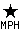

# Convolution of Images

Convolution uses the local 'neighbourhood' of pixels to modify images$1\nIt does this by merging and averaging all the color values around each pixel to blur images, to highlight edges and boundaries, and sharpen images.
The convolution variation, 'Correlation' is also used for scanning and searching for specific patterns, producing a image denoting how closely images matches.

------------------------------------------------------------------------

## Introduction to Convolution {#intro}

The '`Convolve`' and the closely related '`Correlate`' methods, are is many ways very similar to [Morphology](../morphology/#intro).
In fact they work in almost the exactly the same way, matching up a heighbourhood 'kernel' at each location, making them a just another special 'method' of morphology.

In fact, they also use much of the same code and even the same kernel defintions that was defined in [Basic Kernels](../morphology/#kernels) and [User Defined Kernels](../morphology/#user).
For more specific kernels designed for use by this operator, (and there are many), I refer you to [Blurring Kernels](#blurring_kernels), and [Edge Detection Kernels](edgedet_kernels).
The most important kernel being the '`Gaussian`' kernel.

However, convolution is much older than morphology, and it generates more grey-scale gradient effects, rather than the binary shape studying effects that morphology typically generates.
This is why it is often regarded as a very different or separate operation to morphology and one that is more central to image processing.

Basically a convolution or correlation performs a 'weighted average' of all the pixels in the neighbourhood specified.
That is, it multiplies the value of each nearby pixel by the amount given in the kernel, then adds all those values together to produce the final result.

As such, each pixel in the final image will generally contain at least a small part of all the other pixels locally surrounding it in the source image.
Looking at it another way, the color of each pixel in the image will be either added to (blurred) or subtracted from (sharpen/edge detection) the colors of all its near by neighbours, as defined by then kernel used.

Both 'convolve' and 'correlate' are the same operation, except in a very minor but important way, and for the examples and controls that we will now look, you can treat them as being basically the same thing.
Later (See [Convolution vs Correlation](#convolve_vs_correlate)) we will examine exactly how the two operators really differ and why they differ in such a minor way.
But in most circumstances they are the same method.
  
### Convolve (  ) {#convolve}

As was mentioned above the '`Convolve`' method works by weighting each of the pixels in the local neighbourhood, according to the floating point values in the kernel.
The weighted values are then simply added together to produce the new replacement pixel in the resulting image.

For example lets convolve a single pixel, using a very small [User Defined](../morphology/#user) convolution kernel.
I also set the special [Show Kernel Setting](../morphology/#showkernel), so you can see the details of the kernel being defined and used (displayed images have been enlarged).

~~~
convert xc: -bordercolor black -border 5x5 pixel.gif
convert pixel.gif -define showkernel=1 \
        -morphology Convolve '3x3: 0.0, 0.5, 0.0
                                   0.5, 1.0, 0.5
                                   0.0, 0.5, 0.0'  pixel_spread.gif
~~~

[![\[IM Text\]](spread_kernel.txt.gif)](spread_kernel.txt)
[![\[IM Output\]](pixel_mag.gif)](pixel.gif)  [![\[IM Output\]](kernel_spread.gif)](kernel_spread.gif)  [![\[IM Output\]](pixel_spread_mag.gif)](pixel_spread.gif)

As you can see the single pixel in the image has now expanded to produce 50% gray pixels around it.

That is, when the kernel's 'origin' (it's center in this case) is positioned next to the single pixel in the original image, only that single pixel has a non-zero value.
This pixel value is then weighted by the '`0.5`' value of the kernel, and the resulting 'half-bright' pixel is added to the resulting image.

Similarly when the kernel's origin is position exactly over the original pixel, it will get a value of '`1.0`' reproducing the original pixel with no other values (black) in the neighbourhood around it adding any component to the result.

Note that any kernel value of '`0.0`' will take no part in the final calculation.
Zero values are effectively not part of the 'neighbourhood', just as any '`Nan`' value in morphology kernels take no part.
As such this kernel consists of a 5 element neighbourhood.

In many ways a '`Convolve`' method is very similar to a morphological '`Dilate`' method, however '`Dilate`' only treats the kernel as a type of bitmap mask, locating the largest value within the neighbourhood.
On the other hand '`Convolve`' is a weighted sum of all the values in the neighbourhood, as such the value of each kernel element plays a part in the overall result.

The syntax of a convolution operation is...

~~~
-morphology Convolve {convolution_kernel}
~~~

But you can also use an older, more direct operator...

~~~
-convolve {convolution_kernel}
~~~

> 
> Before IM v6.5.9 the older "`-convolve`" did not understand morphology kernel definitions.
> It would only accept the 'old style' of user defined kernels, consisting of just a string of comma separated values to produce to some odd-sized square kernel.
> It will now accept the 'new' style' convolution kernels definitions.
>
> However it is still restricted to 'odd sized' square kernels.
> And will remain that way until it starts to make use of the new 'morphology' convolution method.
>
> 
> The older "`-convolve`" operator is not exactly the same as the newer morphology '`Convolve`' method.
>The following is a list of how the two operations differ...
>
> -   The old operator is implemented as a [Correlation](#correlation) rather than a true convolve.
>     This means the kernel is not overlaid on the source image in its reflected form.
>     See [Convolve vs Correlate](#convolve_vs_correlate) for the effects this has on results.
> -   It only accepts odd sized square kernels.
>     The morphology one allows any rectangular array, with any point within the array being declared as the origin.
> -   The old operator will always [Normalize Kernels](#kernel_normalization) without any user control over kernel [Kernel Scaling](#kernel_scaling) of the kernel.
>     The new one does not automatically normalize, you need to request it.
>     However most generated kernels are pre-normalized for you.
> -   You can not use any form of [Blending with the Identity Kernel](#identity_addition), though output [Output Bias](#bias) is performed as normal.
> -   It will however make use of fast 'GPU' code, if the host computer has such facilities.
>     Morphology does not have this enabled yet.
> -   Currently other convolution related operators, such as "`-gaussian_blur`", "`-blur`", "`-sharpen`", "`-unsharp`", use the old version of the operator.
> -   By default the old command will only convolve against the color channels (as defined by the "`-channel`" setting.
>     If you convolve with a "`-channel RGBA`" setting it will also weigh the kernel values by the alpha channel to ensure correct blurring with regards to transparency.
>
>     The Morphology '`convolve`' method will automatically handle transparency weighting of the color channels by default.
>     That is image blurring using it will treat transparent colors as transparent, and thus avoid the [Blur Transparency Bug](../bugs/blur_trans/), by default.
>
>     However if the user modifies the default "`-channel`" setting (by not including the special '`Sync`' flag), then it will handle the convolution as a pure channel based greyscale operator.
>
> See the "`-channel`" setting documentation, or look at [Image Channel Mathematics](../compose/#image_math) which uses the same flag in the same way, for more information.

  
Eventually most of the above differences will change as it things merge with the newer morphology '`Convolve`' method.

If you like to see some great examples of how '`Convolve`' actually does works, I recommend you also have a look at [EECE \\ CS 253 Image Processing, Lecture 7, Spatial Convolution](http://www.archive.org/details/Lectures_on_Image_Processing/EECE253_07_Convolution.pdf).

The [Wikipedia, Convolve](http://en.wikipedia.org/wiki/Convolve) article has some nice 1-D animations of the convolution process.

### Convolve Kernel Scaling {#kernel_scaling}

The above example works well for a mostly black image such as a single pixel, but if you were to apply this to a real image, you will have a problem...

~~~
convert logo: -resize 50% -crop 80x80+150+60 +repage  face.png
convert face.png \
        -morphology Convolve '3x3: 0.0,0.5,0.0  0.5,1.0,0.5   0.0,0.5,0.0' \
        face_spread.png
~~~

[![\[IM Output\]](face.png)](face.png)

[![\[IM Output\]](kernel_spread.gif)](kernel_spread.gif)

[![\[IM Output\]](face_spread.png)](face.png)

As you can see the resulting image is very bright (3 times brighter in fact) as the original image.

What happened is that each pixel is being shared 3 times, 4 × '`0.5`' on the sides, plus a full copy of the original pixel.
That is the addition of all the values in the kernel is 3, making the resulting image three times as bright!

If you go back and look at the 'showkernel' output above, you will see that it listed this kernel as having a "convolution output range from 0 to 3".
Which shows that this kernel will in general brighten an image 3 times.

To fix this you would want to divide all the values in the kernel by 3.
That is a value of '`0.5`' should really have been about '`0.1667`' while the central value of '`1.0`' should have been '`0.3333`'.
This is a process known as '**Kernel Normalization**'.

For example here is manually 'normalized' result, and the kernel definition...

~~~
convert face.png  -define showkernel=1 \
        -morphology Convolve \
                '3x3: 0.0,.1667,0.0  .1667,.3333,.1667   0.0,.1667,0.0' \
        face_spread_norm.png
~~~

[![\[IM Text\]](kernel_spread_norm.txt.gif)](kernel_spread_norm.txt)
[![\[IM Output\]](face.png)](face.png)  [![\[IM Output\]](kernel_spread_norm.gif)](kernel_spread_norm.gif)  [![\[IM Output\]](face_spread_norm.png)](face_spread_norm.png)

As you can see you get a very slightly blurred version of the face image, as each pixel was spread out to each of its immediate neighbours.
  

  
The 'kernel image' that is shown in the above (generated using a special [Kernel 2 Image Script](../morphology/#kernel2image)) also shows the resulting normalized kernel.
As you can see the kernel itself is now very dark, as all its values are also dark, though they all add up to a value of '`1.0`'.
  
From this point on all convolution kernel images shown will always be adjusted so the maximum value is set to white, otherwise all you will generally see is a dark, and basically useless, 'Kernel Image'.

Normalizing the kernel yourself is not pleasant, and as you saw it makes the resulting kernel definition a lot harder to understand.
As such, alternative ways are provided.

As of IM v6.5.9-2 the special expert option "`-define convolve:scale={kernel_scale}`' allows you to specify a global scaling factor for the kernel, and thus adjust the brightness of the overall result.

~~~
convert face.png  -define convolve:scale=0.33333 \
        -morphology Convolve '3x3: 0.0,0.5,0.0  0.5,1.0,0.5  0.0,0.5,0.0' \
        face_spread_scale.png
~~~

[![\[IM Output\]](face_spread_scale.png)](face_spread_scale.png)

Actually what this does is adjusts the overall intensity of the kernel results.
As you will see in later examples, you will probably want to make the convolution result more or less powerful.
This '*kernel\_scale*' factor lets you do that.

### Kernel Normalization (automatic scaling) {#normalize}

Rather then working out the scaling factor (as above), you can simply ask the IM to work out this 'normalize scaling factor' internally by giving it the special '`!`' normalization flag.

~~~
convert face.png  -define convolve:scale=\! \
        -morphology Convolve  '3x3: 0,1,0  1,2,1  0,1,0' \
        face_spread_normalize.png
~~~

[![\[IM Output\]](face_spread_normalize.png)](face_spread_normalize.png)

> 
> The '`!`' character is also sometimes used for special purposes by various UNIX command line shells.
> So you may have to escape the character using a backslash, even in quotes.
> Caution is advised.

Note that as the kernel is now normalized, I can define it in a simpler fashion using whole numbers.
The normalized kernel will still be the same as previous 'scaled' kernel.

Typically you will always want to normalize the kernel, and because of this the simpler "`-convolve`" variant will automatically do this normalization.

You can have IM normalize the kernel, then scale it further again by a given amount to adjust its output range.
To make this even easier you can specify the scaling factor as a percentage.

For example here I normalize the kernel but then re-scale the values to 50% the calculated size, so as to produce a darker result.

~~~
convert face.png  -define convolve:scale=50%\! \
        -morphology Convolve  '3x3: 0,1,0  1,2,1  0,1,0' \
        face_spread_norm_half.png
~~~

[![\[IM Output\]](face_spread_norm_half.png)](face_spread_norm_half.png)

Note that using a value of '`!`' is actually equivalent to using '`1!`' or even '`100%!`'.
You can even use a negative scaling factor if you want to flip the positive and negative values within the kernel.
For an example of this see ['Un-Sharpening' Images using Blurs](#unsharpen).

If the kernel has been normalized in this way the [Show Kernel](../morphology/#showkernel) output will tell you that it is normalized.

#### How Normalization Works {#normalize_how}

The actual way '*Kernel Normalization*' works is that all the kernel values are added together (including any negative values which is also posible).
If the result is non-zero, then scale all the values so that their combined value adds up to a value of one ('`1.0`').

Note that, if you have negative values, this could actually create a kernel with a value larger than one, typically at the origin.
It specifically happens with [Un-Sharp](#unsharpen) kernels.
The important point, however, is that the kernel as a whole adds to '`1.0`', so that the final image is not made darker or lighter by the [Convolution](#convolve) operation.

If the result of the addition is Zero ('`0.0`'), then the kernel is assumed to be a special [Zero-Summing Kernel](#zero-summing).
In that case the kernel is scaled to make all positive values equal to '`1.0`', and by the same token, all negative values will then add up to '`-1.0`'.
These kernels are especially prevalent with [Edge Detection](#edgedet) techniques.

The [Show Kernel](../morphology/#showkernel) output will also specify that it is zero-summing, if the kernel is in this form, even if not actually a normalized zero-summing kernel, though that will also be easilly seen by the other numbers displayed.

Most mathematically determined kernels are pre-normalized.
This includes the mathematically derived kernels: '`Unity`', '`Gaussian`', '`LoG`', '`DoG`', '`Blur`', '`Comet`'.

Discrete Constant Kernels, however are are not pre-normalized, so you will have to do this using the [Kernel Normalization Setting](#normalize) (above).
This includes the kernels: '`Laplacian`', '`Sobel`', '`Roberts`', '`Prewitt`', '`Compass`', '`Kirsch`', '`FreiChen`'.

Note that the '`FreiChen`' kernel has sub-types that are specially pre-weighted for more specific purposes.
The FreiChen kernels should not be normalized, but used as is.

### Zero-Summing Normalization {#zero-summing_normalization}

Not all convolution kernels use only positive values.
You can also get kernels that use a mix of positive and negative values and often the values of these kernels are meant to add up to zero to produce a [Zero-Summing Kernels](#zero-summing).
Such kernels are very important to more advanced Image Convolutions, as they provide techniques of [Edge Detection](#edgedet) and [Sharpening Images](#sharpening).

As I mentioned in the last section, the usual normalization flag '`!`' will work with such kernels.
But sometimes due to special situations you want to ensure that the kernel does remain 'zero-summing'.

The special '`^`' normalization method just provides a way to ensure the kernel is 'zero-summing' in situations such as...

1.  If the user's kernel definition is not precise enough to ensure zero-summing.
    For example you can not specify '`1/3`' or any other fractional factor of 3 as an exact floating point decimal number.
2.  The mathematical curve gets 'clipped' by the kernels size (radius) so it may no longer be zero summing.
    For example, this occurs in a '`LoG`' or '`DoG`' kernels, which are based on infinite response curves.
    IM actually uses this special normalization internally on these kernels for this very reason.
3.  Ensure that a [Correlation](#correlate) 'shape mask' is zero summing, so that in the search, IM can look for both positive and negative matches, equally.
    See [Correlation Shape Searching](#correlate) below.

What happens is that it will normalize the all the positive and negative values of the kernel as separate enities.
That is all the negative values will be scaled to add up to '`-1.0`' and all the positive values to scaled add to '`+1.0`'.
The result is that the kernel will be guaranteed as a whole, to add up to zero.

Note that if you use this normalization method for an all-positive kernel such as 'Gaussian' you will still get a properly normalized kernel.
As such this form of normalization can still be used with [Blurring Kernels](blurring_kernels).

However it should not be used to normalize directly defined [Sharpening](#sharpening) or even [Un-Sharpening](#unsharpen) kernels, as this can contain negative values, but are required to sum to a value of one (using the normal normalization method).

### Blending Kernel with the Identity Kernel {#identity_addition}

The full syntax of the Kernel Scaling Setting is either...

~~~
-define convolve:scale='{kernel_scale}[!^]       [,{origin_addition}] [%]' -set option:convolve:scale '{kernel_scale}[!^]       [,{origin_addition}] [%%]'
~~~

Note the doubling of the percent character when using "`-set`".

The optional normalization flags '`!`' or '`^`" will be applied to the user defined or built in kernel first (if requested).

After that, the kernel will scaled by the '*kernel\_scale*' factor either increasing or decreasing the effective 'power' of the convolution on the results.
Default scaling factor is '`1.0`'.

Lastly the 'origin' value of the kernel will have the number after a comma added to it.
Default '*origin\_addition*' is '`0.0`'.

This last step effectively 'adds' a [Unity Kernel](#unity) of the given 'scaling' to the previously generated normalized and scaled kernel.

This generates kernels that can...

-   Soften the effects of a [Blurring Kernel](#blurring_kernels).
-   Convert a [Blurring Kernel](#blurring_kernels) into one that can be used to directly to [Un-Sharpen an Image](#unsharpening).
-   It can also allow you to convert [Edge Detection Kernel](#edgedet_kernels) into a [Image Sharpening Kernel](#sharpening).

Note that if you give a percent ('`%`') flag, that percentage will be applied to BOTH the '*kernel\_scale*' factor and the '*origin\_addition*'.
This can make makes the scale easier to read and understand when fractions are involved.

Example use of kernel scaling define...

~~~
-define convolve:scale='!50%,100%'  -morphology Convolve Laplacian:2
~~~

Will generate the requested '`Laplacian:2`' kernel...

$$
\begin{array}{ccc}
 0 & -1 &  0 \\
-1 &  4 & -1 \\
 0 & -1 &  0 \\
\end{array}
$$

Normalizes it ('!' flag)

$$
\begin{array}{ccc}
 0    & -0.25 &     0 \\
-0.25 &  1    & -0.25 \\
 0    & -0.25 &     0 \\
\end{array}
$$

Scale by 50%

$$
\begin{array}{ccc}
 0     & -0.125 &  0     \\
-0.125 &  0.5   & -0.125 \\
 0     & -0.125 &  0     \\
\end{array}
$$

Add a Unity kernel (add 100% to origin value)

$$
\begin{array}{ccc}
 0     & -0.125 &  0     \\
-0.125 &  1.5   & -0.125 \\
 0     & -0.125 &  0     \\
\end{array}
$$

And you can now convolve using '`Laplacian:2`' as a sharpening kernel, but with only a '`50%` sharpening power.

Remember any '`%`' flag given anywhere in the scale setting, will make both values percentages.
If not present both values are just simple direct multipliers.
For example all these scaling options are equivalent

~~~
50,100%     50%,100    %50,100      .5,1      0.5,1.0
~~~

The same goes for the two normalization flags.
They can appear anywhere in the convolve scaling setting, but they will always be applied first before any other scaling takes place.

### Output result Bias Control {#bias}

When you are dealing with a kernel that contains negative values, some pixels in the resulting image should be assigned a negative value.
This is especially the case with [Zero-Summing Kernels](#zero-summing) (see below).

Unfortunately, unless you have a specially built [HDRI Version of ImageMagick](../basics/#hdri), to preserve the negative values that were generated, any negative result will be clipped to zero (black).
You will only get the positive results from the convolution.
It just can not be stored in a normal image format, leaving you with half the result.

You could build [HDRI Version of ImageMagick](../basics/#hdri) to preserve the negative values that were generated, and then extract the information you want.
Alternately, you can negate the kernel by using a negative scaling factor.
For example using...

~~~
-define convolve:scale='-1'
~~~

However then you only get the negative results with the positive results becoming clipped.

However by using the IM setting "`-bias`" you can still preserve both positive and negative results.

The settings to use for non-HDRI version of IM is...

~~~
-define convolve:scale=50%\!  -bias 50%
~~~

The first setting scales the output to half the size you would normally get (after it is normalized), so as to make room for both positive and negative results.
Then it will add a 50% gray to the pixel output before saving the result back into an image.

With these settings, any 'zero' result will become pure gray with negative results darker than this and positive result lighter than this.
Black will represent '`-1.0`' and white will mean '`+1.0`'.

One example of doing this is shown in the [Correlate Shape Search](#correlate_search) examples below.

------------------------------------------------------------------------

## Blurring Images (low-pass filtering) {#blurring_images}

Another section of IM examples, specifically [Blurring, and Sharpening Images](../blur/), actually deals with practical aspects of this subject.
Here we look at more specific details.

First however, we will describe the basic kernels and how you can use them directly without modification.
Later we will look at ways of modifying the bluring to generate other effects.

### Blurring Kernels {#blurring_kernels}

[![\[IM Output\]](kernel_unity.gif)](kernel_unity.gif)

#### Unity {#unity}

This is a special kernel that actually does nothing.
Only one kernel element is specified, and as a result each pixel is replace by itself without change.

For example here is a no-op [Convolution](#convolve)...

~~~
convert face.png -morphology Convolve Unity  face_unity.png
~~~

[![\[IM Output\]](face.png)](face.png)  [![\[IM Output\]](kernel_unity.gif)](kernel_unity.gif)  [![\[IM Output\]](face_unity.png)](face_unity.png)

As of IM v 6.6.9-4, the kernel can take a single argument, as a kernel specific scale argument.
This allows you to use it to multiply the values of an image, such as make an image brighter or darker.

~~~
convert face.png -morphology Convolve Unity:0.5  face_dimmed.png
~~~

[![\[IM Output\]](face_dimmed.png)](face_dimmed.png)

This may not seem very useful, but it can be used for generating [Soft Blurs](#soft_blur), and [Unsharpen](#unsharpen) effects, or in multi-kernel sequences where you may not be able to use [Kernel Scaling](#kernel_scaling) or [Kernel Identity Blending](#identity_addition).

This kernel exact same single element kernel can also be generated using '`Disk:0.5`', which also allows you to specify a scaling argument as part of the kernels generation.
(EG: '`Disk:0.5,0.5`' for the last example).

A similar kernel (for [Convolution](#convolve)) can also be generated by the a '`Gaussian`' kernel generator with a '*sigma*' of '`0.0`'.
However that can only produce a small 3x3 kernel, consisting of a central '`1.0`' value surrounding by 8 '`0.0`' values.

[![\[IM Output\]](kernel_shape.gif)](kernel_shape.gif)

#### Mean or Average Filtering using Shape Kernels {#mean}

While most convolution kernels defined below generally involve the use of a Gaussian Curve in some way, you can still use one of the previous [Morphology Shape Kernels](../morphology/#shape_kernels) to simply average the pixels over a given (large) area.
Of course you will need to [Normalize](#normalize) the kernel so as to actually generate an average, rather than just a sum of the neighbourhood.

For example, here I use a smaller '`Octagon`' shaped kernel, to average all the pixel values found within a circlular areas surrounding each pixel.

~~~
convert face.png  -define convolve:scale=! \
        -morphology Convolve Octagon:2  face_mean.png
~~~

[![\[IM Output\]](face.png)](face.png)  [![\[IM Output\]](kernel_shape.gif)](kernel_shape.gif)  [![\[IM Output\]](face_mean.png)](face_mean.png)

The result is that the value of each pixel is spread out equally over all 25 pixels in the defined neighbourhood.
That is, it is equivalent to a 'mean' or 'averaging' filter over the given shape.

If you want to exclude the original pixel from that average, only using the surrounding pixels, then you can use a '`Ring`' kernel (supplying only one radii).

The other [Shape Kernels](#shape_kernels) can also be used in the same way to, say, average the pixel values over a '`Diamond`', '`Square`' or large '`Disk`' shape and to whatever size you want.

However while a constant averaging over an shaped area does blur images, it has a tendency to produce unusual effects (specifically [Aliasing Artefacts](../filter/#aliasing)) in the resulting image.

More specifically, by using a 'flat' averaging kernel tends to convert sharp edges into a thicker linear slope with sudden change in the slope at the thickened egdes

The thickness of the result is kernel '`radius*2-1`'.
How different edge angles effect the slope thickness and linearity of the slope depends on the shape of the 'flat' or averaging kernel.

~~~
convert -size 80x80 xc: -draw 'polygon 15,15 15,65 60,15' shape.png
convert shape.png \
        -define convolve:scale=! -morphology Convolve Square:5 \
        shape_mean_square.png
convert shape.png \
        -define convolve:scale=! -morphology Convolve Disk:5 \
        shape_mean_disk.png
~~~

[![\[IM Output\]](shape.png)](shape.png)

[![\[IM Output\]](shape_mean_square.png)](shape_mean_square.png)
[![\[IM Output\]](shape_mean_disk.png)](shape_mean_disk.png)

Note that the diagonal blur in the above is different for a square kernel, than it is for a disk kernel.

Another way of generating square 'linear slope' blurring is to use a very large sigma with a specific radius.
The above square kernel convolution can for example also be achieved using `-blur 5x65535`.
This was commonly used by Fred Wienhaus in his scripts before morphology was available.

[![\[IM Output\]](kernel_gaussian.gif)](kernel_gaussian.gif)

#### Gaussian Kernel (2d gaussian blur) {#gaussian}

As you may have gathered, the '`Gaussian`' kernel is the most commonly used kernel to [Convolve](#convolve) an image.
This is the mathematical ideal kernel for blurring effects.

Here for example is the [Show Kernel](../morphology/#showkernel) of a small '`Gaussian`' kernel (they can get very large very quickly)...

~~~
convert xc:  -define showkernel=1 \
             -morphology Convolve:0 Gaussian:0x0.8  null:
~~~

[![\[IM Text\]](kernel_gaussian.txt.gif)](kernel_gaussian.txt)

I did not actually want to apply a convolution to the above, as I only wanted to show the kernel that it was going to use.
As such I used a '`:0`' [Iteration Count](../morphology/#iterate), so it does nothing.
Similarly I junk the resulting image output using the special '`null:`' file format.

As you can see by the convolution output range, a '`Gaussian`' kernel has already been normalized (scaled) for you.
However you will also notice that it is still quite a large kernel, filled completely with small fractional values.
If you look closer you will find the largest value (also listed on the first line) is in the center, with the smallest values toward the edges and the corners.

Here typical Gaussian blur using a convolution...

~~~
convert face.png   -morphology Convolve Gaussian:0x2  face_gaussian.png
~~~

[![\[IM Output\]](face.png)](face.png)  [![\[IM Output\]](kernel_gaussian.gif)](kernel_gaussian.gif)  [![\[IM Output\]](face_gaussian.png)](face_gaussian.png)

The kernels syntax is straightforward...

~~~
Gaussian:[{radius}]x{sigma}
~~~

These arguments are in fact exactly the same as that used by the "`-gaussian-blur`" operator, which actually performs a [Convolution](#convolve) using this kernel.

The first number, like most [Morphology Kernels](../morphology/#kernel), is the '*radius*' or size of the kernel.
This is just an integer, with a minimum value of 1, making the smallest kernel posible 3x3 elements in size.
The best idea is to always specify zero, which allows ImageMagick to calculate an appropriate radius for the '*sigma*' value provided.

The second more important argument is '*sigma*' which defines how blurred or 'spread out' each pixel should become.
The larger the value the more blurry a image will become.
It is a floating-point value.
**The *sigma* value MUST be provided**.

If a sigma value of '`0.0`' is given you will end up with a fairly useless '`Unity`' kernel (of the given radius, or a radius of 1, so producing a 3x3 kernel of a single '`1.0`' value surrounded by '`0.0`' values.).
As you saw above, convolving with any type of '`Unity`' kernel does *nothing* to the image!

If you do specify a '*radius*' it is generally a good idea to make it at lest twice as big as the '*sigma*', IM usally calculates a radius that is approximatally 3 times as big (actually the largest radius that will provide meaningful results), though it depends on the [Compile-time Quality](../basics/#quality) of your specific IM installation.

For more information on the effect of the '`Gaussian`' kernel arguments, and on blurring images in general, see... [Blurring Images](../blur/#blur).

[![\[IM Output\]](kernel_blur.gif)](kernel_blur.gif)

#### Blur Kernel (1d gaussian blur) {#blur}

The '`Blur`' kernel is very similar to the [Gaussian Kernel](#gaussian), and even takes the same arguments (see below).
But where gaussian is a 2-dimensional curve, the '`Blur`' kernel produces a 1-dimensional curve.
That is to say it generates a long thin single row of values.

Here is a [Show Kernel](../morphology/#showkernel) output of a small '`Blur`' kernel.

~~~
convert xc:  -define showkernel=1 \
             -morphology Convolve:0 Blur:0x0.8  null:
~~~

[![\[IM Output\]](kernel_blur_profile.gif)](kernel_blur_profile.gif)
  
[![\[IM Text\]](kernel_blur.txt.gif)](kernel_blur.txt)

The graph shown above is an actual profile of the default '`Blur`' kernel.
It was created using the [Kernel Image](../morphology/#kernel2image) script "`kernel2image`", and that image then graphed using the "`im_profile`" script.
It clearly shows the 'Gaussian Bell Curve' that this kernel represents.
  
Here is an example of using this kernel to horizontally blur a image.

~~~
convert face.png -morphology Convolve Blur:0x4  face_blur.png
~~~

[![\[IM Output\]](face_blur.png)](face_blur.png)

The kernel's syntax is exactly like that of '`Gaussian`' but with a extra optional rotation angle.

~~~
Blur:[{radius}]x{sigma}[,{angle}]
~~~

As before the second value '*sigma*' is required, and if set to zero you will get the linear equivalent of a '`Unity`' kernel.
  
The '*angle*' allows you rotate the kernel by 90 degrees allowing you to blur an image vertically.

~~~
convert face.png -morphology Convolve Blur:0x4,90  face_blur_vert.png
~~~

[![\[IM Output\]](face_blur_vert.png)](face_blur_vert.png)

At this time only a 90 degree rotation is posible.
This may change in a later version of ImageMagick.

The purpose of this kernel is actually to create a faster form of 2-dimensional image blurring that the '`Gaussian`' kernel produces.
See [Gaussian vs Blur Kernels](#gaussian_vs_blur) below for details of how this is done.

[![\[IM Output\]](kernel_comet.gif)](kernel_comet.gif)

#### Comet Kernel (half 1d gaussian blur) {#comet}

The '`Comet`' kernel is almost exactly the same as a '`Blur`' kernel, but is actually only a half a blur kernel.

~~~
convert xc:  -define showkernel=1 \
             -morphology Convolve:0 Comet:0x1.0  null:
~~~

[![\[IM Text\]](kernel_comet.txt.gif)](kernel_comet.txt)

Note how the defined location of the origin is on the left hand edge, and not in the center of the kernel.
This is very unusual for a convolution kernel, and as as such produces a very unusual result.

It blurs the image out in one direction like a finger had smeared the surface of a wet painting, leaving a trail of color.
Its a bit like the tail of a comet, or the trail left by a meteor, or falling star.

~~~
convert face.png -morphology Convolve Comet:0x5  face_comet.png
~~~

[![\[IM Output\]](face_comet.png)](face_comet.png)

Note that both the foreground and background colors were 'smeared'.
If you only want to blur the foreground colors, make the background transparent.

You can also give a third *angle* argument to rotate the kernel in any multiple of 90 degrees about its 'origin'.

~~~
convert face.png -morphology Convolve comet:0x5+90  face_comet_vert.png
~~~

[![\[IM Output\]](face_comet_vert.png)](face_comet_vert.png)

This kernel is actually the same kernel that is use by the specialized [Motion Blur](../blur/#motion_blur) operator, though that operator also does some very fancy coordinate look-up handling to allow the blur to work at any angle.
Though it does so poorly, producing 'clumps' of color at large angles, such as 45 degrees.

Hopefully proper kernel rotation will implemented to create better motion blur type effects at angles outside of 90 degree increments.

[![\[IM Output\]](kernel_blur_profile.gif)](kernel_blur_profile.gif)

### Gaussian Curve {#gaussian_curve}

The Gaussian Curve, is a classical and idealized density function, that has a area of 1 under the curve.
The '*sigma*' value represents the distance from the center to the point at which the curve crosses 50% of the peak value.

The larger the sigma value, the more spread out the curve is, and as such defines the 'neighbourhood', around the central point.
Also the larger the value of sigma, the more spread out and diffuse the effect of any single point becomes.
At very large (practically infinite) values, it will has spread out to uniformity or a background 'average'.

The '*radius*' just limits the overall distance from the pixel and is more a 'memory' and processing speed factor.

*FUTURE: show a graphed example*

If you must set its value set it to at least 2 times that of the sigma, Otherwise set it to zero and let IM decide on a good value to use (which internally can be very large).

It is special in that it is also the result you get from a poorly focused lens on an image, and as such is very commonly used in image processing.

### Gaussian vs Blur Kernels {#gaussian_vs_blur}

As mentioned the '`Gaussian`' and '`Blur`' kernels are very closely related, and can in fact to the same job.
Both are representations of the [Gaussian Curve](#gaussian_curve), the first being a 2-dimensional representation, while the other is a 1-dimensional representation.

For example here is repeat of the "`-gaussian-blur 0x2`" which is equivalent to "`-morphology Convolve Gaussian:0x2`" operation.

~~~
convert face.png    -gaussian-blur 0x2      face_gaussian-blur.png
~~~

[![\[IM Output\]](face_gaussian-blur.png)](face_gaussian-blur.png)

This can be replaced by using two separate Linear or 1 dimensional blurring operations rotated ninety degrees to each other (order does not really matter either)...

~~~
convert face.png -morphology Convolve Blur:0x2 \
                 -morphology Convolve Blur:0x2+90  face_blur_x2.png
~~~

[![\[IM Output\]](face_blur_x2.png)](face_blur_x2.png)

Rather than specifying two separate convolutions, you can give both kernels as a kernel list.
For example

~~~
convert face.png -morphology Convolve 'Blur:0x2;Blur:0x2+90' face_blur_x2.png
~~~

IM will by default 're-iterate' the result of the first convolve kernel with the second (and later) convolve kernel, as defined by [Multiple Kernel Composition](../morphology/#kernel_compose) setting.

You can even simplify the above even further by asking IM to expand one kernel into a [Rotated Kernel List](../morphology/#rotated_kernels), by using a '`>`' to do a list of 90 degree rotations (two kernels in this case).
For example...

~~~
convert face.png -morphology Convolve 'Blur:0x2>' face_blur_x2.png
~~~

All the above examples are equivalent to each other, and is how the "`-blur`" operator works.

~~~
convert face.png    -blur 0x2      face_blurred.png
~~~

[![\[IM Output\]](face_blurred.png)](face_blurred.png)

This represents the real difference between "`-blur`" and "`-gaussian-blur`" operators.
In the latter one single large 2-dimensional kernel is used, while the former uses two small 1-dimensional kernels are used.

In terms of speed however the "`-blur`" operator is usually an order of magnitude faster, as it uses two much smaller kernels, rather than one very large one.
The larger the blurring argument (the size of the *sigma* argument) the bigger kernels become, and the larger the difference in speed between the two operations.
As such the "`-blur`" operator is generally the recommended one to use.

The only difference in results between the two operators are small quantum rounding effects (unless you are using HDRI) and edge effects (depending on [Virtual Pixel Setting](../misc/#virtual)).
Both of these being caused by a loss of information generated due to saving a intermediate image between the two separate passes of the 'blur' convolutions.
This difference is typically so small as to be invisible and of no concern to any practical usage.

### Softened Blurring (blending with original image) {#soft_blur}

You can soften the impact of any sort of blur by blending it with some of the original image.
Especially when applying a very strong blur.
For example...

~~~
convert face.png  -morphology Convolve Gaussian:0x3  face_strong_blur.png
convert face.png  face_strong_blur.png \
        -compose Blend -define compose:args=60,40% -composite \
        face_soft_blur.png
~~~

[![\[IM Output\]](face.png)](face.png)

[![\[IM Output\]](face_strong_blur.png)](face_strong_blur.png)

[![\[IM Output\]](face_soft_blur.png)](face_soft_blur.png)

This used the '`Blend`' composition method, to mix '`60%`' of the blurred image (composition source image) with '`40%`' of the original image (composition destination image) to give a 'soft blur' effect on the final image.

However you can do the same thing directly by [Blending the Kernel with the Identity Kernel](#identity_addition), using the same ratio.

~~~
convert face.png -define convolve:scale=60,40% \
        -morphology Convolve 'Gaussian:0x3' face_soft_blur2.png
~~~

[![\[IM Output\]](face_soft_blur2.png)](face_soft_blur2.png)

Note that the order of the scaling numbers is the same.
The first number ('`60%`') scales the given kernel so as to reduce its effect on the output, while the second number ('`40%`') adds enough of the '`Unity`' (or 'Identity') kernel to prevent the result from becoming darker.

The important point is that for [Blurring Kernels](#blurring_kernels), the two numbers add up to '`100%`', just as you would for [Composite Blending](../compose/#blend_use).

You can also use the faster 2-pass blurring, but in this case we can not incorporate a 'Blend' into the kernel directly, as the two separate convolutions will not 'separate' cleanly.
As such we will need to again do the [Blend Composition](../compose/#blend) afterwards.

~~~
convert face.png \( +clone -blur 0x3 \) \
        -compose Blend -define compose:args=60 -composite \
        face_soft_blur3.png
~~~

[![\[IM Output\]](face_soft_blur3.png)](face_soft_blur3.png)

Note that you only need to give the amount of the blurred (source) image you want to be blended with the original image.
As such values of '`100`' will give the blurred image, while '`0`' will give the original image.

> 
> Remember the "`-blur`" operator is exactly equivalent to using the faster 2-pass [Bluring Kernels](#blur).
  
### 'Un-sharpen' Images using Blurs (subtracting from the original image) {#unsharpen}

By taking this blending of kernels further, so that you start to use a negative scaling, you can subtract the blurring effects from the original image.
The result is a technique called 'unsharp'.
See [Unsharp, Wikipedia](http://en.wikipedia.org/wiki/Unsharp_mask) for how it came to get such an unfortunate name.

~~~
convert face.png -define convolve:scale=-100,200% \
        -morphology Convolve 'Gaussian:0x2' face_unsharp.png
~~~

[![\[IM Output\]](face_unsharp.png)](face_unsharp.png)

Note that even though a negative kernel scaling factor is used, the two numbers still adds up to '`100%`', exactly as it did above.
You can also do this with [Composite Blending](../compose/#blend_use) as well.

The above example is actually exactly how the mis-named "`-sharpen`" operator works but with only the '*sigma*' blurring control.
However no other control of the operation is provided.
The blending is exactly as given above.

You can use faster 2-pass, 1-dimensional [Blurring Kernels](#blur), but again you will need to do the blending operation as a separate step.

~~~
convert face.png \( +clone -blur 0x2 \) \
        -compose Blend -define compose:args=-100,200 -composite \
        face_unsharp_fast.png
~~~

[![\[IM Output\]](face_unsharp_fast.png)](face_unsharp_fast.png)

This you may have gathered is almost identical to that of [Softened Blurring](#soft_blur) but with the blurred image being subtracted from the original image instead of being added.
A blending method known as [Extrapolated Blending](#compose/#blend_use), or blending beyond the normal 0 to 100 percent range.
Again like you can simply specify how much of the blurred image you want to subtract from the original image.
For example lets over do the unsharpening of the image, causing some aliasing and color distortions.

~~~
convert face.png \( +clone -blur 0x2 \) \
        -compose Blend -define compose:args=-200 -composite \
        face_unsharp_200.png
~~~

[![\[IM Output\]](face_unsharp_200.png)](face_unsharp_200.png)

The full "`-unsharp`" operator provides provides another type of control.
Specifically, a difference threshold, so that the sharpening only applied when the given difference is larger, such as near an actual edge within the image.
That threshold can be use to prevent the 'sharpening' small small defects, like wrinkles, or camera noise.

Unsharpening an image is typically used with very small blurs (on the order of sigma=0.75) after resizing or distorting image, to improve the final result.
See [Sharpen Resized Images](../resize/#resize_unsharp) for some examples of this.

The alternative to using an 'unsharp' technique for image sharpening is to actually locate image edges and use them to sharpen images.
See [Sharpening Images with Edge Detection](#sharpening) below for details.
However it is generally regarded as being slower, though not really by very much.

------------------------------------------------------------------------

## Edge Detection Convolutions (high-pass filtering) {#edgedet}

Edge Detection is another area in which convolutions are heavily used.

The task here is to highlight or enhance the edges of an image in various ways.
This can be to either locate an edge as accurately as posible or to determine the angle or direction of slope of each of the edges.

However the job can be made a lot more difficult by the presence of noise in the image, such as that produced by scanners, digital cameras, or even just caused by the lossy compression of the JPEG image file format.

In general, however, larger kernels handle noise better, but at a loss of localizing the edge properly, while smaller kernels produce sharp edge locating results but with more spurious results caused by noise in the image.

There are a lot of small, well-known kernels, that have been developed and studied for edge detection.
Most of these are 'named' after the mathematician which studied the mathematics or the developed that specific kernel type.
As such, you have kernels such as '`Laplacian`', '`Sobel`' and '`Prewitt`'.
These 'named' kernels are generally very small and are defined using whole numbers, so they can be built into specifically designed optimized software and hardware for speed.
That is, they are said to be 'discrete' kernels.
Because of that, you will need to either [Scale](#kernel_scale) or [Normalize](#normalize) the kernel as part of their use.

Edge detection also has the side effect of providing ways of sharpening the edges of an image.

### Zero-Summing Kernels {#zero-summing_kernels}

All the edge detection kernels have one feature in common.
They are all zero-summing.
That means they contain negative values, but with all the values in the kernel adding up to zero.

For a smooth flat color image, a [Convolution](#convolve) using such a kernel will produce a 'zero' or black image.
However for any other image, you will have results that contain both negatative and positive values.

For example here I apply a discrete '`Sobel`' edge detector on a image containing some basic shapes...

~~~
convert -size 80x80 xc:black \
        -fill white -draw 'rectangle 15,15 65,65' \
        -fill black -draw 'circle 40,40 40,20'       shapes.gif
convert shapes.gif  -define convolve:scale='!' \
        -morphology Convolve Sobel  shapes_sobel.gif
~~~

[![\[IM Output\]](shapes.gif)](shapes.gif)

[![\[IM Output\]](shapes_sobel.gif)](shapes_sobel.gif)

If you look at the results you will see that the kernel is directional in that only the vertical edges are found (as defined by the '`Sobel`' kernel with a zero angle.
However it only found one set of edges, the 'positive' left-to-right black-to-white slopes.

To get the 'negative' slopes you will need to negate the kernel, by using the [Kernel Scaling Setting](#kernel_scaling).
For example...

~~~
convert shapes.gif  -define convolve:scale='-1!' \
        -morphology Convolve Sobel  shapes_sobel_neg.gif
~~~

[![\[IM Output\]](shapes_sobel_neg.gif)](shapes_sobel_neg.gif)

With a '`Sobel`' kernel, you can also rotate it 180 degrees to get the same result as the 'scale negation', but not all kernels are symmetrical in this way.

The other solution is to add an [Output Bias](#bias) to the result.
That is add 50% grey to the resulting image so that negative values are lighter than this and positive values are brighter.
However, you will also need to [Scale the Kernel](#kernel_scale) to ensure the results remain 'unclipped' by the 'black' and 'white' limits of the image.

~~~
convert shapes.gif  -define convolve:scale='50%!' -bias 50% \
        -morphology Convolve Sobel  shapes_sobel_bias.gif
~~~

[![\[IM Output\]](shapes_sobel_bias.gif)](shapes_sobel_bias.gif)

If you don't care about the polarity you can get an absolute value of the results with a little trickiness..

~~~
convert shapes.gif  -define convolve:scale='50%!' -bias 50% \
        -morphology Convolve Sobel  -solarize 50% -level 50,0% \
        shapes_sobel_abs.gif
~~~

[![\[IM Output\]](shapes_sobel_abs.gif)](shapes_sobel_abs.gif)

See the '`Sobel`' kernel, for more result handling techniques, especially techniques involving direction determination.

The other alternative to using an [Output Bias](#bias) is to build a special [HDRI](../basics/#hdri) version of Imagemagick.
This stores images in memory using floating point values and means that the image values will not be 'clipped' or 'rounded' by the use of integers.

However, even if you do use this special version of IM you will still need to post-process the results before saving to a normal image file format or you will need to use a special floating point enabled image file format.
However you will not need to worry about clipping or rounding effects in the intermediate image results, making things easier to handle.

### Edge detection Kernels {#edgedet_kernels}

[![\[IM Output\]](kernel_log.gif)](kernel_log.gif)

#### LoG: Laplacian Of Gaussians {#log}

~~~
LoG:{radius},{sigma}
~~~

The '`LoG`' or "Laplacian of a Gaussian" is one of the best edge detection kernels you can get.
It is also known as a "Mexican Hat" kernel.

Basically is it a '`Laplacian`' differential (slope) operator, that has been smoothed by the addition of gaussian blurring.
This in turn removes most of the impact of noise in an image, which can be adjusted by the '*sigma*' setting.

The Kernel contains negative values that form a ring around a strong central peak.
In the 'Kernel Image' shown above, the negatives are shown as the dark (near black) colors with the edges decaying to zero (dark grey) toward the edges.

And here is its effect.. showing how it highlights the edges of the image.

~~~
convert face.png -bias 50% -morphology Convolve LoG:0x2  face_log.png
~~~

[![\[IM Output\]](face.png)](face.png)

[![\[IM Output\]](kernel_log.gif)](kernel_log.gif)

[![\[IM Output\]](face_log.png)](face_log.png)

A laplacian kernel is direction-less, but produces both a positive and negative ridge of values on either size of an edge.
To locate the edge you would look for the points of zero-crossing, between the positive and negative ridges, a technique known as [Marr and Hildreth Edge Detection](http://en.wikipedia.org/wiki/Marr-Hildreth_algorithm).

This kernel is also ideal for [Sharpening Images](#sharpen).

[![\[IM Output\]](kernel_dog.gif)](kernel_dog.gif)

#### DoG: Difference of Gaussians {#dog}

~~~
DoG:{radius},{sigma1}[,{sigma2}]
~~~

This will generate a '`DoG`' or "Difference of Gaussians" kernel in which the gaussian generated by '*sigma1*' will have the gaussian generated by '*sigma2*' subtracted from it.
Normally '*sigma2*' is the larger so that the 'central peak' of the kernel is positive.
Reversing the two numbers will effectively negate the resulting kernel.

One of the major criticisms of a [Laplacian of a Gaussian](#log) is that it is difficult to implement as it is such an unusual mathematical curve.
It is also not a very well documented curve.
The other aspect is that it can not be 'separated' into a faster 2-pass solution as you can with a Gaussian, (see [Gaussian vs Blur Kernels](#gaussian_vs_blur)).

However by generating two '`Gaussian`' kernels of slightly different *sigma* values (in a ratio of approximately 1.6), and subtracting them from each other you can actually generate a close approximation of a [Laplacian of a Gaussian](#log).

The result is that a '`DoG`' is much more easily generated in hardware, than a '`LoG`' kernel.

For example here I have placed the [Kernel Images](../morphology/#kernel2image) of a '`LoG`', and a '`DoG`' kernel side-by-side for comparison.

[![\[IM Output\]](kernel_dog.gif)](kernel_dog.gif) [![\[IM Output\]](kernel_log.gif)](kernel_log.gif)

If you look on the [Difference of Gaussian, Wikipedia](http://en.wikipedia.org/wiki/Difference_of_Gaussians) web page you will see some graphs where they also compare the profile of a '`LoG`' (or "Maxican Hat"), with a '`DoG`', showing the very very slight difference between matching curves.

*More information wanted on how to map a sigma of a LoG to generate a near equivalent 'DoG'.
If you know please [Mail Me](http://www.ict.griffith.edu.au/anthony/mail.shtml).*
  
The applied results are also the very similar.

~~~
convert face.png -bias 50% -morphology Convolve DoG:0,1.8,2.4  face_dog.png
~~~

[![\[IM Output\]](face_dog.png)](face_dog.png)
  
Note that both '*sigma*' values should be defined and at least one should be non-zero.
A zero value for either sigma component will be the equivalent of a '`Unity`' kernel, meaning that it keeps the image unchanged.
If both values are zero, the two Gaussians would be a '`Unity`' kernels, which when subtracted would produce a perfectly zero or black result (plus any bias value).
  
When the arguments are '`Dog:0,0,non-zero`, the DoG, becomes a simple high pass filter, which is defined as the 'Unity' kernel (producing the original image) minus a low pass filter kernel (blurred image).
In this case sigma1=0 is just the 'Unity' kernel and sigma2=*non-zero* is a Gaussian low pass (blur) filter kernel.
  
The following, therefore, produces a high pass filtered image with filter value of sigma2=2

~~~
convert face.png -bias 50% -morphology Convolve DoG:0,0,2  face_dog_unity.png
~~~

[![\[IM Output\]](face_dog_unity.png)](face_dog_unity.png)

A Photoshop high pass filter with filter value of radius=2 produces the same result.

Note that using '`DoG:0,2,0`' will return an image that is basically the negated version (around the Output Bias) of the previous image.

This technique can also be used to generate a 3x3 'Isotropic Laplacian' kernel, meaning a '`Laplacian`' kernel which produce equal results in all directions, rather than having unequal diagonal bias.

For example radius=1 (for a 3x3 kernel) and a sigma of 1 will generate...

~~~
convert face.png  -define showkernel=1 -bias 50% \
        -morphology Convolve DoG:1,0,1  face_laplacian_isotropic.png
~~~

[![\[IM Text\]](face_laplacian_isotropic.png)](face_laplacian_isotropic.png)
  
[![\[IM Text\]](kernel_laplacian_isotropic.txt.gif)](kernel_laplacian_isotropic.txt)

The other point about using a "Difference of Gaussians" is that you can use the much faster "`-blur`" operator (which internally uses the '`Blur`' kernels), to generate the same results.
However to do this you will need to generate each of the two 'blurred' images separately, and then subtract the results, with the addition of an appropriate scaling and bias.

For example...

~~~
convert face.png \
        \( -clone 0 -blur 0x1.8 \) \( -clone 0 -blur 0x2.4 \) -delete 0 \
        -compose Mathematics -define compose:args=0,-4,4,0.5 -composite \
        face_diff_of_blurs.png
~~~

[![\[IM Output\]](face_diff_of_blurs.png)](face_diff_blurs.png)

The above uses the special [Mathematics Composition Method](../compose/#mathematics) to avoid problems with 'clipping' during the subtraction of the images in a non-[HDRI](../basics/#hdri) version of IM.
For more details see [Adding Biased Gradients](../transform/#math_addition).

The only other factor is the use of a larger scaling factor during the subtraction (the two '`4`'s in the [Mathematics Compose](../compose/#mathematics) argument).
This is because subtracting two normalized blurs, does not produce the same (increased) magnitude of results that you from normalizing the two subtracted gaussian curves together in a '`DoG`' kernel.

However other than the magnitude, the above example image is equivalent to the first '`DoG`' kernel result, just faster to generate, especially for larger sigma values.
And that is the point, even though it is more work, that complex method is faster than using a '`DoG`' or '`LoG`' kernel directly.
  
#### Discrete Laplacian Kernels {#laplacian}

~~~
Laplacian:{type}
~~~

There have been many forms of small "Laplacian Kernel" that have been published in many scientific research papers.
Here I provide built in versions of the more common ones I have been able to find in the academic literature.

These kernel are basically calculated using a '`LoG`' kernel but scaled so as to use discrete integer values in a small kernal array.
This allow you to use generated dedicated fast image filters that only use integer maths to process the image data.
However ImageMagick is a more generalized image processor and as such does not provide such a ultra fast dedicated filter.
Still people like them as they are simpler to understand.

None of the kernels provided here are rotatable, and most are 'anisotropic', meaning they are not perfectly circular, especially in diagonal directions.
However see the previous section ('`DoG`' kernals) for a way to generate a true "Isotropic 3x3 Laplacian Kernel".

The first two '`Laplacian:0`' and '`Laplacian:1`' kernels are the most common form of "Discrete Laplacian Kernel" in use.
They are very small, meaning they will locate edges very accurately, but are also prone to enhancing image noise.

Note that not all '*type*' numbers have been defined, leaving spaces for more discrete kernels to be defined in the future.
The numbers used were selected to better match the kernel defined by that number.

#### `Laplacian:0` (default)

The 8 neighbour Laplacian.
Probably the most common discrete Laplacian edge detection kernel.

Here I use [Show Kernel](../morphology/#showkernel) to extract the 'discrete' and 'unnormalized' kernel, before showing you thw result of the normalized kernel with a [Output Bias](#kernel_bias).

~~~
convert xc: -define showkernel=1 -precision 2 \
        -morphology Convolve:0 Laplacian:0 null:
convert face.png -define convolve:scale='!' -bias 50% \
        -morphology Convolve Laplacian:0   face_laplacian_0.png
~~~

[![\[IM Text\]](face_laplacian_0.png)](face_laplacian_0.png)
  
[![\[IM Text\]](kernel_laplacian_0.txt.gif)](kernel_laplacian_0.txt)

Sometimes a Laplacian, whether it is a discrete Laplacian, as in the last example, or a generated '`LoG`' or '`DoG`' produces a result that is more complex than is desired.
In such cases, generating an unbiased, (without any [Output Bias](#kernel_bias)) will work better.

So lets repeat the above without a bias, so as to only keep the brighter 'positive' edges.

~~~
convert face.png -define convolve:scale='!' \
        -morphology Convolve Laplacian:0 \
        -auto-level face_laplacian_positives.png
~~~

[![\[IM Output\]](face_laplacian_positives.png)](face_laplacian_positives.png)

In this case we have dark (black) lines on a lighter (white) colors.
This in turn causes the filter to 'double' the edges, which can be seen in the results shown.

For this image using a negative scaling factor (to keep negative edges, rather than positive edges) works better.

~~~
convert face.png -define convolve:scale='-1!' \
        -morphology Convolve Laplacian:0 \
        -auto-level face_laplacian_negatives.png
~~~

[![\[IM Output\]](face_laplacian_negatives.png)](face_laplacian_negatives.png)

As you can see, for this image using the negative size produces stronger edges without the 'twinning' effects the positive results produced.
This is because of the use of 'black' edging lines on a white background, in the image being used.

ASIDE: The reason you get a blue edge around the yellow star is that the difference between the 'yellow' star, and the 'white' background is a subtraction of blue color.
If the background was black, you would get a yellow edge color.

#### `Laplacian:1`

The 4 neighbour Laplacian.
Also very commonly used.

~~~
convert xc: -define showkernel=1 -precision 2 \
            -morphology Convolve:0 Laplacian:1 null:
convert face.png -define convolve:scale='!' -bias 50% \
                 -morphology Convolve Laplacian:1   face_laplacian_1.png
~~~

[![\[IM Text\]](face_laplacian_1.png)](face_laplacian_1.png)
  
[![\[IM Text\]](kernel_laplacian_1.txt.gif)](kernel_laplacian_1.txt)

The results are not a strong, but are often clearer than the 8-neighbour laplacian.

#### `Laplacian:2`

3x3 Laplacian, with center:4 edge:1 corner:-2

~~~
convert xc: -define showkernel=1 -precision 2 \
            -morphology Convolve:0 Laplacian:2 null:
convert face.png -define convolve:scale='!' -bias 50% \
                 -morphology Convolve Laplacian:2   face_laplacian_2.png
~~~

[![\[IM Text\]](face_laplacian_2.png)](face_laplacian_2.png)
  
[![\[IM Text\]](kernel_laplacian_2.txt.gif)](kernel_laplacian_2.txt)
#### `Laplacian:3`

3x3 Laplacian, with center:4 edge:-2 corner:1

~~~
convert xc: -define showkernel=1 -precision 2 \
            -morphology Convolve:0 Laplacian:3 null:
convert face.png -define convolve:scale='400%!' -bias 50% \
        -morphology Convolve Laplacian:3    face_laplacian_3.png
~~~

[![\[IM Text\]](face_laplacian_3.png)](face_laplacian_3.png)
  
[![\[IM Text\]](kernel_laplacian_3.txt.gif)](kernel_laplacian_3.txt)

This kernel highlights diagonal edges, and tends to make vertical and horizontal edges vanish.
However you may need to scale the results (as I did above) to see make any result visible.

#### `Laplacian:5`

5x5 Laplacian

~~~
convert xc: -define showkernel=1 -precision 2 \
            -morphology Convolve:0 Laplacian:5 null:
convert face.png -define convolve:scale='!' -bias 50% \
                 -morphology Convolve Laplacian:5   face_laplacian_5.png
~~~

[![\[IM Text\]](face_laplacian_5.png)](face_laplacian_5.png)
  
[![\[IM Text\]](kernel_laplacian_5.txt.gif)](kernel_laplacian_5.txt)

The rule-of-thumb with laplacian kernels is the larger they are the cleaner the result, especially when errors are involved.
However you also get less detail.

#### `Laplacian:7`

7x7 Laplacian

~~~
convert xc: -define showkernel=1 -precision 2 \
            -morphology Convolve:0 Laplacian:7 null:
convert face.png -define convolve:scale='!' -bias 50% \
                 -morphology Convolve Laplacian:7   face_laplacian_7.png
~~~

[![\[IM Text\]](face_laplacian_7.png)](face_laplacian_7.png)
  
[![\[IM Text\]](kernel_laplacian_7.txt.gif)](kernel_laplacian_7.txt)

#### `Laplacian:15`

A Discrete 5x5 LoG (Sigma approximately 1.4)

~~~
convert xc: -define showkernel=1 -precision 2 \
            -morphology Convolve:0 Laplacian:15 null:
convert face.png -define convolve:scale='!' -bias 50% \
                 -morphology Convolve Laplacian:15   face_laplacian_15.png
~~~

[![\[IM Text\]](face_laplacian_15.png)](face_laplacian_15.png)
  
[![\[IM Text\]](kernel_laplacian_15.txt.gif)](kernel_laplacian_15.txt)

#### `Laplacian:19`

A Discrete 9x9 LoG (Sigma approximately 1.4)

~~~
convert xc: -define showkernel=1 -precision 2 \
            -morphology Convolve:0 Laplacian:19 null:
convert face.png -define convolve:scale='!' -bias 50% \
                 -morphology Convolve Laplacian:19   face_laplacian_19.png
~~~

[![\[IM Text\]](face_laplacian_19.png)](face_laplacian_19.png)
  
[![\[IM Text\]](kernel_laplacian_19.txt.gif)](kernel_laplacian_19.txt)

### Sharpening Images with Edge Detection (enhancing the edges of the original image) {#sharpening}

The '`LoG`' and '`DoG`' kernels can also be used to sharpen images, as opposed to [Un-sharpening Images using Blurs](#unsharpen).

Basically all you need to do is add the kernel results (including negative results) to the original image.

To do this is easy, simply add 100% weighted '`Unity`' or "Identity" kernel to the scaling factors.
This is why it was provided.
  
For example...

~~~
convert face.png -define convolve:scale='100,100%' \
        -morphology Convolve 'Log:0x2' face_sharpen.png
~~~

[![\[IM Output\]](face_sharpen.png)](face_sharpen.png)
  
This is a much broader smoother sharpening of the image than what the [Unsharpen Technique](#unsharpen) generated (result shown to right).
That is because it is an actual true sharpening of the image, and not one faked by the subtraction of a blur.
  
[![\[IM Output\]](face_unsharp.png)](face_unsharp.png)

As before, when only a single pass convolution is being performed, you can make direct use of a [Blended Kernel](#identity_addition)
  
For example less sharp...

~~~
convert face.png -define convolve:scale='50,100%' \
        -morphology Convolve 'Log:0x2' face_sharpen_50.png
~~~

[![\[IM Output\]](face_sharpen_50.png)](face_sharpen_50.png)
  
Or more sharp...

~~~
convert face.png -define convolve:scale='150,100%' \
        -morphology Convolve 'Log:0x2' face_sharpen_150.png
~~~

[![\[IM Output\]](face_sharpen_150.png)](face_sharpen_150.png)

You can use 2-pass methods of the [Difference of Gaussians](#dog) to produce a faster multi-step sharpen operation, but as it was shown above, such a scheme requires, 4 convolutions and a a separate blending operation to achieve the same result.

*FUTURE: add example of this*

It is this complexity that is the reason that using [Unsharpen](#unsharp) is more often the preferred method of sharpening images.

But as you can see for a heavy sharpening process, using a proper sharpening kernel is preferred over an [Unsharp Sharpening](#unsharpen).
However for minor sharpening, such as [Sharpening Resized Images](../resize/#resize_unsharp) their is no problem with using unsharp.
  

------------------------------------------------------------------------

## Directional Convolutions (Slopes, and Compass) {#directional}

Like the above, these kernels look for slopes in the color intensity of the image, but rather than any slope, these look for slopes in a specific direction.
Mathematically this is known as a 'derivative' which is really just fancy way of saying 'slope'.

But knowing slope information for different directions can also be useful as a means from which you can determine the angle or 'compass' direction of the a slope or image edge.
That is the 2-dimensional direction of the slope in an image at some particular point.

Slopes are also used in image processing techniques known as 'embossing' and 'shading' of images.

At this time no 'generated' kernels are available, only 'named' pre-defined kernels, such as [Sobel](#sobel) and [Roberts](#roberts).
However I am certain that the embossing and shading kernel generation functions will be moved into the morphology/convolution kernel set, at some point in the future.

So lets have a look at some of the 'named' directional kernels.

### Directional Kernels {#directional_kernels}

#### Sobel {#sobel}

~~~
Sobel:{angle}
~~~

[![\[IM Text\]](kernel_sobel.txt.gif)](kernel_sobel.txt)

We already saw the '*Sobel*' kernel above in the discussion of [Zero-Summing Kernels](zero-summing_kernels).

This kernel is a raw directional (first derivative) kernel designed to return the slope of a edge in some specific orthogonal direction.
By default it is designed for left to right slope detection, using a '`convolve`' operation.
The result is essentially a X-derivative (slope) of the image.

~~~
convert -size 60x60 xc:black xc:white +append slope_positive.gif
convert slope_positive.gif -morphology Convolve Sobel slope_sobel.gif
~~~

[![\[IM Output\]](slope_positive.gif)](slope_positive.gif)

[![\[IM Output\]](kernel_sobel.gif)](kernel_sobel.gif)

[![\[IM Output\]](slope_sobel.gif)](slope_sobel.gif)

> 
> If you look at the kernel you may think that it is declared backwards.
> In one sense you are actually correct.
> However this is due to the way '[Convolve](#convolve)' actually works.
  
You can find out more about this 'reversal' in more detail in [Convolve vs Correlate](#convolve_vs_correlate) below.

Note that this kernel can produce a 'negative slope' indication too, but this can not be seen unless a [Bias](#bias) of '`50%`' is also used with this convolve operation.
Though there is no negative slope in the previous example, this next example does have one, so I also added a [Bias Setting](#bias) so you can see it.

~~~
convert -size 40x60 xc:black xc:white xc:black +append slope_both.gif
convert slope_both.gif -define convolve:scale='50%!' -bias 50% \
                       -morphology Convolve Sobel slope_sobel_bias.gif
~~~

[![\[IM Output\]](slope_both.gif)](slope_both.gif)

[![\[IM Output\]](kernel_sobel.gif)](kernel_sobel.gif)

[![\[IM Output\]](slope_sobel_bias.gif)](slope_sobel_bias.gif)

> 
> If you use this kernel with '`Correlate`', you will find slopes that 'match' the way the kernel is defined.
> In that case you would get a positive results for a slope going from high (white value) on left and a low (black value) on right.
> In the able example the two lines would then be swapped.
>
> However the above is '[Convolution](#convolve)', and not a '[Correlation](#correlate)' (meaning match the kernel) .
> Again see [Convolve vs Correlate](#convolve_vs_correlate) for more detail of the difference.

As you can see we now get a white line (positive slope) as we go up the slope from black to white, and a black line (negative slope) as we go back down from white to black.

Here is the result of using default '`Sobel`' kernel, on the face image.

~~~
convert face.png -define convolve:scale='50%!' -bias 50% \
                 -morphology Convolve Sobel  face_sobel.png
~~~

[![\[IM Output\]](face.png)](face.png)

[![\[IM Output\]](kernel_sobel.gif)](kernel_sobel.gif)

[![\[IM Output\]](face_sobel.png)](face_sobel.png)

Note that sobel, and most other edge detection kernals tend to produce a 2 pixel thick response along very strong edge, and a 3 pixel response over a single pixel wide line.
This is much stronger than a laplacian edge detector.

You can rotate this kernel using the '*angle*' argument, generally in multiples of 90 degrees.
However you can also rotate it 45 degree multiples, even though it was not designed for this.
This is useful for getting 45 degree quantized directional derivatives or the gradient magnitude from the maximum of all 45 degree rotated derivative results.
  
Here it is again, but rotated 90 degrees (top to bottom).

~~~
convert face.png -define convolve:scale='50%!' -bias 50% \
        -morphology Convolve Sobel:90   face_sobel_90.png
~~~

[![\[IM Output\]](face_sobel_90.png)](face_sobel_90.png)
  
One way to collect all the edges of an image using a '`Sobel`' kernel, is to apply the kernel 4 times in all directions, and collect the maximum value seen (using a [Lighten Mathematical Composition](../compose/#lighten).
This is an approximation to the gradient magnitude.

~~~
convert face.png   -define convolve:scale='!' \
        \( -clone 0 -morphology Convolve Sobel:0 \) \
        \( -clone 0 -morphology Convolve Sobel:90 \) \
        \( -clone 0 -morphology Convolve Sobel:180 \) \
        \( -clone 0 -morphology Convolve Sobel:270 \) \
        -delete 0 -background Black -compose Lighten -flatten \
        face_sobel_maximum.png
~~~

[![\[IM Output\]](face_sobel_maximum.png)](face_sobel_maximum.png)

You can simplify the above by making use of the [Multiple Kernel Handling](../morphology/#multi-kernel) features of IM morphology.
That is you can create a rotated list of all 90 degree rotations of the '`Sobel`' kernel.

~~~
convert face.png   -define convolve:scale='!' \
        -define morphology:compose=Lighten \
        -morphology Convolve  'Sobel:>'   face_sobel_maximum_2.png
~~~

[![\[IM Output\]](face_sobel_maximum_2.png)](face_sobel_maximum_2.png)

If you want to see exactly what the above is doing add the [Show Kernel](../morphology/#showkernel) setting, and the [Verbose](../morphology/#verbose) setting.

A more efficient technique for generating a gradient magnitude would be to use the fact that a 180 degree rotation, simply produces the same result as a negating the kernel, and thus negating the results.
As such the X and Y derivative (90 degree rotated convolutions), with some trickiness to get the absolute values of the convolution, can achieve such a result with less processing.

~~~
convert face.png   -define convolve:scale='50%!' -bias 50% \
        \( -clone 0 -morphology Convolve Sobel:0 \) \
        \( -clone 0 -morphology Convolve Sobel:90 \) \
        -delete 0 -solarize 50% -level 50,0% \
        -compose Lighten -composite      face_sobel_maximum_3.png
~~~

[![\[IM Output\]](face_sobel_maximum_3.png)](face_sobel_maximum_3.png)

This is typically good enough for most purposes.

A more exact magnitude of all the slopes can be extracted by doing a vector addition of the two X and Y derivatives (as per [Pythagorean Theorem](http://en.wikipedia.org/wiki/Pythagorean_theorem)).

~~~
convert face.png   -define convolve:scale='50%!' -bias 50% \
        \( -clone 0 -morphology Convolve Sobel:0 \) \
        \( -clone 0 -morphology Convolve Sobel:90 \) \
        -delete 0 -solarize 50% -level 50,0% \
        +level 0,70% -gamma 0.5 -compose plus -composite  -gamma 2 \
        -auto-level face_sobel_magnitude.png
~~~

[![\[IM Output\]](face_sobel_magnitude.png)](face_sobel_magnitude.png)

> 
> The "`-gamma`" function in the above use being used to perform a mathematical 'Square' and 'Square Root' of the values returned by the '`Sobel`' results.
> For more detail see [Power Of Maths Function](../transform/#evaluate_pow).
>
> The extra "`+level`" ensures the [Plus Composition](../compose/#plus) does not overflow the image quantum range.
> See [Quantum Effects, non-HDRI vs HDRI](../basics/#quantum_effects) for details.

Instead of the magnitude you can extract the direction of the slope from the two edge detection results.

~~~
convert -size 30x600 xc:'#0F0' -colorspace HSB \
        gradient: -compose CopyRed -composite \
        -colorspace RGB -rotate 90  rainbow.jpg
convert shapes.gif -define convolve:scale='50%!' -bias 50% \
    \( -clone 0 -morphology Convolve Sobel:0 \) \
    \( -clone 0 -morphology Convolve Sobel:90 \) \
    -delete 0 \
    \( -clone 0,1 -fx '0.5+atan2(v-0.5,0.5-u)/pi/2' rainbow.jpg -clut \) \
    \( -clone 0,1 -fx 'u>0.48&&u<0.52&&v>0.48&&v<0.52 ? 0.0 : 1.0' \) \
    -delete 0,1 -alpha off -compose CopyOpacity -composite \
    face_sobel_direction.png
~~~

[![\[IM Output\]](shapes.gif)](shapes.gif)

[![\[IM Output\]](face_sobel_direction.png)](face_sobel_direction.png)

The first "`-fx`" expression is the one that uses a 'atan()' function to convert a X,Y vector into an angle.
This is then colored with the an external [Rainbow Gradient Image](../canvas/#gradient_colorspace), as a [Color Lookup Table](../color_mods/#clut).
The second "`-fx`" expression create a thresholded transparency mask to make any areas without a slope transparent.

However the above technique tends to produce huge mess of information for real images as it does not take into account the magnitude of the slope.

Here is another more complex version.
This does almost all the calculations in the green 'G' channel, so as to reduce the amount of image processing needed by a factor of three.
It then uses HSB colorspace to create direction (hue) and magnitude (brightness).

~~~
convert face.png -colorspace Gray    -channel G \
        -define convolve:scale='50%!' -bias 50% \
        \( -clone 0 -morphology Convolve Sobel:0 \) \
        \( -clone 0 -morphology Convolve Sobel:90 \) \
        -delete 0 \
        \( -clone 0,1 -fx '0.5 + atan2(v-0.5,0.5-u)/pi/2' \) \
        \( -clone 0   -fill white -colorize 100% \) \
        \( -clone 0,1 -fx 'hypot(u-0.5,v-0.5)*2' \) \
        -delete 0,1 -separate +channel \
        -set colorspace HSB -combine -colorspace RGB \
        face_sobel_magnitude_n_direction.png
~~~

[![\[IM Output\]](face_sobel_magnitude_n_direction.png)](face_sobel_magnitude_n_direction.png)
  
#### Roberts {#roberts}

~~~
Roberts:{angle}
~~~

[![\[IM Text\]](kernel_roberts.txt.gif)](kernel_roberts.txt)

The '`Roberts`' kernel is far simpler that the previous '`Sobel`' kernel, and will produce an even tighter edge location (down to 2 pixels).
Of course that also makes it more prone to noise effects.

Normally this kernel is represented by a much smaller 2x1 or even a 2x2 kernel, however by implementing it as a 3x3 kernel I can 'cyclically' rotate the kernel in 45 degree increments.
  
For example here is a 45 degree result, more commonly known as a 'Roberts-Cross' kernel.

~~~
convert face.png -define convolve:scale='50%!' -bias 50% \
                 -morphology Convolve Roberts:45  face_roberts.png
~~~

[![\[IM Output\]](face_roberts.png)](face_roberts.png)

As with '`Sobel`' you can also use [Multi-Kernel Handling](../morphology/#multi-kernel) to generate a maximum slope from all directions.
But this time we will get 8 x 45 degree directions, rather than just 4.

~~~
convert face.png -define morphology:compose=Lighten \
        -morphology Convolve  'Roberts:@'   face_roberts_maximum.png
~~~

[![\[IM Output\]](face_roberts_maximum.png)](face_roberts_maximum.png)

Note that as rotating this kernel by 180 degrees does not generate a negated result (due to an offset).
As such you can not simply merge half the number of convolutions, as you can with '`Sobel`'.

Basically the slope generated by just one '`Roberts`' convolution, is offset by half a pixel from aligning with the actual image.
That is the slope calculated is located for a point between the '`+1`' and '`-1`' values, between the pixels, but stored in the center '`-1`' pixel.

However this also means that by saving all the slopes around a pixel and adding them together, you get a much smaller sharper edge detection with only 2 pixels (rather than 4 pixels) highlighting sharp edge boundaries.

#### Prewitt {#prewitt}

~~~
Prewitt:{angle}
~~~

[![\[IM Text\]](kernel_prewitt.txt.gif)](kernel_prewitt.txt)

  
The '`Prewitt`' kernel is very similar to a '`Sobel`', though much looser on the exact direction of the specific edge detection.
The result is thus a little more fuzzy.

~~~
convert face.png -define convolve:scale='50%!' -bias 50% \
                 -morphology Convolve Prewitt  face_prewitt.png
~~~

[![\[IM Output\]](face_prewitt.png)](face_prewitt.png)

#### Compass {#compass}

~~~
Compass:{angle}
~~~

[![\[IM Text\]](kernel_compass.txt.gif)](kernel_compass.txt)

  
This is the 'Prewitt Compass' kernel which supposedly a stronger directional sense than '`Sobel`'.

~~~
convert face.png -define convolve:scale='50%!' -bias 50% \
                 -morphology Convolve Compass  face_compass.png
~~~

[![\[IM Output\]](face_compass.png)](face_compass.png)

#### Kirsch {#kirsch}

~~~
Kirsch:{angle}
~~~

[![\[IM Text\]](kernel_kirsch.txt.gif)](kernel_kirsch.txt)

  
This is another strong direction sensing edge detector.

~~~
convert face.png -define convolve:scale='50%!' -bias 50% \
                 -morphology Convolve Kirsch  face_kirsch.png
~~~

[![\[IM Output\]](face_kirsch.png)](face_kirsch.png)

#### Frei-Chen {#freichen}

Three sets of kernels are provided by this built-in.
The first is a 'Isotropic' (uniform direction) varient of '`Sobel`', where the '`2`' values have been replaced by a Square Root of 2.

~~~
Frei-Chen:[{type},][{angle}]
~~~

[![\[IM Text\]](kernel_freichen.txt.gif)](kernel_freichen.txt)

  
The kernel above is the default unweighted kernel that is the heart of the '`Frei-Chen`' kernel.

~~~
convert face.png -define convolve:scale='50%!' -bias 50% \
                 -morphology Convolve Frei-Chen  face_freichen.png
~~~

[![\[IM Output\]](face_freichen.png)](face_freichen.png)

Like '`Sobel`', this kernel should be applied using an angle in multiples of 90 degrees.

To make things easier two kernels (with the same weighting) have been provided, one like the above for orthogonal use, the other for diagonal use.

  
Frei-Chen:1
  
[![\[IM Text\]](kernel_freichen1.txt.gif)](kernel_freichen1.txt)
  
Frei-Chen:2
  
[![\[IM Text\]](kernel_freichen2.txt.gif)](kernel_freichen2.txt)

The third set of types consists of 9 specially designed and weighted kernels that is used not only for edge detection in a specific direction, but also for determining the actual angle of a sharp edge.

The '*type*' in this can is a number from '`11`' to '`19`', allowing you to extract any one of the 9 kernels in the set.

However if you give a '*type*' value of '`10`' you will get a multi-kernel list of all 9, pre-weighted kernels.

    The kernels are each applied to the original image, then the results are added
    together to generate the edge detection result.

    This is best done using a HDRI version of
    ImageMagick.

       convert image.png \
               \( -clone 0 -morphology Convolve FreiChen:11 \) \
               \( -clone 0 -morphology Convolve FreiChen:12 \) \
               \( -clone 0 -morphology Convolve FreiChen:13 \) \
               \( -clone 0 -morphology Convolve FreiChen:14 \) \
               \( -clone 0 -morphology Convolve FreiChen:15 \) \
               \( -clone 0 -morphology Convolve FreiChen:16 \) \
               \( -clone 0 -morphology Convolve FreiChen:17 \) \
               \( -clone 0 -morphology Convolve FreiChen:18 \) \
               \( -clone 0 -morphology Convolve FreiChen:19 \) \
               -delete 0 -background Black -compose Plus -flatten \
               result.pfm

    If a type of 10 is given then a multi-kernel list of all the weighted kernels
    is generated. This lets you use multi-kernel composition to do the above,
    much more simply...

        convert image.png  -define morphology:compose=Plus \
              -morphology Convolve FreiChen:10 \
              result.pfm

    I have not however found out what the supposed meaning of the results are.  If
    anyone has any experience of knowledge about how this is actually used, please
    let me know, so I can include it here for others to use.  

  

------------------------------------------------------------------------

## Correlate (  ) {#correlate}

Where the '`Convolve`' method is basically used for image processing, the '`Correlate`' method is designed more for pattern matching.
That is, it performs a 'Cross-Correlation' of an image with its kernel, looking for a match of the given shape within the image.

In reality both '`Convolve`' and '`Correlate`' are the same operation.
The only difference between them is actually very minor, namely, an x and y reflection (equivalent to a 180 degree rotation) of the kernel.

The best guide I have found on the how correlation and convolution work and how they differ to each other is [Class Notes for CMSC 426, Fall 2005, by David Jacobs](http://www.cs.umd.edu/~djacobs/CMSC426/Convolution.pdf).

### Convolution vs Correlation (asymmetrical kernel effects) {#convolve_vs_correlate}

As I mentioned above the two operators '`Convolve`' and '`Correlate`' are essentially the same.
In fact users often say convolution, when what they really mean is a correlation.
Also correlation is actually the simpler method to understand.

For kernels which are symmetrical around a central 'origin', which is very typically the case, the two methods are actually the same.
The difference only becomes apparent when you are using a asymmetrical or uneven kernel.

For example, here I use a 'L' shaped 'flat' kernel against our 'single pixel' image.

~~~
convert pixel.gif  \
        -morphology Convolve '3: 1,0,0
                                 1,0,0
                                 1,1,0'   convolve_shape.gif
~~~

[![\[IM Output\]](pixel.gif)](pixel.gif)

[![\[IM Output\]](kernel_lshape.gif)](kernel_lshape.gif)

[![\[IM Output\]](convolve_shape.gif)](convolve_shape.gif)

As you can see a '`Convolve`' expanded the single pixel in the center to form the 'L' shape around it.
Even when the origin itself was not part of the 'neighbourhood'.

Now lets repeat this example but using '`Correlate`' instead.

~~~
convert pixel.gif  \
        -morphology Correlate '3: 1,0,0
                                  1,0,0
                                  1,1,0'  correlate_shape.gif
~~~

[![\[IM Output\]](pixel.gif)](pixel.gif)  [![\[IM Output\]](kernel_lshape.gif)](kernel_lshape.gif)  [![\[IM Output\]](correlate_shape.gif)](correlate_shape.gif)

As you can see '`Correlate`' also expanded the single pixel, to form a 'L' shape but it was a 'rotated' 'L' shape.

This is essentially the only difference between these two methods.
The '`Correlate`' method applies the kernel 'AS IS' which results in the single pixel expanding into a 'rotated' form.
On the other hand '`Convolve`' actually uses an 180 degree 'rotated' form of the kernel so that each pixel gets expanded into the same non-rotated shape.

If you like to see some great examples of how '`Convolve`' actually does work, I recommend you also have a look at [EECE \\ CS 253 Image Processing, Lecture 7, Spatial Convolution](http://www.archive.org/2/items/Lectures_on_Image_Processing/EECE253_07_Convolution.pdf).
The diagram on page 22, where it actually applies the 'reflected' kernel to a single pixel, just as I did above.
  
This rotation difference may not seem like much, but it means that in terms of the mathematics, a convolve operation (represented by a asterix ('`*`') symbol) is [Commutative](http://en.wikipedia.org/wiki/Commutativity) in that if both kernel and image were treated as just an array of values (or two images), then `F * G  == G * F`.
It also means convolve is [Associative](http://en.wikipedia.org/wiki/Associativity) in that `( F * G ) * H  == F * ( G * H )`.
See [Convolution Properties, Wikipedia](http://en.wikipedia.org/wiki/Convolve#Properties) for more information on this.

The '`Correlate`' operation is neither [Commutative](http://en.wikipedia.org/wiki/Commutativity) or [Associtive](http://en.wikipedia.org/wiki/Associativity).
Even though it is closely related (by rotation of the kernel).
Basically '`Convolve`' acts more like a mathematical 'multiply', while '`Correlate`' does not.

The exception to all this fuss, is when the kernel being used is, identical when rotated 180 degrees.
That is the kernel is symmetrical about the 'origin'.
In that special case both operations generate equivalent results.

What confuses people, is that most of the kernels that are use for convolution, such as Gaussian Blurs, Laplacian, and so on are symetrical, in which case it does not really matter whether you are in fact doing a convolution, or a correlation.
So people get relaxed and fuzzy on the meanings.

It is only when they are not symmetrical, as in the case of [Shape Searching](#correlate_search) (see next), or with directional kernels such as [Sobel](#sobel), that the difference really becomes important.

### Correlation and Shape Searching {#correlate_search}

The real use of the '`Correlate`' method, (applying the kernel neighbourhood 'as is' without rotation), is an old, but simple method of locating shaped objects that roughly match the shape found in the provided kernel.

For example if we were to use '`Correlate`' with an 'L' shaped kernel and attempt to search the image that we created with the convolution method example above, we get...

~~~
convert convolve_shape.gif  -define convolve:scale='1!' \
        -morphology Correlate '3: 1,0,0
                                  1,0,0
                                  1,1,0' correlate.gif
~~~

[![\[IM Output\]](convolve_shape.gif)](convolve_shape.gif)  [![\[IM Output\]](kernel_lshape.gif)](kernel_lshape.gif)  [![\[IM Output\]](correlate.gif)](correlate.gif)
  
ASIDE: note that the 'black' areas in the above kernel image, represent a value of zero.
Their are no negative values in this kernel, only positive values for the shape being matched.

Note that I used IM's [Kernel Normalization](#convolve_normalize) to prevent the final results becoming too bright, and swamping the 'peak' in a sea of white points.

As you can see the '`Correlate`' method produced a maximum brightness at the point where the kernel 'origin' exactly matches the same shape in the image.
But it also produces less bright results where you only get a partial match of the shape.
The more of the shape that matched, the brighter the pixel becomes.

I would warn you however that while '`Correlate`' succeeded in this case, it is not really a great way of doing so.
For example, it can generate a very large number of false matches in areas of very high brightness.

This problem can be mitigated by using negative values for areas that should match the dark background of the image instead.
That is, areas that do not match the background should make the resulting pixel less bright.

~~~
convert convolve_shape.gif -define convolve:scale='1^'  \
        -morphology Correlate '4x5+2+2:  0 -1  0  0
                                        -1 +1 -1  0
                                        -1 +1 -1  0
                                        -1 +1 +1 -1
                                         0 -1 -1  0 '  correlate_pattern.gif
~~~

[![\[IM Output\]](convolve_shape.gif)](convolve_shape.gif)  [![\[IM Output\]](kernel_lpattern.gif)](kernel_lpattern.gif)  [![\[IM Output\]](correlate_pattern.gif)](correlate_pattern.gif)
  
ASIDE: To make the kernel image clearer, I generated the kernel image so that positive (foreground) values are white, negative (background) values are black and the zero (don't care) values are transparent.
However the kernel that is actually used, is completely defined, in terms of numbers, and its 'neighbourhood' is a full rectangle.

As you can see, the matching peak is much more pronounced, as you are now not only matching foreground pixels, but background pixels as well.

Note the use of the special normalization flag '`^`' in the above.
This is important as it will normalize the positive and negative values in the kernel separately.
That is you want to search for foreground pixels equally with the background pixels.

This means that you can search for both positive and negative matches of the given shape by using an [HDRI version of IM](#../basics/#hdri) or with the appropriate use of [Output Bias](#bias) (see above).

For example, here I apply the 'L' shape search to a test image containing both positive and negative 'L' shapes.

*(images shown have been magnified)*

~~~
convert test.gif  -bias 50% -define convolve:scale='50%^' \
        -morphology Correlate '4x5+2+2:  0 -1  0  0
                                        -1  1 -1  0
                                        -1  1 -1  0
                                        -1  1  1 -1
                                         0 -1 -1  0 '  correlate_bias.gif
~~~

[![\[IM Output\]](test_mag.gif)](test.gif)  [![\[IM Output\]](kernel_lpattern.gif)](kernel_lpattern.gif)  [![\[IM Output\]](correlate_bias_mag.gif)](correlate_bias.gif)

The [Output Bias](#bias) made the normal output of the search a mid-tone grey, while the matching shapes are given brighter or darker colors, depending on the number of pixels that actually match the 'shape kernel'.
If you examine the actual values of the output image only, one pure-white and one pure-black pixel are produced, indicating perfect matches.
However there are also quite a number of near-matches as well.

If I was not interested in the negative or 'black' matches, I could remove the [Output Bias](#bias), and the '`50%`' scaling factor, so that the no-match pixels are black, and perfect matches are white.

Once you have a '`Correlate`' matching image, you need to try to find the matching 'peaks'.
This can be done using another [Correlation](#correlate), but does not always work very well.

The better method is to use the more exact pattern matching method, '`HitAndMiss`' morphology, with the special '`Peaks`' which was created for this purpose.
This finds any single pixel that is only surrounded by darker colored pixels.
Other '`Peaks`' kernels can be used to find 'looser' matches.

~~~
convert correlate_bias.gif  -morphology hitandmiss peaks:1.9 \
        -auto-level  correlate_peaks.gif
~~~

[![\[IM Output\]](correlate_bias_mag.gif)](correlate_bias.gif)  [![\[IM Output\]](kernel_peaks.gif)](kernel_peaks.gif)  [![\[IM Output\]](correlate_peaks_mag.gif)](correlate_peaks.gif)

And here you can easily find the location where the best match of the shape was found, though the degree of the match has been lost.

You may like to look at the 'peak finding' section of [Compare and Sub-Image Searching](../compare/#sub-image).
But also look at Fred Weinhaus's script "`maxima`".

*FUTURE: Normalized Cross Correlation with the Fast Fourier Transform, for generating very fast image Correlations with very large images (both source image and sub-image).*

### Correlation vs HitAnd Miss Morphology {#correlate_vs_hitandmiss}

If you compare the kernel image as I represented it to kernels that are used by the [Hit-And-Miss Morphology Method](../morphology/#hitmiss), you will find they actually represent the same thing.

|            | HitAndMiss                    | Correlate                                 |
|------------|-------------------------------|-------------------------------------------|
| Foreground | A value of '`1.0`'            | A value of '`1.0`' (before normalization) |
| Don't Care | A value of '`Nan`' or '`0.5`' | A value of '`Nan`' or '`0.0`'             |
| Background | A value of '`0.0`'            | A value of '`-1.0`' (before normalization)|
| Results    | Subtracts the minimum of the  | Generates a range of how closely the image matches a shape. |
|            | foreground from the maximum of| It is possible for some background pixels to be larger in |
|            | background. Only exact matches| value than foreground pixels as long as the overall pattern is present. |
|            | will thus produce positive    | Can be difficult to locate specific 'matching' peaks. |
|            | results and thresholding will | You can also find negative matches. |
|            | produce a binary matching     | |
|            | image.                        | |

As you can see they to correspond to each other.
Thus a kernel for one could be transformed into a kernel for the other.

However '`Hit-And-Miss`' will only find perfect exact matches with a definite foreground to background difference.
As such, it is much less forgiving of noise and near misses than '`Correlate`'.

On the other hand '`Correlate`' can be performed using linear image processing and more specifically using a [Fast Fourier Transform](../fourier/).
This can make pattern matching with larger patterns and kernels a lot faster, especially when multiple patterns are involved, saving you the cost of transforming images and patterns into the frequency domain.
It also works with actual images, though some pre-processing and the use of [HDRI](../basics/#hdri) may also be necessary.

Which you use is really up to you, and what results you are after.
Perfect matches only, or near matches with lots more errors, and the possible use of a faster algorithm.

Note that for finding exact matches of small color images within larger images, the [Sub-Image Locating Feature](../compare/#sub-image) of the "`compare`" program will provide a much better method than either '`Hit-And-Miss`' or '`Correlate`' methods.
This is because it uses a 'least squares of color vector differences' to do the sub-image matching, which can produce a better metric for match results.
However it is just as slow, especially for large images.
  

------------------------------------------------------------------------

## Neighbour Counting {#neighbours}

One of the more unusual things convolution can be put to is known as neighbour counting.
That is figuring out how many pixels exist in a particular area surrounding each pixel point in an image.

### Counting Neighbours {#counting}

Basically by using a very simple convolution kernel you can create a image that contains a count of the number of neighbours surrounding a particular point in a binary image.

By convolving with a [Ring Kernel](../morphology/#ring) of the size '`1.5`' you get a neighbour count.

Here is a count the neighbours of each pixel in a small area, and show the enlargement of individual pixels before and after (generated using the [Enlarge Image Script](../scripts/enlarge_image))...

~~~
convert area.gif  -define convolve:scale=\! \
        -morphology Convolve Ring:1.5     neighbour.gif
~~~

[![\[IM Output\]](area_enlarged.png)](area_enlarged.png)

[![\[IM Output\]](neighbour_enlarged.png)](neighbour_enlarged.png)

As you can see all the pixels grey-level show how many neighbours they have, including any [Virtual Pixel](../misc/#virtual) neighbours along the edges.

If you want to include the current pixel in the count, you can use a [Square Kernel](../morphology/#square) instead.

With appropriate conversions (including level adjustments) and using the [PbmPlus File Format](../formats/#pbmplus), you can convert the above grey levels, into actual numbers if that is what you want.

~~~
convert neighbour.gif +depth +level 0,8 pgm: | pnmnoraw | tail -n +4
~~~

[![\[IM Text\]](neighbour.txt.gif)](neighbour.txt)

If you want to exclude pixels that lie inside in the actual shape, you can use a kernel with a strong negative center pixel and then [Clamp](../basics/#clamp) any negative results (if you are using [HDRI version of IM](../basics/#hdri)).

One simple method to generate just such a kernel of positive 1's surrounding a large negative center is to negatively scale a standard [Descrete Laplacian Kernel](#laplacian).

~~~
convert area.gif  -define convolve:scale=-1\! \
        -morphology Convolve Laplacian:0 -clamp  neigh_edge.gif
~~~

[![\[IM Output\]](area_enlarged.png)](area_enlarged.png)  [![\[IM Output\]](neigh_edge_enlarged.png)](neigh_edge_enlarged.png)

Of course we could have used the original image as a mask to remove the uninteresting pixels too.

### The Game of Life {#life}

In 1970 a British mathematician, John Horton Conway, publish in Scientific American, a special simulation which became very popular.
It is now known as [Conway's Game of Life](http://en.wikipedia.org/wiki/Conway's_Game_of_Life).

It was based on a grid of points where each point was either 'alive', or 'dead'.
What 'cells' were then classed as being 'alive' or 'dead' in the next 'generation' depended of a set of very simple rules purely based on the number living neighbouring cells around them.

-   The neighbourhood is the 8 pixels surrounding each 'cell'.
-   A 'live' cell continues to live if it has 2 or 3 neighbours.
-   A 'dead' cell becomes 'live' (born) if it has exactly 3 neighbours.
-   Otherwise the cell becomes or remains 'dead'.

The results of these rules on binary patterns was remarkable, in that you get clusters of 'cells' that seem to expand, and shrink, oscillate, or even move slowly across the grid.
It became a major point of theoretical research, to see if you could even generate 'DNA' style replication of larger 'life patterns.
ASIDE: It seems it was posible but it was so fragile as to be impractical, which makes current DNA life so much more remarkable.

It also sparked major interest in the study and implementation of other forms of [Cellular Automation](http://en.wikipedia.org/wiki/Cellular_automaton), as a method of generating and studying large effects using very very simple rules at very small scales.
Much like what really happens, but with grater complexity at the atomic level.

So lets implement 'Life' using ImageMagick.

First to make things easy we will make 'live' cells white, and 'dead' cells black.
That way we are only counting 'white' pixels, surrounding each cell, in a 8 pixel neighbourhood.
However we could also implemented with black and white swapped, though it would be harder to follow how it is done.

However the rules has a strong dependency on if the central cell is alive or dead.
So we need to separate the neighbourhood counts for a 'dead' cell from those of a 'live' cell.
That can be simply done by giving the central cell a larger value than the sum of all its neighbours.
A value of '10' is good for this.
It is a nice round number that is larger than the maximum neighbourhood count of 8.

That makes the 'Game of Life' Convolution kernel equivalent to..

~~~
'3: 1,  1,  1
    1, 10,  1
    1,  1,  1'
~~~

The result of this will be a count of the 8 neighbours around each pixel (is 'white'), plus a value of 10 if the central pixel is 'live' or 'white'.
As such the value of this kernel will be either '`0`' to '`8`' for dead pixels or '`10`' to '`18`' for live pixels.

If we scale this kernel by a value of 20 (actually scaling by '`0.05`' to generate a gradient, see below), you will generate an image with 21 posible grey-levels.
That is you will get a 'black' for a value for the '`0`' grey-level and a white value for the '`21`' grey-level, not that the kernel can actually generate such a value.

Now we can encode the '*Game of Life*' rules into an [Color Lookup Table Image](../color_mods/#clut), so as to convert the resulting neighbour count 'grey-level', generated by the above kernel, into the appropriate 'life and death' result according to the 'Life Rules'.

~~~
convert -size 21x1 xc:black -fill white \
        -draw 'point 3,0  point 12,0  point 13,0' \
        life_clut.gif
enlarge_image -25.3 -ml 'Life Rules'  life_clut.gif  life_clut_enlarged.png
~~~

[![\[IM Output\]](life_clut_enlarged.png)](life_clut_enlarged.png)

The image is very small, so I used a [Enlarge Image Script](../scripts/enlarge_image) to generate a larger version to display above, with each pixel clearly separated.

Basically the first 10 pixels are what to do for a 'dead cell', the next 10 pixels what to do for a 'live cell'.

The first white pixel on the left side (neighbour count = 3 around a dead cell) is a 'birth', while the two white pixels on the right side (neighbour counts 2 and 3 next to a live cell) allows an existing 'live cell' to continue to live.
Any other result leaves the result as black (dead).

The [Color Lookup Table](../color_mods/#clut) is 21 pixels long because I will be dividing by a scaling factor of 20, whice means we could generate a value in the range from 0 to 20, or 21 distinct gray-scale levels.
We could actually use a different value than 10 for the center (cells previous state), and 20 for the scaling, but these values are easy numbers to work with.

In summary, we divide the convolution kernel by 20, and use a a CLUT that is 21 pixels long (with [Integer Interpolation](../misc/#integer)) to match convolution results (grey-levels) to the right output color value.

ASIDE: This 'Life Rules' CLUT, can be regarded as a general Cellular Automata Rules Table.
The neighbourhood pattern used for neighbour counting is also part of the cellular automata.
This technique is also outlined in [Cellular Automata Rules Lexicon](http://psoup.math.wisc.edu/mcell/ca_rules.html), in the [Rules Tables](http://psoup.math.wisc.edu/mcell/rullex_rtab.html) section, as a way of defining general 'limit-free' forms of the cellular automata that it lists.
Basically almost any automata can be defined using such a neighbourhood/table combination, though most are defined using more simplified forms.

So lets apply this to a image containing a 'life' pattern, multiple times to see how the pattern changes from one generation to the next, and to check that it is working as expected.

~~~
convert -size 15x15 xc:black -fill white \
        -draw 'line  3,2 3,4  line 10,10 12,10  point 10,11  point 11,12' \
        life_gen_000.gif
convert life_gen_000.gif -define convolve:scale=0.05 \
                         -morphology Convolve '3:1,1,1 1,10,1 1,1,1' \
        life_clut.gif -interpolate integer -clut \
        life_gen_001.gif
convert life_gen_001.gif -define convolve:scale=0.05 \
                         -morphology Convolve '3:1,1,1 1,10,1 1,1,1' \
        life_clut.gif -interpolate integer -clut \
        life_gen_002.gif
convert life_gen_002.gif -define convolve:scale=0.05 \
                         -morphology Convolve '3:1,1,1 1,10,1 1,1,1' \
        life_clut.gif -interpolate integer -clut \
        life_gen_003.gif
convert life_gen_003.gif -define convolve:scale=0.05 \
                         -morphology Convolve '3:1,1,1 1,10,1 1,1,1' \
        life_clut.gif -interpolate integer -clut \
        life_gen_004.gif
~~~

[![\[IM Output\]](life_gen_000_mag.gif)](life_gen_000.gif)

[![\[IM Output\]](life_gen_001_mag.gif)](life_gen_001.gif)

[![\[IM Output\]](life_gen_002_mag.gif)](life_gen_002.gif)

[![\[IM Output\]](life_gen_003_mag.gif)](life_gen_003.gif)

[![\[IM Output\]](life_gen_004_mag.gif)](life_gen_004.gif)

Remember the above images have been enlarged, to see the original 'tiny' image generated click the enlarged image.

As you can see the 'Life' patterns behave as they should (if you are familiar with the patterns).
The 'blinker' in the top left corner flips back and forth, while the 'glider' in the bottom moved 1 diagonal step toward it, over the 4 'generations' we iterated the life rules.

[![\[IM Output\]](glider_gun.gif)](glider_gun.gif) And here is a larger example known as [Gosper's Glider Gun](http://en.wikipedia.org/wiki/Gun_%28cellular_automaton%29), where I generate an animation of 60 frames from a special life pattern.
The actual size of the image being used is shown to the right, but I scale the resulting animation for better viewing.

~~~
convert glider_gun.gif life_pattern.gif
for i in `seq 59`; do
  convert life_pattern.gif -define convolve:scale=0.05 \
          -morphology Convolve '3:1,1,1 1,10,1 1,1,1' \
          life_clut.gif -interpolate integer -clut \
          -write life_pattern.gif  miff:-
done | convert - -scale 500% \
               -set delay 10 -layers Optimize -loop 0  glider_gun_anim.gif
convert glider_gun.gif -scale 500% life_pattern.gif
~~~

[![\[IM Output\]](life_pattern.gif)](life_pattern.gif)

[![\[IM Output\]](glider_gun_anim.gif)](glider_gun_anim.gif)

Note that the reason the glider 'explodes' on the bottom edge is because of the default '[Virtual Pixel](../misc/#virtual)' handling that convolve uses, and the loss of the life information as it goes beyond the bounds of the image.

More life pattern images can be found in the [Life Pattern Catalog](http://www.radicaleye.com/lifepage/patterns/cat7.html), though you will need to recolor (negate) the images for use in the above life processor.

I'll leave it as an exercise for someone to put the above into a script, that can generate a life sequence for some particular input image.
  
This is just one example of whole range of '*Cellular Automata*' that IM could process.
Of course their are many faster dedicated programs for 'Life' and 'Cellular Automata', which generally do exactly the same thing, but I wanted to show that IM is flexiable enough to do it as well.

As the results are simple binary images, you can also use IM's [Morphology](../morphology/#morphology) methods such as [Hit and Miss Pattern Searching](../morphology/#hmt) or [Cross-Correlation](#correlate_search) to search for specific life patterns, making using IM for life reseach more practical, if slow.

---
title: Convolution of Images
created: 26 May 2010 (Separated from "morphology")  
updated: 26 March 2013  
author:
- "[Anthony Thyssen](http://www.ict.griffith.edu.au/anthony/anthony.html), &lt;[A.Thyssen@griffith.edu.au](http://www.ict.griffith.edu.au/anthony/mail.shtml)&gt;"
- "[Fred Weinhaus](http://www.fmwconcepts.com/fmw/fmw.html), &lt;fmw at alink dot net&gt;"
version: 6.6.9-9
url: http://www.imagemagick.org/Usage/convolve/
---
