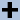
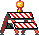
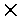
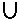
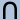
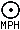
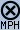
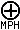

# Drawing

Drawing in IM is the way to add new elements to an existing image.
While a lot of text drawing is covered in the examples page for [Compound Font Effects](../fonts/), and in [Image Annotating](../annotating/), this page deals with the other more general aspects of the "`-draw`" operator.

The draw command started as a means to create simple images.
But has expanded over time to be the interface for vector graphic to raster image conversion.

------------------------------------------------------------------------

## ImageMagick Draw Commands {#draw}

Images in computers are generally saved in two different ways.
The first and most common way you have seen throughout these example pages is known as Raster Graphics.
In this approach, images are stored in terms of a rectangular array of pixels.

The other way is less common, and less modifiable, but in another sense more versatile, Object Vector Graphics.
In this form the image is described in terms of lines, arcs, color fills, and sometimes depth.
This is useful because you can scale these images to just about any size you want and they still display perfectly.
You can also describe very large and complex images in a very small amount of space when compared to the raster format equivalent.

Examples of vector graphic images include postscript, and the new [SVG -- Scalable Vector Graphics](http://www.w3.org/TR/SVG/).

True-Type Fonts are also examples of vector graphics, as this allows the individual character descriptions to be used at any scale.

The "`-draw`" image operator, is a window into the ImageMagick vector drawing functions, and forms a set of commands quite separate from the normal command line image operators of IM.
  
> 
>  
> There are only a few vector graphic file formats in general use as every such format is usually very different from other such formats.
> The result is that there is very little in the way of code sharing possible.
>  
> For this reason, ImageMagick is more concerned with the use of vector graphics to draw SVG format images.
> Postscript and true-type font graphics are passed to other external '[delegate](../files/#delegate)' libraries and applications that are much more suited to drawing those kinds of vector graphic formats.
>  
> That is not to say that delegates are not available for SVG.
> One example is a RSVG library or GTK SVG library which is available at compile time.
> IM will link to those libraries to convert SVG rather than attempting to do it itself.

### Primitive Draw Commands {#primitives}

Lets start with the oldest, simplest, and most common drawing primitives of the "`-draw`" image operator of MVG commands.

Note that all arguments are treated as floating point, and do not have to be integers, such as I typically use in these examples.

~~~
# Single Pixel Draw  (two ways -- these have been enlarged)

# Point 'paints' the color pixel
convert -size 10x6 xc:skyblue  -fill black \
        -draw 'point 3,2'         -scale 100x60   draw_point.gif

# Color Point 'replaces' the color pixel
convert -size 10x6 xc:skyblue  -fill black \
        -draw 'color 6,3 point'   -scale 100x60   draw_color_point.gif
~~~

  
[![\[IM Output\]](draw_point.gif)](draw_point.gif)  
[![\[IM Output\]](draw_color_point.gif)](draw_color_point.gif)

These two point methods produce different results when semi-transparent colors are involved, according to the comment given.
See [Color Fill Primitives](#color) below for details.

~~~
# Rectangle  /  Rounded Rectangle  /  Rectangular Arc

convert -size 100x60 xc:skyblue -fill white -stroke black \
        -draw "rectangle 20,10 80,50"       draw_rect.gif

convert -size 100x60 xc:skyblue -fill white -stroke black \
        -draw "roundrectangle 20,10 80,50 20,15"  draw_rrect.gif

convert -size 100x60 xc:skyblue -fill white -stroke black \
        -draw "arc  20,10 80,50  0,360"     draw_arc.gif

convert -size 100x60 xc:skyblue -fill white -stroke black \
        -draw "arc  20,10 80,50 45,270"     draw_arc_partial.gif
~~~

[![\[IM Output\]](draw_rect.gif)](draw_rect.gif)  
[![\[IM Output\]](draw_rrect.gif)](draw_rrect.gif)  
[![\[IM Output\]](draw_arc.gif)](draw_arc.gif)  
[![\[IM Output\]](draw_arc_partial.gif)](draw_arc_partial.gif)

The '`arc`' draw primitive is listed with rectangles as it is really just a 'ellipse' that is fitted inside the '`rectangle`' defined by the two coordinates.
Partial arcs are rarely used as it can be hard to determine the end points unless the angles are limited to multiplies of ninety degrees.

The '`circle`' and '`ellipse`' primitives, involve 'center' coordinate with either a 'edge' coordinate, or 'size' and 'angle values respectively.

~~~
# Circle  /  Ellipse    (centered on a point)

convert -size 100x60 xc:skyblue -fill white -stroke black \
        -draw "circle 50,30 40,10"          draw_circle.gif

convert -size 100x60 xc:skyblue -fill white -stroke black \
        -draw "ellipse 50,30 40,20 0,360"   draw_ellipse.gif

convert -size 100x60 xc:skyblue -fill white -stroke black \
        -draw "ellipse 50,30 40,20 45,270"   draw_ellipse_partial.gif
~~~

[![\[IM Output\]](draw_circle.gif)](draw_circle.gif)  
[![\[IM Output\]](draw_ellipse.gif)](draw_ellipse.gif)  
[![\[IM Output\]](draw_ellipse_partial.gif)](draw_ellipse_partial.gif)

You may also like to look at [Push/Pop Context](#push_context) for an example on how you can create a rotated ellipse.

~~~
# Line / Polyline / Polygon / Bezier

convert -size 100x60 xc:skyblue -fill white -stroke black \
        -draw "line   20,50 90,10"                 draw_line.gif

convert -size 100x60 xc:skyblue -fill white -stroke black \
        -draw "polyline 40,10 20,50 90,10 70,40"   draw_polyline.gif

convert -size 100x60 xc:skyblue -fill white -stroke black \
        -draw "polygon  40,10 20,50 90,10 70,40"   draw_polygon.gif

convert -size 100x60 xc:skyblue -fill white -stroke black \
        -draw "bezier   40,10 20,50 90,10 70,40"   draw_bezier.gif
~~~

[![\[IM Output\]](draw_line.gif)](draw_line.gif)  
[![\[IM Output\]](draw_polyline.gif)](draw_polyline.gif)  
[![\[IM Output\]](draw_polygon.gif)](draw_polygon.gif)  
[![\[IM Output\]](draw_bezier.gif)](draw_bezier.gif)

A better method of drawing lines and curves is to use the [SVG Path Drawing](#paths), which can be much more versatile and even allows for 'relative line drawing'.

~~~
# text drawing  / image

convert -size 100x60 xc:skyblue -fill white -stroke black \
        -font Candice -pointsize 40 -gravity center \
        -draw "text 0,0 'Hello'"   draw_text.gif

convert -size 100x60 xc:skyblue -gravity center \
        -draw "image over 0,0 0,0 'terminal.gif'"   draw_image.gif
~~~

[![\[IM Output\]](draw_text.gif)](draw_text.gif)  
[![\[IM Output\]](draw_image.gif)](draw_image.gif)

These last two fill type operations are currently the only draw operations that are affected by "`-gravity`".

Other modifiers for these operations, include: "`-fill`", "`-tile`", "`-origin`", "`-stroke`", "`-strokewidth`", "`-font`", "`-pointsize`", "`-box`",

Their are other modifiers but these are related to the more advanced [Magick Vector Graphics language](#mvg).

### Bezier Primitive {#bezier}

The '`bezier`' primitive is used to draw curves.
Each command will draw just one curve segment.
Typically 4 points (8 numbers) is given: a start point 'knot', two control points and an end point 'knot'.
The two control points define the direction and how fast the curve deviates from the attached end 'knot' points.

To join two curves smoothly, the control point from the end should be mirrored through the 'knot' to form the control point in the next Bezier curve.

For example here I draw two bezier curves that join smoothly together.
Note how the control lines and points (also drawn) mirror straight though the join coordinate, both in angle and in length.
This is important or the curve will not be smooth.

~~~
points="10,10 30,90   25,10 50,50   50,50 75,90   70,10 90,40"
clines=`echo "$points" | sed 's/   /\n/g' |\
           while read line; do echo "line $line"; done`
symbols=`echo path "'"; for point in $points; do
           echo "M $point   l -2,-2 +4,+4 -2,-2   l -2,+2 +4,-4 -2,+2"
         done;  echo "'"`
convert -size 100x100 xc:skyblue -fill none \
        -draw "stroke gray $clines    stroke blue $symbols " \
        -draw "stroke red  bezier 10,10 30,90   25,10 50,50 " \
        -draw "stroke red  bezier 50,50 75,90   70,10 90,40 " \
        draw_bezier_joined.gif
~~~
  
[![\[IM Output\]](draw_bezier_joined.gif)](draw_bezier_joined.gif)

If I move one of the control points, so that it is NOT 'reflected' though the attached 'knot' from the other control point of the same 'knot', then the curve will be dis-continuous.

~~~
points="10,10 30,90   25,10 50,50   50,50 80,50   70,10 90,40"
clines=`echo "$points" | sed 's/   /\n/g' |\
           while read line; do echo "line $line"; done`
symbols=`echo path "'"; for point in $points; do
           echo "M $point   l -2,-2 +4,+4 -2,-2   l -2,+2 +4,-4 -2,+2"
         done;  echo "'"`
convert -size 100x100 xc:skyblue -fill none \
        -draw "stroke gray $clines    stroke blue $symbols " \
        -draw "stroke red  bezier 10,10 30,90   25,10 50,50 " \
        -draw "stroke red  bezier 50,50 80,50   70,10 90,40 " \
        draw_bezier_disjoint.gif
~~~

[![\[IM Output\]](draw_bezier_disjoint.gif)](draw_bezier_disjoint.gif)

If the control point is moved again so that it matches the related 'knot' point the line will come directly from that point without any 'curve' at all.

~~~
points="10,10 30,90   25,10 50,50   50,50 50,50   70,10 90,40"
clines=`echo "$points" | sed 's/   /\n/g' |\
           while read line; do echo "line $line"; done`
symbols=`echo path "'"; for point in $points; do
           echo "M $point   l -2,-2 +4,+4 -2,-2   l -2,+2 +4,-4 -2,+2"
         done;  echo "'"`
convert -size 100x100 xc:skyblue -fill none \
        -draw "stroke gray $clines    stroke blue $symbols " \
        -draw "stroke red  bezier 10,10 30,90   25,10 50,50 " \
        -draw "stroke red  bezier 50,50 50,50   70,10 90,40 " \
        draw_bezier_no_curve.gif
~~~
  
[![\[IM Output\]](draw_bezier_no_curve.gif)](draw_bezier_no_curve.gif)

If both control points are set to the their respective 'knots', then a straight line will be generated.

~~~
points="10,10 10,10   50,50 50,50   50,50 50,50   90,40 90,40"
clines=`echo "$points" | sed 's/   /\n/g' |\
           while read line; do echo "line $line"; done`
symbols=`echo path "'"; for point in $points; do
           echo "M $point   l -2,-2 +4,+4 -2,-2   l -2,+2 +4,-4 -2,+2"
         done;  echo "'"`
convert -size 100x100 xc:skyblue -fill none \
        -draw "stroke gray $clines    stroke blue $symbols " \
        -draw "stroke red  bezier 10,10 10,10   50,50 50,50 " \
        -draw "stroke red  bezier 50,50 50,50   90,40 90,40 " \
        draw_bezier_lines.gif
~~~

[![\[IM Output\]](draw_bezier_lines.gif)](draw_bezier_lines.gif)

The '`bezier`' primitive is not really useful without specifying all 4 points.
Only the first and last point are classed as 'knots' through which the curve will pass (or end).
All the other intervening points are regarded purely as control points, effecting the curve in the sequence given, the further away the control point is the larger its effect on that segment of the curve.

~~~
points="10,10 30,90   25,10    75,90   70,10 90,40"
symbols=`for point in $points; do
           echo "M $point   l -2,-2 +4,+4 -2,-2   l -2,+2 +4,-4 -2,+2"
         done`
convert -size 100x100  xc:skyblue  -fill none \
        -draw "stroke gray  polyline $points " \
        -draw "stroke red   bezier $points " \
        -draw "stroke blue  path '$symbols' " \
        draw_bezier_multi.gif
~~~

[![\[IM Output\]](draw_bezier_multi.gif)](draw_bezier_multi.gif)

It is not recommended that you use more or less than 4 points per '`bezier`' curve segment, to keep things simple.

Actually I recommend you don't use the '`bezier`' primitive at all, but use the [SVG Path Cubic Bezier](#cubic) instead for generating curves.
This has a special '`S`" curve continuation function that automatically does the appropriate control point 'reflection' to generate smoothly joining curve segments and reduces the number of control points you need to use.
You can also define points relative to the last end point in the path.

### Color Fill Primitives {#color}

On top of the above 'simple' primitives, "`-draw`" also provides a set of color fill or modification primitives.
These modify the color(s) in the image starting at the point specified, according to the method chosen.

These fill methods are actually not true 'draw' commands, but color replacement function.
They were added to draw as it was the easiest place to insert their operations into ImageMagick in a very early version of the program.

Just as in the above, the color used is set with the "`-fill`" color setting, but if set, the "`-tile`" image will be used instead.

The other setting options above are not used, and have no effect on these operations.

Two extra settings as you will also apply to these primitives, "`-bordercolor`" and "`-fuzz`" factor settings.
However these settings can NOT be defined within the 'MVG' language, so can only be set before using the "`-draw`" operator.

The first of these '`color point`' you have already seen as an alternative to the '`point`' draw primitive in the above examples.
If you look carefully you will see the single white pixel we set in our test image.

~~~
convert color_test.png   -fill white \
        -draw 'color 30,20 point'      color_point.png
~~~

[![\[IM Output\]](color_point.png)](color_point.png)

However when drawing transparent and semi-transparent colors, these functions are not the same.

Here we have a three pixel red image (enlarged), the second or middle pixel we used the '`point`' function to **paint** over the red pixel with a semi-transparent blue color, giving a purple result.
If however use use the '`color point`' function (last or right pixel), the red color is completely **replaced** by the semi-transparent blue pixel.
It is not overlaid.

~~~
convert -size 3x1 xc:red -matte -fill '#00F8' \
        -draw 'point 1,0' \
        -draw 'color 2,0 point'   -scale 33x33  draw_points.png
~~~

[![\[IM Output\]](draw_points.png)](draw_points.png)

All the '`color`' functions do full color replacement, while all other color primitive 'paint' the color on top of the image.
As such you can use '`color`' to draw the transparent color.

The '`color replace`' draw function will replace all instances of the exact given color at the location specified.
And as you can see the areas do not have to be connected.

~~~
convert color_test.png   -fill white \
        -draw 'color 30,20 replace'      color_replace.png

convert color_test.png   -fill white   -fuzz 13%\
        -draw 'color 30,20 replace'      color_replace_fuzz.png
~~~

[![\[IM Output\]](color_replace.png)](color_replace.png)  

[![\[IM Output\]](color_replace_fuzz.png)](color_replace_fuzz.png)

However as you can see in the first result, some pixels along the edges did not get replaced.
These pixels are not *exactly* the same color as the pixel selected, so they were ignored.
Adding a small [fuzz factor](../color_basics/#fuzz) will also include colors that are similar to the original color.
As shown the second example above.

Of course a 'fuzz factor' is not a great solution, as it will not capture all such edge pixels.
This is a recurring problem with all these 'color fill' methods, and one that has no general solution.

If you want to replace a specific known color, rather than select a color from the image itself, then the "`-opaque`" image operator can be used instead.
This function also uses a "`-fuzz`" factor setting to increase the range of colors that match the given color.

The '`floodfill`' method is also quite simple as it will just fill the the whole area around the point selected and not select any other area of similar colors which are not connected in some way.

You can also expand the area being filled by using "`-fuzz`" to include similar colors.
In this case we chose a value high enough to also include the cross border, allowing the flood fill to 'leak' to the other side of the image.

~~~
convert color_test.png   -fill white \
        -draw 'color 30,20 floodfill'      color_floodfill.png

convert color_test.png   -fill white   -fuzz 15%   \
        -draw 'color 30,20 floodfill'      color_floodfill_fuzz.png
~~~

[![\[IM Output\]](color_floodfill.png)](color_floodfill.png)  
[![\[IM Output\]](color_floodfill_fuzz.png)](color_floodfill_fuzz.png)

Flood-filling areas with a color is not without its problems.
The color can leak across a thin boundary, into areas where it was not wanted, (see [GIFs on a background pattern](../formats/#bg_pattern) as a demonstration of this).
Or it may not fill the area selected right to the edge, (see [Anti-Aliasing and Flood Fill Problems](../antialiasing/#floodfill)).
But it does work.

The '`filltoborder`' is like '`floodfill`' except you specify a color which borders the area to be filled, rather that the color to be replaced by the fill process.
  
Of course a [fuzz factor](../color_basics/#fuzz) is also recommended to include 'similar colors' in that border color selection, to further limit the floodfill.

~~~
convert color_test.png   -fill white  -bordercolor royalblue \
        -draw 'color 30,20 filltoborder'   color_filltoborder.png

convert color_test.png   -fill white  -bordercolor blue \
        -draw 'color 30,20 filltoborder'   color_filltoborder2.png

convert color_test.png   -fill white  -bordercolor blue  -fuzz 30% \
        -draw 'color 30,20 filltoborder'   color_filltoborder_fuzz.png
~~~

[![\[IM Output\]](color_filltoborder.png)](color_filltoborder.png)  
[![\[IM Output\]](color_filltoborder2.png)](color_filltoborder2.png)  
[![\[IM Output\]](color_filltoborder_fuzz.png)](color_filltoborder_fuzz.png)

The final draw color method is '`reset`' which just replaces, or resets the whole image to the fill color.
In this case the actual pixel selected has no bearing on the results at all.

~~~
convert color_test.png   -fill white \
        -draw 'color 30,20 reset'      color_reset.png
~~~

[![\[IM Output\]](color_reset.png)](color_reset.png)

This is actually very useful in that it gives one simple way of generating a plain solid color (or tiled image) canvas from an existing image.
(See [Canvases Sized to an Existing Image](../canvas/#sized)) for this and other ways of doing the same thing.

FUTURE: Using a "`-tile`" pattern to fill the area.

### Matte Fill Primitives {#matte}

The '`matte`' draw primitive works in exactly the same way as the '`color`' primitive described above, except it will not replace the color of the areas selected, only the 'matte' channel of the areas selected.
(That is only the 'alpha' or 'matte' channel is adjusted by these fill functions).

Just as like the '`color`' fill function, the 'matte' value uses the fill color (unless "`-tile`" as the source of the 'alpha value' to use).

Here we use the same '`color floodfill`' example above, but here only adjust the matte channel to make the filled parts fully-transparent.
That is the original color is still present, just transparent!

~~~
convert color_test.png   -fill none \
        -draw 'matte 30,20 floodfill'      matte_floodfill.png

convert color_test.png   -fill none   -fuzz 15%   \
        -draw 'matte 30,20 floodfill'      matte_floodfill_fuzz.png
~~~

[![\[IM Output\]](matte_floodfill.png)](matte_floodfill.png)  
[![\[IM Output\]](matte_floodfill_fuzz.png)](matte_floodfill_fuzz.png)

The '`matte reset`' function can also be used to make a whole image semi-transparent.
Of course in this case we must output to PNG which can accept semi-transparent colors in images.

~~~
convert color_test.png   -fill '#00000080' \
        -draw 'matte 30,20 reset'      matte_reset.png
~~~

[![\[IM Output\]](matte_reset.png)](matte_reset.png)

Notice that the '`black`' color component was not used in operations, only the matte component of the color.
The images original color is left as is.

FUTURE: Using "`-tile`" pattern for in interesting matte effect.

Both '`color`' and '`matte`' are full replacement of color functions, which will always produce a Boolean (all or nothing) type of color replacement.
As such the edges of such areas will always show [Aliasing effects](../antialiasing/).

Because of this, these are generally not good image operators for general image development, except for setting the transparent areas of GIF images (which are also Boolean).
All is not lost however, as can be seen in the examples for [Background Removal](../masking/#bg_remove).

------------------------------------------------------------------------

## Specifics about Draw Commands {#specifics}

### Pixel Coordinates {#coordinates}

The "`-draw`" command (and many others in IM) use what is calls "Pixel Coordinates".
That is a coordinate of '`10,10` is the center of the pixel 10 pixels down and to the left from the top-left corner.

In this coordinate system 0,0 is the center of the top-left pixel, and w-1,h-1 is the center of the bottom-right corner.
The actual edges are located at -0.5,-0.5 and w-0.5,h-0.5 and the center pixel (if the image is a odd size) is located at '`(w-1)/2,(h-1)/2`'.

However when you are processing an image mathematically (such as when using distort) actual pixels have no real meaning, as such it uses "Image Coordinates".
In this system the actual edge of the image is at '`0,0`' and '`w,h`'.
And the center of the image (which may or may not be the center of a pixel) is at '`w/2,h/2`'.

To convert 'pixel coordinates' to image coordinates, add ½ As such the center of the top-left pixel is '`0.5,0.5`' and the bottom-right pixel is '`w-0.5,h-0.5`'.

*Example: center of a circle in small image*

### Drawing with Gamma and Colorspace Correction {#colorspace}

As with almost all ImageMagick operations, "`-draw`" is a linear operator.
And as such works in a linear RGB colorspace.
This means to get nice smooth edges you may need to do some gamma correction of images, before you save them so they are stored using non-linear (gamma corrected) sRGB colorspace.
  
For example if you draw a large circle, and just save it...

~~~
convert -size 81x81 xc:black -fill white -draw 'circle 40,40 40,3' \
        circle_raw.png
~~~

[![\[IM Output\]](circle_raw.png)](circle_raw.png)

Look at the edges of the circle, they don't actually look really very smooth.
You can see significant staircase effects.

That is because you drew the circle in linear RGB colorspace.
But you then saved the image as if it was really sRGB colorspace!
  
To fix this we need to add a gamma correction to the image before saving it.

~~~
convert -size 81x81 xc:black -fill white -draw 'circle 40,40 40,3' \
        -gamma 2.2 circle_gamma.png
~~~

[![\[IM Output\]](circle_gamma.png)](circle_gamma.png)

Now the circle edges actually looks smooth and rounded just like they should be.

If you want to do this properly, we really should be making the correction using colorspace.
However as IM assumes RGB is the default colorspace for saving you need do some tricky handling to get it to do things correctly.

~~~
convert -size 81x81 xc:black -set colorspace RGB \
        -fill white -draw 'circle 40,40 40,3' \
        -colorspace sRGB circle_sRGB.png
~~~

[![\[IM Output\]](circle_sRGB.png)](circle_sRGB.png)

> 
> Note that sRGB colorspace (which is the correct way to save images) is not exactly the same as simply applying a 2.2 gamma correction.
> However the differences in results between the two are minor, and only visible in very very dary images.
>  
> 
> Before IM v6.7.5-1 the colorspace names 'sRGB' and 'RGB' (linear-RGB), was actually reversed.
> As such on older versions of IM the two labels in the above should be swapped.

To correctly draw (or do any 'linear' image processing) using a real image (in IMv6) you need to first remove any existing gamma, process the image, then restore that gamma correction.
See [Resizing using Colorspace Correction](../resize/#resize_colorspace) for more details.

Here is an example of drawing on a real image...
First without any color correction (raw), and then with gamma, and colorspace corrections.

~~~
convert rose:  -fill none -stroke white -draw 'line 5,40 65,5'  rose_raw.png
~~~

[![\[IM Output\]](rose_raw.png)](rose_raw.png)

~~~
convert rose: -gamma .454545 \
        -fill none -stroke white -draw 'line 5,40 65,5' \
        -gamma 2.2 rose_gamma.png
~~~

[![\[IM Output\]](rose_gamma.png)](rose_gamma.png)

~~~
convert rose: -colorspace RGB \
        -fill none -stroke white -draw 'line 5,40 65,5' \
        -colorspace sRGB rose_sRGB.png
~~~
  
[![\[IM Output\]](rose_sRGB.png)](rose_sRGB.png)

As you can see by using gamma or colorspace correction, the line become very smooth looking without a jaggy 'staircase' aliasing effect, than can be seen when drawing directly.
(You need a very good monitor to see it)
  
> 
> The line in the above was drawn using a "`-stroke`" color.
> You can draw the line using "`-fill`" and get the same results, but then you will not have line thickness control using "`-strokewidth`".
> See [Stroke Color Setting](#stroke) below for more information.
>  
> 
> Color names are actually defined using values for 'sRGB' colorspace BUT are being applied by draw as if the image is in linear-RGB colorspace.
> As such using the above gamma correction with named colors (other than 'white' or 'black') will result in those colors becoming distorted.
> In such cases it may be better to not use gamma or colorspace correction, so that named colors will map correctly.
>  
> Correct mapping of named 'sRGB' colors, to the colorspace of the image being draw to, will be fixed as part of IMv7 Development.

### Stroke, StrokeWidth and Fill Interaction {#stroke}

The "`-stroke`" and "`-strokewidth`" options are used when drawing an outline around a font's edge.

These options commonly used with "`-fill`" to make text more interesting, for very little effort.

~~~
convert -size 380x70 xc:lightblue -pointsize 50 -font Chisel \
        -fill green  -stroke black  -draw 'text 10,55 "Black Border"' \
        stroke_font.jpg
~~~

[![\[IM Output\]](stroke_font.jpg)](stroke_font.jpg)

The default settings is "`-strokewidth 1`" and "`-stroke None`".

But this makes the outline stroke invisible, leaving just the "`-fill`" color, you will not see it.

The only effect "`-strokewidth`" has when the "`-stroke`" is 'invisible', is on font size attributes, which means it can still effect font positioning and the size of a [Label and Caption](../text/#label) image generation.
Otherwise the width has not visible effect until you make the stroke visible.

To see how the "`-strokewidth`" actually effects the look of a font (when made visible) here I have drawn some text with various widths from 'turned off' and getting larger.

~~~
convert -size 320x420 xc:lightblue -pointsize 70 -font Vademecum \
  -fill red -stroke none                 -draw 'text 30,80  "Stroke -"' \
  -fill red -stroke black -strokewidth 0 -draw 'text 30,160 "Stroke 0"' \
  -fill red -stroke black -strokewidth 1 -draw 'text 30,240 "Stroke 1"' \
  -fill red -stroke black -strokewidth 2 -draw 'text 30,320 "Stroke 2"' \
  -fill red -stroke black -strokewidth 3 -draw 'text 30,400 "Stroke 3"' \
  stroke_table.jpg
~~~

[![\[IM Output\]](stroke_table.jpg)](stroke_table.jpg)

Note from the the above examples that setting a "`-strokewidth`" of '`0`' is NOT the same as setting the "`-stroke`" color to '`none`' (the default).
The former makes a very very thin stroke outline, while the latter effectively turns it off.
In both cases the stroke is still drawn.

However you should also note that even with a "`-strokewidth`" of '`0`' the image outline will be expanded very very slightly over that of just a plain 'filled' image (using a "`-stroke`" color of '`none`'.

Essentially using any width smaller than '`1.0`' does not work properly.
And you should exercise caution in cases where this can matter.

Remember however that "`-strokewidth`" is also a floating point setting.
That is a stroke width of '`0.5`' is also valid.
However usually this is only important when you are attempting to draw [Drawing Thin Bitmapped Circles](../antialiasing/#thin_circles) with the [Anti-Alising](../antialiasing/#intro) turned off.
  
 Here is an example of using an extremely large stroke width.

~~~
convert -size 320x100 xc:lightblue -font Candice -pointsize 72 -fill white \
        -stroke black -strokewidth 15 -draw "text 25,65 'Anthony'" \
        stroke_thick.jpg
~~~

[![\[IM Output\]](stroke_thick.jpg)](stroke_thick.jpg)

Note that "`-strokewidth`" expands both lines inward and outward.
Here is the same example but with the font re-drawn, without the stroke outline, to remove the inside part of the very thick stroke.

~~~
convert -size 320x100 xc:lightblue -font Candice -pointsize 72 -fill white \
        -stroke black -strokewidth 15 -draw "text 25,65 'Anthony'" \
        -stroke none                  -draw "text 25,65 'Anthony'" \
        stroke_outline.jpg
~~~

[![\[IM Output\]](stroke_outline.jpg)](stroke_outline.jpg)

For more examples of using stroke see [Compound Font Effects](../fonts/).
Have a special look at the "[Balloon Effect](../fonts/#balloon)".

### Drawing (Stroke) Lines {#strokewidth}

The default line drawing in IM has few weird behaviors, which are worth knowing about.

Here is the default line draw...

~~~
convert -size 100x40 xc:lightblue \
        -draw "line 5,35 95,5" \
        line_default.jpg
~~~

[![\[IM Output\]](line_default.jpg)](line_default.jpg)

You can set the color of the line with a "`-fill`" option.

~~~
convert -size 100x40 xc:lightblue \
        -fill white -draw "line 5,35 95,5" \
        line.jpg
~~~

[![\[IM Output\]](line.jpg)](line.jpg)

Also you can make a line slightly thicker by setting the "`-stroke`" color.

~~~
convert -size 100x40 xc:lightblue \
        -fill white -stroke black -draw "line 5,35 95,5" \
        line_stroke.jpg
~~~
  
[![\[IM Output\]](line_stroke.jpg)](line_stroke.jpg)

But what happened to the white color we specified with the "`-fill`" option?

This is the tricky aspect of drawing lines in ImageMagick.
What the program does is actually consider the line as a filled object about 1 pixel wide.
This is natural, as typically multiple lines are generally used to sweep out an area that is to be filled.

So just as when we used stroke with fonts in the previous section, IM draws the line (or object) using the fill color, then draws around it with the stroke color.
The result is that the above stroke color line is now slightly thicker, with the fill color completely hidden underneath.
If you make the stroke color semi-transparent you can make that fill color visible again.

To summarize, lines will appear to be drawn with the "`-fill`" color, but that option is of no consequence once the "`-stroke`" color has been defined as something other than the default "`none`" or "`transparent`" colors.
  
> 
> The option "`-linewidth`" is really only an alias for "`-strokewidth`", and should not be used.

For example, you would probably think that this command would produce a very thick line.
It does, but as the "`-stroke`" color is invisible you can't see it.
You only see the inside 'fill' of the one pixel wide area of the line.

~~~
convert -size 100x40 xc:lightblue \
        -fill white -strokewidth 3 -draw "line 5,35 95,5" \
        line_fill_3.jpg
~~~

[![\[IM Output\]](line_fill_3.jpg)](line_fill_3.jpg)

> 
> The above result I actually regard as a bug.
> Nothing should have been drawn, as there is no 'area' to be filled, and no line 'stroke color' has been set.
> The reason IM currently does this is to avoid confusion with new users, but really it just causes problems with advanced users.
> See [Draw Fill Bounds](#bounds) for more details.

But if the stroke color is also defined, you will get the thick line requested...

~~~
convert -size 100x40 xc:lightblue \
        -stroke black -strokewidth 3 -draw "line 5,35 95,5" \
        line_stroke_3.jpg
~~~
  
[![\[IM Output\]](line_stroke_3.jpg)](line_stroke_3.jpg)

If the "`-strokewidth`" setting is set to one, the above line will be completely covered.

~~~
convert -size 100x40 xc:lightblue \
        -stroke black -strokewidth 1 -draw "line 5,35 95,5" \
        line_stroke_1.jpg
~~~

[![\[IM Output\]](line_stroke_1.jpg)](line_stroke_1.jpg)

Of course when you are armed with this knowledge, you can use it to be creative, just as you can with font drawing.

~~~
convert -size 100x40 xc:lightblue \
        -stroke black -strokewidth 5 -draw "line 5,35 95,5" \
        -stroke white -strokewidth 2 -draw "line 5,35 95,5" \
        line_multi.jpg
~~~

[![\[IM Output\]](line_multi.jpg)](line_multi.jpg)

Here I used the thinnest "`-strokewidth`" setting of '`0`', just as I did for the fonts above.

~~~
convert -size 100x40 xc:lightblue \
        -fill white -stroke black -strokewidth 0 -draw "line 5,35 95,5" \
        line_stroke_0.jpg
~~~

[![\[IM Output\]](line_stroke_0.jpg)](line_stroke_0.jpg)

This produces the very strange result of a dotted line, consisting of black dots and grey segments.
This is the result of a weird "color beat frequency" between the stroke, fill and background colors.
Here is an enlarged view of the line...

~~~
convert -size 25x10 xc:lightblue \
        -fill white -stroke black -strokewidth 0 -draw "line 2,8 22,1" \
        -scale 400%    line_stroke_0_white.jpg
~~~

[![\[IM Output\]](line_stroke_0_white.jpg)](line_stroke_0_white.jpg)
  
> 
> The "color beat frequency" effect is not unlike that of a "sound beat" you get when you have two guitars which are very slightly out of tune.
> In this case you get a black dot where the stroke color completely overrides the underlying fill color and you get a grey dot where the stroke color mixes with BOTH the fill and the background colors.
>  
> The color mixing is a natural consequence of the anti-aliasing processes which IM uses to try to improve the look of lines and other draw objects.
For more information see my [Anti-Aliasing in IM](../antialiasing/) discussion and examples page.

Note that this effect only appears on slanted lines, not pure horizontal or vertical lines, where aliasing has no effect and thus no "color beat frequency" effects.

~~~
convert -size 100x40 xc:lightblue \
        -fill white -stroke black -strokewidth 0 -draw "line 5,20 95,20" \
        line_stroke_horz.jpg
~~~

[![\[IM Output\]](line_stroke_horz.jpg)](line_stroke_horz.jpg)

Here I used different underlying fill colors on the enlarged view, so you can see how the color changes the resulting beat.

~~~
convert -size 25x10 xc:lightblue \
        -fill none -stroke black -strokewidth 0 -draw "line 2,8 22,1" \
        -scale 400%     line_stroke_0_none.jpg
~~~

[![\[IM Output\]](line_stroke_0_none.jpg)](line_stroke_0_none.jpg)

~~~
convert -size 25x10 xc:lightblue \
        -fill red -stroke black -strokewidth 0 -draw "line 2,8 22,1" \
        -scale 400%    line_stroke_0_red.jpg
~~~

[![\[IM Output\]](line_stroke_0_red.jpg)](line_stroke_0_red.jpg)

~~~
convert -size 25x10 xc:lightblue \
        -fill black -stroke black -strokewidth 0 -draw "line 2,8 22,1" \
        -scale 400%    line_stroke_0_black.jpg
~~~

[![\[IM Output\]](line_stroke_0_black.jpg)](line_stroke_0_black.jpg)

Lets compare that to a stroke of none...

~~~
convert -size 25x10 xc:lightblue \
        -fill black -stroke none -draw "line 2,8 22,1" \
        -scale 400%    line_stroke_-_black.jpg
~~~

[![\[IM Output\]](line_stroke_-_black.jpg)](line_stroke_-_black.jpg)

As you can see, when drawing very thin lines, you can reduce that 'beat' by either using the same fill and stroke colors, OR setting one of the colors to none to turn it off.
While the later is the best idea, the former may be more practical for your specific programming needs.

Note the fill line thickness is '0'.
But the the stroke line can have a larger thickness.
It is also a floating point value!
A 2.5 pixel wide line is perfectly valid.
  
> 
> These results are caused by not only a buggy stroke width 0, causing a color beat, but also the 'fill color' being drawn with a extra 1.0 diameter thickness, when there is no actual area to be filled.
> This I also regard as a bug.
> See [Draw Fill Bounds](#bounds).

### Draw Fill Bounds {#bounds}

There are a few other points that you should note about the various draw primitives.

The stroke-width works well for floating point values above a value of 1.0, but seems to break down for values less that 1.0.
This is due to the implementation algorithm used and not simply because it is wrong, as it works fine larger thickness lines.

Basically if you use a stroke-width of zero you could expect that no stroke color will be added.
Instead you get a sort of beat pattern where stroke color is at full strength when the line goes through the actual 'center' of the pixel..

What really should happen is the amount of color added to a pixel should reflect the area of the line being drawn, and not the pixels distance from that line.
As such lines of zero width should add no color to the image, while lines of less than 1.0 thickness should only add a smaller amount of color.

See the examples [Drawing Lines, with StrokeWidth and Stroke](#strokewidth) above.

The other problem is that the fill color is not being applied up to the edge of the shape (polygon) being draw, but ½ pixel further out.
This includes the situation where no 'stroke' is being applied, and the edge should be exact.
It also includes drawing a 'line', which really has a 'zero' fill thickness.

Basically if you draw a line, without enabling stroke, technically you should see, no line as it has no 'fill' thickness.
Instead lines are being drawn with at minimum 1 pixel wide 'fill' color included.
This is for historical reasons, and generally avoids confusion by new users of IM.
Unfortunately it is NOT correct for advanced users.

What that means is that if you draw two polygons using fill color only, that share an edge, that edge will overlap by 1 pixel as each polygon is ½ pixel bigger along all its edges.
In other words polygons and other shapes do not fit together, but overlap!

For example here I try use draw to divide an image into two halves (drawing black on white).
To do this I draw two polygons that share a edge, exactly without overlap.
The resulting 'tiny' images, have been enlarged for display.

~~~
convert -size 10x10 xc: -draw 'polygon 2,-1 7,10 10,10 10,-1' bound_left.gif
convert -size 10x10 xc: -draw 'polygon 2,-1 7,10 -1,10 -1,-1' bound_right.gif

convert bound_left.gif bound_right.gif -compose Plus -composite bound_add.gif
~~~

[![\[IM Output\]](bound_left_mag.gif)](bound_left_mag.gif)  [![\[IM Output\]](bound_right_mag.gif)](bound_right_mag.gif)  [![\[IM Output\]](bound_add_mag.gif)](bound_add_mag.gif)

The two black parts (which was what is actually drawn) actually overlap each other!
In other words, even though we tried to draw the two areas separately using drawn polygons, the filled area is slightly larger that what was requested.

I also added ([Plus Composited](../compose/#plus)) the two images together so you can actually see the overlap of the drawn black areas.
If the two polygons were a perfect fit the 'added' drawing would be a solid white color.

The actual amount of overlap is equivalent to the default "`-strokewidth 1.0`" setting.
So it is normally expected that this extra area would be covered by a normal stroke width.
However it can cause some real problems.

ASIDE: For a complete test of the join you would generate 50% grey areas on a black background and add them together.
That way you can see if the areas not only 'overlap' (as shown above), but also test if they 'underlap' (leaving a gap between filled areas) when you add the areas together.
The resulting image should be a perfectly smooth 50% grey color with no color variations along the join.
A transparency check would involve, a 50% transparent, 50% gray color should be used on a fully transparent background.

To see an example of a perfect cut and re-add, based on a single mask image, see the composition method examples, [Compose DstOut](../compose/#dstout).

FUTURE BUG FIX: The area filled should be exact, but to compensate for this when drawing shapes, the default 'stroke color' should be set to the fill color (unless it is itself specifically set).
  

------------------------------------------------------------------------

## MVG - Magick Vector Graphics {#mvg}

The primitives shown above form the basis of all the "`-draw`" operations provided.
Together that are the starting point for a special internal language in ImageMagick, called the **Magick Vector Graphics** language.
For more detail of this language see [Summary of MVG Primitives and Syntax](http://www.imagemagick.org/script/magick-vector-graphics.php) on the IM website.

This "MVG" language designed with the goal of allowing ImageMagick to handle the even more complex SVG ([Scalable Vector Graphics](http://www.w3.org/TR/SVG/)) language.
It does this by attempting to convert images given the SVG format to the simpler internal MVG format.
For more details see [SVG handling](#svg) below.

Consequently what you saw above is only a tiny part of the capabilities of the "`-draw`" operator.
Though if you want to draw complex objects, I do recommend you create a separate SVG format image of the object using an SVG editor such as "`Sodipodi`".
(See [Non-IM Vector Graphic Programs](#other) below).

Unlike SVG, MVG does not have any form of 'containers' or sets of image commands.
These are all removed during the conversion process to produce a simplified sequence of MVG drawing commands.
Instead it uses a concept of [Graphic Contexts](#push_context) to save and restore various drawing settings, which is what we will now look at.

### Command Line Settings vs MVG Settings {#settings}

First of all, almost all the settings you set via the command line options that the the draw primitives use have direct equivalents in the MVG drawing commands.

The main difference between setting the via a command line option, (such as "[-strokewidth](../option_link.cgi?strokewidth)") or using a setting within a MVG drawing string (for example '`stroke-width`), is that the MVG setting only lasts for the duration of the MVG command string.

    Summary of the General Drawing Settings
      __cmd_option__   __draw_MVG__        __Argument__
        -fill            fill                color/tile for inside shapes
        -tile            fill                image tile, replaces fill color

        -stroke          stroke              line color/tile around the shapes
        -strokewidth     stroke-width        pixel width
        +antialias       stroke-antialias    0/1 aliasing line edges

        -font            font                font_name / font_file
        -family          font-family            ?
        -weight            ?                    ?
        -stretch           ?                    ?
        -pointsize       font-size           height in points
        -kerning           -                 extra inter-character spacing

        +antialias       text-antialias      0/1 aliasing drawing text
        -box             text-undercolor     fill color for font bounding box
          -              decorate        (None, Underline, LineThrough or Overline)

        -gravity         gravity             (None, North, South-East,...)
        -fuzz              -                 color delta / percentage
        -bordercolor       -                 color

    Notes:
      - no such option      ? unknown

These settings are usually well understood as they are regularly used and demonstrated above.
  
> 
> A font, stretch, style, and weight are used to identify a font from the ImageMagick font list.
> Most people however just select a specific font and pointsize to use instead.
> As such they are rarely used in IM.

As you can see the special settings for the 'color fill' primitives do not have direct equivalents in the MVG.
That is the "[-bordercolor](../option_link.cgi?bordercolor)" and the "[-fuzz](../option_link.cgi?fuzz)" factor setting.
These must be specified from the command line before using the "`-draw`" operator.

Some MVG settings would probably be more useful as global command line settings, such as the '`decorate`' setting for font drawing.

WARNING: "[-gravity](../option_link.cgi?gravity)" is not part of the SVG specification.
Within MVG it is only used for text and image placement, and justification.
Their is currently no justification setting that is separate to the default 'gravitational' effects.
However as justification is part of SVG text handling, that will probably change sometime in the future.

Now the global command line settings (outside the MVG draw string) are used to initialise the settings for each "[-draw](../option_link.cgi?draw)" operation you apply, which is why you can set a "[-fill](../option_link.cgi?fill)" colour which you can then use to draw a circle of that color.

~~~
convert -size 100x60 xc:skyblue   -fill red \
        -draw "circle 50,30 40,10"          draw_circle_global.gif
~~~

[![\[IM Output\]](draw_circle_global.gif)](draw_circle_global.gif)

You can override that global setting locally within the "[-draw](../option_link.cgi?draw)" MVG argument...

~~~
convert -size 100x60 xc:skyblue   -fill red \
        -draw "fill green   circle 50,30 40,10"  draw_circle_override.gif
~~~

[![\[IM Output\]](draw_circle_override.gif)](draw_circle_override.gif)

However settings set within a single "[-draw](../option_link.cgi?draw)" MVG argument only exist for the duration of that "[-draw](../option_link.cgi?draw)" operation.
That is settings within a "[-draw](../option_link.cgi?draw)" are local only to that draw and do not carry into later separate "[-draw](../option_link.cgi?draw)" arguments.

~~~
convert -size 100x60 xc:skyblue   -fill red   -draw 'fill green' \
        -draw "circle 50,30 40,10"          draw_circle_local.gif
~~~

[![\[IM Output\]](draw_circle_local.gif)](draw_circle_local.gif)

If you plan to do a lot of operations, it may be better to do them all in the single MVG string, rather than multiple "[-draw](../option_link.cgi?draw)" operations.

~~~
convert -size 100x60 xc:skyblue  \
        -draw "fill green  circle 41,39 44,57
               fill blue   circle 59,39 56,57
               fill red    circle 50,21 50,3  "  draw_circle_multi.gif
~~~

[![\[IM Output\]](draw_circle_multi.gif)](draw_circle_multi.gif)

### MVG Specific Settings {#mvg_settings}

Other MVG settings that control the way lines and objects are drawn are also useful to know even when using the primitive operations.
These include..

       __draw_MVG__       __Description/Argument__
      fill-opacity        fill transparency, from 0.0 to 1.0
      clip-rule           fill style for crossed lines (evenodd, nonzero)

      stroke-opacity      line transparency, number from 0.0 to 1.0
      stroke-dasharray    list of 'on' and 'off' lengths for lines
      stroke-dash
      stroke-linecap      End of line look: butt round square
      stroke-linejoin     Lines joins:  butt  miter round square
      stroke-miterlimit   Angle when 'miter' joins become 'bevel' (or 'butt')

Remember a fill list of all MVG settings and drawing operators can be seen at [Summary of MVG Primitives and Syntax](http://www.imagemagick.org/script/magick-vector-graphics.php) in the IM website.

Lets look at the effects of some of the simpler settings...

~~~
# Stroke Opacity
convert -size 100x60 xc:skyblue -fill none -stroke black \
        -draw "                           path 'M 10,10 L 90,10'" \
        -draw "stroke-opacity 0.8         path 'M 10,20 L 90,20'" \
        -draw "stroke-opacity 0.6         path 'M 10,30 L 90,30'" \
        -draw "stroke-opacity 0.4         path 'M 10,40 L 90,40'" \
        -draw "stroke-opacity 0.2         path 'M 10,50 L 90,50'" \
        set_stroke_opacity.gif

# Fill Opacity
convert -size 100x60 xc:skyblue -fill white -stroke black \
        -draw "                    rectangle  5,10 15,50 " \
        -draw "fill-opacity 0.8    rectangle 20,10 30,50 " \
        -draw "fill-opacity 0.6    rectangle 35,10 45,50 " \
        -draw "fill-opacity 0.4    rectangle 50,10 60,50 " \
        -draw "fill-opacity 0.2    rectangle 65,10 75,50 " \
        -draw "fill-opacity  0     rectangle 80,10 90,50 " \
        set_fill_opacity.gif
~~~

[![\[IM Output\]](set_stroke_opacity.gif)](set_stroke_opacity.gif)
[![\[IM Output\]](set_fill_opacity.gif)](set_fill_opacity.gif)

~~~
# Plain and Dashed Lines
convert -size 100x60 xc:skyblue -fill none -stroke black \
        -draw "                           path 'M 10,10 L 90,10'" \
        -draw "stroke-dasharray 5 3       path 'M 10,20 L 90,20'" \
        -draw "stroke-dasharray 5 5       path 'M 10,30 L 90,30'" \
        -draw "stroke-dasharray 10 3 3 3  path 'M 10,40 L 90,40'" \
        -draw "stroke-dasharray 1 6       path 'M 10,50 L 90,50'" \
        set_lines.gif

convert -size 100x60 xc:skyblue -fill white -stroke black \
        -draw "                           path 'M 10,10 L 90,10'" \
        -draw "stroke-dasharray 5 3       path 'M 10,20 L 90,20'" \
        -draw "stroke-dasharray 5 5       path 'M 10,30 L 90,30'" \
        -draw "stroke-dasharray 10 3 3 3  path 'M 10,40 L 90,40'" \
        -draw "stroke-dasharray 1 6       path 'M 10,50 L 90,50'" \
        set_lines_fill.gif

# Note: Technically the second image should be the same as the first
# as the 'filled' lines contain no area.
# This I regard as a BUG.
~~~

[![\[IM Output\]](set_lines.gif)](set_lines.gif)
[![\[IM Output\]](set_lines_fill.gif)](set_lines_fill.gif)

~~~
# Stroke Ends and Joins
convert -size 100x60 xc:skyblue -fill white -stroke black -strokewidth 8 \
        -draw "                           path 'M 20,20 L 20,70'" \
        -draw "stroke-linecap butt        path 'M 40,20 L 40,70'" \
        -draw "stroke-linecap round       path 'M 60,20 L 60,70'" \
        -draw "stroke-linecap square      path 'M 80,20 L 80,70'" \
        set_endcaps.gif

convert -size 100x60 xc:skyblue -fill white -stroke black -strokewidth 5 \
        -draw "                        path 'M  5,70 L 20,20  35,70'" \
        -draw "stroke-linejoin miter   path 'M 35,70 L 50,20  65,70'" \
        -draw "stroke-linejoin bevel   path 'M 55,70 L 70,20  85,70'" \
        -draw "stroke-linejoin round   path 'M 75,70 L 90,20 105,70'" \
        set_linejoin.gif

convert -size 100x60 xc:skyblue -fill white -stroke black -strokewidth 5 \
        -draw "                        path 'M  5,70 L 20,20  35,70'" \
        -draw "stroke-miterlimit 7     path 'M 35,70 L 50,20  65,70'" \
        -draw "stroke-miterlimit 6     path 'M 65,70 L 80,20  95,70'" \
        set_miterlimit.gif
~~~

[![\[IM Output\]](set_endcaps.gif)](set_endcaps.gif)
[![\[IM Output\]](set_linejoin.gif)](set_linejoin.gif)
[![\[IM Output\]](set_miterlimit.gif)](set_miterlimit.gif)

The '`stroke-miterlimit`' setting is rather hard to demonstrate.
This property defines the angle at which a '`miter`' join is changed into a '`bevel`' join.
Basically for very sharp angles a miter can extend a long way from the actual join in the two lines.
This sets a maximum limit to that sharpness, and blunting the corner point when it gets too long.
Note however that it represents a trigonmetric value of an angle of some kind, and is not a length or distance.
The value must be greater than 1.0.

The above shows how for the join angle I am display, the miter will suddenly be convert into a bevel somewhere between a value of 6 to 7.

For example, a '`stroke-miterlimit`' of 1.414 converts a '`miter`' to '`bevel`' for any angle of less than 90 degrees.
A value of 4.0 (the default) converts the join for angles less than approximately 29 degrees.
While a value of of 10.0 converts them for an angle less than approximately 11.5 degrees.

## SVG Path Drawing {#paths}

The SVG path is the basic drawing primitive of SVG.
It is used to draw lines shapes, circles, curves, arcs and so on.
The full specification of the SVG Paths can be found in the [SVG Path Specification](http://www.w3.org/TR/SVG/paths.html#PathDataGeneralInformation) document.

This however is not a easy document to read as it is really for programmers, not users, so I'll simplify and summarize the path specification...

-   Letters are commands, while all numbers (floating point) are arguments.
-   Commas or spaces may be used as argument separators, otherwise they are completely ignored.
-   The last two arguments (x,y) of each path component will become the end point (or 'knot') of that path component.
-   Uppercase letters specify the final point absolute coordinates.
-   Lowercase letters are relative to the end point of the previous component.

    > For example: "` M 1,2   l 3,4   l 2,-4 `" is the same as "` M 1,2   L 4,6   L 6,2 `".
    >
    > That is 3,4 was added to 1,2, to draw a line to 4,6.
    >
    > Then 2,-4 was added to draw a line to the final coordinate of 6,2.

-   The arguments of each element may be repeated without re-issuing the same path letter, by adding more number argument groups.
    However for curves, I recommend you add the function letters anyway for ease of reading.
-   Repeated arguments of "`M`" or "`m`" are treated as "`L`" or "`l`" respectively.

    > For example: "` M 1,2   3,4   5,6 `" is the same as "` M 1,2   L 3,4   L 5,6 `"
    >
    > And : "` m 1,2   3,4   2,-4 `" is the same as "` m 1,2   l 3,4   l 2,-4 `"

-   For cubic bezier all points (control and end knot points) are given relative to the end point of the previous path component.

Note how you can specify things as either absolute coordinates or relative coordinates.
Thus you can define an object in terms of relative coordinates and just supply an initial absolute 'move' coordinate to position the whole path.

On the other hand you can also use other 'graphic-content' commands to move a whole drawing within a 'viewbox' or 'translation', (see below).
So really it does not matter if you use absolute or relative coordinates in SVG paths.

### Moving and Lines {#lines}

**Moves, Lines and Path Closures** are the initial starting point for learning about SVG object paths.

~~~
# Open, Completed and Closed Paths (same points)

convert -size 100x60 xc:skyblue -fill white -stroke black \
        -draw "path 'M 40,10 L 20,50 90,10 70,40'" path_open.gif

convert -size 100x60 xc:skyblue -fill white -stroke black \
        -draw "path 'M 40,10 L 20,50 90,10 70,40 40,10'" path_complete.gif

convert -size 100x60 xc:skyblue -fill white -stroke black \
        -draw "path 'M 40,10 20,50 90,10 70,40 Z'" path_closed.gif
~~~

[![\[IM Output\]](path_open.gif)](path_open.gif) [![\[IM Output\]](path_complete.gif)](path_complete.gif)  
[![\[IM Output\]](path_closed.gif)](path_closed.gif)

Note however that '`Z`' only closes the loop.
It does NOT create a separate object.
As such two 'closed' paths are still classed as being a single drawn object, weather they are overlapping or completely disconnected.

Here we show two closed but overlapping loops, drawn in the same direction.
As only a single path is used the object is a single object, and the '**`fill-rule`**' setting controls how the overlapping region is to be filled.

~~~
# Overlapping Paths and Fill Rule

convert -size 100x60 xc:skyblue -fill white -stroke black \
        -draw "fill-rule evenodd \
               path 'M 40,10 20,20 70,50 Z
                     M 20,40 70,40 90,10 Z' " path_evenodd.gif

convert -size 100x60 xc:skyblue -fill white -stroke black \
        -draw "fill-rule nonzero \
               path 'M 40,10 20,20 70,50 Z
                     M 20,40 70,40 90,10 Z' " path_nonzero.gif
~~~

[![\[IM Output\]](path_evenodd.gif)](path_evenodd.gif)  
[![\[IM Output\]](path_nonzero.gif)](path_nonzero.gif)

As the objects were drawn in the same angular direction around the center, the two closed loops will inclose an area that has a cycle value of 2.
as such the '`evenodd`' rule made that area unfilled, while the non-zero '`nonzero`' rule filled it.
Note however that all paths are visible, as they are actually the same object.

The direction in which paths are drawn is very important, and in general all the paths should be drawn in exactly the same direction relative to the 'inside' of the object.

For example here I draw the second object in the reverse direction to the first.
As such when the two objects overlap that area is circled '*zero*' times.
That is it will be unfilled no matter what '`fill-rule`' is used, creating a 'hole'.

~~~
# Overlapping Closed Objects, Second object drawn in reverse

convert -size 100x60 xc:skyblue -fill white -stroke black \
        -draw "fill-rule evenodd \
               path 'M 40,10 20,20 70,50 Z
                     M 20,40 90,10 70,40 Z' " path_rvs_evenodd.gif

convert -size 100x60 xc:skyblue -fill white -stroke black \
        -draw "fill-rule nonzero \
               path 'M 40,10 20,20 70,50 Z
                     M 20,40 90,10 70,40 Z' " path_rvs_nonzero.gif
~~~
  
  
[![\[IM Output\]](path_rvs_nonzero.gif)](path_rvs_nonzero.gif)  
[![\[IM Output\]](path_rvs_evenodd.gif)](path_rvs_evenodd.gif)

This means that you can generate a 'holes' in an object, by reversing the direction, so as to keep the 'inside' of the object to the same side of the direction of travel.

~~~
# An object with a reversed drawn hole!

convert -size 100x60 xc:skyblue -fill white -stroke black \
        -draw "path 'M 30,10 20,55 70,50 80,5 Z
                     M 50,20 60,40 40,30 Z' " path_with_hole.gif
~~~

[![\[IM Output\]](path_with_hole.gif)](path_with_hole.gif)

The result is the same regardless of the '`fill-rule`' setting, as the hole is both 'even' and 'zero' so is unfilled.

Of course if you use a completely separate '`path`' element, you will generate a completely separate object.
In which case, the '`fill-rule`' does not apply and the objects are just drawn on top of each other, in the order given.

~~~
# Separate paths are separate objects

convert -size 100x60 xc:skyblue -fill white -stroke black \
        -draw "path 'M 40,10 20,20 70,50 Z'
               path 'M 20,40 70,40 90,10 Z' " path_separate.gif
~~~

[![\[IM Output\]](path_separate.gif)](path_separate.gif)

    FUTURE: coordinate aligned paths  "H" and "V" 

### Elliptical Arcs {#arcs}

**Elliptical Arcs** are the circle drawing function of SVG Paths...

 The 'large' and 'sweep' parameters are especially important as they are used to determine which of the four ways you will 'arc' from your starting point to the finishing point for that path component.
  
The two flags 'large' and 'sweep' define which of the four arcs of that radius will connect the two points.

~~~
#  Elliptical Arcs :   A  radius_x,y  angle   large,sweep  x,y

convert -size 100x60 xc:skyblue -fill white -stroke black \
        -draw "path 'M 30,40  A 30,15 0 0,0 70,20'"    path_arc.gif

convert -size 100x60 xc:skyblue -fill white -stroke black \
        -draw "path 'M 30,40  A 30,15 0 0,1 70,20'"    path_arc2.gif

convert -size 100x60 xc:skyblue -fill white -stroke black \
        -draw "path 'M 30,40  A 30,15 0 1,0 70,20'"    path_arc3.gif

convert -size 100x60 xc:skyblue -fill white -stroke black \
        -draw "path 'M 30,40  A 30,15 0 1,1 70,20'"    path_arc4.gif
~~~

[![\[IM Output\]](path_arc.gif)](path_arc.gif)  
[![\[IM Output\]](path_arc2.gif)](path_arc2.gif)  
[![\[IM Output\]](path_arc3.gif)](path_arc3.gif)  
[![\[IM Output\]](path_arc4.gif)](path_arc4.gif)

the second flag 'sweep' simply determines which side of the direction of the straight line path the arc should be drawn.

The 'large' flag is used to select the longer path, going around the center of the ellipse.
That is set angle of the arc will be larger that 180 degrees.
If turned off you get the smaller 'arc' not containing the center of the ellipse, and arcing over an angle less than 180 degrees.

Closing an arc with a 'Z' just draws a final straight line segment.

To create a full ellipse or circle you will need at least two 'arc' segments, going from the first to the second point, then back to the first point.
Both arcs should have the same 'sweep' setting, so the arc will be on different sides, with the different direction of travel.
One of the arcs should have the 'large' setting set.

~~~
# Closed and angled elliptical arcs  (defined by two edge points)

convert -size 100x60 xc:skyblue -fill white -stroke black \
        -draw "path 'M 30,40  A 30,20  20  0,0 70,20 Z '" path_arc5.gif

convert -size 100x60 xc:skyblue -fill white -stroke black \
        -draw "path 'M 30,40  A 30,20  20  1,1 70,20 Z '" path_arc6.gif

convert -size 100x60 xc:skyblue -fill white -stroke black \
        -draw "path 'M 30,40  A 30,20  20  0,0 70,20 \
                              A 30,20  20  1,0 30,40 Z '" path_arc7.gif
~~~

[![\[IM Output\]](path_arc5.gif)](path_arc5.gif)  
[![\[IM Output\]](path_arc6.gif)](path_arc6.gif)  
[![\[IM Output\]](path_arc7.gif)](path_arc7.gif)

Note that if the line is too long to fit the given ellipse size at the angle given, the size of the ellipse will be enlarged to fit the line with the ellipse centered on the line.

This means that by using small numbers for the axis radii, you can just specify a ratio of axis lengths, and guarantee the direct line path goes though the center point of the ellipse.
That is the path forms an elliptical diameter from one side of the ellipse to the other.
This is not necessarily the major or minor axis of the ellipse, just a elliptical diameter.

~~~
convert -size 100x60 xc:skyblue -fill white -stroke black \
        -draw "path 'M 30,40   A 3,2  45  0,0 70,20'" path_arc_x.gif
~~~

[![\[IM Output\]](path_arc_x.gif)](path_arc_x.gif)

Of course using lengths of "`1,1`" results in a perfect half-circle, going from one point, to the next point.
The elliptical angle in this case will make no difference.

~~~
convert -size 100x60 xc:skyblue -fill white -stroke black \
        -draw "path 'M 30,40   A 1,1  0  0,0 70,20'" path_hcircle.gif
~~~

[![\[IM Output\]](path_hcircle.gif)](path_hcircle.gif)

For a full circle centered between the two points use...

~~~
convert -size 100x60 xc:skyblue -fill white -stroke black \
        -draw "path 'M 30,40   A 1,1  0  0,0 70,20
                               A 1,1  0  1,0 30,40  Z'" path_circle.gif
~~~

[![\[IM Output\]](path_circle.gif)](path_circle.gif)

The SVG definition of 'arc' also declares that if either of the two radii are zero, then a straight line should be drawn.
Thus any arc with "`0,0`" radii, is just a simple straight line arc...

~~~
convert -size 100x60 xc:skyblue -fill white -stroke black \
        -draw "path 'M 30,40   A 0,0  0  0,0 70,20'" path_arc_line.gif
~~~

[![\[IM Output\]](path_arc_line.gif)](path_arc_line.gif)

If you specify a very large radii for the arc, and do not specify a 'large sweep' for the return path, you can create lens shape of that radius between the two points.

~~~
convert -size 100x60 xc:skyblue -fill white -stroke black \
        -draw "path 'M 30,40   A 50,50  0  0,0 70,20
                               A 50,50  0  0,0 30,40  Z'" path_lens.gif
~~~

[![\[IM Output\]](path_lens.gif)](path_lens.gif)

This type of arc is a key feature.
It allows you to give what is an otherwise straight line, a small but distinct curve very easily.

For example instead of a simple triangle like this...

~~~
convert -size 100x60 xc:skyblue -fill white -stroke black \
        -draw "path 'M 20,55  L 25,10  L 70,5 L 20,55 Z' "   triangle.gif
~~~

[![\[IM Output\]](triangle.gif)](triangle.gif)

You can replace each line with an arc using a large radius to give them just a slight curve.

~~~
convert -size 100x60 xc:skyblue -fill white -stroke black \
        -draw "path 'M 20,55  A 100,100 0 0,0 25,10
                              A 100,100 0 0,0 70,5
                              A 100,100 0 0,0 20,55 Z' " triangle_curved.gif
~~~

[![\[IM Output\]](triangle_curved.gif)](triangle_curved.gif)

The end points of the lines have no changes, all that has happened is that each '`L`' was replaced by an arc segment.
The size of the arc however should be proportional to the length of the line.
As I did not do this the longer diagonal line has a far stronger deeper curve, than the other two.

Remember when resizing or scaling the object being draw you should also scale the radius by the same amount as that lines length so the curve is resized accordinally, so the arc also scales correctly.

Note that the 'sweep' flag controls if the curve bulges outward or inward, according to the direction each path segment is drawn (see above).

~~~
convert -size 100x60 xc:skyblue -fill white -stroke black \
        -draw "path 'M 20,55  A 100,100 0 0,0 25,10
                              A 100,100 0 0,1 70,5
                              A 100,100 0 0,1 20,55 Z' " triangle_bulge.gif
~~~

[![\[IM Output\]](triangle_bulge.gif)](triangle_bulge.gif)

The 'static' looking triangle of straight edges, now looks a bit like a sail filling with a wind.

If you really want to make the line perfectly straight without converting them back into true line segments, you can turn off the curve by using an arc radius of zero.

Arcs are thus not only good for generating ellipses and circles, but it is useful for drawing straight and slightly curved line segments.
It is a very versatile general point-to-point draw path.

One simple alternative to using Elliptical Arcs for generating separated curved line segments is to use [Quadratic Bezier Segments](#quad) instead.
The main difference is that a single control point is used, rather than a circular radius to define the arc.
This also allows you to bias the arc toward one end of the line segment, but at the cost of making it harder to generate a symmetrical arc.

You can of course 'mix-n-match' by using both.

**Pie Chart Example**

To finish off using arcs, lets give an example of using for them to generate circular wedges.
Of course you may need to use some external trigonometric mathematics (how good was your senior high school math?) to determine the end path points that are required.

~~~
convert -size 140x130 xc:white -stroke black \
  -fill red   -draw "path 'M 60,70 L   60,20   A 50,50 0 0,1 68.7,20.8 Z'" \
  -fill green -draw "path 'M 60,70 L 68.7,20.8 A 50,50 0 0,1 77.1,23.0 Z'" \
  -fill blue  -draw "path 'M 68,65 L 85.1,18.0 A 50,50 0 0,1  118,65   Z'" \
  -fill gold  -draw "path 'M 60,70 L  110,70   A 50,50 0 1,1   60,20   Z'" \
  -fill black -stroke none  -pointsize 10 \
  -draw "text 57,19 '10' text 70,20 '10' text 90,19 '70' text 113,78 '270'" \
  piechart.jpg
~~~

[![\[IM Output\]](piechart.jpg)](piechart.jpg)

Note that all the arcs are drawn to the left of the 'line path', and are flagged accordingly (using the 'sweep' flag).
But if the arc covers an angle larger than 180 degrees, the 'large' flag needs to be set.
see the last 'gold' component in the example above.

Also note that you should draw each section completely, even though this means you may have to draw bordering lines twice.
If you don't you will probably either not completely fill that section with color, or the fill color will overlay a previously drawn section outline.

The only way to avoid doubling up multiple lines is to draw all the filled areas, then repeat so as to draw the outlines.
That is you will need to drawing everything twice, ensuring things match up properly.
Thus, doubling up of the outlines is probably the simplest solution.

### Cubic Curves {#cubic}

**Cubic Bezier** curves can be defined using a '`C`' function defining two control points, and the final end point.
For continuing Cubic Bezier curves that use a mirror image of the last control point (for a continuous curve), you can use a '`S`' function.

Here is an example.
Because of the complexity of this function, I pre-prepared a canvas showing the location of the control points, as well as the 'assumed mirror' of the last control point.

~~~
# Cubic Bezier:    C  control_1_x,y control_2_x,y  x,y
# Smooth " :       S  control_2_x,y  x,y

convert path_cubic_canvas.gif  -fill white -stroke black \
        -draw "path 'M 10,30  C 10,4 50,4 50,30  S 90,55 90,30' " \
        path_cubic.gif
~~~

[![\[IM Output\]](path_cubic.gif)](path_cubic.gif)

The line connecting the control point to the final point on the path of that path segment (control line) basically defines the direction of the curve though that point on the path.
A long control line will produce a smoother curve at that point, while a short line generates a sharper curve at that point.
If the control point matches the point of the curve (control line is zero in length) the curve with have a sharp discontinuity at that point, as if only straight line segments were used.

As a more practical example, the following bit of code is extracted from the [IM Examples Logo Generator Script](../scripts/generate_logo) which creates the curvy splash area of the [IM Examples Logo](../images/logo.gif)

The tricky part of the example is that I convert the Cubic Bezier path string I use, into another path showing the control lines used to generate the bezier curve.
This lets me see the curve's control line angles and lengths, making it a lot easier to adjust the results.
Only one set of points needs to be adjusted to show both curve and controls, keeping mistakes to a minimum.

~~~
curve="M 12,27  C 7,37  18,50 18,60  S  0,80 10,94
       S 40,74 50,78  S 60,99 76,95  S 72,70 75,65
       S 95,55 95,42  S 69,37 66,32  S 67,2  53,7
       S 43,17 35,22  S 17,17 12,27  Z"
c_ctrls=`echo $curve | \
           sed '1s/\([0-9]\)  *\([0-9]\)/\1 M \2/;
                s/S/M/g; s/C/ /;' -`
convert -size 100x100 xc:white \
        -draw "stroke None  fill Green  path '$curve'" \
        -draw "stroke Red   fill None   path '$c_ctrls'" \
        curvy_splash.gif
~~~

[![\[IM Output\]](curvy_splash.gif)](curvy_splash.gif)

If you look closely at the image you will see that the start and end of the curve has two control lines facing in opposite directions.
For a closed continuous path, both start and end control lines should be at the same angle (just in mirror direction), and of course the same length.
This is important to remember, as it is easy to get this wrong.

All the other points along the curve only has a single control point/line which points in the *opposite direction* to the direction the curve is drawn.
The longer that line segment, less 'sharp' the curve is at that control point, with a zero length producing a 'point'.

The '`S`' function internally generates the mirror control point/line for the next segment from the data of the previous segment, so as to produce a smooth continuation of the curve.

For more examples of this path function see, [SVG: Cubic Bezier Curve Commands](http://www.w3.org/TR/SVG/paths.html#PathDataCubicBezierCommands).

**Manually Generating a Bezier Curve** is relatively straightforward without needing any fancy GUI tools.

-   First define all the coordinate points you want you curve to go though, repeat the starting coordinate at the end of the list.
-   Now expand this list by doubling all the x,y coordinate points into pairs and add a '`S`' (Smooth Cubic) function before every pair.
    The first number in each pair is the control point connected to the second number representing the point on the curve.
    The first point pair however has this reversed, with the first point being the start of the curve and the second representing the first and only inverted control point.
-   Change the function letter of the first pair of coordinates from an '`S`' into an '`M`', then add a '`C`' between this pair of coordinates.
    Finally remove the '`S`' from the second pair of coordinates, to complete the initial Cubic ('`C`') function.
-   Complete the path by adding a final '`Z`' to close the curve.
    See the example sequence above as to how it should look.
-   At this point you can test draw your path.
    The path will only consist of straight line segments as all control lines will be of length zero.
-   All you need to do is now slowly and carefully adjust the position of the controlling line segment (the first coordinate of each '`S`' pair) to get the final curve you want.
    Do not make control lines too long, or in the wrong direction or you'll get a very funny looking curve.
-   To help see your changes and find mistakes, use the conversion "`sed`" command above to draw the control lines between the path control points and the curve control point.
    Note however that zero length control lines are not visible, but as the lin will produce a sharp point the position should be obvious.
-   Finally ensure the first control point/line after a '`C`' is exactly opposite that of the of the ending control/line, at that same position.

**Interactive Curve Generation** is also possible by using some vector graphic editors.

For example *Luis Guerra* reports that "[Inkscape](http://www.inkscape.org/)" generated bezier curves can be made accessible using the "Edit -&gt; XML Editor" function then selecting the path or shape you want the control points for.

> Do you know of other ways of extracting a bezier curve (giving either two or one control point per point on curve) using a GUI tool.
> Or perhaps some other technique for generating such curves?
> Email me!
> I'd love to hear about it.
> You will be credited with the technique as others have.

### Quadratic Bezier {#quad}

**Quadratic Bezier** is a simplification of the Cubic Bezier function, when the two control points are merged into a single control point.
Again you can start the curve with a '`Q`' function, and then use a '`T`' function to continue the curve, mirroring the last control point.

~~~
#  Quadratic Bezier:  Q  control_x,y  x,y
#  Smooth " :         T  x,y

convert path_quad_canvas.gif  -fill white -stroke black \
        -draw "path 'M 10,30   Q 20,4 50,30   T 90,30' " \
        path_quad.gif
~~~

[![\[IM Output\]](path_quad.gif)](path_quad.gif)

I should warn you however that the '`T`' continuing function really only works for paths which connect points that are equally spaced.
I do not recommend its use.

The advantage of Quadratic Curves is as a replacement for [Elliptical Arcs](#arcs) as it uses an actual position, rather than radius for the arc.
It can also bias the arc in favor of one end over another, which not practical when using [Elliptical Arcs](#arcs).

~~~
convert -size 100x60 xc:skyblue -fill white -stroke black \
        -draw "path 'M 20,55  Q 30,32 25,10
                              Q 50,1 70,5
                              Q 50,45 20,55 Z' " triangle_bulge_2.gif
~~~

[![\[IM Output\]](triangle_bulge_2.gif)](triangle_bulge_2.gif)

In this case the arcs are not so uniform, and you get something like a upside-down shark fin, rather than a sail.

Remember Quadratic Arcs are parabolas, while Elliptical Arcs basically generate circular segments.
This may be the key to determined which type of arc'ing line segment you should use.

For more examples of this path function see, [SVG: Quadratic Bezier Curve Commands](http://www.w3.org/TR/SVG/paths.html#PathDataQuadraticBezierCommands).

### Warping of the Drawing Surface {#transform}

On top of these abilities, the drawing surface on which the objects are drawn can be warped in various ways to allow you to do some amazing things.

First you can apply some general drawing surface modifications such as...
'`translate`', '`rotate`', '`scale`', '`skewX`', '`skewY`', and '`affine`'.

For example given a 'path' of lines we can "translate" the origin or 0,0 point of the drawing surface to another location.

~~~
convert -size 100x60 xc:skyblue \
        -draw "translate 50,30
               image over 3,3 0,0 'terminal.gif'
               fill white  stroke black
               path 'M 0,20 -45,20 20,-25 -25,-25'
               fill none  stroke red
               path 'M 0,10 0,-10  M 10,0 -10,0' "  transform_translate.gif
~~~

[![\[IM Output\]](transform_translate.gif)](transform_translate.gif)

Notice that the '`0,0`' or origin of the drawing area is now centered on the image, though the Y axis remains negative at the top and positive at the bottom of the image.

The "`rotate`" operation will rotate the drawing surface so anything later drawn on that surface will be drawn rotated.
Of course it will rotate around the translated origin, so it is a good idea to use both transformation operators together.

~~~
convert -size 100x60 xc:skyblue \
        -draw "translate 50,30    rotate -30
               image over 4,4 0,0 'terminal.gif'
               fill white  stroke black
               path 'M 0,20 -45,20 20,-25 -25,-25'
               fill none  stroke red
               path 'M 0,10 0,-10  M 10,0 -10,0' "  transform_rotate.gif
~~~

[![\[IM Output\]](transform_rotate.gif)](transform_rotate.gif)

"`scale`" will magnify and shrink the drawing surface around the origin.

~~~
convert -size 100x60 xc:skyblue \
        -draw "translate 50,30    scale 1.5,1.5
               image over 4,4 0,0 'terminal.gif'
               fill white  stroke black
               path 'M 0,20 -45,20 20,-25 -25,-25'
               fill none  stroke red
               path 'M 0,10 0,-10  M 10,0 -10,0' "  transform_scale.gif
~~~

[![\[IM Output\]](transform_scale.gif)](transform_scale.gif)

One common use of "`scale`" is to flip the Y axis so that the a positive Y value is upward.
Of course the origin should also be moved either to the center, or the lower left corner, to keep things in order.

~~~
convert -size 100x60 xc:skyblue \
        -draw "translate 50,30    scale 1,-1
               image over 4,4 0,0 'terminal.gif'
               fill white  stroke black
               path 'M 0,20 -45,20 20,-25 -25,-25'
               fill none  stroke red
               path 'M 0,10 0,-10  M 10,0 -10,0' "    transform_flip.gif
~~~

[![\[IM Output\]](transform_flip.gif)](transform_flip.gif)

And finally, "`skewX`" and "`skewY`" shear the image in the X and Y directions.
For example, here we use "`skewX`" to give the vertical Y axis of the image a slant.

~~~
convert -size 100x60 xc:skyblue \
        -draw "translate 50,30   skewX 20
               image over 4,4 0,0 'terminal.gif'
               fill white  stroke black
               path 'M 0,20 -45,20 20,-25 -25,-25'
               fill none  stroke red
               path 'M 0,10 0,-10  M 10,0 -10,0' "    transform_skewY.gif
~~~

[![\[IM Output\]](transform_skewY.gif)](transform_skewY.gif)

These operators have equivalents outside the MVG "`-draw`" string, for general use.
However these command line versions are operators and are applied immediately to images already existing in memory rather that to a drawn surface only which vector objects have yet to be drawn.
For more details see [Distorting Images](../distorts/#summary).
  
### Affine Warping of the Drawing Surface {#affine}

All five of the above canvas transformations can be combined into a general Affine Matrix Operator.
Either by using the MVG primitive '`affine`' or setting the affine transformation using "`-affine`" before calling "`-draw`".

Affine transformations use a set of '*Matrix Coefficients*' which defines how the coordinates you give should be modified into actual drawing coordinates.

For more details on how these 'coefficients' actually work, see [Affine Matrix Transforms](../distorts/affine/).

For example...
To just set a central origin relative to while objects are drawn...

~~~
convert -size 100x60 xc:skyblue \
        -draw "affine 1,0,0,1,50,30
               image over 4,4 0,0 'terminal.gif'
               fill white  stroke black
               path 'M 0,20 -45,20 20,-25 -25,-25'
               fill none  stroke red
               path 'M 0,10 0,-10  M 10,0 -10,0' "  affine_null.gif
~~~
  
[![\[IM Output\]](affine_null.gif)](affine_null.gif)

Flip image over...

~~~
convert -size 100x60 xc:skyblue \
        -draw "affine 1,0,0,-1,50,30
               image over 4,4 0,0 'terminal.gif'
               fill white  stroke black
               path 'M 0,20 -45,20 20,-25 -25,-25'
               fill none  stroke red
               path 'M 0,10 0,-10  M 10,0 -10,0' " affine_flip.gif
~~~

[![\[IM Output\]](affine_flip.gif)](affine_flip.gif)

Rotate by 30 degrees around the origin...

~~~
convert -size 100x60 xc:skyblue \
        -draw "affine .866,-.5,.5,.866,50,30
               image over 4,4 0,0 'terminal.gif'
               fill white  stroke black
               path 'M 0,20 -45,20 20,-25 -25,-25'
               fill none  stroke red
               path 'M 0,10 0,-10  M 10,0 -10,0' "    affine_rot.gif
~~~

[![\[IM Output\]](affine_rot.gif)](affine_rot.gif)

For more complex Affine transformations you can make use of the [Affine Helper Scripts](../distorts/affine/#affine_scripts) that were created for the purpose.
These scripts convert things like a rotation angle and center point into affine coordinates that you can directly use in your "`-draw affine`", or "`-affine`" setting.

### Push/Pop Context {#push_context}

Some MVG primitives actually rely on the use of these transforms to be used properly.
For example the [Ellipse Primitive](#primitive_circle) can only be directly specified with orthogonally aligned axis.

~~~
convert -size 100x60 xc:skyblue -fill white -stroke black \
        -draw "ellipse 50,30 30,15 0,360"   ellipse_orthogonal.gif
~~~

[![\[IM Output\]](ellipse_orthogonal.gif)](ellipse_orthogonal.gif)

However by using [Drawing Transforms](#transform) we can easlly add a 'angle of rotation' to the ellipse.

~~~
convert -size 100x60 xc:skyblue -fill white -stroke black \
        -draw "push graphic-context
               translate 50,30   rotate 30
               fill white  stroke black
               ellipse 0,0 30,15 0,360
               pop graphic-context"       ellipse_rotated.gif
~~~

[![\[IM Output\]](ellipse_rotated.gif)](ellipse_rotated.gif)

Note that 'center' of the ellipse (the point of rotation) was first translated, before a rotation was applied.
The '`ellipse`' was then drawn at that translated position at '`0,0`'.

The above also shows two new MVG drawing primitives.
'`push graphic-context`' and '`pop graphic-context`'.
This are not strictly needed in the above example, but they are recommended when doing major drawing transformations.

What the '`push`' and '`pop`' primitives do is save the current drawing state or 'graphic-context', then restore it again afterward.
Any drawing settings that are changed between the two primitives will be forgotten.
That includes and surface warping, such as '`translate`' and '`rotate`', as well as the color settings '`fill`' and '`stroke`', or anything else that modified the drawing 'state'.

These primitives make it easy to draw very complex objects with many transformations, and then restore things back to a more 'normal' situation for later drawing operations.
You can see a more practical demonstration of this in [Drawing Arrows](#arrows) below.

### Push/Pop Special Objects {#push_objects}

** Under Construction **

    More settings used specifically for MVG handling of SVG format.

        font-family   font-stretch   font-style   font-weight
        encoding 'UTF-8'

        push defs

          push gradient 'def_name' linear X1,Y1 X2,Y2
            stop-color 'color' where
            stop-color 'color' where
              # where is a point between the two pixels given (0 = X1,Y1  1= X2,Y2)
            gradient-units 'objectBoundingBox|userSpaceOnUse'
            affine ....
          pop gradient

          push gradient 'def_name' radial CX,CY FX,FY R
            # Here CX,CY is the center of the radial gradient of radius R
            # the FX,FY is the focal, and is usually the same a CX,CY
            # unless you are trying to warp the gradient in a specific direction
            stop-color 'color' where
            ...
          pop gradient

        pop defs

        push graphic-context
          fill 'url(#def_name)'
          ... draw things here ...
        pop graphic-context

    For examples see Florent Monnier's development site...
      http://www.linux-nantes.fr.eu.org/~fmonnier/OCaml/MVG/

### Reading MVG Files {#reading}

As you can see in the above examples the MVG "[-draw](../option_link.cgi?draw)" arguments can become very long.
In fact the conversion of SVG to MVG can produce some extremely long MVG drawing arguments (see below).

However the general command line interface of IM allows you to read any string argument from a file by using a "`@filename`" argument instead.
This is handy as it means you can read in your very long and complex MVG drawing commands from a separate file.

For example, If I put MVG operations into a file called "`draw_circles.mvg`", I can then draw it like this...

~~~
convert -size 100x60 xc:skyblue  -draw @mvg_circles.mvg  mvg_draw.gif
~~~

[![\[IM Output\]](mvg_circles.mvg.gif)](mvg_circles.mvg)
 [![\[IM Output\]](mvg_draw.gif)](mvg_draw.gif)

Not only that but ImageMagick also understands reading "MVG:" image file format directly allowing you to draw such commands more directly.
However unless the MVG file defines a canvas, you may need to specify the initial canvas ("[-size](../option_link.cgi?size)" and "[-background](../option_link.cgi?background)") for it to draw onto.

~~~
convert -size 100x60  -background limegreen  mvg_circles.mvg  mvg_file.gif
~~~

[![\[IM Output\]](mvg_circles.mvg.gif)](mvg_circles.mvg)
 [![\[IM Output\]](mvg_file.gif)](mvg_file.gif)

You can move the initial canvas settings into the MVG image by adding a '`viewbox`' to the MVG file, with appropriate background color fill draws.
That completes the MVG image file as a complete image definition.

~~~
convert    mvg_circles2.mvg    mvg_image.gif
~~~

[![\[IM Output\]](mvg_circles2.mvg.gif)](mvg_circles2.mvg)
 [![\[IM Output\]](mvg_image.gif)](mvg_image.gif)
  
> 
> There is currently only one way of reading a external MVG file from inside a MVG argument string, and that is using a '`image`' drawing primitive.
> Unfortunately this converts the MVG include into a raster image BEFORE overlaying that image onto the drawing surface.
> In other words there is currently no MVG 'include' function.
> ` :-( `

** Under Construction **

    You can generate the low level draw operations of IM, using the "+render" to record them.

    When you then give a "-render" setting/operator, IM will immediately draw those saved
    operations.

    Strangely just outputting to a "MVG" file also seems to do this...

         convert  ...   -draw '....'  draw_commands.mvg

    NOTE: if you draw a curve while outputting a MVG format file, the file lists
    the curve as a series of short line segments, rather than the original curve.

    You can of course go the whole way and use the more universal SVG format.
    See "SVG format handling" below.

### MVG Alpha Composition {#alpha_composition}

** Under Construction **

    I have not seen any use of Alpha composition (other than 'painters' algorithm
    which is basically a 'over' alpha composition) for the drawing of objects.

    However that is not to say it can not be done.

    If you like to compose your rectangle, ellipse, circle, or whatever with a
    different alpha composition (such as 'DstOver' which is an Under-like
    composition),  then draw your figure on a blank transparent canvas the same
    size as the original and compose it onto your image.

    However as SVG allows you to use alpha composition to draw text and other
    items onto images, I would imagine that it will be a future addition.

    Stay Tuned!

------------------------------------------------------------------------

## Drawing Symbols {#symbols}

Sometimes you have a set of points on an image where you want to draw reference symbols, like crosses, circles, etc...
Unfortunately at this time IM does not have commands to draw such symbols easily, but with a little bit of extra work you can draw such symbols.

### Symbol Drawing Techniques {#symbol_drawing}

The trick to drawing multiple symbols in a given list of locations, is to generate the MVG drawing commands using a shell script, or whatever API you are using, so as to transform the given a set of points into the appropriate set of drawing commands.

For example here I convert a line of points, into a 'plus' at each of those points...

~~~
# Define a string of X and Y coordinates
# comma between values, space between coordinates.
points="6.6,7.7  25.0,75.0 42.2,85.4 75.8,94.7 51.5,39.3  92.5,66.6"

# convert each point into a draw command for a cross (using 'awk')
# the 'tr' converts spaces into 'newlines' (one point per line).
crosses=`echo $points | tr -s ' ' '\012' |\
   awk -F, '{ print "line " $1-3 "," $2 " " $1+3 "," $2 ;
              print "line " $1 "," $2-3 " " $1 "," $2+3 ; }' -`

# draw a red line between the points, and blue crosses on the points.
convert -size 100x100 xc:white \
        -draw "fill none stroke red   polyline $points " \
        -draw "fill none stroke blue  $crosses " \
        points_plus.gif
~~~

[![\[IM Output\]](points_plus.gif)](points_plus.gif)

The above uses "`tr`" to separate each point (two numbers) into one point per line, then uses "`awk`" to do all the mathematical calculations needed to draw the 'plus' over the given point.
You can use anything you like for this as I am simply applying a form of text macro expansion on the input point list.
Just about any programming language can do this.
For the above shell script case I just found "`awk`" to be the simplest and fastest means.

Actually you can even use Imagemagick itself to do that 'macro' expansion using the "`convert`" format option...
For example here I use it to calculate a point on the circumference of the circle, for this 'point symbol'.

~~~
# Define a string of X and Y coordinates
# comma between values, space between coordinates.
points="6.6,7.7  25.0,75.0 42.2,85.4 75.8,94.7 51.5,39.3  92.5,66.6"

# circle radius (or symbol size) to draw around each point.
radius=3.5

# convert each point into a draw command for a cross
# In this case, points are space separated by the shell
circles=$(for point in $points; do
           x=$(echo "$point" | cut -d, -f1)
           y=$(echo "$point" | cut -d, -f2)
           # use IM to do some floating point math, EG:  y2=$y+$radius
           y2=$(convert xc: -format '%[fx:'"$y"'+'"$radius"']' info:)
           echo "circle $x,$y $x,$y2"
         done)

# Draw a red line between the points, and blue circles on the points.
convert -size 100x100 xc:white \
        -draw "fill none stroke red   polyline $points " \
        -draw "fill none stroke blue  $circles " \
        points_circle.gif
~~~

[![\[IM Output\]](points_circle.gif)](points_circle.gif)

Now the draw strings you generate can get fairly long, and could start to cause problems with the length of your final command.
So rather than converting the points into long strings which we then pass to IM on the command line, you can pipe draw commands to IM as a file instead.

I also this time use a [SVG Path](#paths) drawing method instead of the [Draw Primitive](#primitives) drawing methods.
Also the symbol I generate are triangles around each point.

~~~
# Define a string of X and Y coordinates
# comma between values, space between coordinates.
points="6.6,7.7  25.0,75.0 42.2,85.4 75.8,94.7 51.5,39.3  92.5,66.6"

# convert each point into a draw commands to draw a triangle
for point in $points; do
   echo "path 'M $point  m 0,-5 -4,+8 +8,0 -4,-8'"
done |\
  convert -size 100x100 xc:white \
        -fill none -stroke red  -draw "path 'M $points' " \
        -fill none -stroke blue -draw '@-' \
        points_tri.gif
~~~

[![\[IM Output\]](points_tri.gif)](points_tri.gif)

The [SVG Path](#paths) actually makes this easier, by allowing relative pixel moves, allowing you to design the symbol so it only requires a single initial absolute move '`M`' before giving the sequence of 'moves' and 'lines' to draw the symbol.
Because of this you actually do not need any floating point calculations at all, as IM draw will do the positioning mathematics needed.
  
> 
> The relative move [SVG Path](#paths) item '`m`' is broken before IM v6.4.3-5.
If your IM is older than this, the above (and next) examples may not draw anything.
> You can fix this for older versions by replacing the relative moves '`m`' in the above with an appropriate sequence of relative lines, '`l`'.

Now you can take this even one step further, feed a fully formed MVG file, complete with draw canvas specification, directly into IM as a pipeline of drawing commands.
This time lets do a 'cross' which is similar to the first 'plus' example above which needed a lot of calculations.

~~~
# Define a string of X and Y coordinates
# comma between values, space between coordinates.
points="6.6,7.7  25.0,75.0 42.2,85.4 75.8,94.7 51.5,39.3  92.5,66.6"

# Generate a MVG file for IM to draw all components
( echo "viewbox 0 0 100 100   fill white  rectangle 0,0 100 100"
  echo "fill none stroke red   path 'M $points'"
  echo "fill none stroke blue  path '"
  for point in $points; do
    echo "  M $point  m -2,-2 +4,+4  m -4,0 +4,-4"
  done
  echo "'"
) | convert mvg:- points_cross.gif
~~~

[![\[IM Output\]](points_cross.gif)](points_cross.gif)

This uses the special shell programming technique where anything and everything that is 'echoed' within the shell parenthesis will be fed into the final "`convert`" command as a MVG file.
The first 'echo' defines and fills the drawing canvas for the image, while the 'while' loop converts each 'point' giving into a circle of the given radius.

The advantage of this method is that you don't get any string limitation that you may get using the other two methods.

Other symbols that you could generate include boxes, diamonds, error-bars, etc...

Also see '[Drawing Circles](#circles) below, for other circle methods, including a no-calculate relative 'path' circle draw.

### Alternatives to Drawing Symbols {#symbol_alts}

There are other ways of adding symbols to images, other than directly drawing them.

#### Symbol Fonts {#symbol_fonts}

You can extract symbols from a [Symbol Font](../text/#symbol) and save them as a small bitmap.
You can also use small pre-defined but colorful images for this too.

However this may have trouble exactly positioning the font relative to a specific pixel.
That is to say it is not a very precise technique.
But you can compose any image at any pixel location.
For example these symbols were extracted from a number of fonts, for specific use in these example pages.

                  

Examples of composting images onto a larger background are given in the section on [Layering Images](../layers/#composite).
However a looped method may be more useful, such as given in [Programmed Positioning of Layered Images](../layers/#layer_prog).

*FUTURE: example of layering images using coordinates*

#### Morphology {#symbol_morphology}

Another alternative is to use [Morphology](../morphology/#intro), to '[Dilate](../morphology/#dilate)' a single pixel, using special 'shape' kernels such as '`Disk`' and '`Ring`' and '`Plus`', or even your own [User Defined Kernel](../morphology/#user).

For example...

~~~
convert -size 80x80 xc:black -fill white \
        -draw 'point 20,15 point 55,30 point 40,60'  points_pixels.gif
convert points_pixels.gif -morphology Dilate Ring    points_rings.gif
convert points_pixels.gif -morphology Dilate Plus:4  points_pluses.gif
convert points_pixels.gif -morphology Dilate Cross:3 points_crosses.gif
~~~

[![\[IM Output\]](points_pixels.gif)](points_pixels.gif)  [![\[IM Output\]](points_rings.gif)](points_rings.gif) [![\[IM Output\]](points_pluses.gif)](points_pluses.gif) [![\[IM Output\]](points_crosses.gif)](points_crosses.gif)

The result can then be converted directly into a colored overlay by using the [Alpha Shape Operator](../basics/#alpha_shape).

The big advantage of this is that you don't actually need to know the individual locations of each symbol.
Or how many symbols there are.
But that can also be a disadvantage.
A major Disadvantage is that the positions are only at integer locations.
You can not 'draw' using a floating point 'sub-pixel' positioning.

#### Convolution {#symbol_convolution}

An almost identical technique is to use '[Convolve](../convolve/#convolve)', with specially designed kernels, which allows you to set various shades of gray, rather than just a simple on/off result, as above.

By using a different [User Defined Kernel](../morphology/#user), for each channel of the image (red, green, blue, and alpha), it is even possible to create multi-colored symbol from each pixel coordinate.

[![\[IM Output\]](marker.png)](marker.png) For this I use a special script "`image2kernel`" I wrote to convert a colored image (see right) into separate floating point convolution kernels for each of the channels.

~~~
image2kernel -q marker.png marker.dat
~~~

This generates four files, such as "`marker_R.dat`", one for each channel of the very small input image.
which are [User Defined](../morphology/#user) representations of the image (with the origin centered in the image).

Now using those kernel data files we can [Convolve](../convolve/#convolve) those single points into our colorful marker image on a transparent background.

~~~
convert points_pixels.gif -alpha off \
        \( -clone 0 -morphology Convolve "`cat marker_R.dat`" \) \
        \( -clone 0 -morphology Convolve "`cat marker_G.dat`" \) \
        \( -clone 0 -morphology Convolve "`cat marker_B.dat`" \) \
        \( -clone 0 -morphology Convolve "`cat marker_A.dat`" \) \
        -delete 0 -channel RGBA -combine point_markers.png
~~~

[![\[IM Output\]](points_pixels.gif)](points_pixels.gif)  [![\[IM Output\]](point_markers.png)](point_markers.png)

  
> 
> Before IM v6.7.6-9 The [Combine Operator](../color_basics/#combine) requires the transparency channel of the image to be given as 'matte' values rather than alpha values, as such the resulting alpha channel created needs to be negated.
EG:
>
>    ... "`cat marker_A.dat`" -negate \) \

Only small images should be used, with the pixel points spread out enough that the symbols do not overlap.
This because [Convolve](../convolve/#convolve) will add together overlapping areas, making them brighter than expected.

The above has been converted into a UNIX shell script "`convolve_image`", to make it easier to use.

~~~
convolve_image  points_pixels.gif marker.png   point_markers.png
~~~

This technique came out of a discussion on the IM Forums [A Fun Experience with IM](../forum_link.cgi?t=17259&p=64696).
The user wanted to place tiny people, on a background image of a football field so that their positions spell out a persons name, in the picture.

#### Layered {#symbol_layered}

A different technique such as [Layers of Images](../layers/), positioned using a list of the pixel that you extracted from the source image, may be the better approach.
You can overlay more distant symbol images first, before the foreground images, and you can programmically pick, or randomise, what symbols replaces what point.

For an example of this see [Pins in a Map](../layers/#layer_pins).
  
### Drawing Circles {#circles}

The draw options provide you with a number of ways to do something very basic...
Drawing Circles.

You can, for example, draw a circle though any point on its circumference.
Thus you will need to calculate a center point and a second point that is the radius (say 25 pixels) away from the first point.

~~~
convert -size 100x60 xc:  -stroke Firebrick  -fill tomato  -strokewidth 2 \
        -draw 'circle 50,30 50,55'    circle_circle.gif
~~~

[![\[IM Output\]](circle_circle.gif)](circle_circle.gif)

[Fred Weinhaus](http://www.fmwconcepts.com/fmw/fmw.html) noted that by using a translation you can remove the need to calculate the circles edge coordinate, but can just give the radius directly.

~~~
convert -size 100x60 xc:  -stroke SeaGreen  -fill PaleGreen  -strokewidth 2 \
        -draw 'translate 50,30 circle 0,0 25,0'    circle_circle_trans.gif
~~~

[![\[IM Output\]](circle_circle_trans.gif)](circle_circle_trans.gif)

However when drawing multiple circles the above will need either separate "`-draw`" operations for each circle, or use [Context Pushing](#push_context).

Using an ellipse you can directly specify the radius as axis lengths

~~~
convert -size 100x60 xc:  -stroke Sienna  -fill Wheat  -strokewidth 2 \
        -draw 'ellipse 50,30 25,25 0,360'    circle_ellipse.gif
~~~
  
[![\[IM Output\]](circle_ellipse.gif)](circle_ellipse.gif)

You can also generate a circle by drawing a very very short line with '`stroke-linecap round`'.
The stroke width then sets the circles diameter.
NOTE the line must have some length (no matter how small) or draw will draw nothing.

~~~
convert -size 100x60 xc:  -stroke Blue  -strokewidth 50 \
        -draw 'stroke-linecap round line 50,30 50,30.0001' \
        circle_line.gif
~~~

[![\[IM Output\]](circle_line.gif)](circle_line.gif)

This technique, unfortunately can not outline the generated circle, but for covering large areas, large stroke widths can be useful.
See [Some simple examples](#wide_strokes) below.

This method makes use of the [SVG Path](#paths) drawing method so that the circle can be drawn without needing to calculate any extra coordinates.

~~~
convert -size 100x60 xc:  -stroke Blue  -fill DodgerBlue  -strokewidth 2 \
        -draw "path 'M 50,30  m 0,25  a 1,1 0 0,0 0,-50  a 1,1 0 1,0 0,50'" \
        circle_path.gif
~~~

[![\[IM Output\]](circle_path.gif)](circle_path.gif)

Only the initial absolute move '`M`' is needed to define the center, the '`25`' and '`50`' in the rest of the path components that follow define the circle radius and diameter relative to this center.
  
> 
> The relative move [SVG Path](#paths) item '`m`' is broken before IM v6.4.3-5.
> If your IM is older than this, the circle may only appear as a single pixel.
> You can fix this for older versions by replacing the '`m`' in the above with a '`l`'.

[Fred Weinhaus](http://www.fmwconcepts.com/fmw/fmw.html) added the following bezier circle method.
It is very close to a real circle (though not exact), and requires a floating point calculation.

~~~
r=25;  cx=50;  cy=30;
x1=25;     x2=75;      # = cx ± radius
y1=-3.25;  y2=63.25;   # = cy ± radius*1.275
convert -size 100x60 xc:  -stroke Purple  -fill Violet  -strokewidth 2 \
        -draw "bezier $x1,$cy $x1,$y1  $x2,$y1 $x2,$cy" \
        -draw "bezier $x1,$cy $x1,$y2  $x2,$y2 $x2,$cy" \
        circle_bezier.gif
~~~

[![\[IM Output\]](circle_bezier.gif)](circle_bezier.gif)

If drawing an exact circle is not important, you can use this 4 Bezier segment SVG path, that only uses the X and Y bounds of the circle for its calculation.

~~~
r=25;  cx=50;  cy=30;
x1=25;    x2=75;      # X bounds = cx ± radius
y1=5;     y2=55;      # Y bounds = cy ± radius
convert -size 100x60 xc:  -stroke Tomato  -fill Gold  -strokewidth 2 \
   -draw "path 'M $cx,$y1 Q $x1,$y1 $x1,$cy T $cx,$y2 $x2,$cy $cx,$y1 z'" \
   circle_bezier_path.gif
~~~

[![\[IM Output\]](circle_bezier_path.gif)](circle_bezier_path.gif)

If you like one that is drawn completely relative to a center starting point, you can use this technique.
Only the radius value is used, making it simple to generate, using only string functions in an API.

~~~
convert -size 100x60 xc:  -stroke Orange  -fill LemonChiffon  -strokewidth 2 \
   -draw "path 'M 50,30  m 0,25  q 25,0 25,-25  t -25,-25  -25,25  25,25 z'"\
   circle_bezier_path_rel.gif
~~~

[![\[IM Output\]](circle_bezier_path_rel.gif)](circle_bezier_path_rel.gif)

Can you think of other ways to draw circles?

### Drawing Arrows -- position, rotate and scale symbols {#arrows}

Using the above techniques you can create a special symbols such as a arrow head, that you can position so its point is at the very end of a line, and draw over it..
If you draw the arrow after the line (typical situation) then the arrow will be drawn on top of the line.

However their are three types of arrows, that can be defined, and each type is defined in different ways depending on the use it is put to.

-   **Measurement** where you simply want to mark the ends of a line with an arrow head to indicate the limits of a measurement in some engineering diagram.
    Very simple.
-   **Vectors**, showing direction and intensity of some value.
    For example in a weather wind chart.
    A tail is required and the 0,0 point is the end of the tail.
    Often a large grid of such vectors is created.
-   **Indicators**, that point out some detail.
    For this the 0,0 point probably should be either the tip, or some distance in front of the arrow itself.

#### Measurement Arrows {#arrows_measurement}

Simply adding a arrow head to the end a line is relatively easy to do.
You basically create a 'arrow head' [symbol](#symbols), and draw it at the right position.

For example...

~~~
arrow_head="l -15,-5  +5,+5  -5,+5  +15,-5 z"

convert -size 100x60 xc: -draw 'line 10,30 80,30' \
        -draw "stroke blue fill skyblue
               path 'M 80,30  $arrow_head' " \
        arrow_horizontal.gif
~~~

[![\[IM Output\]](arrow_horizontal.gif)](arrow_horizontal.gif)

Note that I drew the symbol so that its starting point is the very end of the line.
This way it can draw backward on top of the previously draw line, making a very nice an neat symbol.

Arrows however have a direction associated.
You could create a huge number of arrow definitions at many different angles, and many programs do this.
But as the arrow is a vector, so why not rotate the arrow as a vector.
The IM draw command has drawing rotations ([Canvas Warping](../draw/#transform)) built-in, so lets use them.

This also has the advantage of moving the position out of the '`path`' definition of the arrow head, allowing you to specify the whole path as a 'constant'...

~~~
arrow_head="path 'M 0,0  l -15,-5  +5,+5  -5,+5  +15,-5 z'"

convert -size 100x60 xc: -draw 'line 25,55 70,10' \
        -draw "stroke blue fill skyblue
               translate 70,10 rotate -45
               $arrow_head
              " \
        arrow_rotate.gif
~~~

[![\[IM Output\]](arrow_rotate.gif)](arrow_rotate.gif)

If you like to change the size of the arrow, add a "scale" draw option after the rotate.

~~~
arrow_head="path 'M 0,0  l -15,-5  +5,+5  -5,+5  +15,-5 z'"

convert -size 100x60 xc: -draw 'line 25,55 70,10' \
        -draw "stroke blue fill skyblue
               translate 70,10 rotate -45 scale 2,2
               $arrow_head
              " \
        arrow_scale.gif
~~~

[![\[IM Output\]](arrow_scale.gif)](arrow_scale.gif)

Note how it enlarged leaving the 'tip' of the arrow where you specify.
This is a very important aspect of handling arrows, as it is only the end point, and angle of the line you are adding the arrow to that matters.

The order of the 'transforms' is important, and really in reverse of the order they are actually carried out.
That is scale is applied to coordinates first, then rotate, and then translate.
If the coordinate transforms was not done in that order, we would end up also scaling the final placement of the arrow, and it would not be where we expect it to be.

Also as the scale has two numbers, and the original arrow head symbol was designed horizontally (angle zero), you can separately scale the width of the arrow to its height.
Also note how the stroke width also scaled with the size of the arrow head, keeping things consistent.

~~~
arrow_head="path 'M 0,0  l -15,-5  +5,+5  -5,+5  +15,-5 z'"

convert -size 100x60 xc: -draw 'line 25,55 70,10' \
        -draw "stroke blue fill skyblue
               translate 70,10 rotate -45 scale 2,1
               $arrow_head
              " \
        arrow_scale_aspect.gif
~~~

[![\[IM Output\]](arrow_scale_aspect.gif)](arrow_scale_aspect.gif)

Now as you are warping the canvas to draw individual arrows, perhaps with many other drawing operations, you may like do them all in one "`-draw`" operation.
Say to draw the line and then add arrows at BOTH ends, requiring different sets of colors, positions, rotations, and may be even different scales.
That means we need to limit the scope of the canvas warp to the drawing of each individual arrow head.
If you don't limit the scope you may start to effect other later drawing operations later and can never be quite sure what you are generating.

To limit the scope of the warp (and all other drawing attributes) you wrap the section involved in a "`graphic-context`" ...

~~~
arrow_head="path 'M 0,0  l -15,-5  +5,+5  -5,+5  +15,-5 z'"

convert -size 100x60 xc: \
        -draw "stroke black fill none
               path 'M 10,40 A 50,50 0 0,1 90,40'
               push graphic-context
                 stroke blue fill skyblue
                 translate 10,40 rotate 135
                 $arrow_head
               pop graphic-context
               push graphic-context
                 stroke firebrick fill tomato
                 translate 90,40 rotate 45
                 $arrow_head
               pop graphic-context
              " \
        arrow_context.gif
~~~

[![\[IM Output\]](arrow_context.gif)](arrow_context.gif)

The '`push`' essentially saves all the current drawing attributes away for future use, while the '`pop`' restores those attributes replacing whatever settings (colors, warps, positions etc) with the previously saved settings.
This means that after 'popping' the 'canvas warp' is canceled, and draw is returned to the state it was in before things were modified.

The above technique is just one way of generating arrows, a good one when drawing arrows as part of measuring distances, such as in technical drawings.

#### Vector Arrows {#arrows_vector}

Vectors as mentioned show both direction and intensity of some value.
That means that the length of the arrow is variable, and the arrow head could be at just about any position away from the vectors starting point.

Now you could do some heavy math to calculate the position that the arrow head should be places given the vectors length and angle, but their is a much better way, which lets ImageMagick do those calculations for you.

The solution is to draw the vectors length as a horizontal line of the right length in the [Warped Canvas Space](../draw/#transform).
When that line has been draw, simply translate the drawing space again to the end of the line while the canvas remains 'warped'.
You are now positioned correctly, with the right rotation to draw the 'arrow head' of the vector as normal.

For example, here I generate a 70 pixel long vector at a -35 degree angle.

~~~
vector_head="path 'M 0,0  l -15,-5  +5,+5  -5,+5  +15,-5 z'"
indicator="path 'M 10,0  l +15,+5  -5,-5  +5,-5  -15,+5  m +10,0 +20,0 '"

convert -size 100x100 xc: \
        -draw "stroke black fill none  circle 20,50 23,50
               push graphic-context
                 stroke blue fill skyblue
                 translate 20,50 rotate -35
                 line 0,0  70,0
                 translate 70,0
                 $vector_head
               pop graphic-context
               push graphic-context
                 stroke firebrick fill tomato
                 translate 20,50 rotate 40
                 $indicator
                 translate 40,0 rotate -40
                 stroke none fill firebrick
                 text 3,6 'Center'
               pop graphic-context
              " \
        arrow_with_tails.gif
~~~

[![\[IM Output\]](arrow_with_tails.gif)](arrow_with_tails.gif)

#### Indicator Arrows {#arrows_indicator}

In the above I also demonstrated an indicator arrow pointing to the start point of the previous vector arrow.

However instead of drawing the arrow like I did previously, I created it as a reversed arrow symbol, that starts 10 pixels away from the origin (or start point).
That is a symbol is located at position I want to indicate, so I don't actually want the arrow directly on top of that position, but a litte away from it.

Now while indicators are simpler to handle than vectors, typically not needing a variable length, you typically want to add text at the far end of the indicator to specify what is being indicated.
As before it can be difficult to calculate that position, so why bother.

The solution for positioning the text is also the same as for vectors.
Keep the original warped space used to draw the indicator arrow, and translate the origin to the tail end of that arrow (40 pixels horizontally in warped space).
Now that we have re-positioned things, we can un-rotate the warp around that new position, so you can draw the text as normal (with a slight offset).

Unfortunately while the default text justification of 'left' works in the above, you can not currently specify a text justification in MVG, as a separate setting to gravity.
If this is a problem put in a request on the IM bugs forum, and hopefully text justification (as separate to gravity positioning) will become a reality, especially as it is actually part of SVG specification.
  

------------------------------------------------------------------------

## Drawing Objects {#objects}

### Wide Strokes of Color {#wide_strokes}

You don't have to completely enlose a fill area with a path or outline to create various shapes.
Using very large and wide [Strokes](#stroke) you can generate big areas and swatches of color on a canvas.
  
For example a broad stroke elliptical arc can generate a nice area of color that I have actually seen used in creating a poster.

~~~
convert -size 100x100 xc: -fill none -stroke powderblue \
        -draw 'stroke-width 70 ellipse -30,0 90,90 10,50' \
        -rotate 180  arc_background.gif
~~~

[![\[IM Output\]](arc_background.gif)](arc_background.gif)

Or you can generate the rather complex smile of a clown.

~~~
convert -size 100x100 xc: \
        -draw 'fill none stroke-linecap round
           stroke-width 40 stroke tomato ellipse 50,0 70,70 65,115
           stroke-width 2  stroke black  ellipse 50,0 70,70 60,120
           stroke-width 40 stroke palegreen line 50,40 50,40.01' clown.gif
~~~

[![\[IM Output\]](clown.gif)](clown.gif)

*What can you come up with?* Let us know.
  
### Cylinders {#cylinders}

In a [IM Forum Discussion](../forum_link.cgi?t=17550) there was a heavy discussion on drawing cylinders, and specifically shaded cylinders, using ImageMagick draw commands.

The trick to cylinder drawing is to draw '`roundrectangle`' primitives, in such a way that the ends form ovals.
That is if the cylinder is say 50 pixels wide, you round the corners of the rectangle by 25 and 12 pixels respectively.
That is half the rectangle width, and then half again.

A cylinder thus becomes just two rounded rectangles drawn on top of each other.
The second ligher color-filled 'end oval' being sized to exactly double that of both corner dimensions.
For example...

~~~
convert -size 60x100 xc:white -stroke snow4 \
        -fill chartreuse3    -draw 'roundrectangle 5,5 55,95 25,12' \
        -fill chartreuse2    -draw 'roundrectangle 5,5 55,29 25,12' \
        cylinder.gif
~~~

[![\[IM Output\]](cylinder.gif)](cylinder.gif)

By replacing the first fill color with a gradient shade (using a [In Memory Tiling technique](../canvas/#tile_memory)) you can make the cylinder look a bit more 3d-like...

~~~
convert -size 60x100 xc:white -stroke snow4 \
        \( -size 1x60 gradient:chartreuse1-chartreuse4 -rotate -90 \
           -write mpr:shading +delete \) \
        -tile mpr:shading  -draw 'roundrectangle 5,5 55,95 25,12' +tile \
        -fill chartreuse2  -draw 'roundrectangle 5,5 55,29 25,12' \
        cylinder_shade.gif
~~~

[![\[IM Output\]](cylinder_shade.gif)](cylinder_shade.gif)

By slowly refining the cylinder drawing (as was discussed in the IM forum), you can go a very long way to generating very complex and visually appealing cylinders.
This included the addition of enclosing semi-transparent glass cylinders, shadow effects, and labeling.

The final result of that discussion is a script "`cylinder_bar`", generating a cylinder percentage bar...

~~~
cylinder_bar 95 cylinder_95.png
~~~

[![\[IM Output\]](cylinder_95.png)](cylinder_95.png)

The script can generate a image of any size, adjusting all parameters appropriately biased on that size and other settings defined at the top of the script.
In also includes the concept of a 'glass thickness', to create a gap between an enclosing semi-transparent glass cylinder, and the colored cylinder within.

Note the very subtile shadings of the cylinder especially when the end of the green cylinder overlaps the glass cylinder end!
It is amazing what you can do with a little bit of fore-thought.

------------------------------------------------------------------------

## Drawing Special Characters in the Text String {#text}

### To Quote or Backslash? {#quote}

One of the biggest problem people have with -draw is the drawing of characters that also have special significance to UNIX shells and the DOS command line or even other languages like C, Perl, PHP, R, or Visual Basic.

The biggest culprit in this regard are the two types of quoting characters, as well as variable substitutions characters like dollars '`$`' and the shell and ImageMagick escape character, backslash '`\`'.

Basically as the MVG argument to "`-draw`" needs to be quoted, *and* the '`text`' string argument within also may need some extra quoting as well.

To solve this, users typically use two different quote characters, one for the shell and a different one for the MVG text string.

       -draw '... text 0,0 "string" ...'

Aside is the only real option for windows users, which has its own quoting problems and methods.

Alternatively they would swap the quotes, and use...

      -draw "... text 0,0 'string' ..."

Which allows you to include shell variable substitutions (using '`$`' without escaping.

The selection of the right form will solve most problems, but some characters still present difficulties, and each solution depend on exactly what set of quotes you use, as they also define how special characters should be escaped.

Here are the four cases of quoting, and special character handling...

-   Using Single Quotes for the shell argument,  
    with Double Quotes around the MVG text string.
    
    The simplest technique for handling draw text strings is to use a single quote for the wrapping shell argument.
    This however means that to include an apostrophe in the drawn string you need to leave the shells 'single quote mode' and supply that apostrophe outside the shells single quotes.
    
    For example here is how to handle the four special characters I talked about.
    
    ~~~
    convert -size 250x50 xc:none  -box white  -pointsize 20 -gravity center \
            -draw 'text 0,0 "  '\''  \"  $  \\  " ' \
            -trim +repage  text_special_sd.gif
    ~~~
      
    [![\[IM Output\]](text_special_sd.gif)](text_special_sd.gif)
    
    Note that as the dollar sign is not needing escaping, you also can not use it to substitute the contents of a shell variable.
    
    It is important to remember that the backslash is the *only* special character that the IM draw string handles.
    Also its reason for existence is purely to allow you to escape any 'IM draw string quotes', such as we used above for the double quotes.
    Beyond this, all the other weirdness is caused by the UNIX command line shell, and not IM.
    
    PS-DOS has its own weirdness, and I would appreciate input on escaping special characters when using IM from environment.
    
-   Using Double Quotes for the shell argument,  
    with Single Quotes around the MVG text string.
    
    If you do want want to insert a 'shell variable' into the drawn string, then you will have to use double quotes for the outside shell argument.
    This makes the whole matter much more complex, as you lose the protection of the shell and you now have to not only escape the dollar '`$`' signs, but also backslashes '`\`' as well.
    
    On the other hand, the shell will not then need to use single quote characters as its end-of-argument de-limiting character, so that aspect is simplified.
    Lets summarize the results for our short list of special characters.
    
    ~~~
    convert -size 250x50 xc:none  -box white  -pointsize 20 -gravity center \
            -draw "text 0,0 '  \\'  \"  \$  \\\\  ' " \
            -trim +repage  text_special_ds.gif
    ~~~
      
    [![\[IM Output\]](text_special_ds.gif)](text_special_ds.gif)
    
    Notice that if you want to draw a backslash itself, the MVG text string needs the backslash to be doubled (as in the previous example), but the shell itself also needs each of those backslashes doubled, producing a total of four backslashes just to produce one such character.
    
    This doubling can very quickly become overwhelming and confusing, requiring lots of backslashes to achieve what you want.
    Just take is slow and easy, and you will figure it out for your situation.
    
-   Using Single Quotes for the shell argument,  
    with Single Quotes around the MVG text string.
    
    Lets finish this off with a summary of the final two quoting combinations.
    I'll leave you to figure out how they are decoded by the shell and MVG.
    
    ~~~
    convert -size 250x50 xc:none  -box white  -pointsize 20 -gravity center \
            -draw 'text 0,0 '\''  \'\''  "  $  \\  '\'' ' \
            -trim +repage  text_special_ss.gif
    ~~~
      
    [![\[IM Output\]](text_special_ss.gif)](text_special_ss.gif)
    
-   Using Double Quotes for the shell argument,  
    
    with Double Quotes around the MVG text string.
    
    ~~~
    convert -size 250x50 xc:none  -box white  -pointsize 20 -gravity center \
            -draw "text 0,0 \"  '  \\\"  \$  \\\\  \"" \
            -trim +repage  text_special_dd.gif
    ~~~
      
    [![\[IM Output\]](text_special_dd.gif)](text_special_dd.gif)

As you can see "`-draw`" arguments from the command line have to deal both with the command line shell as well as backslash and quote escaping within the MVG text string.
The results can be confusing and tricky.
Just remember that the shell treats the two types of quotes differently, while the MVG text string does not.

Of course in complex scripts, the better way may be to avoid the shell and any scripting problems entirely.
You can do this by reading the "`-draw`" arguments from a MVG draw file.

    -draw @drawfile.mvg

Of course you will still need to backslash whatever quote character you are using, as well as for any backslashes within the text.
However this is lot simpler than trying to dealing with a shell own quoting and escaping system at the same time as IM's.

~~~
convert -size 500x50 xc:lightblue  -font Candice -pointsize 36 \
        -gravity center     -draw @text_quotes.mvg      text_quotes.gif
~~~

[![\[IM Output\]](text_quotes.mvg.gif)](text_quotes.mvg)
  
 [![\[IM Output\]](text_quotes.gif)](text_quotes.gif)

The first image is from one of the "`MVG`" text files I used.
It contains no shell escapes or quoting.
As such only the MVG quoting and escapes are present.

Note that in the above if I had used single quotes for the MVG text string, the only change is that I would need to backslash the single quote characters rather than the double quote characters in the string.

### About Percent Characters {#percent}

Just one final point about special 'escape' characters in the "`-draw text`" operator.
Percent characters '`%`' should draw 'as is'.
You should not need to do anything special to draw them.
If they don't draw 'as is', then you have an old version of IM and should upgrade ASAP.
  
> 
> Up until IM version 6.2.4, the '`%`' character was used as an escape character to include extra image information in the drawn text string.
> This is no longer the case as such escapes were confusing and incorrect when SVG images also tried to draw percent characters.

This use of percent 'escapes' (as well as '`\n`' newline escapes) was deemed incompatible with the "`-draw`" operator, and MVG format's intended use for handling SVG image formats.
As such from IM version 6.2.4 onward, % escapes do not work, and backslashes only escape itself and the surround quotes.

~~~
convert -size 250x50 xc:none -box white  -pointsize 20 -gravity center \
        -draw 'text 0,0 "%w\n%h"'    -trim +repage text_escapes.gif
~~~

[![\[IM Output\]](text_escapes.gif)](text_escapes.gif)

For more details of the 'percent bug', and ways to avoid it when using "`-draw`" in older ImageMagick's, see the [Drawing a Percent Bug](../bugs/draw_percent/) page.

### Annotate instead of Draw {#annotate}

The better way of avoiding these types of problems is to use "`-annotate`" rather than draw for text drawing.
This operator is a wrapper around the draw operator and allows the use of all the capabilities of draw, but in a simpler form.

Basically this operator only need one set of quoting (for the shell).
This makes dealing with special characters a much much simpler.

Unfortunately while you no longer need to escape quotes for IM, you now have [Percent Escapes](../basics/#arg_percent), such as '`@`' file reads, '`\n`' newlines, and other percent escape expansions.

For example, using single quotes...

~~~
convert -size 200x50 xc:none  -box white  -pointsize 20 -gravity center \
        -annotate 0 '\@  '\''  "  $  \\  %% ' \
        -trim +repage  annotate_s.gif
~~~

[![\[IM Output\]](annotate_s.gif)](annotate_s.gif)

and for double quotes...

~~~
convert -size 200x50 xc:none -box white -pointsize 20 -gravity center \
        -annotate 0 "\@  '  \"  \$  \\\\  %% " \
        -trim +repage  annotate_d.gif
~~~

[![\[IM Output\]](annotate_d.gif)](annotate_d.gif)

However all annotation quotes and escapes are completely ignored if you use the at '`@`' escape to read the string from a file.

For example here we include information on an images width and height!

~~~
convert -size 200x50 xc:none -box white -pointsize 20 -gravity center \
        -annotate 0 '%w\n%h' -trim +repage    annotate_percents.gif
~~~

[![\[IM Output\]](annotate_percents.gif)](annotate_percents.gif)

However all escapes are completely ignored when read a annotation string from a file.

~~~
echo -n '@ %w\n%h' |\
  convert -size 200x50 xc:none -box white -pointsize 20 -gravity center \
          -annotate 0 '@-'  -trim +repage  annotate_file.gif
~~~

[![\[IM Output\]](annotate_file.gif)](annotate_file.gif)

For more information see [Annotate Text Drawing Operator](../text/#annotate), and especially [Annotate Escape Characters](../text/#escape_chars).

------------------------------------------------------------------------

## IM and SVG handling {#svg}

### SVG Input Drivers: RSVG vs MSVG {#svg_drivers}

Handling the actual SVG image format is a very complex business.
The engine needs to handle all its aspects, as defined by the [SVG -- Scalable Vector Graphics](http://www.w3.org/TR/SVG/) document.
Something that requires a lot of programming effort, and time.

Therefore, ImageMagick provides two methods in the handling of SVG format images.
The first is to use a open source RSVG library, to convert the SVG format into a raster image that IM has no problems handling.
This engine is complete in just about all aspects of SVG handling.

The second method is for IM to try to convert SVG into MVG, using a built-im method called **MSVG**.
MSVG tries to convert a SVG image into the IM "[-draw](../option_link.cgi?draw)" operators "MVG" drawing language.
A lot of the functionality of the draw MVG was created specifically for this purpose.
Unfortunately while the basic line drawing and coloring is present, it is far from being a complete SVG convertor.

You can force the use of the internal MSVG converter by reading the SVG image using using the special input format "`MSVG:`" (added IM v6.3.4).
But if the RSVG library is present most ImageMagick's will use it instead to do render SVG images.

To find out what your IM will do use...

~~~
convert -list format | grep SVG
~~~

[![\[IM Text\]](svg_handling.txt.gif)](svg_handling.txt)

As you can see by the "`RSVG`" in parenthesis, my own IM will use the RSVG library, with the version given, that is present on my computer.
  
Here I 'draw' a small, hand made, SVG image, "[diagonal.svg](diagonal.svg)" (contributed by the forum user *[penciledin](../forum_link.cgi?u=8538)*), which creates a rectangle with a simple diagonal gradient, on a white background.

~~~
convert diagonal.svg  diagonal_rsvg.gif
~~~

[![\[IM Output\]](diagonal_rsvg.gif)](diagonal_rsvg.gif)

Perfect.
A proper diagonal gradient is produced.
  
However if you render this using the internal MSVG (the default if the RSVG library is not present)...

~~~
convert msvg:diagonal.svg  diagonal_msvg.gif
~~~

[![\[IM Output\]](diagonal_msvg.gif)](diagonal_msvg.gif)

As you can see the internal MSVG conversion fails, returning a vertical gradient rather than a diagonal one.

You can also see the actual MVG commands IM generates by converting a SVG directly into a MVG file.
  
[![\[IM Text\]](diagonal.svg.gif)](diagonal.svg.txt)

~~~
convert msvg:diagonal.svg diagonal.mvg
~~~

[![\[IM Text\]](diagonal.mvg.gif)](diagonal.mvg)

You can probably see how the MSVG convertor tried to convert SVG to MVG drawing commands.

Things the current internal MSVG is known to fail with include...

-   Non-vertical Gradients (no conversion to new MVG gradient handling)
-   Text along a curved path
-   Text justification (as separate to gravity)

However most basic drawing actions are handled.

Remember also that the MVG language can actually handle things that SVG can not, including the use of gravity for positioning image and text.
Gravity is not part of the the SVG specification, though it is an integral part of IM text and font handling.

Also remember that MVG does not have the same container mechanism that SVG has.
The internal MSVG converter replaces the XML containers with the pushing and popping of graphic contexts (see the MVG output above), which has the same effect.

### SVG settings {#svg_settings}

The SVG image format is a vector format (See [A word about Vector Image formats](../formats/#vector)), and as such the image normally does not have a default 'size'.
Instead it is 'drawn' or 'rendered' at a particular "`-density`" just like postscript (default density is 72 dpi).

Also if the SVG does not 'paint' the background, you can specify the background color to use by using the "`-background`" setting.

For example here is another small SVG image "`home.svg`", which has been 'rendered' using 3 different densities, with 3 different backgrounds, including a transparent background.

~~~
convert -density 36                      home.svg  home_1.gif
convert              -background skyblue home.svg  home_2.gif
convert -density 144 -background none    home.svg  home_3.png
~~~

[![\[IM Output\]](home_1.gif)](home_1.gif) [![\[IM Output\]](home_2.gif)](home_2.gif) [![\[IM Output\]](home_3.png)](home_3.png)

Note that I used a PNG format image for the larger transparent background version of the above example.
This produces a cleaner image than a GIF image format would produce due to semi-transparent edge pixels.
PNG is always recommended when transparency is involved in the final image.
  

  
I have found that some SVG images will not scale.
That is they have been defined terms of 'pixels', rather than real-world lengths such as 'points', 'inches' or 'millimeters'.
As a consequence while the "`-density`" setting may change the overall image size (in real-world units), the size of 'pixels' does not change, and so the image itself does not change size.
Such SVG images are however quite rare.
  
Worse still a few SVG image use a mix of 'pixel' and 'point' measurements, and unless the author did this on purpose, you could get a real mess and you try to use it as a different density that what the author intended.
These are fortunately even rarer.
  
A simple fix is typically just change all 'pixels' units in the SVG to 'points', but it should not be done blindly, in case the use of 'pixels' was used on purpose.
  
## SVG Output Handling {#svg_output}

As of IM v6.4.2, IM can convert ANY bitmap image into an SVG vector graphic!
The conversion is not always successful, but larger and/or simpler images (like a bitmap mask) will convert very well.

For example here I convert a horrible bitmap shape into a SVG image, then convert it back again, so as to smooth the bitmap into a proper anti-aliased shape.

~~~
convert -pointsize 72 -font Candice label:A -threshold 50% \
        -trim +repage -bordercolor white -border 5x5 A.gif
convert A.gif  A.svg
convert A.svg  A.png
~~~

[![\[IM Output\]](A.gif)](A.gif)
  

  
[![\[IM Text\]](A.svg.gif)](A.svg)
  

  
[![\[IM Output\]](A.png)](A.png)

For this to work however the 'development' "`AutoTrace`" library must be installed, and IM configured with a "`--with-autotrace`" switch.

If the "`AutoTrace`" library is not installed and compiled into IM, then the SVG output generated will be a huge number of single pixel circles, generating a binary result, rather than a smooth SVG outlined image.
Such images are huge by comparison, and often take a very long time to render by by SVG render.

A better default raster to vector technique, is actually needed.
probably using Morphology skeletion and MAT techniques.

There is a "`autotrace:`' input delegate command to do exactly what the last example did when reading in a bitmap image, so as to smooth the resulting image in memory.
This does not require IM to be compiled with the autotrace library, but only the "`autotrace`" command to be present for it to work.

~~~
convert autotrace:A.gif  A_traced.png
~~~

[![\[IM Output\]](A_traced.png)](A_traced.png)

Of course this will NOT get you the SVG output from the "`autotrace`" command, just filter the input image through SVG to smooth it.

An an alternative, you can actually use the "autotrace" command directly, as shown in the examples [Raster to Vector Edging](../transform/#edge_vector) and [Skeleton using Autotrace](../morphology/#autotrace_skeleton).

------------------------------------------------------------------------

## Non-IM Vector Graphic Editors {#other}

ImageMagick is a pixel array processor, It will generally not save vector images ('MVG' is the only exception to this), only read them and convert them to pixel arrays.

The same is true of other pixel image editors, such as Gimp, Photoshop, and so on.

For editing and handling vector based images use programs such as

- **Sodipodi** SVG based Vector Graphics Editor
- **Xfig** Simple, but very good, Vector Object Editor
    (Great for signs, maps, and arranging photos on a page)
- **Dia**
- **AutoTrace** Convert a shape in a bitmap array to vector outlines
- **Sketch** Python based vector editor with curved text.

This is of course not a complete list.
Even many word processors, such as OpenOffice, Word, and TeX, generally have various simple, though often difficult to use, object editors.

However for general converting a vector graphic format to a different vector format, ***do not use ImageMagick***.
ImageMagick is, and always will be, essentially a raster image or bitmap graphics converter and manipulator.
For more information see [A word about Vector Image formats](../formats/#vector).

---
created: 24 March 2004  
updated: 14 March 2011  
author: "[Anthony Thyssen](http://www.ict.griffith.edu.au/anthony/anthony.html), &lt;[A.Thyssen@griffith.edu.au](http://www.ict.griffith.edu.au/anthony/mail.shtml)&gt;"
version: 6.7.1-1
url: http://www.imagemagick.org/Usage/draw/
---
