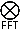

# Fourier Multiply/Divide

**Index**

 * [ImageMagick Examples Preface and Index](../../)
   * [Fourier Transforms](../)
   * [DIY FFT Mathematics Introduction](#intro)
   * [FFT Multiply](#multiply)
     * [Magnitude/Phase Images, Using IM Q16 non-HDRI](#multiply_mp)
     * [Real/Imaginary Images, Using IM Q16 HDRI](#multiply_ri)

   * [FFT Division](#divide)
     * [Magnitude/Phase Images, Using IM Q16 non-HDRI](#divide_mp)
     * [Real/Imaginary Images, Using IM Q16 HDRI](#divide_ri)

------------------------------------------------------------------------

## DIY FFT Mathematics Introduction

Below are examples of a number of techniques for doing multiplication and Division with the two different styles of Fast Fourier Transform images.

Their are basically two ways of doing the mathematics.
Using FX math, and using Composite Maths....

**FX Math**

Using [FX, DIY Operator](../../transforms/#fx) applies the formula directly.
But as it is interpreted, it is very slow.
However the formulas are applied all in a single expression, avoiding the need for intermediate images.
For non-HDRI versions of IM this will reduce Quantum Rounding effects.

**Composite math**

This uses Image Composition to perform mathematical operations, which is much faster than 'FX Math'.
However you can only do one mathematical operation at a time, which means after every operation the image must be saved into another in-memory image.
For non-HDRI versions this will produce extra 'rounding effects' between operations.

The other aspect touched on above is the use of HDRI.

[HDRI versions of ImageMagick](../../basics/#hdri) saves the color values as floating point numbers instead of QuantumRange scaled integers (See [Quality](../../basics/#quality)).
As such when generating the FFT images, or saving the intermediate results to a new image, does not cause 'rounding effects' especially when small values (typical in FFT images) are involved.

Also as Real/Imaginary FFT image pairs require the use of negative numbers you must use a HDRI version of image magick when processing these types of FFT images.

Negatives are however not a problem for Magnitude/Phase FFT images, so you can process such images without using HDRI, though you will still have strong 'rounding effects' between each and every image processing step.

Because of this Fast Fourier transforms, are best used on [HDRI](../../basics/#hdri) versions of ImageMagick, regardless of the type of FFT images you are using.
The exact same commands are used for both HDRI and non-HDRI version of ImageMagick.
  
> 
> When saving intermediate [HDRI](../../basics/#hdri) images to a disk file, you will need to use one of the very few floating point image file formats.
> These formats include [NetPBM PFM](../../formats/#netpbm) file format, [TIFF](../../formats/#tiff), or the [MIFF](../../files/#miff) file format with the special setting "`-define quantum:format=floating-point`".

Here is the convolution kernel image we will be using...

~~~
# motion blur kernel
#convert -size 128x128 xc:black -fill white -draw 'line 60,64 68,64' \
#        -alpha off convolve_kernel.png

# disk blur kernel (Fred Wienhaus's version)
convert -size 128x128 xc:black -fill white -draw 'circle 64,64 54,64' \
        -alpha off convolve_kernel.png
~~~

[![\[IM Output\]](convolve_kernel.png)](convolve_kernel.png)

The convolution kernel must be rolled so that pixel 0,0 contains the center of convolution.
In this case a "`-roll -64-64`" needs to be applied immediately the kernel image is read in.

The kernel image also needs to be divided by its mean so as to preserve the intensity of the image it is being FFT multiplied or divided against.
This is a major complication with FFT multiplication and division.

As non-HDRI images can not be normalized in this way this is generally done after the FFT conversion has been applied, and before multiplication.

For HDRI version of IM you can do this at any time.

------------------------------------------------------------------------

## FFT Multiplication   (  )

### FFT multiply of Magnitude/Phase Images, Using IM Q16

        R = A ⊗ B       ( FFT Multiply )

        Rm = Am × Bm
        Rp = mod( Ap + Bp +0.5, 1.0)

        mean = the DC value (center pixel) of the magnitude image

Using FX Math,  

(note value v.p{64x64} is the DC, or mean of the convolve kernel)

~~~
# non-HDRI
convert convolve_kernel.png -roll -64-64 -fft \
        \( cameraman_sm.png -fft \) \
        \
        \( -clone 0,2 -fx 'u*v / p{64,64} ' \) \
        \( -clone 1,3 -fx 'mod(u + v + 0.5, 1.0)' \) \
        \
        -delete 0-3 -ift  cameraman_convolve_1.png
~~~
[![\[IM Output\]](cameraman_sm.png)](cameraman_sm.png)

[![\[IM Output\]](convolve_kernel.png)](convolve_kernel.png)

[![\[IM Output\]](cameraman_convolve_1.png)](cameraman_convolve_1.png)

Using Composite Maths...

~~~
# non-HDRI
convert convolve_kernel.png -roll -64-64 -fft \
        \( -clone 0 -crop 1x1+64+64 +repage -scale 128x128 \
           -clone 0 -compose divide -composite \) -swap 0 +delete \
        \( cameraman_sm.png -fft \) \
        \
        \( -clone 0,2 -compose multiply -composite \) \
        \( -clone 1,3 -compose add -background gray50 -flatten \) \
         -delete 0-3 -ift  cameraman_convolve_2.png
~~~

[![\[IM Output\]](cameraman_sm.png)](cameraman_sm.png)

[![\[IM Output\]](convolve_kernel.png)](convolve_kernel.png)

[![\[IM Output\]](cameraman_convolve_2.png)](cameraman_convolve_2.png)

Note that "add" is a modulo addition composition, which works to add values the 50% biased values, to generate a 50% biased value.

Alternative  

 Divide with mean from original image

~~~
# non-HDRI
convert convolve_kernel.png \( -clone 0 -roll -64-64 -fft \) \
        \( -clone 0 -scale 1x1 -scale 128x128 \
           -clone 1 -compose divide -composite \) \
        -delete 0,1 +swap \
        \( cameraman_sm.png -fft \) \
        \
        \( -clone 0,2 -compose multiply -composite \) \
        \( -clone 1,3 -compose add -background gray50 -flatten \) \
         -delete 0-3 -ift  cameraman_convolve_2b.png
~~~

[![\[IM Output\]](cameraman_sm.png)](cameraman_sm.png)

[![\[IM Output\]](convolve_kernel.png)](convolve_kernel.png)

[![\[IM Output\]](cameraman_convolve_2b.png)](cameraman_convolve_2b.png)

Alternative...

Note that the DC value divided by DC value ==&gt; 1.0

As DC value is the largest value in a magnitude spectrum, why not just normalise!
EG: `-auto-level`"

This can only be done to a magnitude image, and will not work with real/imaginary pairs as they have to be stretched by the same amount.

~~~
# non-HDRI
convert convolve_kernel.png -roll -64-64 -fft \
        \( -clone 0 -auto-level \) -swap 0 +delete \
        \( cameraman_sm.png -fft \) \
        \
        \( -clone 0,2 -compose multiply -composite \) \
        \( -clone 1,3 -compose add -background gray50 -flatten \) \
        \
        -delete 0-3 -ift  cameraman_convolve_2c.png
~~~

[![\[IM Output\]](cameraman_sm.png)](cameraman_sm.png)

[![\[IM Output\]](convolve_kernel.png)](convolve_kernel.png)

[![\[IM Output\]](cameraman_convolve_2c.png)](cameraman_convolve_2c.png)

### FFT multiply of Real/Imaginary Images, Using IM HDRI

        R = A ⊗ B       ( FFT Multiply )

        Rr = Ar×Br - Ai×Bi
        Ri = Ar×Bi + Ai×Br

        mean = the DC value (center pixel) of the real image

Using FX...

5 images involved, the 5'th being scaled mean - FX does the division

~~~
# HDRI
convert convolve_kernel.png -roll -64-64 \( +clone +fft \) \
        \( cameraman_sm.png +fft \) +matte \
        \( -clone 0 -scale 1x1 \) -delete 0 \
        \
        \( -clone 0-4 -fx '( u[0]*u[2] - u[1]*u[3] ) / u[4].p{0,0}' \) \
        \( -clone 0-4 -fx '( u[0]*u[3] + u[1]*u[2] ) / u[4].p{0,0}' \) \
        -delete 0-4 +ift  cameraman_convolve_3.png
~~~

[![\[IM Output\]](cameraman_sm.png)](cameraman_sm.png)

[![\[IM Output\]](convolve_kernel.png)](convolve_kernel.png)

[![\[IM Output\]](cameraman_convolve_3.png)](cameraman_convolve_3.png)

Using FX...

using the DC value for the mean (no 5'th image)

~~~
# HDRI
convert convolve_kernel.png -roll -64-64 +fft \
        \( cameraman_sm.png +fft \) \
        \
        \( -clone 0-3 -fx '( u[0]*u[2] - u[1]*u[3] ) / u[0].p{64,64}' \) \
        \( -clone 0-3 -fx '( u[0]*u[3] + u[1]*u[2] ) / u[0].p{64,64}' \) \
        -delete 0-3 +ift  cameraman_convolve_3b.png
~~~

[![\[IM Output\]](cameraman_sm.png)](cameraman_sm.png)

[![\[IM Output\]](convolve_kernel.png)](convolve_kernel.png)

[![\[IM Output\]](cameraman_convolve_3b.png)](cameraman_convolve_3b.png)

Using Composite Maths...

With the scale image mean!

~~~
# HDRI
convert convolve_kernel.png -roll -64-64 \
        \( -clone 0 -scale 1x1 -scale 128x128 \) \
        \( -clone 0 +fft \) \
        \( -clone 1,2 -compose divide -composite \) \
        \( -clone 1,3 -compose divide -composite \) \
        -delete 0--3 \
        \
        \( cameraman_sm.png  +fft \) \
        \
        \( -clone 0,2 -compose multiply -composite \) \
        \( -clone 1,3 -compose multiply -composite \) \
        \( -clone 0,3 -compose multiply -composite \) \
        \( -clone 1,2 -compose multiply -composite \) \
        \
        \( -clone 4,5 +swap +matte -compose minus -composite \) \
        \( -clone 6,7 -compose plus -composite \) \
        \
        -delete 0--3 +ift  cameraman_convolve_4.png
~~~

[![\[IM Output\]](cameraman_sm.png)](cameraman_sm.png)

[![\[IM Output\]](convolve_kernel.png)](convolve_kernel.png)

[![\[IM Output\]](cameraman_convolve_4.png)](cameraman_convolve_4.png)

Optimized Composite Maths...

Mean from image scaling

~~~
# HDRI
convert convolve_kernel.png -roll -64-64 \
        \( -clone 0 -scale 1x1 -scale 128x128 \) \
        \( -clone 0 +fft    null: +insert    -clone 1 +insert \
           -compose divide -layers composite \) -delete 0,1  \
        \
        \( cameraman_sm.png +fft \) \
        \
        \( -clone 0,1,0,1 null: -clone 2,3,3,2 \
              -compose multiply -layers composite \) \
        \( -clone 4,5 +swap +matte -compose minus -composite \) \
        \( -clone 6,7 -compose plus -composite \) \
        \
        -delete 0--3 +ift  cameraman_convolve_4b.png
~~~

[![\[IM Output\]](cameraman_sm.png)](cameraman_sm.png)

[![\[IM Output\]](convolve_kernel.png)](convolve_kernel.png)

[![\[IM Output\]](cameraman_convolve_4b.png)](cameraman_convolve_4b.png)

Alternative...

Use the DC value for mean...

~~~
# HDRI
convert convolve_kernel.png -roll -64-64 +fft \
        \( -clone 0 -crop 1x1+64+64 +repage -scale 128x128 \) \
        null: +insert +insert   -compose divide -layers composite \
        \
        \( cameraman_sm.png +fft \) \
        \
        \( -clone 0,1,0,1 null: -clone 2,3,3,2 \
              -compose multiply -layers composite \) \
        \( -clone 4,5 +swap +matte -compose minus -composite \) \
        \( -clone 6,7 -compose plus -composite \) \
        \
        -delete 0--3 +ift  cameraman_convolve_4c.png
~~~

[![\[IM Output\]](cameraman_sm.png)](cameraman_sm.png)

[![\[IM Output\]](convolve_kernel.png)](convolve_kernel.png)

[![\[IM Output\]](cameraman_convolve_4c.png)](cameraman_convolve_4c.png)

Alternative...

Apply DC value mean, AFTER the FFT multiply...

~~~
# HDRI
convert convolve_kernel.png -roll -64-64 +fft \
        \( cameraman_sm.png  +fft \) \
        \
        \( -clone 0,1,0,1 null: -clone 2,3,3,2 \
              -compose multiply -layers composite \) \
        \( -clone 4,5 +swap -compose minus -composite \) \
        \( -clone 6,7 -compose plus -composite \) \
        \
        \( -clone 0 -crop 1x1+64+64 +repage -scale 128x128 \
           null: -clone -2,-1  -compose divide -layers composite \) \
        \
        -delete 0--3 +ift  cameraman_convolve_4d.png
~~~

[![\[IM Output\]](cameraman_sm.png)](cameraman_sm.png)

[![\[IM Output\]](convolve_kernel.png)](convolve_kernel.png)

[![\[IM Output\]](cameraman_convolve_4d.png)](cameraman_deconvolve_4d.png)

------------------------------------------------------------------------

## FFT Division   (  )

Here use use division to remove or de-convolve (for want of a better word) the blur that was added to the above image.
It is basically exactly the same except that the 'normalized' convolution kernel is divided from the main image.
Each Example uses the image generated, using the same technique as above.
### FFT divide of Magnitude/Phase, Using IM Q16

        R = B ø A       ( FFT Divide )

        Rm = Bm / Am
        Rp = mod( -Ap + Bp +1.5, 1.0)

        mean = the DC value (center pixel) of the magnitude image

NOTE: A minimum of QuantumScale is added to the denominator to avoid perfect division by zero.
This is also used later to remove noise from images.

Using FX Math...

~~~
# non-HDRI
noise=QuantumScale
convert convolve_kernel.png -roll -64-64 -fft \
        \( cameraman_convolve_1.png -fft \) \
        \
        \( -clone 0,2 -fx "v/(u/p{64,64}+$noise)" \) \
        \( -clone 1,3 -fx 'mod( -u + v + 1.5, 1.0)' \) \
        \
        -delete 0--3 -ift cameraman_deconvolve_1.png
~~~

[![\[IM Output\]](cameraman_convolve_1.png)](cameraman_convolve_1.png)

[![\[IM Output\]](convolve_kernel.png)](convolve_kernel.png)

[![\[IM Output\]](cameraman_deconvolve_1.png)](cameraman_deconvolve_1.png)

~~~
echo -n "Peak = "
compare -metric PAE cameraman_sm.png cameraman_deconvolve_1.png null:
echo -n "Avg = "
compare -metric RMSE cameraman_sm.png cameraman_deconvolve_1.png null:
~~~

[![\[IM Text\]](roundtrip_cmp_1.txt.gif)](roundtrip_cmp_1.txt)

Using HDRI version of IM to do roundtrip MP convolved FFT (FX Math)

[![\[IM Output\]](cameraman_sm.png)](cameraman_sm.png)

[![\[IM Output\]](cameraman_convolve_1hdri.png)](cameraman_convolve_1hdri.png)

[![\[IM Output\]](cameraman_deconvolve_1hdri.png)](cameraman_deconvolve_1hdri.png)
  
[![\[IM Text\]](roundtrip_cmp_1hdri.txt.gif)](roundtrip_cmp_1hdri.txt)

Using Composite Maths...

~~~
# non-HDRI
noise=1
convert convolve_kernel.png -roll -64-64 -fft \
         \( -clone 0 -crop 1x1+64+64 +repage -scale 128x128 \
            -clone 0 -compose divide -composite \) -swap 0 +delete \
        \( cameraman_convolve_2.png -fft \) \
        \
        \( -clone  0  -evaluate add $noise \
           -clone  2  -compose divide -composite \) \
        \( -clone 1,3 -compose subtract -background gray50 -flatten \) \
        \
        -delete 0--3 -ift cameraman_deconvolve_2.png
~~~

[![\[IM Output\]](cameraman_convolve_2.png)](cameraman_convolve_2.png)

[![\[IM Output\]](convolve_kernel.png)](convolve_kernel.png)

[![\[IM Output\]](cameraman_deconvolve_2.png)](cameraman_deconvolve_2.png)

~~~
echo -n "Peak = "
compare -metric PAE cameraman_sm.png cameraman_deconvolve_2.png null:
echo -n "Avg = "
compare -metric RMSE cameraman_sm.png cameraman_deconvolve_2.png null:
~~~

[![\[IM Text\]](roundtrip_cmp_2.txt.gif)](roundtrip_cmp_2.txt)

Using HDRI version of IM to do roundtrip MP convolved FFT (Composite Math)

[![\[IM Output\]](cameraman_sm.png)](cameraman_sm.png)

[![\[IM Output\]](cameraman_convolve_2hdri.png)](cameraman_convolve_2hdri.png)

[![\[IM Output\]](cameraman_deconvolve_2hdri.png)](cameraman_deconvolve_2hdri.png)
  
[![\[IM Text\]](roundtrip_cmp_2hdri.txt.gif)](roundtrip_cmp_2hdri.txt)

### FFT divide of Real/Imaginary, Using HDRI version of IM

        R = B ø A       ( FFT Divide )

        Denom = Ar×Ar + Ai×Ai + noise
        Rr = ( Ar×Br + Ai×Bi ) / Denom
        Ri = ( Ar×Bi - Ai×Br ) / Denom

        mean = the DC value (center pixel) of the real image

Using FX...

~~~
# HDRI
#noise=QuantumScale
noise=Epsilon
convert convolve_kernel.png -roll -64-64 +fft \
        \( -clone 0 -fx "u/p{64,64}" \) \( -clone 0,1 -fx "v/u.p{64,64}" \) \
        -delete 0,1 \
        \( cameraman_convolve_3.png +fft \) \
        \
        \( -clone 0-3 -fx "u[0]*u[0] + u[1]*u[1] + $noise" \) \
        \( -clone 0-3 -fx 'u[0]*u[2] + u[1]*u[3]' \) \
        \( -clone 0-3 -fx 'u[0]*u[3] - u[1]*u[2]' \) \
        \( -clone 4,5 -fx 'u==0?0:v/u' \) \
        \( -clone 4,6 -fx 'u==0?0:v/u' \) \
        \
        -delete 0--3 +ift cameraman_deconvolve_3.png
~~~

[![\[IM Output\]](cameraman_convolve_3.png)](cameraman_convolve_3.png)

[![\[IM Output\]](convolve_kernel.png)](convolve_kernel.png)

[![\[IM Output\]](cameraman_deconvolve_3.png)](cameraman_deconvolve_3.png)

~~~
echo -n "Peak = "
compare -metric PAE cameraman_sm.png cameraman_deconvolve_3.png null:
echo -n "Avg = "
compare -metric RMSE cameraman_sm.png cameraman_deconvolve_3.png null:
~~~

[![\[IM Text\]](roundtrip_cmp_3.txt.gif)](roundtrip_cmp_3.txt)

The -fx divide I used above is not nearly as good as a composite divide.
Presumably due to the extra FX scaling involved.

~~~
# HDRI
#noise=QuantumScale
noise=Epsilon
convert convolve_kernel.png -roll -64-64 +fft \
        \( -clone 0 -fx "u/p{64,64}" \) \( -clone 0,1 -fx "v/u.p{64,64}" \) \
        -delete 0,1 \
        \( cameraman_convolve_3.png +fft \) \
        \
        \( -clone 0-3 -fx "u[0]*u[0] + u[1]*u[1] + $noise" \) \
        \( -clone 0-3 -fx 'u[0]*u[2] + u[1]*u[3]' \) \
        \( -clone 0-3 -fx 'u[0]*u[3] - u[1]*u[2]' \) \
        \( -clone 4,5 -compose divide -composite \) \
        \( -clone 4,6 -compose divide -composite \) \
        \
        -delete 0--3 +ift cameraman_deconvolve_3b.png
~~~

[![\[IM Output\]](cameraman_convolve_3.png)](cameraman_convolve_3.png)

[![\[IM Output\]](convolve_kernel.png)](convolve_kernel.png)

[![\[IM Output\]](cameraman_deconvolve_3b.png)](cameraman_deconvolve_3b.png)

~~~
echo -n "Peak = "
compare -metric PAE cameraman_sm.png cameraman_deconvolve_3b.png null:
echo -n "Avg = "
compare -metric RMSE cameraman_sm.png cameraman_deconvolve_3b.png null:
~~~

[![\[IM Text\]](roundtrip_cmp_3b.txt.gif)](roundtrip_cmp_3b.txt)

Using Composite Maths (verbose)...

~~~
# HDRI
noise=0.00000001  # Epsilon
convert \( convolve_kernel.png -roll -64-64 +fft \
           \( -clone 0 -crop 1x1+64+64 +repage -scale 128x128 \) \
           \( -clone 2,0 -compose divide -composite \) \
           \( -clone 2,1 -compose divide -composite \) \
           -delete 0-2 \) \
        \( cameraman_convolve_4.png +fft \) \
        \
        \( -clone 0,0 -compose multiply -composite \) \
        \( -clone 1,1 -compose multiply -composite \) \
        \( -clone 0,2 -compose multiply -composite \) \
        \( -clone 1,3 -compose multiply -composite \) \
        \( -clone 0,3 -compose multiply -composite \) \
        \( -clone 1,2 -compose multiply -composite \) \
        \
        \( -clone 4,5 -compose plus  -composite -evaluate add $noise \) \
        \( -clone 6,7 -compose plus -composite \) \
        \( -clone 8,9 +swap -compose minus -composite \) \
        \
        \( -clone 10,11 -compose divide -composite \) \
        \( -clone 10,12 -compose divide -composite \) \
        \
        -delete 0--3 +ift cameraman_deconvolve_4.png
~~~

[![\[IM Output\]](cameraman_convolve_4.png)](cameraman_convolve_4.png)

[![\[IM Output\]](convolve_kernel.png)](convolve_kernel.png)

[![\[IM Output\]](cameraman_deconvolve_4.png)](cameraman_deconvolve_4.png)

~~~
echo -n "Peak = "
compare -metric PAE cameraman_sm.png cameraman_deconvolve_4.png null:
echo -n "Avg = "
compare -metric RMSE cameraman_sm.png cameraman_deconvolve_4.png null:
~~~

[![\[IM Text\]](roundtrip_cmp_4.txt.gif)](roundtrip_cmp_4.txt)

Optimized Composite Maths...

~~~
# HDRI
noise=0.00000001  # Epsilon
convert \( convolve_kernel.png -roll -64-64 +fft \
           \( -clone 0 -gravity center -extent 1x1 -scale 128x128 \) \
           null: +insert +insert -compose divide -layers composite \) \
        \( cameraman_convolve_4.png +fft \) \
        \
        \( -clone 0,1,0,1,0,1 null: -clone 0,1,2,3,3,2 \
              -compose multiply -layers composite \) \
        \( -clone 4,5 -compose plus  -composite -evaluate add $noise \) \
        \( -clone 6,7 -compose plus  -composite \) \
        \( -clone 9,8 -compose minus -composite \) \
        \( -clone 10 null: -clone 11,12 \
              -compose divide -layers composite \) \
        \
        -delete 0--3 +ift cameraman_deconvolve_4b.png
~~~

[![\[IM Output\]](cameraman_convolve_4.png)](cameraman_convolve_4.png)

[![\[IM Output\]](convolve_kernel.png)](convolve_kernel.png)

[![\[IM Output\]](cameraman_deconvolve_4b.png)](cameraman_deconvolve_4b.png)

~~~
echo -n "Peak = "
compare -metric PAE cameraman_sm.png cameraman_deconvolve_4b.png null:
echo -n "Avg = "
compare -metric RMSE cameraman_sm.png cameraman_deconvolve_4b.png null:
~~~

[![\[IM Text\]](roundtrip_cmp_4b.txt.gif)](roundtrip_cmp_4b.txt)

------------------------------------------------------------------------

**UPDATE:** the use of the color 'gray50' in the above should be change to 'gray(50%)' to generate a more accurite 50% gray value.
The former 'named' color is actually only an 8-bit color, and as such not very accurite.

Also with the new colorspace handling, gray50 is in sRGB colorspace while gray(50%) is linear colorspace, which is what should be used in the above calculations.

The examples also needs to be checked with respect to the use a linear gray-scale colorspace.

------------------------------------------------------------------------

Created: 13 August 2009  
 Updated: 6 October 2009  
 Author: [Fred Wienhaus](http://www.fmwconcepts.com/fmw/fmw.html), &lt;fmw at alink.net&gt; with editing and formating by [Anthony Thyssen](http://www.ict.griffith.edu.au/anthony/anthony.html), &lt;[A.Thyssen@griffith.edu.au](http://www.ict.griffith.edu.au/anthony/mail.shtml)&gt;  
 Examples Generated with: ![\[version image\]](version.gif)  
 URL: `http://www.imagemagick.org/Usage/fourier/fft_math/`
