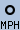
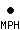
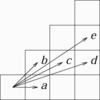

# Morphology of Shapes

Morphology modifies an image in various ways based on the nearby 'neighbourhood' of the other pixels that surround it.
This in turn can provide a huge range of effects, Shape expansion and contraction (dilate/erode), to distance from edge, to thining down to a skeleton, or mid-line axis.

Even the more anchiet method of 'convolution' techniques that provide blurring and sharpening techniques (next section), is in a way a type of morphology method.

Essentially morphology is for the modification, determination, and discovery of the shapes of objects found within an image.

----

## Morphology Introduction {#intro}

Morphology was originally developed as a method by which the structure of shapes within an image could be cleaned up and studied.
It works by comparing each pixel in the image against its neighbours in various ways, so as to either add or remove, brighten or darken that pixel.
Applied over a whole image, perhaps repetitively, specific shapes can be found and/or removed and modified.

For example if an pixel is white and completely surrounded by other white pixels, then that pixel is obviously not on the edge of the image.
You may then like to make that pixel black, so as to leave only edge pixels turned on.
A method known as '`EdgeIn`' (see below).

The whole process actually depends on the definition of a 'Structuring Element' or 'Kernel', which defines what pixels are to be classed as 'neighbours' for each specific morphological method.
Exactly what size and shape this 'neighbourhood' often depends on just what you are trying to achieve, or what you are specifically looking for within the image.

Here are some examples of various kernels that have been converted into images (using a special script "`kernel2image"`") showing some of the 'neighbourhoods' around a central pixel, 'origin'.

[![\[IM Output\]](kernel_diamond.gif)](kernel_diamond.gif       "Diamond")
[![\[IM Output\]](kernel_square.gif)](kernel_square.gif         "Square")
[![\[IM Output\]](kernel_octagon.gif)](kernel_octagon.gif       "Octagon")
[![\[IM Output\]](kernel_disk.gif)](kernel_disk.gif             "Disk")
[![\[IM Output\]](kernel_plus.gif)](kernel_plus.gif             "Plus")
[![\[IM Output\]](kernel_rectangle.gif)](kernel_rectangle.gif   "Rectangle 7x4+3+2")
[![\[IM Output\]](kernel_corner.gif)](kernel_corner.gif         "Corner #0")
[![\[IM Output\]](kernel_gaussian.gif)](kernel_gaussian.gif     "Gaussian 5x2")

The images have been scaled to highlight the individual elements of the 'kernel', and as you can see typical kernels are often very small.
In fact the 'Disk' kernel show above is actually "![\[Raw Disk Kernel Image\]](kernel_disk_raw.gif)", and that is one of the largest kernels shown above.

However the 'kernels' are not really images.
Just an array of floating-point values with one element specified to be the 'origin' of the kernel.
This special element is the location of the pixel that will be 'effected' by the defined neighbourhood, and is typically though not always the center pixel of a symetrical kernel.

Note that these are only some examples of possible neighbourhoods.
Some kernels can be made larger, typically by increasing a 'radius' argument specific to that kernel, while others used for special purposes are of fixed size.

For simple kernels, such as the first two, the morphological method could be repeated (iterated) to increase the effective 'size' of the kernel, so as to effect more pixels further away from the 'origin' (as marked).
This does not always work however, and can produce unexpected results, however it is sometimes faster than directly using a larger kernel, but again that is not always the case.

The final size and shape of a 'Structuring Element', or 'SE', as a kernel is termed in morphology research papers, is important as a means of locating and enhancing or deleting image elements that are larger or smaller than this shape.
This is what makes morphology extremely powerful as a means of sorting out various elements within images.
However the larger the kernel, the longer the morphological methods will take, so it is better to keep the kernels small.

All of the kernels shown, excluding the last kernel one, are actually shaped.
The parts that are transparent are *not* part of the defined 'neighbourhood' of the kernel.
That is they will do not have any valid value, and will not take part in any of the morphology calculations.

Note how the second last kernel '`Corner #0`' not only has 'on' values, but also 'off' values, as part of its 'shape'.
Both values, as well as those that are transparent (not part of shape) are important to the [Hit-n-Miss](#hitmiss) and related methods (see below).
This specific kernel is only the first of a series of kernels that to locate 'corner' pixels of binary shapes within an image.

The last 'kernel' shown above is fully defined over a large rectangular (square) area.
Also unlike the other kernels which only use values of 1 (white), 0 (black), or a special 'undefined' value, the values of this kernel actually range from near-zero (almost-black) at the edges to a maximum (pure-white) value in the center.
However such kernels can also use negative, or even very large values, well beyond the normal range of other kernels.
Remember a kernel is really just an array of values, and these could have any value, not just a 0 to 1 range.

This type of kernel is especially important in '[Convolution Operations](../convolve/#intro)', a special method that has been around far longer than morphology itself.
As a result IM has a very large number of built-in, or 'Named' kernels of this type.
This will be looked at in more detail in the next section of IM Examples, [Convolution of Images](../convolve/)'.

Now as I already mentioned, kernels are not really images.
They are simply an array of floating point values.
We will be looking at these actual values (which was converted into an image for viewing, above) latter.

### Morphology Operator {#morphology}

The "`-morphology`" operator is very complex, as it provides the user with a lot of controls over its actions.

~~~
 -morphology {method}[:{iterations}]   {kernel}[:[k_args}]
~~~

Note that you need to provide at least two items, the morphology '*method*', telling the operator type of operation you want to apply to the image, and a '*kernel*' specifying what 'neighbouring' pixels should effect the final result.
Both are equally important and both can have far reaching consequences.

You can get a list of the methods that are available using "**`-listmorphology`**".
A list of the built-in kernels that we have included in IM can be see with "**`-listkernel`**".
We will go though the various methods, and the kernels that those methods may use later.

> 
> 
> :WARNING:
> The "`-morphology`" operator (basic methods) and the initial set of kernels was added to ImageMagick version 6.5.9-0 by myself, while I was on a vacation in China.
> December 2009 to January 2010.
> 
> However it is posible to perform simplified 'square' kernel morphology using the older and closely related "`-convolve`" method.
> See [Alternative Basic Morphology Techniques](#alternative) below.

### Basic Built-In Shape Kernels {#kernel}

As the kernel is common to all the morphology methods, and the results of the various methods depend heavily on the actual kernel selected, we will first look at how you can define or select a kernel to use.

A good selection of kernels have already predefined for you and often you need look no further than these.
You can get a list of the pre-defined built-in kernels by using "`-listkernel`" All kernels have a specific size, typically a square which has a odd number of pixels per side, the center of which is the 'origin' of the kernel.
However as you will see the "`-morphology`" operator is not restricted to this limitation.

The most common *k\_argument* used for built-in kernels, and generally the first argument given is a '*radius*'.
This defines how big the typical odd-sized square neighbourhood of the kernel will be.
The final kernel size will generally be twice the radius plus one (for the center pixel).
That is a '*radius*' of '`2`' will create a kernel that is 5×5 pixels square.

While a '*radius*' typically defines the size of the final kernel, and thus the overall speed of the morphological operation over the images, it may not be the most important factor, especially for [Convolution Kernels](#convolve_kernels) where the values have a greater effect on results than the kernels size.

If a '*radius*' set to 0, or left undefined the '*radius*' will automatically default to some reasonable or most commonly used value, depending on the kernel involved.

[![\[IM Output\]](kernel_unity.gif)](kernel_unity.gif)

#### Unity {#unity}

This is a special kernel that is specifically used when you need a 'No-Op' kernel.
Most morphological methods using this kernel will either re-produce the original image, or generate a blank result.

The kernel has no arguments.

This exact same single element kernel can also be generated using '`Disk:0.5`', which also allow you to specify a scaling argument as part of the kernels generation.

[![\[IM Output\]](kernel_diamond.gif)](kernel_diamond.gif)

#### Diamond {#diamond}

The most minimal, though perhaps not the simplist kernel is the '**`Diamond`**' built-in kernel.
A simple way to look at the basic kernel is to use a [Dilate](#dilate) morphology method, on an image containing a single white pixel on a black background.
This basically expands the single pixel into the 'shape' of the kernels neighbourhood.

Here is the result of a using '`Dilate`' with the minimal '`Diamond`' built-in kernel, and scaling the result larger to make it more visible.

~~~
convert xc: -bordercolor black -border 5x5 pixel.gif

convert pixel.gif -scale 800% pixel_mag.gif

convert pixel.gif -morphology Dilate Diamond \
                  -scale 800% k_diamond.gif
~~~

[![\[IM Output\]](pixel_mag.gif)](pixel.gif)

[![\[IM Output\]](k_diamond.gif)](k_diamond.gif)

> 
> 
> :REMINDER:
> Remember all the kernel image results in this area of IM examples have been enlarged to allow you to see the individual pixels.
> In reality all the kernels and the results we are showing are very small, as they should be.
> In this case the image being dilated only 11×11 pixels in size and has been scaled 8 times for display.

This is actually a fairly good kernel for morphological operations, and basically defines the most minimal practical neighbourhood: the original pixel, plus the four pixels in direct contact.
Another name for this type of kernel is a 'Z4' structuring element.
It looks rather like a tiny 'plus' sign.
The diamond shape only becomes apparent as the radius increases.

The optional *k\_arg* for this kernel can take two values, like this...

~~~
 Diamond[:{radius}[,{scale}]]
~~~

For all the shape kernels the most important argument is *radius* and as mentioned before is an integer that represents the distance from the center 'origin' to the nearest edge.

As such the final '`Diamond`' kernel is a square (2 times *radius* plus 1) containing the diamond shape.
Here is the results of using a larger *radius* to generate a large kernel.

~~~
for r in 1 2 3 4; do
    convert pixel.gif -morphology Dilate Diamond:$r -scale 800% k_diamond:$r.gif
done
~~~

[![\[IM Output\]](k_diamond:1.gif)](k_diamond:1.gif "Diamond:1  (default)")
[![\[IM Output\]](k_diamond:2.gif)](k_diamond:2.gif "Diamond:2")
[![\[IM Output\]](k_diamond:3.gif)](k_diamond:3.gif "Diamond:3")
[![\[IM Output\]](k_diamond:4.gif)](k_diamond:4.gif "Diamond:4")

The other *k\_argument* is *scale* which defaults to a value of 1.0.
Typically this is used to change the actual values used by the kernel to form the shape.
This is generally only important to special methods such as [Convolve](#convolve), and [Grey-scale Morphology](#greyscale).

[![\[IM Output\]](kernel_square.gif)](kernel_square.gif)

#### Square {#square}

The '**`Square`**' is the most commonly used kernel for morphology, as it is easiest to apply using other alterantive techniques.
However it is not the most minimal kernel (see '`Diamond`' above).

By default the '`Square`' kernel uses a 3x3 pixel neighbourhood around the 'center'.

~~~
convert pixel.gif  -morphology Dilate Square -scale 800% k_square.gif
~~~

[![\[IM Output\]](k_square.gif)](k_square.gif)

Basically this means that all 8 neighbours of the original pixel will be classed as part of that pixels neighbourhood.
As a result it is a good kernel for averaging pixels, or expanding/shrinking some shape by one pixel.
As with all the shape kernels it takes the same *k\_arguments* as shown for the [Diamond Kernel](#diamond) above, with the first argument *radius* being the most important.

~~~
for r in 1 2 3 4; do
    convert pixel.gif  -morphology Dilate Square:$r -scale 800% k_square:$r.gif
done
~~~

[![\[IM Output\]](k_square:1.gif)](k_square:1.gif "Square:1  (default)")
[![\[IM Output\]](k_square:2.gif)](k_square:2.gif "Square:2")
[![\[IM Output\]](k_square:3.gif)](k_square:3.gif "Square:3")
[![\[IM Output\]](k_square:4.gif)](k_square:4.gif "Square:4")

The default (radius=1) for this kernel as mentioned is a 3×3 square, and is commonly known as a 'Z8' structuring element (for the number of immediate neighbours involved).

[![\[IM Output\]](kernel_octagon.gif)](kernel_octagon.gif)

#### Octagon {#octagon}

The '**`Octagon`**' kernel is a 8 sided shaped kernel.
And was specifically designed to match the '`Octagonal Distance Metric`'.
Do not confuse the two as they are very different kernels.
Here are the resulting kernels for small radii...

[![\[IM Output\]](kernel_octagon_1.gif)](kernel_octagon_1.gif)
[![\[IM Output\]](kernel_octagon_2.gif)](kernel_octagon_2.gif)
[![\[IM Output\]](kernel_octagon_3.gif)](kernel_octagon_3.gif)
[![\[IM Output\]](kernel_octagon_4.gif)](kernel_octagon_4.gif)
[![\[IM Output\]](kernel_octagon_5.gif)](kernel_octagon_5.gif)

Note that at radius 1, you get the same kernel as a "Diamond" kernel.
Because of this the default octagon size is of radius '`2`'.

> 
>
> :REMINDER:
> From this point on I will be using a special [kernel2image](#kernel2image) script to generate images of the kernels as they are much clearer than using a raw "dilate-scale" method (as above).
> Remember however the kernels are in generally very small, though Octagon and Disk kernels (see next) can become very large for specific uses.

> 
>
> :REMINDER:
> The "`Octagon`" kernel was added in IM v6.6.9-4, along with the "`Octagonal`" distance kernel.
>
> [![\[IM Output\]](kernel_disk.gif)](kernel_disk.gif)

#### Disk {#disk}

The '`Disk`' kernel is as you would expect, a circular shape.
And is commonly used when a very large morphological kernel is needed.
Note however it is a aliased boolean circle.

However the *radius* argument for a disk can be a floating point number, which allows you to produce a quite a range of shapes, using small radii.

[![\[IM Output\]](kernel_disk_01.gif)](kernel_disk_01.gif)
[![\[IM Output\]](kernel_disk_02.gif)](kernel_disk_02.gif)
[![\[IM Output\]](kernel_disk_03.gif)](kernel_disk_03.gif)
[![\[IM Output\]](kernel_disk_04.gif)](kernel_disk_04.gif)
[![\[IM Output\]](kernel_disk_05.gif)](kernel_disk_05.gif)
[![\[IM Output\]](kernel_disk_06.gif)](kernel_disk_06.gif)\
[![\[IM Output\]](kernel_disk_07.gif)](kernel_disk_07.gif)
[![\[IM Output\]](kernel_disk_08.gif)](kernel_disk_08.gif)
[![\[IM Output\]](kernel_disk_09.gif)](kernel_disk_09.gif)
[![\[IM Output\]](kernel_disk_10.gif)](kernel_disk_10.gif)
[![\[IM Output\]](kernel_disk_11.gif)](kernel_disk_11.gif)

The '`Disk:4.3`' kernel is the default, and what I regard as the first true disk shape.
Disks of this size or larger are especially good for generally rounding and smoothing image shapes.

The final size of the kernel containing the disk is the '*radius*' value rounded down, times 2 plus 1.
As such the default '`Disk:4.3`' kernel has a kernel size radius of 4, making the final kernel size 4 times 2 plus 1, and generating a 9×9 kernel to hold the disk shape.

Note that a value less than one (but not zero) will always produce a single pixel kernel, though that is not very useful.
After that the kernel tends to mostly produce kernels that can also be generated using the previous kernel types.
It is only as the radius gets large that true disk-shaped kernels start to emerge.

The most important thing to note is that a disk with a fractional radius works a lot better than using a integer radius.
Adding a fraction of about 0.3 to 0.5 is generally recommended, to avoid generating an off looking single pixel on the sides of the disk.

[![\[IM Output\]](kernel_plus.gif)](kernel_plus.gif)

#### Plus {#plus}

The '`Plus`' kernel is actually a little different to the other morphological shape kernels, in that it is designed to represent a specific 'shape' rather than a simple 'neighbourhood' around a pixel.

Using a larger '*radius*' with this kernel does not simply increase the size of the kernel, but lengthens the arms of the resulting plus sign.
The thickness of the arms however does not increase.

[![\[IM Output\]](kernel_plus_1.gif)](kernel_plus_1.gif)
[![\[IM Output\]](kernel_plus_2.gif)](kernel_plus_2.gif)
[![\[IM Output\]](kernel_plus_3.gif)](kernel_plus_3.gif)
[![\[IM Output\]](kernel_plus_4.gif)](kernel_plus_4.gif)

The default size of a '`Plus`' kernel is a radius of 2, producing 2 pixel 'arms' around the central 'origin'.
A '`Plus:1`' kernel happens to be the same as the default '`Diamond`' kernel.

Note that a '`Plus`' kernel is a generally not used for normal morphological methods, and should be avoided for such purposes.

However it is a very useful if you are wanting to find and highlight single points in an image, such as I do later to display [Skeleton Information](#skeleton_info).
Basically it provides a method of [Drawing Symbols](../draw/#symbols), without needing to know exactly where the individual 'points' are located in the image.

[![\[IM Output\]](kernel_cross.gif)](kernel_cross.gif)

#### Cross {#cross}

The '`Cross`' kernel is exactly like '`Plus`' but rotated 45 degrees.
It is also just a special kernel shape suitable for expanding pixels to mark the locations of various points

[![\[IM Output\]](kernel_cross_1.gif)](kernel_cross_1.gif)
[![\[IM Output\]](kernel_cross_2.gif)](kernel_cross_2.gif)
[![\[IM Output\]](kernel_cross_3.gif)](kernel_cross_3.gif)
[![\[IM Output\]](kernel_cross_4.gif)](kernel_cross_4.gif)

[![\[IM Output\]](kernel_ring.gif)](kernel_ring.gif)

#### Ring {#ring}

The '`Ring`' kernel, like the '`Plus`' kernel is also designed as a special 'shape' kernel for marking pixels of generating patterns on images.

However it does not just take one radius, it can take two radii and is defined in the same way as [Disk Kernels](#disk)...

~~~
 Ring[:{radius1}[,{radius2}[,{scale}]]]
~~~

What it does it turn 'on' any pixel that falls between the two radii, regardless of the order of the two radii given.
If no radii are given it defaults to a radii of '`2.5`' and '`3.5`', producing a '`Ring:2.5,3.5`' and a hollow octagonal shaped ring.

By varying the two radii you can create a 'ring' of any size and thickness.
However if the two radii are within 1 pixel of each other you can also generate a ring consisting of sparsly separated dots, which can be useful special purpose neighbourhood.
At smaller scales, box-like kernels can also be generated.

If the second radius is not given it will default to a value of '`0.5`' which effectively defines a full disk, but without the center 'origin' pixel.
Here are examples of many of the '`Ring`' kernels that can be generated...

[![\[IM Output\]](kernel_ring_01.gif)](kernel_ring_01.gif)
[![\[IM Output\]](kernel_ring_02.gif)](kernel_ring_02.gif)
[![\[IM Output\]](kernel_ring_03.gif)](kernel_ring_03.gif)
[![\[IM Output\]](kernel_ring_04.gif)](kernel_ring_04.gif)
[![\[IM Output\]](kernel_ring_05.gif)](kernel_ring_05.gif)
[![\[IM Output\]](kernel_ring_06.gif)](kernel_ring_06.gif)
[![\[IM Output\]](kernel_ring_07.gif)](kernel_ring_07.gif)
[![\[IM Output\]](kernel_ring_08.gif)](kernel_ring_08.gif)
[![\[IM Output\]](kernel_ring_09.gif)](kernel_ring_09.gif)
[![\[IM Output\]](kernel_ring_10.gif)](kernel_ring_10.gif)
[![\[IM Output\]](kernel_ring_11.gif)](kernel_ring_11.gif)
[![\[IM Output\]](kernel_ring_12.gif)](kernel_ring_12.gif)
[![\[IM Output\]](kernel_ring_13.gif)](kernel_ring_13.gif)
[![\[IM Output\]](kernel_ring_14.gif)](kernel_ring_14.gif)
[![\[IM Output\]](kernel_ring_15.gif)](kernel_ring_15.gif)
[![\[IM Output\]](kernel_ring_16.gif)](kernel_ring_16.gif)
[![\[IM Output\]](kernel_ring_17.gif)](kernel_ring_17.gif)
[![\[IM Output\]](kernel_ring_18.gif)](kernel_ring_18.gif)
[![\[IM Output\]](kernel_ring_19.gif)](kernel_ring_19.gif)
[![\[IM Output\]](kernel_ring_20.gif)](kernel_ring_20.gif)
[![\[IM Output\]](kernel_ring_21.gif)](kernel_ring_21.gif)

As you can see you have a lot of possibilities, by carefully adjusting the two radii, and provides a good way of showing locations of interest in an image.

[![\[IM Output\]](kernel_rectangle.gif)](kernel_rectangle.gif)

#### Rectangle {#rectangle}

The '`Rectangle`' kernel is closely related to the '`Square`' kernel above, and by default produces the same square 3x3 kernel.
But rather than a simple radius argument, you can give a '*geometry*' argument to specify the exact size of the rectangular kernel wanted.

Here are some specifications and an image of the kernels they produce.

[![\[IM Output\]](kernel_rect_1.gif)](kernel_rect_1.gif)
[![\[IM Output\]](kernel_rect_2.gif)](kernel_rect_2.gif)
[![\[IM Output\]](kernel_rect_3.gif)](kernel_rect_3.gif)
[![\[IM Output\]](kernel_rect_4.gif)](kernel_rect_4.gif)\
[![\[IM Output\]](kernel_rect_5.gif)](kernel_rect_5.gif)
[![\[IM Output\]](kernel_rect_6.gif)](kernel_rect_6.gif)
[![\[IM Output\]](kernel_rect_7.gif)](kernel_rect_7.gif)
[![\[IM Output\]](kernel_rect_8.gif)](kernel_rect_8.gif)

By default the kernel will try to set the 'origin' of the neighbourhood to the exact 'center' of the kernel.
But for an even-sized rectangle, it will pick the point to the immediate top and/or left of the center as appropriate.
However you can also specify off-centered origins as well.

This particular kernel is also good at defining long horizontal and vertical lines, allowing you to search for such objects within images.
More on this later.

At this time you can not provide a *scale* factor for a rectangle.
All its kernel values will be set to 1.0 only.

#### User Defined Kernels {#user}

You are not restricted to just the built-in kernels, but can also specify your own kernel, and giving the exact values you want the kernel to use...

~~~
 "[{geometry}:] {value}, {value}, {value},....."
~~~

The '*geometry*' specification is basically exactly like that of the argument previous '`Rectangle`' kernel.
It gives the size of the kernel, and even the 'offset' of the neighbourhood 'origin'.
If only one number is supplied, it is the dimensions for a a square kernel will be assumed.
Remember this is NOT a 'radius' argument.

If no '*geometry*' or '`:`' is specified, then you are using a 'old' style specification, and a odd sized square kernel big enough to hold all the values given will be generated.
This is not recommended and only provided for backward compatibility with older versions of ImageMagick.

After the '`:`' (which is required after a '*geometry*' specification) you then supply *width* × *height* floating point values separated by commas and/or spaces.
A special value of '`NaN`' (meaning "Not a Number") or a '`-`' on its own, can be used to specify that this point in the kernel is not part of the neighbourhood.

For example here is a specification for a square kernel of width 3, that can be used as for convolution blurring of the single pixel image.

~~~
convert pixel.gif   -morphology Convolve \
        "3:  0.3,0.6,0.3   0.6,1.0,0.6   0.3,0.6,0.3" \
        -scale 800%  k_user_3.gif
~~~

[![\[IM Output\]](k_user_3.gif)](k_user_3.gif)

With a single pixel, [Convolve](#convolve) works almost the same as [Dilate](#dilate), however [Convolve](#convolve) works with the kernels values, expanding and adding neighbouring values together.
[Dilate](#dilate) on the other hand works using an on/off (boolean) shape and the maximum of all the neighbours.
However when operating on a single isolated pixel with a boolean shape you get the same result.

Note how you can add extra spacing to the input string so as to separate the the individual rows of the rectangular kernel definition.

> 
> 
> :EXPERT:
> By default a "`-morphology Convolve`" does not do any normalization, scaling, or biasing of the results of the convolution method.
> If the above was done using the older "`-convolve`" operator (before IM v6.5.9) the result would be much darker due to its automatic normalization of the input kernel.

And here I defined a 5×3 rectangular area, but use the special 'nan' (not a number) values to cut off the corners to make an oval shaped kernel...

~~~
convert pixel.gif   -morphology Dilate \
        "5x3: nan,1,1,1,nan   1,1,1,1,1   nan,1,1,1,nan " \
        -scale 800%   k_user_5x3.gif
~~~

[![\[IM Output\]](k_user_5x3.gif)](k_user_5x3.gif)

And finally here is an example of specifying a rectangular neighbourhood, that forms a 'L' shape around the 'origin'.
Note that the origin of this kernel is not even part of its own neighbourhood!

~~~
convert pixel.gif   -morphology Dilate \
        "2x3+1+1:   1,-   1,-   1,1   "  -scale 800% k_lman.gif
~~~

[![\[IM Output\]](k_lman.gif)](k_lspace.gif)

Note that instead of 'nan' I used '-' to specify the parts that is not part of the kernel.
Of course the '-' must be surrounding by spaces or commas so it does not get confused with a numerical minus sign.

As you can see user kernel specification is very flexible, allowing you to specify just about any type of kernel you like, whether it is a convolution kernel with lots of fractions, or a shaped kernel with 'not part of neighbourhood' elements, for morphological methods.

### Iterating (Repeating) Morphology Operations {#iteration}

As you seen from the above you can generate a larger kernel, so as to apply a morphology over a larger neighbourhood.

However in some cases a faster alternative to using a larger kernel is to simply repeat (iterate or loop) the morphology operator multiple times.
This means that the effect of that operator will be carried further, having the same basic effect as a using a larger kernel, but without the added computational cost of using a larger kernel.

For example, to produce the same result as a '`Diamond:3`' you could repeat the operation three times using the default radius 1 kernel...

~~~
convert pixel.gif  -morphology Dilate Diamond \
                   -morphology Dilate Diamond \
                   -morphology Dilate Diamond  -scale 800% k_diamond_x3.gif
~~~

[![\[IM Output\]](k_diamond_x3.gif)](k_diamond_x3.gif)

Now remember you are still only using a very small 3x3 kernel, but repeating the basic morphological operation three times to produce the same effect as if you are using a larger kernel.
In fact repeating small kernels like this is actually a good deal faster than using the much larger kernel.

Because repeating a morphological operation is very common, rather than repeating the operation multiple times, you can just ask IM to loop or iterate the operation, that many times.

~~~
convert pixel.gif   -morphology Dilate:3 Diamond -scale 800%  k_diamond_3.gif
~~~

[![\[IM Output\]](k_diamond_3.gif)](k_diamond_3.gif)

Using an '*iteration*' to make the effective neighbourhood bigger, works for most 'circular' kernels, such as a '`Square`' and '`Diamond`'.
But **it does not work for all kernel types**.
For example for a non-convex kernel such as a '`Plus`' (which is not a convex shape) it will produce a very unusual results.

For example...

~~~
convert pixel.gif   -morphology Dilate:2 Plus  -scale 800%  k_plus_2.gif
~~~

[![\[IM Output\]](k_plus_2.gif)](k_plus_2.gif)

On the other hand iterating a '`Plus:1`' kernel produces the same result as iterating a '`Diamond`' kernel as they are really the same kernel shape.

Note that if you use a '*iteration*' count of '`0`', the morphology will do nothing.
This is a useful way to 'turn off' the operator when you don't want it to do anything, but do not want to remove it from the command line.
See [Verbose Output Display](#showkernel), below for another such use of a zero iteration count.

Using a special value of '`-1`', will repeat the operation until no more changes are seen in the image.
That is the image reaches a point of 'convergence'.
This is however dangerous, as in some situations could lead to very long running operations.
For an operation such as for '`Dilate`' for example it would simply repeat the dilation until the whole image was completely filled with white.
Basically producing a sort of runaway 'flood fill' (see the next example below).

Iterating a '`Disk`' kernel to produce a larger neighbourhood effect, is also generally not recommended.
That is because the '`Disk`' kernel becomes a more accurate disk shape as the radius gets larger, where a iterated disk, will enlarge not just the shape but the errors (non-disk shape) of the kernel.
As such you may be better off using a larger radius (which is slower) rather than iterating the operation (which produces a more distorted disk) .

However as a '`Disk`' radius becomes really large then a combination of radius and multiple iterations, could produce a faster, but still acceptable result.
Caution and some experimentation with your specific situation may be needed.

### Verbose Output of Changes {#verbose}

If you want to see the results of iterating (repeating) a morphological operation, you can set the "`-verbose`" option, which turns on the [Verbose Operational Control](../basics/#verbose).
As the morphology operator iterates, it will report a incrementing count of the iteration, and how many pixels in the image were changed by each iterated step.
The output is to standard error, so that you can still pipe the image results..

For example lets '`Dilate`' the single pixel image using the larger '`Octagon`' kernel until the whole image has been filled with white and no more changes can be made to the image.
Remember an iteration limit of '`-1`' means iterate forever, or until no more changes are seen.

~~~
MAGICK_THREAD_LIMIT=1 \
    convert pixel.gif -verbose  -morphology Dilate:-1 Octagon \
                      +verbose  -scale 800% iterate_infinite.gif
~~~

[![\[IM Output\]](iterate_infinite.gif)](iterate_infinite.gif)

[![\[IM Text\]](verbose_iterate.txt.gif)](verbose_iterate.txt)

Note the number of changes made in each iteration.
Initially there were 20 pixels converted from black to white.
Then 48 more on the next iteration, and so on.
This number generally grows as the edge of the resulting shape gets larger, but then started to shrink again as shape hits the image boundary.
On the fourth dialation the last 4 pixels (in the corners of the image) were filled in.
On the last dilation (iteration 5) the image was already completely filled, as such no more changes to any pixel was performed.
As no changes were made the morphology automatically aborts, giving a final number of changes for this stage of the operation.

Using an infinite iteration of '`-1`' does have an internal limit.
This is currently set to the maximum width or height of the image.
This is done to prevent ImageMagick from going into a never ending loop.
Typically however operations will finish long before that internal limit is reached.

Some morphology methods are actually defined in terms of simpler more primitive methods.
For example a '`Smooth`' method for example is one such compound method.
The "`-verbose`" output that is generated when using this method, shows the multiple internal steps that goes to make up its processing.

~~~
MAGICK_THREAD_LIMIT=1 \
    convert man.gif   -verbose -morphology Smooth:2 Diamond +verbose   null:
~~~

[![\[IM Text\]](verbose_compound.txt.gif)](verbose_compound.txt)

If you look you can see that the '`Smooth`' actually iterates, 4 more primitive methods, and thus internally processes the image 8 times to perform the requested operation.
Each line consists of...

`Smooth:i.s`

:   this shows the high level morphology method being applied to the image, and the iteration count '*i*' and primitive 'stage' '*s*', that IM is processing.

    For the '`Smooth`' method that first number is always '1', as the user-given 'iteration count' is applied in the lower level primitive method.
    In other methods, the user-given iteration may be applied at this higher level rather than at the lower level.

    The second 'stage' number is the primitive 'stage' count that is being applied.
    '`Smooth`' itself is composed of four such stages, as it implements the '`Open`' and '`Close`' compound methods.

`Dilate*:i.k`

:   This is the primitive method being applied.
    The first number *i* is again the user-given iteration count (if it is being applied here).
    The second number '*k*' is the kernel being applied by the primitive morphology method.
    As there is only one kernel so it is always zero in this case.
    (See [Multi-Kernel Handling](#multi-kernel) below)

    The '`*`' indicates that the kernel was reflected (or rotated 180 degrees around origin) before being applied by the morphological primitive.
    This is required for some compound morphological methods, in this case the '`Close`' method always uses a reflected kernel in its use of the '`Dilate`' and '`Erode`' primitive methods.

`#6 => Changed 311  Total 637`

:   This is a report of the results of applying the morphology primitive to the image.

    The 'hash' number is a incremental count of the number of primitive passes though the image.
    This gives you a good idea of how computationally intensive a compound morphology operator is.

    You then get a the actual number of pixels that were changed in some way during that pass.

    If this is the last of a number of iterations for this specific primitive and kernel, a total count of pixel modifications is also output.
    This does not however reflect the total number of pixels changed in total from start to finish, just the changes caused by the low-level iteration of the specific primitive, kernel operation.
    Some pixels may change multiple times by some morphological primitives.

From the above you may see that internally IM may have four loops of processing being applied to fully process an given morphology method.
However typically most of these loops are only applied once only.

> 
> 
> :WARNING:
> Warning the number of pixels that change, may not be correct on machines running a multi-threaded environment on modern multi-core machines!
> It is only guaranteed to be accurate when executed in a single threaded environment.
> I class this as a bug, but not a vital one.
> 
> If this is a problem then ensure you set the environment variable "`MAGICK_THREAD_LIMIT`" to a value of '`1`' for that specific run of ImageMagick, as I did in the last two examples above.
> 
> As of IM v6.8.4 you no longer need the "`MAGICK_THREAD_LIMIT`" environment setting, as the counts are correctly handled in a multi-threding environment.

### Displaying the Kernel Generated (for debugging purposes) {#showkernel}

If you like to actually see the values that was used to define a particular kernel that was generated, you can define a special setting...

>         -define morphology:showkernel=1   
>         -define convolve:showkernel=1   
>         -define showkernel=1   

Any of the above defines causes IM to output (to 'standard error') all the information about a generated kernel, after the kernel has been completely processed in preparation for its use.
(See [Convolve Kernel Scaling](../convolve/#kernel_scaling)).

For example, here is the actual values of the built-in '`Disk`' kernel...

~~~
convert xc: -define showkernel=1 -morphology Dilate:0 Disk null:
~~~

[![\[IM Text\]](k_disk.txt.gif)](k_disk.txt)

Note that as I only wanted to show the kernel, I really don't care about the image processing at all.
As such I set the morphology '*iteration*' to '`0`' (do nothing), and also discard any image result using a [null:](../files/#null) output file format.

The special floating point value of 'nan' in the above has the same meaning as when inputting a [User Defined Kernel](#user).
It means 'Not A Number' and marks the parts of a kernel that is not part of the neighbourhood.
These values are ignored by all morphological operations.

Here is another example.
This time of a '`Comet`' convolution kernel.

~~~
convert xc:  -define showkernel=1 -morphology Dilate:0 Comet:0x2  null:
~~~

[![\[IM Text\]](k_comet.txt.gif)](k_comet.txt)

This is actually half a 1 Dimensional Gaussian Curve (sigma of 1.0), and can provide a nice way of extracting such a curve from ImageMagick.

Also notice that this specific kernel's 'origin' (the pixel that it effects), is off-center, which is unusual.

The size and spacing of the values in the output can be controlled by the special [Precision Operational Control](../basics/#precision).
That was added to IM at about the same time as the morphology operator.

For example here is a repeat of the previous example but using "`-precision`" to limit the number of significant digits from the default of 6 to 3.

~~~
convert xc:  -define showkernel=1 -precision 3 \
             -morphology Dilate:0 Comet:0x2  null:
~~~

[![\[IM Text\]](k_precision.txt.gif)](k_precision.txt)

> 
> 
> :WARNING:
> The "`-precision`" option was added to ImageMagick version 6.5.9-1 during the morphology development cycle.
> As such if morphology is available, precision can also be regarded as available.

### Generating an Image of the Kernel {#kernel2image}

To make it easier to see kernels, rather than using [Dilating](#dilate) or [Convolution](../convolve/#convolve) on a a single pixel image to see what it produces, I created a special script called "`kernel2image`".
This script extracts the exact [Show Kernel](#showkernel) output, and converts it into a image of the kernel.

The "`kernel2image` script has lots of options, from output the raw image of the kernel (the default) to specifying the amount of scaling, inter-pixel gaps, montage, labeling, and even coloring of the resultant 'kernel image'.

For example here is how I generated the "`Octagon`" kernel image, which has now been shown a number times in these examples.

~~~
 kernel2image -10.1  -m "Octagon"  kernel_octagon.gif
~~~

[![\[IM Output\]](kernel_octagon.gif)](kernel_octagon.gif)

The special option '`-10.1`' means scale all pixels to 10 pixels in size, but also include a 1 pixel gap between those pixels.
If the kernel is scaled enough the 'origin' of the kernel will be marked with some drawn circles.
The '`-m`' then specifies that I it to create a [Montage](../montage/) of the image with a identification label of the extracted "`Octagon`" kernel, and shadow effects.

And here I generate a 'kernel image' of the 'L' shaped kernel, I demonstrated previously.

~~~
 kernel2image -20.2 -ml 'L-Shape'  "3: 1,-,-  1,-,-  1,1,- " kernel_lman.gif
~~~

[![\[IM Output\]](kernel_lman.gif)](kernel_lman.gif)

This script makes it a lot easier to view and understand the various kernels, and is used extensivally in these programs.

If you want to create a kernel from an existing image, a script "`image2kernel`" can be used to create a kernel data file from a image.
This script normally takes a gray-scale image, but if a multi-colored image is given each channel of the image is converted as a separate kernel data file.

For an example of using kernels generated from images see the convolution method of [Alternatives to Drawing Symbols](../draw/#symbol_alts).

Be warned that you should not to use too big an image, otherwise the later morphology processing will become very slow.
The larger the image the slower it becomes.
Remember kernels are generally kept as small as posible.

### Multiple Kernel List Handling {#multi-kernel}

#### Generating Multiple Kernels

As of IM v6.6.2-0 you can specify multiple kernels which will be applied to the image one at a time.
To specify multiple kernels you would just append each kernel definition together, separated by a semicolon '`;`'.
A final semicolon at the end is optional.

For example here I define a special kernel list containing a list that can be used for 'pattern matching' corner pixels.

~~~
   3: 0,0,- 0,1,1 -,1,-  ;     
   3: -,0,0 1,1,1 -,1,-  ;
   3: -,1,- 1,1,0 -,0,0  ;
   3: -,1,- 0,1,1 0,0,-  ;
~~~

Extra semicolons ('`;`') do not matter, as long as at least one is provided between kernel specifications.
Nor does extra white space (including newlines), in any kernel specification.

Here is a [Show Kernel Output](#showkernel) of this definition.

~~~
convert xc: -define showkernel=1 -morphology Dilate:0 \
      ' 3: 0,0,- 0,1,1 -,1,-  ;
        3: -,1,- 1,1,0 -,0,0  ;
        3: -,0,0 1,1,1 -,1,-  ;
        3: -,1,- 0,1,1 0,0,-  ; '   null:
~~~

[![\[IM Text\]](k_multi.txt.gif)](k_multi.txt)

And here is a [Kernel Image](#kernel2image) of these four kernel using the special "`kernel2image`" script.

~~~
kernel2image -20.2 -ml '' -mt x1 \
             ' 3: 0,0,- 0,1,1 -,1,-  ;
               3: -,1,- 1,1,0 -,0,0  ;
               3: -,0,0 1,1,0 -,1,-  ;
               3: -,1,- 0,1,1 0,0,-  ; '  kernel_multi.gif
~~~

[![\[IM Text\]](kernel_multi.gif)](kernel_multi.gif)

Now this definition actually consists of just the one kernel which has been expanded to form a set of 4 kernels each rotated by 90 degrees.

ASIDE: This definition is almost equivalent to the the special '`Corners`' pattern matching kernel (see below), except that it limits itself to corners of the actual shape, and not just any corner, background or foreground.

#### Expanding to a Rotated Kernel List {#rotated_kernels}

As of IM v6.2.2-0 you can ask IM to expand a single kernel into a list of rotated kernels by using one of three special flags, in either named or user-defined kernels.
The three special flags are...

'**`@`**'

:   Cyclically rotate 3x3 kernels in 45-degree increments, producing a list of up to 8 rotated kernels.

    *(mnemonic: '`@`' is circular)*

'**`>`**'

:   Rotate (square or linear kernels only) in 90-degree increments.

    *(mnemonic: the '`>`' is right angled)*

'**`<`**'

:   Also produce 90-degree rotations but in a 'mirror' sequence (rotation angles of 0, 180, -90, +90).
    This special form of rotation expansion works better for morphology methods such as '`Thinning`'.

    *(mnemonic: '`<`' is a mirror of a right angle)*

For example that same kernel above be specified more simply as...

~~~
 ' 3>:  0,0,-  0,1,1  -,1,- '
~~~

This defines one kernel, which the '`>`' flag then tells IM to expand into a 90 degree rotated list.
And here is a image of the resulting multi-kernel list

~~~
 kernel2image -20.2 -ml '' -mt x1 \
              '3>: 0,0,- 0,1,1 -,1,- '  kernel_rotated_list.gif
~~~

[![\[IM Text\]](kernel_rotated_list.gif)](kernel_rotated_list.gif)

And here I rotate a 3x3 kernel in a 'cyclic' 45 degree rotation, expanding it to a list of 8 kernels.

~~~
 kernel2image -20.2 -ml '' -mt x1 \
              '3@: -,1,- -,0,- 1,1,1 '  kernel_rotated_list2.gif
~~~

[![\[IM Text\]](kernel_rotated_list2.gif)](kernel_rotated_list2.gif)

You can also do the same for any 'single' built-in named kernel IM, using the same flags in the argument section of those kernels.
For example here I take a symmetrical '`Blur`' kernel and expand it into a 90 degree rotated list using a '`>`' flag.

~~~
 kernel2image -12.1 -n -ml ''   "Blur:0x1>"  blur_kernels.gif
~~~

[![\[IM Text\]](blur_kernels.gif)](blur_kernels.gif)

Note that only 2 kernels were generated as a third kernel, would just reproduce the first kernel exactly.
This is discovered and the generation of rotated kernels stops.

However if the 'origin' is off centered, then the full sequence of 4 rotated kernels would have been generated as while the kernel 'shape' matches, the origin location would not be the same.

Many built-in kernel definitions automatically generate a multi-kernel list, so you do not need to specify any flags for that purpose.
That is, the rotation expansion is also 'built-in' to the specific kernel definition.
Such kernels typically also provide 'sub-types' of the original single kernel definition, so that you can pick and choose specific kernels for specific purposes.

### Multiple Kernel Result Merging: Re-iterate or Compose {#kernel_compose}

When you have defined multiple kernels, the morphology method also needs to know how it should merge the results generated by multiple kernels.
This can be controlled by the use of a global [Define](../basics/#define)...

~~~
 -define morphology:compose={compose_method}   
~~~

The default for most morphology methods is a setting of '`None`'.
This means that after each kernel has been applied using the morphology method given, the resulting image should be used as the source for next kernel.
That is simply '*re-iterate*' or reuse the resulting image from applying one kernel, for the next kernel.

For example, if I [Convolve](../convolve/#convolve) using 2, 90 degree rotated '`Blur`' kernels we get the following.

~~~
convert pixel.gif  -morphology Convolve "Blur:0x1>" \
                   -auto-level  blur_re-iterate.gif
~~~

[![\[IM Output\]](pixel_mag.gif)](pixel.gif)

[![\[IM Output\]](blur_kernel.gif)](blur_kernel.gif)

[![\[IM Output\]](blur_kernel2.gif)](blur_kernel2.gif)

[![\[IM Output\]](blur_re-iterate.gif)](blur_re-iterate.gif)

As you can see both kernels were applied to the image one after the other, so that each kernel works with the result of the previous kernel.
That is it '*re-iterates*' the result of one kernel with the next kernel, in sequence.

This is equivalent to doing the two steps like this.

~~~
convert pixel.gif -morphology Convolve "Blur:0x1" \
                  -auto-level blur_1.gif

convert blur_1.gif -morphology Convolve "Blur:0x1+90" \
                   -auto-level blur_re-iterate.gif
~~~

[![\[IM Output\]](pixel_mag.gif)](pixel.gif)

[![\[IM Output\]](blur_kernel.gif)](blur_kernel.gif)

[![\[IM Output\]](blur_1_mag.gif)](blur_1.gif)

[![\[IM Output\]](blur_kernel2.gif)](blur_kernel2.gif)

[![\[IM Output\]](blur_re-iterate.gif)](blur_re-iterate.gif)

Actually this is how the [Blur Operator](../blur/#blur) really works, to generate image blurs more quickly.
See [Gaussian vs Blur Kernels](../convolve/#gaussian_vs_blur) which demonstrates this use more throughly.

By setting the '`{compose_method}`' to any method other than '`None`', the operation will NOT be *re-iterated*.
Instead each kernel will be applied *to the original image*, and the resulting images will be then be [Composited](../compose/) together using the '`{compose_method}`' method specified.

For example if I use a '`Lighten`' morphology method to generate a [Union](../compose/#set_theory) of the separate results, we would get..

~~~
convert pixel.gif  -define morphology:compose=Lighten \
                   -morphology Convolve "Blur:0x1>" \
                   -auto-level blur_union.gif
~~~

[![\[IM Output\]](pixel_mag.gif)](pixel.gif)

[![\[IM Output\]](blur_kernel.gif)](blur_kernel.gif)

[![\[IM Output\]](blur_kernel2.gif)](blur_kernel2.gif)

[![\[IM Output\]](blur_union_mag.gif)](blur_union.gif)

That was equivalent to doing...

~~~
convert pixel.gif -morphology Convolve "Blur:0x1"  -auto-level blur_1.gif

convert pixel.gif -morphology Convolve "Blur:0x1+90" -auto-level blur_2.gif

convert blur_1.gif blur_2.gif -compose Lighten -composite \
                  -auto-level blur_union.gif
~~~

[![\[IM Output\]](pixel_mag.gif)](pixel.gif)

[![\[IM Output\]](blur_kernel.gif)](blur_kernel.gif)

[![\[IM Output\]](blur_1_mag.gif)](blur_1.gif)\
[![\[IM Output\]](pixel_mag.gif)](pixel.gif)

[![\[IM Output\]](blur_kernel2.gif)](blur_kernel2.gif)

[![\[IM Output\]](blur_2_mag.gif)](blur_2.gif)\
[![\[IM Output\]](blur_1_mag.gif)](blur_1.gif)

[![\[IM Output\]](blur_2_mag.gif)](blur_2.gif)

[![\[IM Output\]](blur_union_mag.gif)](blur_union.gif)

If you are not sure what IM is actually doing during a morphology, turn on the [Verbose Output of Changes](#verbose).
For example here the verbose output of re-iterating with each kernel...

~~~
convert pixel.gif  -define morphology:compose=None \
                   -verbose -morphology Convolve "Blur:0x1>" +verbose  null:
~~~

[![\[IM Text\]](blur_re-iterate.txt.gif)](blur_re-iterate.txt)

And here is the verbose output of a [Union](../compose/#set_theory) ([Lighten Composition](../compose/#lighten)) of each kernel result....

~~~
convert pixel.gif  -define morphology:compose=Lighten \
                   -verbose -morphology Convolve "Blur:0x1>" +verbose  null:
~~~

[![\[IM Text\]](blur_union.txt.gif)](blur_union.txt)

Both of which clearly shows what ImageMagick is doing to generate the final image.
The number after the decimal point represents the kernel number that is being applied, at each step.
Followed at the end by how it composes the images together according to the '`morphology:compose`' setting.

Many of the [Mathematical Composition Methods](../compose/#math) and their equivalent [Set Theory](../compose/#set_theory) type operations, can also be used to merge the results of applying each kernel to the original image.

In summary this setting defines how the individual kernels of a multi-kernel list will be applied to the given image.
The default is the compose value of '`None`' meaning to simply 're-iterate' results, otherwise it will merge all the results based on the compose method given.

----

## Basic Morphology Methods {#basic}

Morphological Methods is a image processing technique for the finding, and analysis of shapes of objects withing an image.
Expanding, shrinking, locating specific shapes, and so on.

It was original developed with binary (pure black and white) images in mind, and because of this it most commonly applied to [Thresholded](../quantize/#threshold) images containing simple black and white shapes.
By convention white in a binary image represents foreground, while black represents background.
The method names are thus described according to this convention.

That is not to say the operators will not work with gray-scale image, or in some cases color images, but their original purpose was to handle binary shapes.

The basic [Shape Kernels](#man_kernels) already looked at above, are the most commonly used neighbourhood defining 'shapes', for morphological methods.
Such kernels are often called 'Structure Elements' as they are typically used to determine the structure of the shapes within the image.

### Erode  (  ) {#erode}

As the name implies the '`Erode`' method 'eats away' the white shape, from any background pixel making it smaller.
You can also think of it as expanding the black areas of the image.

For example here is a simple binary 'man-like' shape that has been eroded using a '`Octagon`' kernel.

~~~
convert man.gif   -morphology Erode Octagon  erode_man.gif
~~~

[![\[IM Output\]](man.gif)](man.gif)

[![\[IM Output\]](kernel_octagon.gif)](kernel_octagon.gif)

[![\[IM Output\]](erode_man.gif)](erode_man.gif)

Its basic effects is to make any protuberances or points the image may have thinner, or remove them completely, but it also makes any holes that is present (such as caused by this images 'arm') in an image larger.
In general the size of kernel, determines how many pixels are removed.

### Dilate  (  ) {#dilate}

The '`Dilate`' method is the dual of '`Erode`'.
It expands the white shapes, making a shape bigger according to the kernel (and the number of iterations) specified.
Of course that also means it will 'erode' the black areas of the image.

~~~
convert man.gif   -morphology Dilate Octagon  dilate_man.gif
~~~

[![\[IM Output\]](man.gif)](man.gif)

[![\[IM Output\]](kernel_octagon.gif)](kernel_octagon.gif)

[![\[IM Output\]](dilate_man.gif)](dilate_man.gif)

Notice how the shape not only becomes larger, but its outlined becomes smoother.
The large indent between the 'legs' has been filled in, as was the small single pixel 'hole' the image contained.
The size and shape of the kernel determines how many pixels were are added around the edges of the image.

The '`Dilate`' and '`Erode`' are dual.
That is (at least with a symmetrical kernel) by negating the image before and after the applying the morphological method, you will actually perform the other form of the operator.
For example here I perform a erosion by using '`Dilate`' on the [Negated Images](../color_mods/#negate).

~~~
convert man.gif -negate \
                -morphology Dilate Octagon   -negate dilate_man_neg.gif
~~~

[![\[IM Output\]](dilate_man_neg.gif)](dilate_man_neg.gif)

### Open  (  ) {#open}

Here is the effect of the '`Open`' method, but this time using much larger '`Disk`' kernel.

~~~
convert man.gif   -morphology Open Disk  open_man.gif
~~~

[![\[IM Output\]](man.gif)](man.gif)

[![\[IM Output\]](kernel_disk.gif)](kernel_disk.gif)

[![\[IM Output\]](open_man.gif)](open_man.gif)

As a result you will see that '`Open`' smoothed the outline, by rounding off any sharp points, and remove any parts that is smaller than the shape used.
It will also disconnect or 'open' any thin bridges.

However it does not remove any 'holes', or gaps that may be present in the image.
such as between the shapes 'legs'.
Also it does not make the basic 'core' size of the shape larger or smaller.

In actual real terms, what it does is to '`Erode`' an image then '`Dilate`' it again using the same kernel that was provided

~~~
convert man.gif         -morphology Erode  Disk  open_erode.gif

convert open_erode.gif  -morphology Dilate Disk  open_man_2.gif
~~~

[![\[IM Output\]](man.gif)](man.gif)

[![\[IM Output\]](open_erode.gif)](open_erode.gif)

[![\[IM Output\]](open_man_2.gif)](open_man_2.gif)

Note that performing a '`Open`' on a shape that has already been opened, with the same kernel will result in no further change to the shape.
For example...

~~~
convert open_man.gif  -morphology Open Disk  open_man_twice.gif
~~~

[![\[IM Output\]](man.gif)](man.gif)

[![\[IM Output\]](open_man.gif)](open_man.gif)

[![\[IM Output\]](open_man_twice.gif)](open_man_twice.gif)

That is repeating a '`Open`' operation, with the same kernel, has no effect on the result.

Because of this, any *iteration* count provided will be applied to the individual dilate and erode sub-methods, and not to the method as a whole, so that the iteration can be used to 'expand' the effective kernel, rather than uselessly repeating the compound operation.

That is a '*Open:2*' iteration will actually be applied as a '`Erode:2`, followed by an '`Dilate:2`' to the image.
This has the general effect of making the effective 'neighbourhood' defined by the kernel larger.

~~~
convert man.gif   -morphology Open:2  Disk  open_man_x2.gif
~~~

[![\[IM Output\]](open_man_x2.gif)](open_man_x2.gif)

Here you can see that the resulting larger neighbourhood resulted in both the man's 'head' and 'feet' extremities being removed.
The main body of the shape basically intact, though also smoother in appearance, while the leg gap remains untouched.

This is the same effect as doubling the size of the kernel, though its exact shape may not be exactly the same as a kernel of double the radius.

### Close  (  ) {#close}

The basic use of the '`Close`' method is to reduce or remove any 'holes' or 'gaps' about the size of the kernel 'Structure Element'.
That is 'close' parts of the background that are about that size.

~~~
convert man.gif    -morphology Close Disk   close_man.gif
~~~

[![\[IM Output\]](man.gif)](man.gif)

[![\[IM Output\]](kernel_disk.gif)](kernel_disk.gif)

[![\[IM Output\]](close_man.gif)](close_man.gif)

The basic effect of this operator is to smooth the outline of the shape, by filling in (closing) any holes, and indentations.
It also will form connecting 'bridges' to other shapes that are close enough for the kernel to touch both simultaneously.
But it does not make the basic 'core' size of the shape larger or smaller.

In actual real terms, what it does is to '`Dilate`' the image then '`Erode`' it again using the same kernel that was provided, causing the image to become first larger, then smaller.
This is the opposite order of what '`Open`' does.

~~~
convert man.gif           -morphology Dilate Disk  close_dilate.gif

convert close_dilate.gif  -morphology Erode  Disk  close_man_2.gif
~~~

[![\[IM Output\]](man.gif)](man.gif)

[![\[IM Output\]](close_dilate.gif)](close_dilate.gif)

[![\[IM Output\]](close_man_2.gif)](close_man_2.gif)

The results is that the external points of the image will be left as is, but any 'bays' smoothed and thickened, and 'holes' and 'gaps' closed.
Disconnected objects that are very close together can be come linked together.

As with '`Open`', repeating the '`Close`' method with the same kernel does not make any further changes to the image.
Using an '*iteration*' with the operator will however repeat the internal sub-methods, so as to produce a stronger rounding effect, similar to using a larger kernel.

And just as with the '`Dilate`' and '`Erode`' methods, the '`Open`' and '`Close`' methods are duals.
You can reproduce the effect of the other 'dual' by [Negating](../color_mods/#negate) the image before and after the operation.

~~~
convert man.gif   -negate -morphology Close Disk -negate   close_man_neg.gif
~~~

[![\[IM Output\]](close_man_neg.gif)](close_man_neg.gif)

### Smooth {#smooth}

The '`Smooth`' method applies a '`Open`' followed by a '`Close`' of the shape, which first removes any 'small objects' then fills in and 'holes' or 'gaps' about the size of the kernel 'Structure Element'.

Here we smooth the image using a mid-range '`Octagon:3`' kernel.

~~~
convert man.gif  -morphology Smooth  Octagon:3  smooth_man.gif
~~~

[![\[IM Output\]](smooth_man.gif)](smooth_man.gif)

As you can see all the 'indents', 'gaps', 'holes', and 'points' have been smoothed and rounded off according to the size and shape of the kernel.

The '`Smooth`' operator is also often repeated with slowly increasing sized Structure Elements, so as to slowly remove noise from images.
If the parts removed are preserved, you get a morphological 'decomposition' of the image which can be used for further study.
See [Granularity](#granularity) below.
The method is particularly good for cleaning up scanned documents.

Note that this is actually applying 4 separate 'primitive' operations to the original image.
It is thus 4 times slower than just a simple '`Erode`' or '`Dilate`'.

### Flat Grey-scale Morphology {#greyscale_flat}

While essentially all four of the Basic Morphological Methods, and later ones which are defined in terms of these four methods, are specifically designed to work with binary images, they can be applied to both grey-scale and color images (though color images may generate some odd color effects).

*FUTURE: Practical Example of Grey-scale Operation Wanted Here*

However the kernel itself will always be regarded as a simple 'on' or 'off' neighbourhood.
Any kernel value that is either a 'nan' or less than '`0.5`' will be regards as outside the 'neighbourhood' that it defines.

In summary, the above operators apply a 'flat' kernel without any 'height' or '3-dimensional' features, but can still be applied to gray-scale images.

### True Gray-scale or 3-dimensional Morphology {#greyscale}

True gray-scale or 3-dimensional morphology (as one library put it) will actually add or subtract the values found in the kernel from the neighbouring pixels in the image, before looking for the maximum/minimum values as the result.
What this means is that it treats a gray-scale image as a 'height field' of a 3-dimensional morphology object and the gray-scale shape of the kernel the smoothing shape to adjust that height field.

While the implementation details of true gray-scale morphology is well documented, is usage in practical situations is not.
That is I have not found any useful example of using true grey-scale morphology beyond 'flat shaped kernels', other than a comment about its use in 'photometric' processing.
Because of this I have not implemented true 3-dimensional grey-scale morphology.
However if people really do need such non-flat grey-scale morphological operators, please let me know, and I will implement the appropriate operators.

Note the special '`Distance`' method (see below) is actually similar to how true gray-scale morphology works, in that it adds the kernel's value to each pixel value, before taking the smallest 'minimum' value.
However this method does not match either 3D erode (subtract and take minimum) or dilate (add and take maximum) morphology definitions.
It is however very closely related, and probably could be implemented using those methods.

### Intensity Variant for Color Images {#intensity}

As the above four methods, are grey-scale [Channel](#channel) methods, using them on color images can generate off color effects where one channel is modified, but another isn't.
They are really not designed for use with multi-channel color images, only with grey-scale and binary images.

The result is that for color images, the colors become distorted, becoming a brighter or darker shade depending on the operation.

With this in mind I have created 'Intensity' versions of these methods.
'`ErodeIntensity`', '`DilateIntensity`', '`OpenIntensity`', '`CloseIntensity`'.

These compare the pixels within the defined 'neighbourhood', and replaces the current pixel color according to the pixels intensity.
That is the whole color pixel is copied, and not just the individual channel values.
As a result...

> **Intensity Variants do not generate any 'new' colors in images.**

Because of their nature the [Intensity Methods](#intensity) will ignore the current "`-channel`" setting completely.

For example here I use the binary and intensity variants of '`Dilate`' Morphology (expand bright areas), on the built-in "`rose:`" image.

~~~
convert rose: -morphology Dilate          Octagon:3  rose_dilate.gif

convert rose: -morphology DilateIntensity Octagon:3  rose_dilate_intensity.gif
~~~

[![\[IM Output\]](rose.gif)](rose.gif)

[![\[IM Output\]](rose_dilate.gif)](rose_dilate.gif)
[![\[IM Output\]](rose_dilate_intensity.gif)](rose_dilate_intensity.gif)

As you can see the normal '`Dilate`' method can generate different shades in each of the large dilated spots, as each channel is separately handled.
The second intensity dilation however preserves the full color of the brightest spots, expanding them according to the boolean kernel shape.

The intensity methods also has a short hand naming scheme, by replacing the word '`Intensity`' with just a '`I`'.
As such here I use a '`CloseIntensity`' method but use the short hand name of '`CloseI`'.

For example here are the results of using each of the four 'Intensity' variants on the built-in rose image.

~~~
convert rose: -morphology ErodeI Octagon:3 rose_erode_intensity.gif
~~~

[![\[IM Output\]](rose_erode_intensity.gif)](rose_erode_intensity.gif)

~~~
convert rose: -morphology DilateI Octagon:3 rose_dilate_intensity.gif
~~~

[![\[IM Output\]](rose_dilate_intensity.gif)](rose_dilate_intensity.gif)

~~~
convert rose: -morphology OpenI Octagon:3 rose_open_intensity.gif
~~~

[![\[IM Output\]](rose_open_intensity.gif)](rose_open_intensity.gif)

~~~
convert rose: -morphology CloseI Octagon:3 rose_close_intensity.gif
~~~

[![\[IM Output\]](rose_close_intensity.gif)](rose_close_intensity.gif)

The last two may be particularly suitable as a replacement operator for the [Paint Operator](../transform/#paint).

*These methods are classed as experimental*, and comments or problems with its use is welcome.
If I do not hear comments, nothing more will be added!

## Alternative Basic Morphology Techniques {#alternative}

    For people with versions of IM older than v6.5.9-0 you can still implement some basic morphology methods.

    You can generate a kernel that is all ones.
    For example a 7x7 array of 1's (radius=3), by use a extremely large sigma and specify the appropriate radius, using a Gaussian blur.

    As such
        -convolve 1,1,1,1,1,.....
    for a total of 49 ones is equivalent to
        -gaussian-blur 3x65535

    This allows you to generate a simple square kernel for binary morphological methods.

    'Dilate'   for a 3x3 square kernel (radius=1) is thus
        -gaussian-blur 1x65535 -threshold 0
    'Erode'  is thus
        -gaussian-blur 1x65535 -threshold 99.999%

    As previously shown above

        'Open' is a 'Dilate' followed by a 'Erode'
        'Close' is a 'Erode' followed by a 'Dilate'
        and Smooth is a 'Open' followed by a 'Close'

    Larger square kernels can be specified using larger radii.

    Unfortunately the other built-in kernel shapes are not available, without using the convolve operator to manually define their shape.

    This also only truly works for binary morphology.
    To implement a flat-greyscale morphology, you will need to use a different technique of generating a separate image for each pixel in the kernel, and rolling it for the pixels position.

    Both the thresholded-convolve and roll-shift composition methods have been implemented in Fred Weinhaus's script "morphology", which was created long before the "-morphology" operator was added to ImageMagick.

    See and Download Fred's Weinhaus "Morphology" Script from http://www.fmwconcepts.com/imagemagick/morphology/index.php

----

## Difference Morphology Methods {#difference}

The next level of morphological methods is something I term difference morphology.
That is the results of these morphology methods is the difference between one of the previous basic morphology methods, and the original image, or some other morphological method.

Essentially they return the changes that was made to the original image by one of the simpler methods, giving you the outlines, the additions or subtractions between the images.
They are essentially a '`Difference`' or '`Minus`' image compositions of the image results.

### EdgeIn {#edgein}

The '`EdgeIn` method, also called a '*Internal Gradient*', find the pixels that an the [Erosion](#erode) removes from the original.
As a result the pixels that are closest to the edge, but which were part of the original shape is returned.

~~~
convert man.gif   -morphology EdgeIn Octagon  edgein_man.gif
~~~

[![\[IM Output\]](man.gif)](man.gif)

[![\[IM Output\]](erode_man.gif)](erode_man.gif)

[![\[IM Output\]](edgein_man.gif)](edgein_man.gif)

The resulting edge is about half the size of the kernel given, which for a '`Octagon`' kernel is rather thick.
More typically the you would use a much smaller '`Diamond`' or '`Square`' kernel, to produce a single pixel pixel outline of the shape.

An example of using '`EdgeIn`' with the alpha channel, to extract edge pixels is shown in [Sparse Color as a Fill Operator](../canvas/#sparse_fill).

### EdgeOut {#edgeout}

The '`EdgeOut`' method, also called '*External Gradient*', finds the pixels that was added to the original image by a [Dilation](#dilate) of that image.
As a result the background pixels immediately next to the shape is returned.

~~~
convert man.gif   -morphology EdgeOut Octagon  edgeout_man.gif
~~~

[![\[IM Output\]](man.gif)](man.gif)

[![\[IM Output\]](dilate_man.gif)](dilate_man.gif)

[![\[IM Output\]](edgeout_man.gif)](edgeout_man.gif)

An example of using '`EdgeOut`' with the alpha channel, is shown in [Outline or Halo Transparency](../masking/#outline).

### Edge or Morphological Gradient {#edge}

The '`Edge`' method returns a '*Morphological Gradient*', which can be described as either the addition of the last two 'edge' methods, or more specifically the difference between the [Eroded](#erode) shape from its [Dilated](#dilate) shape.

~~~
convert man.gif   -morphology Edge Octagon  edge_man.gif
~~~

[![\[IM Output\]](man.gif)](man.gif)

[![\[IM Output\]](dilate_man.gif)](dilate_man.gif)

[![\[IM Output\]](erode_man.gif)](erode_man.gif)

[![\[IM Output\]](edge_man.gif)](edge_man.gif)

As before the size and shape of the kernel defines the thickness of the eroded image.
Its thickness is essentially equivalent to that kernel size, minus the center pixel.
As such a kernel of radius 3 will generally produce a '`Edge`' which 6 pixels thick (kernel size is 7 pixels thick)

Here for example is the '`Edge`' outline of the shape using the minimal '`Diamond`' kernel.

~~~
convert man.gif  -morphology Edge Diamond  man_outline.gif
~~~

The edge is two pixels thick as it contains the pixels that lie on either side of the actual 'pixel edge' of the original shape.
The only way to make this edge thinner is actually to offset the whole image diagonally by half-a-pixel.

[![\[IM Text\]](man_outline.gif)](man_outline.gif)

For more details of getting outlines of shapes in various ways see the section on [Edge Detection](../transform/#edge).

*FUTURE: generating the edge using a 'diagonal line'.*

### Top-Hat {#top-hat}

The '`TopHat`' method, or more specifically '*White Top Hat*', returns the pixels that were removed by a [Opening](#open) of the shape, that is the pixels that were removed to round off the points, and the connecting bridged between shapes.

~~~
convert man.gif   -morphology TopHat Disk  tophat_man.gif
~~~

[![\[IM Output\]](man.gif)](man.gif)

[![\[IM Output\]](open_man.gif)](open_man.gif)

[![\[IM Output\]](tophat_man.gif)](tophat_man.gif)

As you can see the pixels often form small highly disjoint islands, with no set of pixels any thicker that the kernel used.

The methods name '*Top Hat*' actually refers to the operators use when applied using the method for gray-scale 3-dimensional morphology, and not with binary images as we have done here.

This operator is more commonly used with greyscale images.

*FUTURE: Example of greyscale top-hat*

### Bottom-Hat {#bottom-hat}

The '`BottomHat`' method, also known as '*Black TopHat*' is the pixels that a [Closing](#close) of the shape adds to the image.
That is the the pixels that were used to fill in the 'holes', 'gaps', and 'bridges'.

~~~
convert man.gif   -morphology BottomHat Disk  bottomhat_man.gif
~~~

[![\[IM Output\]](man.gif)](man.gif)

[![\[IM Output\]](close_man.gif)](close_man.gif)

[![\[IM Output\]](bottomhat_man.gif)](bottomhat_man.gif)

Again you can see that it also results in highly disjoint 'islands' of pixels, none of which is thicker that the kernel used.
However they are always a completely different set of islands to the previous method.

*FUTURE: Example of greyscale bottom-hat*

----

## Using Low Level Morphology Methods {#using}

### Basic Morphology and Channels {#channel}

All the above basic morphology methods are channel methods, as such they are applied to the individual channels of an image according to the current "`-channel`" setting.

This means you can apply these methods to color images, provided you are not too fussy about 'color leakage' from undefined transparent areas.

For example lets '`Erode`' the alpha channel of the original 'man figure' image, without modifying the color channels.

~~~
convert figure.gif -channel A  -morphology Erode Diamond:3 \
                   +channel   figure_erode.gif
~~~

[![\[IM Output\]](figure.gif)](figure.gif)

[![\[IM Output\]](kernel_diamond_3.gif)](kernel_diamond_3.gif)

[![\[IM Output\]](figure_erode.gif)](figure_erode.gif)

As you can see it works fine.

For other examples see [Sparse Color as a Fill Operator](../canvas/#sparse_fill), using the '`EdgeIn`' method to find the edge pixels of an image.
Also [Outline or Halo Transparency](../masking/#outline) using '`EdgeOut`' to expand the edges of an image with a specific color.

### Search for Specific Shapes {#searching}

    Knowledge about an object depends on the manner in which we probe (observe) it.
                                    -- Georges Matheron, The Father of Morphology

    Using Erode to locate specific shapes from a large correction of shapes.
    Taken to extreme this creates Skeletons, see also Thinning Skeletons.

    Restoring objects using Open (smoothed result) or Conditional Dilation.

    Needs some sort of Connected Component Analysis, (Segmentation) to properly count objects found within an image.

### Granularity of a collection of Shapes {#granularity}

By using a series of '`Open`' operations in an image of slowly increasing size structuring elements, and measuring the resulting area, you can quickly get a summary of number of such shapes that can be found in the image.

By taking the derivative (slope) of that result you get a 'spectrum' of the number and size those shapes that form the image.
This graph is the '**granularity**' of the image for some particular shape.

See [Granulometry (morphology), Wikipedia](http://en.wikipedia.org/wiki/Granulometry_%28morphology%29).

The differences from one size to the next will also let you separate and count specific elements based on size, and in turn separate areas containing different sized and shaped elements.
The result is a method of texture segmentation.

*Demonstration of determining the number and size a collection of shapes.
However this requires a 'counting' method (to be added) to implement fully.*

#### Historical note...

This usage was in fact the original driving force behind the original creation of morphology methods, at a Paris mining company, in the 1960's.
It allowed the creators to create a automated system to analyze the grain structure of microscopic photos of mineral samples to determine their suitability for mining.
That is locate and count the size and amount of mineral in samples.

For example: Two mineral ores may have the same amount of desired mineral (usually as grains or crystals in the rock), but only the ore with larger grains could be effectively mined as it allowed you to more easily separate the large pure mineral from the surrounding ore bearing rock.
This was a very labour intensive task, which morphology made a lot easier.

### Asymmetric Kernel Effects (Basic Method Tests) {#asymmetric}

Lets have a look at how these basic method work when used with a kernel which is not symmetrical.
For example here I apply a user defined 'L' shape against a special morphological test image (enlarged for viewing individual pixels).

~~~
for method in  erode dilate open close; do
    convert test.gif \
           -morphology $method  '2x3+1+1: 1,-  1,-  1,1 '  test_$method.gif
done
~~~

[![\[IM Text\]](test_mag.gif)](test.gif)

Which has the following results...

[![\[IM Text\]](test_erode_mag.gif)](test_erode.gif)

**'`Erode`'** results in any exact match of the kernel shape, becoming a single white pixel at the matching point 'origin'.
It will also expand any single pixel 'hole' into that same shape but 'reflected' around the 'origin', that is as if the kernel had been rotated 180 degrees.

[![\[IM Text\]](test_dilate_mag.gif)](test_dilate.gif)

**'`Dilate`'** As expected produces that same results but for a 'negative' and 'reflected' form of either the image or the kernel.
A single white pixel expands to the kernel shape, while any matching 'reflected' shaped hole, shrinks down to a single pixel 'hole'.

Note also that the boundary between positive and negative halves of the test image does move as consequence of applying the above basic morphological methods.
That is to be expected.

This brings up a specific point about these two methods.
To convert a '`Erode`' methods into a '`Dilate`' or visa-versa, you not only need to [Negate](../color_mods/#negate) the images before and after, but you also need to rotate or reflect the kernel about the origin.
Normally this second aspect can be ignored, as most kernels are 'symmetrical'.
It only becomes important with user defined asymmetrical kernels.

[![\[IM Text\]](test_open_mag.gif)](test_open.gif)

**'`Open`'** as mentioned before, generally does not remove any 'holes' in the image, however an exactly matching shape will remain unchanged.
Larger shapes (such as the negative half of the test image, may also remain, but perhaps slightly modified.
 
[![\[IM Text\]](test_close_mag.gif)](test_close.gif)

**'`Close`'** is an exact negative result of the previous, but is defined such that it does not need the kernel to be reflected (as it is reflected by its internal definition), only the image negated.

----

## Hit And Miss (HMT) Pattern Matching {#hmt}

### Hit-And-Miss  (  ) {#hitmiss}

The '`Hit-And-Miss`' morphology method, also commonly known as "*HMT*" in computer science literature, is a high level morphology method that is specifically designed to find and locate specific patterns in images.
It does this by looking for a specific configuration of 'foreground' and 'background' pixels around the 'origin'.

> 
> 
> :WARNING:
> As of IM v6.6.9-4, you can use any of the method names '`HitAndMiss`', '`Hit_N_Miss`' or just '`HMT`', and the variants, to specify this morphology method.
> Before this version only the '`HitAndMiss`' method name could be used.

For example we could look for a 'foreground' pixel, which has a 'background' pixel immediately to its right.

~~~
convert man.gif   -morphology Hit-and-Miss '2x1:1,0'  hmt_right.gif
~~~

[![\[IM Output\]](man.gif)](man.gif)

[![\[IM Output\]](kernel_right.gif)](kernel_right.gif)

[![\[IM Output\]](hmt_right.gif)](hmt_right.gif)

As you can see the small 2 element kernel only matched the pixels, that were on the right side of the image.
That is the method only returned a specific pixel which matched the given pattern.

The 'Kernel' or 'Structuring Element' used can contain a pattern of 3 types of elements only: a value of '`1`' meaning 'foreground', a value of '`0`' meaning 'background', and also a third element which can be specified as either '`Nan`', or '`-`' or a value of '`0.5`' which means 'I Don't Care' or 'Any Pixel'

What value you use for the 'origin' is very important as it will define whether you only want to 'hit' the foreground shape, or the background pattern.
But if you specifically set the 'origin' value to a value of 'I Don't Care', then you can match either foreground and background pixels who has the correct surrounding neighbourhood.

For example if I use a structured element like...

~~~
convert man.gif   -morphology Hit-and-Miss '3x1:1,-,0'  hmt_right2.gif
~~~

[![\[IM Output\]](man.gif)](man.gif)

[![\[IM Output\]](kernel_right2.gif)](kernel_right2.gif)

[![\[IM Output\]](hmt_right2.gif)](hmt_right2.gif)

You get any right edge pixels which are either inside or outside.
As such you are now marking both sides of the shape boundary, and extracting a 2 pixel wide edge.
However not all pixels match the patten, so not ever pixel is doubled, but in general that is what you get.

The use of a 'I Don't Care' value for the 'origin' is actually very common, especially when we later look at [Thicken](#thicken) and [Thinning](#thinning) methods, which restrict themselves to either adding or removing pixels.
By 'Not Caring' the same kernel definition could be used for either operation, as the operation itself defines what type of 'hits' you are interest in.

Here is another example, but this time I again limit my 'hits' to pixels that fall inside the shape but which form a North-West facing corner.

~~~
convert man.gif   -morphology HMT "3:0,0,- 0,1,1 -,1,-" hmt_nw_corner.gif
~~~

[![\[IM Output\]](man.gif)](man.gif)

[![\[IM Output\]](kernel_nw_corner.gif)](kernel_nw_corner.gif)

[![\[IM Output\]](hmt_nw_corner.gif)](hmt_nw_corner.gif)

By expanding this single corner to a set of 90 degree Rotated Corners by adding a '`>`' flag, we can find all corners that appear within the shape.

~~~
convert man.gif  -morphology HMT "3>:0,0,- 0,1,1 -,1,-" hmt_corners.gif
~~~

[![\[IM Output\]](kernel_hmt_corners.gif)](kernel_hmt_corners.gif)
[![\[IM Output\]](hmt_corners.gif)](hmt_corners.gif)

As you can see the '`Hit-And-Miss`' method locates and returns ALL the pixel positions which match any of the kernel patterns provided.

> 
> 
> :EXPERT:
> If you were to examine the [Verbose Output](#verbose) of the "`-morphology`" operation above, you will find that the '`Hit-And-Miss`' uses a '`Lighten`' composition method to create a 'union' of all the pixels that match each of the pattern kernels provided.
> 
> Unfortunately the 'changed' pixel count is of all the pixels which are turned off by each kernel application.
> In other words the number of pixels in the shape, minus the number of pixels that were matched by each kernel.

> 
> 
> :EXPERT:
> By the same token, repeating a the [Hit-And-Miss Method](#hitmiss) with the results of itself is usually useless as the image would have change so much you will probably end up with no matches afterward.
> 
> You can, and as you see, use the results to modify the original image so as to generate a slightly different image.

You can use a set of kernels that are more selective of what you are specifically interested in.
For example suppose you are interested in the points where three lines meet.
Then you can use the '`LineJunctions`' kernel set, which is designed specifically for this purpose.

~~~
convert lines.gif -morphology HMT LineJunctions hmt_junctions.gif
~~~

[![\[IM Output\]](lines.gif)](lines.gif)

[![\[IM Output\]](hmt_junctions.gif)](hmt_junctions.gif)

As you can see only a sprinkling of locations match any of the kernels in that set.
However the results can make it very difficult to actually see where the matching locations were in the original image.
This is especially bad if you are dealing with a grey-scale image.

One solution is to expand the matches using '`Dilate`' with some [Shape Kernel](man_kernels), such as a '`Ring`'.
For example...

~~~
convert lines.gif \( +clone                         \
                     -morphology HMT LineJunctions  \
                     -morphology Dilate Ring        \
                     -background red -alpha shape   \
                  \) -composite       hmt_junctions_rings.gif
~~~

[![\[IM Output\]](hmt_junctions_rings.gif)](hmt_junctions_rings.gif)

You can now clearly see locations where this particular set of kernels found Junctions of 3 or more lines.

Each of the kernels in '`LineJunctions`' may only match a couple of specific locations, as such pattern matching in this way can be slow.
Still it is very precise and works very well.

Another similar '`Hit-And-Miss`' kernel set is the '`LineEnds`' kernel which can be used to find the free ends of all the lines in the image.

~~~
convert lines.gif \( +clone                         \
                     -morphology HMT LineEnds       \
                     -morphology Dilate Ring        \
                     -background red -alpha shape   \
                  \) -composite       hmt_lineends_rings.gif
~~~

[![\[IM Output\]](hmt_lineends_rings.gif)](hmt_lineends_rings.gif)

*FUTURE: HitandMiss - with foreground pixels only -&gt; erode*

*FUTURE: HitandMiss - with background only -&gt; negated dilate*

#### Hit And Miss with Gray-scale Images {#hitmiss_greyscale}

When the '`Hit-And-Miss`' method is applied to a gray-scale image, that actual value returned will be the difference between the minimum 'foreground' value and the maximum 'background' value.
If a negative result occurs (no math) the result is 'clipped to zero' as negatives have no real meaning.

In other words it returned the '*minimum separation*' of values between the two sets of pixels.

For Boolean shapes, that will be either '`0.0`' (black) or '`1.0`' (white).
But for gray-scale images this is equivalent to the 'gradient' of the matching pixels.
It can for example be used to identify just how much contrast is present between a particular foreground and background in the matching pattern.

If you really only want a Boolean (on/off) result of what pixels actually match the pattern in a grey-scale image, you should add a "`-threshold 0`" option after the command.

### Thicken (Adding Pixels to a Shape) {#thicken}

The '`Thicken`' method will add pixels to the original shape at every matching location.

For example here I look for a background pixel that is two pixels away from the right edge of the shape.

~~~
convert man.gif   -morphology Thicken '3x1+2+0:1,0,0'  thick_right.gif
~~~

[![\[IM Output\]](man.gif)](man.gif)

[![\[IM Output\]](kernel_right_out.gif)](kernel_right_out.gif)

[![\[IM Output\]](thick_right.gif)](thick_right.gif)

As you can see you ended up with a line of pixels just outside the shapes original boundary.

You can [Iterate](#iteration) this '`Thicken`' method a few times to continue the sequence.

~~~
convert man.gif   -morphology Thicken:4 '3x1+2+0:1,0,0'  thick_right2.gif
~~~

[![\[IM Output\]](thick_right2.gif)](thick_right2.gif)

However as pixels are being added, the origin of the pattern matching kernel should NOT match foreground pixel, or you will essentially be adding a pixel, where a pixel is already present.

In the above set the origin pixel to a background pattern, so only background patterns will actually match.
An alternative is to always set the origin to a 'Do Not Care' element value.
By doing this you will be able to use the same kernel pattern for thicken '`Thicken`', and as you will see later for '`Thinning`' as well.

So the better rule is set origin to 'Do Not Care'.

> 
>
> :EXPERT:
> Another way to generate a '`Thicken`' operation is to generate a [Union](../compose/#set_theory) of the results of '`Hit-And-Miss`' of this kernel with the special '`Unity`' kernel so as to include the original image in the results.
>
> For example...
>
>       convert man.gif -define morphology:compose=Lighten \
>                       -morphology HitAndMiss 'Unity ; 3x1+2+0:1,0,0' hmt_thicken.gif
>
> [![\[IM Output\]](man.gif)](man.gif)
> 
> [![\[IM Output\]](hmt_thicken.gif)](hmt_thicken.gif)
>
>
> Actually the [Multi-Kernel Composition Setting](#kernel_compose) in the above example is not needed as the '`Hit-And-Miss`' method specifically sets this composition setting by default, when not defined by the user.

Typically '`Thicken`' is used to enlarge shapes such as lines, but without making the lines longer.
A special set of kernels known as the '`ConvexHull`' kernel, allows you to do this

For example...

~~~
convert -size 80x80 xc:black -fill none -stroke white \
        +antialias   -draw 'line 10,20 70,60'     man_line.gif

convert man_line.gif   -morphology Thicken ConvexHull  thick_line.gif
~~~

[![\[IM Output\]](man_line.gif)](man_line.gif)

[![\[IM Output\]](thick_line.gif)](thick_line.gif)

#### Thicken - Octagonal Convex Hull {#thicken_convexhull}

The actual '`ConvexHull`' kernel is really designed to work with image shapes, and will expand a shape into a '*Octagonal Convex Hull*'.
That is it will try to fill in all the gaps between the extremes until it produces a 'octagonal shaped' object.

~~~
convert man.gif -morphology Close Diamond \
                -morphology Thicken:-1 ConvexHull \
                -morphology Close Diamond       man_hull_full.gif
~~~

[![\[IM Output\]](man.gif)](man.gif)

[![\[IM Output\]](man_hull_full.gif)](man_hull_full.gif)

See '`ConvexHull`' kernel definition for more details, and why the two '`Close`' methods are needed.

You can watch the iterations being performed by turning on the [Verbose Output Setting](#verbose).
However this will show that the above is very very slow.

Each '`Thicken`' iteration will only actually add a few pixels to the shape on each iteration.
As such it can take a lot of iterations before the full 'hull' is completed.
In this specific case, the image required 80 '`Thicken`' iterations, with a 8 kernel '`ConvexHull`'.
That means the above actually required 640 primitive iterations, plus another 4 primitive iterations needed to do the two '`Close`' methods.
That can take quite a large amount of time.

Basically iterating using [Hit And Miss Pattern Matching](#hmt) can be very very '*slow*', and if an alternative technique can be found, it should be used instead.

You can use this to also find the what points of the original image caused the creation of this octagonal shape, by getting an intersection ([Darken Composition](../compose/#darken)) and the edge of the convex hull and the original shape.

~~~
convert man_hull_full.gif \
       -morphology EdgeIn Diamond man_convex_edge.gif

convert man.gif man_convex_edge.gif \
       -compose Darken -composite man_extremities.gif
~~~

[![\[IM Output\]](man_convex_edge.gif)](man_convex_edge.gif)

[![\[IM Output\]](man.gif)](man.gif)

[![\[IM Output\]](man_extremities.gif)](man_extremities.gif)

Any connected shape that fits inside the convex hull, but also includes at least one pixel on every edge of the above convex hull, will generate the same octagonal convex hull.

#### Thicken with Gray-scale Images {#thicken_greyscale}

When handling a gray-scale image '`Thicken`' will **add** the '`Hit-And-Miss`' foreground and background separation result to the origin pixel.

This can thus be used to make the matching pixels brighter, even when the 'origin' pixel is not in the 'background' set.

For example, lets repeat the corner-find example from above but with a 50% grey version of the shape.

~~~
convert man.gif   -evaluate multiply 0.5   man_grey.gif

convert man_grey.gif  -morphology Thicken Corners  thick_corners.gif
~~~

[![\[IM Output\]](man_grey.gif)](man_grey.gif)

[![\[IM Output\]](thick_corners.gif)](thick_corners.gif)

When using a [HDRI version of Imagemagick](../basics/#hdri) with '`Thicken`' it is probably a good idea to "`-clamp`" or "`-auto-level`" the results to prevent it overflowing the image pixel value range limits.

### Thinning  (  )  (Subtracting Pixels from a Shape) {#thinning}

The '`Thinning`' method is the dual of '`Thicken`'.
Rather than adding pixels, this method subtracts them from the original image.

For example lets remove any pixel that is 4 pixels in from the right edge.

~~~
convert man.gif   -morphology Thinning '5x1+0+0:1,1,1,1,0' thin_right.gif
~~~

[![\[IM Output\]](man.gif)](man.gif)

[![\[IM Output\]](kernel_right_in.gif)](kernel_right_in.gif)

[![\[IM Output\]](thin_right.gif)](thin_right.gif)

For '`Thinning`' to work properly the pattern matching kernel should have an origin containing a foreground pixel, otherwise the method has no matching pixel to remove from the shape.

> 
>
> :EXPERT:
> Another way to generate a '`Thinning`' operation is to [Relative Complement](../compose/#set_theory) (using a [MinusSrc](../compose/#minussrc) composition) the results of '`Hit-And-Miss`' from the original image.
> You can include that image at the start of the kernel list (to 'subtract' from) by using a '`Unity`' kernel.
>
> For example...
>
>       convert man.gif -define morphology:compose=MinusSrc \
>               -morphology HMT 'Unity ; 5x1+0+0:1,1,1,1,0' hmt_thinning.gif
>
> [![\[IM Output\]](man.gif)](man.gif)
> 
> [![\[IM Output\]](hmt_thinning.gif)](hmt_thinning.gif)
>
>
> This is an 'intersection' style of thinning, removing all the specified pixels of all the kernels in a single step, rather than 'iterative' style, that removes the pixels from each kernel in sequence.
> See [Thinning Style](#thinning_style) for more info.

#### Line Connected-ness {#thinning_linecnt}

*FUTURE: 4-connected verses 8-connected lines*

See discussion in IM forums, [From 8-connected to 4-connected lines](../forum_link.cgi?f=1&t=21253).

#### Thinning Edge Detector Output {#thinning_edgedet}

One of the most common uses of thinning is to reduce the threshold output of an [Edge Detector](../convolve/#edgedet) such as [Sobel Convolution](../convolve/#sobel), to lines of a single pixel thickness, while preserving the full length of those lines.

*FUTURE: Example using a Distance Gradient Image*.

#### Thinning down to a Skeleton {#thinning_skeleton}

'`Thinning`' images is actually more commonly used than '`Thicken`', as it is used to reduce the shapes into more manageable forms, such as [Skeletons](#skeletons).
Which, as will be discussed later, are meant to be the center line of pixels between any two (or more) edges of the shape.

A skeleton is important as it provides a very good description of a very complex shape.
For example processing the image to find the number of loops, line segments, and how they are arranged, will tell you a lot about the shape that you have.

So let's produce a '*Thinned Skeleton*' by '`Thinning`' the edges of the man shape down repeatedly, until only the center lines are left.

~~~
convert man.gif  -morphology Thinning:-1 Skeleton  man_raw_thinned.gif
~~~

[![\[IM Output\]](man.gif)](man.gif)

[![\[IM Output\]](man_raw_thinned.gif)](man_raw_thinned.gif)

A [verbose](#verbose) report on the above would have shown that 18 iterations, with 8 kernels, totalling 144 primitive iterations in total.
This is actually a lot faster than finding its [Convex Hull](#thicken_convexhull) (above), as the thinning kernels remove whole rows and columns of pixels with each iteration, and not just a few at a time.
Note how the '`Skeleton`' kernel set failed to expand the hole, so that it did not find the center line between the hole and the outside edge.
This is a serious failing of this specific skeleton thinning kernel, and is caused by the kernels all requiring at least background pixels before they will make any thinning match.

You can use sets of skeleton thinning kernels to solve this problem.

A simplier solution is to [Erode](#erode) the image slightly to give the kernels something to work with.
I will also only erode and thin the 'Red' and 'Green' channels, so as to leave original shape in blue.

~~~
convert man.gif -channel RG -morphology Erode Diamond  man_erode.gif

convert man_erode.gif -channel RG \
                      -morphology Thinning:-1 Skeleton +channel  man_skeleton.gif
~~~

[![\[IM Output\]](man_erode.gif)](man_erode.gif)

[![\[IM Output\]](man_skeleton.gif)](man_skeleton.gif)

You can also see that any hole in the image has now expanded to produce larger continuous loop of pixels around it.

Here is a close up of loop around the eroded hole.

~~~
convert man_skeleton.gif -crop 22x22+47+29 +repage \
                         -scale 120x120    man_skeleton_zoom.gif
~~~

[![\[IM Output\]](man_skeleton_zoom.gif)](man_skeleton_zoom.gif)

Note that it did not produce an exact center-line between the hole and the edge.
Also as the shape was eroded, the lines do not go right the edge of the original the shape but stop one pixel short.
That is the end of lines have been 'pruned' slightly.
That is the disadvantage of the 'erode' soltion.

The skeleton is also limited to octagonal lines, which means it is missing a lot of detail, though in this case that simplification can be a good thing.
See the section on [Skeletons](#skeletons) below.

This is a traditional '`Skeleton`' kernel, which as you can see produces 'thick' diagonal lines, so that all parts of the skeleton are '4-connected' or 'diamond connected'.
There are other variations of '`Skeleton`' kernels, which will produce other variations in the resulting '*Thinned Skeleton*'.

#### Thinner, 8 Connected, Skeleton {#thinner_skeleton}

This 'traditional' skeleton as mentioned has thick diagonals.
But often this is not 'thin' enough.
In some situations what you want is a slightly thinner skeleton.
That is you want an '8-connected' skeleton rather than '4-connected' skeleton.

One solution is to use a different skeleton generation variant, such as generated using a '`Skeleton:2`' kernel, (found on the [HIPR2 Graphic Tutorial Website](http://homepages.inf.ed.ac.uk/rbf/HIPR2/morops.htm)).
For example...

~~~
convert man.gif -channel RG  -morphology Erode Diamond \
                -morphology Thinning:-1 Skeleton:2 +channel  man_skeleton_hipr.gif
~~~

[![\[IM Output\]](man_skeleton_hipr.gif)](man_skeleton_hipr.gif)

And here is a zoom of the loop area, showing how the resulting skeleton is 8-connected, with thinner diagonals.

~~~
convert man_skeleton_hipr.gif -crop 22x22+47+29 +repage \
       -scale 120x120    man_skeleton_hipr_zoom.gif
~~~

[![\[IM Output\]](man_skeleton_hipr_zoom.gif)](man_skeleton_hipr_zoom.gif)

However I have found such skeletons to not be as accurate as the 'traditional' skeleton.
Basically in test cases I have found that the diagonals were 'thinned' on the wrong side.
Basically because the side of the diagonals that is removed is controlled purely by the order of the 'corner' thinning kernel in the kernel set, and not by any decision due to the nature of the shape.

The alternative is to take a 'traditional' skeleton, and thin it so that the diagonals are always thinned on the 'outside' of the diagonal, as defined by the end points of the diagonal.

The special '`Diagonals`' thinning kernel, is designed to do this, with a '`Corners`' kernel being used afterward to 'finish'.
So lets thin the previous 'traditional' skeleton further..

~~~
convert man_skeleton.gif -channel RG \
       -morphology Thinning:-1 Diagonals \
       -morphology Thinning Corners   man_thin_skeleton.gif
~~~

[![\[IM Output\]](man_skeleton.gif)](man_skeleton.gif)

[![\[IM Output\]](man_thin_skeleton.gif)](man_thin_skeleton.gif)

This technique of thinning a traditional 4-connected skeleton, is slightly slower, than simply directly using the '`Skeleton:2`' variant.
The extra thinning required 8 thinning iterations of the 8 kernels, or 64 primitive iterations.

Alternately you can just use the '`Corners`' kernel only, though that will just generate the 'HIPR' variant, with just a 'random' choice of which side of the diagonals was thinned.
However it will only take 1 pass of all 4 kernels, and as such it much much faster than using '`Diagonals`'.

In any case by starting with a 'traditional' 4-connected skeleton, you can then generated an 8-connected version (of some kind), Very easily.

#### Skeleton Information {#skeleton_info}

When you have a skeleton (perhaps even both a 4 and 8 connected version) the next step is usually to find out more information about the skeleton.
For example how many 'free end of lines', 'line junctions', and 'line loops' are present.

##### Number of Line Ends

Here I use a [Hit And Miss Search](#hitmiss) for '`LineEnds`' on the skeleton we generated previously (extracting it from the 'red' channel).
I then [Dilate](#dilate) those line ends into [Rings](#ring) and color them before merging with the original skeleton, to make their locations highly visible.

~~~
convert man_skeleton.gif -channel R -separate +channel \
        -morphology HMT LineEnds man_ends.gif

convert man_ends.gif -morphology Dilate Ring -background Red -alpha Shape \
        man_skeleton.gif +swap -composite man_ends_marked.gif
~~~

[![\[IM Output\]](man_skeleton.gif)](man_skeleton.gif)

[![\[IM Output\]](man_ends.gif)](man_ends.gif)

[![\[IM Output\]](man_ends_marked.gif)](man_ends_marked.gif)

Note that the lines all connect each other, or to the loop of pixels were not found.
Only the free line ends were indicated.
If you did a pixel count (using a [Histogram Output](../files/#histogram)) you would see that this skeleton generated 12 line ends.

##### Number of Line Junctions

You can get a rough count count of the number of line junctions in an image by using the '`LineJunctions`' kernel with a **8-connected skeleton**, preferably one that was thinned down from the original skeleton used for counting line-ends.
Do not mix two different skeleton generation variants.

~~~
convert man_thin_skeleton.gif -channel R -separate +channel \
       -morphology HMT LineJunctions  man_junctions.gif

convert man_junctions.gif -morphology Dilate Ring \
       -background Red -alpha Shape \
       man_thin_skeleton.gif +swap -composite man_junctions_marked.gif
~~~

[![\[IM Output\]](man_thin_skeleton.gif)](man_thin_skeleton.gif)

[![\[IM Output\]](man_junctions.gif)](man_junctions.gif)

[![\[IM Output\]](man_junctions_marked.gif)](man_junctions_marked.gif)

If you did try this kernel directly with a traditional 4-connected skeleton, you will get multiple matches for some of the '`T`' junctions, making the count very inaccurate.

The result as you can see are 12 line junctions, which for this specific shape is correct.

However for some junctions the '`LineJunctions`' kernel is inaccurate.
For example a 4-line diagonal '`X`' junction will only produce 1 match, while a orthogonal '`+`' junction, will produce 4 matches.
Both of these special junctions should produce 2 matches, to keep the line junction count correct.

As such to get an accurate count you will need to add 1 more value for every '`X`' junction, and subtract 2 counts for every '`+`' junction.

For a skeleton that has no loops the number of junctions should be 2 less than the number of line ends.
However if the number of line ends equals the number of line junctions it means you have one or more loops in the skeleton.

Now this skeleton has 12 line ends and 12 junctions.
So it contains at least one continuous loop of pixels somewhere in the image.

*FUTURE: Number of Loops*

*FUTURE: Connected Object Labeling*

#### Pruning Lines {#thinning_pruning}

So you know this image has at least one loop.
Suppose you want to simplify the shape to just those loop(s).
The solution to to '*Prune*' all the line ends repeatedly until you have removed them all.

For a 4-connected skeleton such as this you can even use a smaller set of '`LineEnds`' kernels to make process about twice as fast.

~~~
convert man_skeleton.gif -channel G \
       -morphology Thinning:-1 'LineEnds:1>' man_loop.gif
~~~

[![\[IM Output\]](man_skeleton.gif)](man_skeleton.gif)

[![\[IM Output\]](man_loop.gif)](man_loop.gif)

A [verbose](#verbose) report on this would have shown that this took 75 iterations with 4 kernels, resulting in 300 primitive integrations to '*Prune*' all the lines with free ends from the image.

That is about twice as many operations as was used to find the skeleton, which shows how much more intensive this operation can be.
Using a full set of '`LineEnds`' kernels (8 kernels), would also have taken 75 iterations, but with twice as many kernels, making this 600 primitive iterations.

#### Fast Pruning of Lines {#thinning_prune_fast}

    Fast Complete pruning technique..

      1/  Find line ends, and line junctions.
      2/  Delete the line junctions to completely disconnect all line segments.
      3/  Flood fill, or use contitional dilate to remove 'line end' segments.
      4/  Restore line junctions.
      5/  use that as a map on original image to restore 'loops'.

We have already covered the first step... resulting in...

~~~
convert man_skeleton.gif -channel R -separate +channel \
       -morphology HMT LineEnds man_ends.gif
~~~

[![\[IM Output\]](man_ends.gif)](man_ends.gif)

To disconnect (or separate) all the line segments you can use a '`LineJunctions`' kernel.
However the default kernel set will not completely disconnect '`T`' junctions (just locate them).

To properly disconnect all line segment you will also need to add orthogonal '`T`' kernels to the kernel set, and it is also best to include a '`+`' junction too.
For example.

~~~
convert man_skeleton.gif -channel R -separate +channel \
       -morphology HMT 'LineJunctions;LineJunctions:3>;LineJunctions:5' \
        man_disconnect.gif
~~~

[![\[IM Output\]](man_disconnect.gif)](man_disconnect.gif)

Thinning with these matches will actually disconnect the segments, however you must do this all in one step, (see [Thinning Style](#thinning_style)), or it will not work correctly.

~~~
convert man_skeleton.gif -channel R -separate +channel \
       -define morphology:compose=Darken \
       -morphology Thinning 'LineJunctions;LineJunctions:3>;LineJunctions:5' \
        man_line_segments.gif
~~~

[![\[IM Output\]](man_line_segments.gif)](man_line_segments.gif)

Here is a zoom of the 'loop' showing the disconnected segments.

~~~
convert man_line_segments.gif -crop 22x22+47+29 +repage \
       -scale 120x120    man_line_segments_zoom.gif
~~~

[![\[IM Output\]](man_line_segments_zoom.gif)](man_line_segments_zoom.gif)

At this point we can now remove any line segment that contains a match with the previously discovered 'line end'.

This can be done either by 'flood filling' from those 'seed' points, to delete them.
However this only works for a 4 connected skeleton, which is what flood filling assumes.

*FUTURE: Example Here*

Alternatively we can use [Conditional Dilatation](#cond_dilation) to find all all the points simultaneously, and remove them.

*FUTURE: Example Here - when Conditional Dilate or Erode is available.*

If you now restore the line junctions, do one prune, and remove any single pixels that are left, you will now have removed all the line segments quickly.

Yes this seems like a lot of steps, but believe me it is still a lot faster than having to '*prune the end of lines*' 300 times to get the same result.

#### Thinning Style - Sequential or Simultaneous {#thinning_style}

If you were to do one single 'pruning' of the end of the line segments, and compare it to the original image you will find that more often than not a line segment was pruned anywhere from 2 to 4 times, depending on the exact shape and orientation of the lines.

For example (resulting image enlarged) is is a default line ends thinning

~~~
convert -size 10x10 xc:black -fill white \
       +antialias  -draw 'line 1,7 8,3' line.gif

convert line.gif -channel GB \
       -morphology Thinning LineEnds  line_seqential.gif
~~~

[![\[IM Output\]](line_mag.gif)](line_mag.gif)

[![\[IM Output\]](line_seqential_mag.gif)](line_seqential_mag.gif)

That is because by default each of the '`Thinning`' kernels is applied against the results of previous kernel, in *sequence*.
That is it removes all the pixels selected by one kernel, before appling the next kernel to that result, which may (and does) select more pixels from the same end of line.
In other words it will, by default, thin the end of the lines multiple times for one complete 'iteration' though all the kernels provided.

That means you can not rely on the [Verbose Output](#verbose) to get a exact idea of how long all the lines were by counting the number of pixels removed by a single iteration of this operator.

However you can modify how '`Thinning`' works, so that it removes only the set of pixels a single '`Hit-And-Miss`' iteration through all the kernel would find.
In other words apply all the kernels to the same image at the start of the interation, merge them, then remove just those pixels, once only for all kernels.
That is remove all the HMT selected pixels *simultaniously*.

Basically you set the [Multi-Kernel Composition Setting](#kernel_compose) to use a '`Darken`' compose method, which will do exactly that.
Specifically merging all the selected pixels for a single removal of selected pixels.
For example...

~~~
convert line.gif -channel GB  -define morphology:compose=darken \
       -morphology Thinning LineEnds  line_simultaneous.gif
~~~

[![\[IM Output\]](line_simultaneous_mag.gif)](line_simultaneous_mag.gif)

What happened here is that each kernel of the [Pattern Matching Kernels](#pattern_kernels) will applied only to the original image.
Any pixels that matched the original, will then be collected together.
That is we will only remove a 'intersection' of the results of all kernels against the original, by using a 'darken' composition.
But the removal is done all in one step for any one iteration through all the kernels.

The result is that a line end will only ever get matched one time, even if multiple kernels could match that line end.
And thus only the single pixel on the end will be removed, rather than 2 or more pixels, by different kernels.

In summary, adding a '`Darken`' [Multi-Kernel Composition Setting](#kernel_compose), will ensure the '`Thinning`' method does '*Simultaneous Thinning*' (all kernels simultaneously), rather than '*Sequential Thinning*' (one kernel at a time - the default).

However, while this will make the pruning of line ends more well-behaved, it will make it slower, and can change the overall result of a thinning.

Take the case of '`Thinning`' some boxes by thinning both the left and right edges simultaneously.

~~~
convert -size 10x10 xc:black -fill white -draw 'rectangle 4,1 5,7' rect.gif

convert rect.gif -channel GB  -define morphology:compose=darken \
       -morphology Thinning Edges  rect_simultaneous.gif
~~~

[![\[IM Output\]](rect_mag.gif)](rect_mag.gif)

[![\[IM Output\]](rect_simultaneous_mag.gif)](rect_simultaneous_mag.gif)

The 'Simultaneous Thinning' actually deleted the center rect completely!
What is happening is that the shape was thinned down to a two pixel thickness, and then both sides of the 'thick' center-rect matched the pattern and both sides were 'thinned'.
The same thing will happen if you do this when [Thinning down Skeletons](#thinning_skeleton).

The default 'Sequential Thinning' on the other hand produced...

~~~
convert rect.gif -channel GB \
       -morphology Thinning Edges rect_seqential.gif
~~~

[![\[IM Output\]](rect_seqential_mag.gif)](rect_seqential_mag.gif)

As you can see it preserved one of the pixel (on the right) to be a skeleton center line.
That is because one set of kernels first thinned down one side of a 'thick' center-line, but the later kernels did not match this 'thinner' line, so it was not removed.

Essentially there are situations where '*Sequential Thinning*' (the default), is better than the special '*Simultaneous Thinning*', and visa-versa.

### Pattern Matching Kernels {#pattern_kernels}

As mentioned a 'Pattern Matching' or '`Hit-And-Miss`' kernel can contain 3 different types of elements, foreground, background, and 'don't care'.

A value of '`1.0`' or (white) matches foreground pixels.
A value of '`0.0`' or (black) matches background pixels.
You can use either a value of '`0.5`' or the special value of '`Nan`' or '`-`' to represent pixel elements that are not part of the neighbourhood and thus you 'don't care' about.

The '`Hit-And-Miss`' will only match places where the smallest (minimum) foreground pixel is larger than the largest (maximum) background pixel.
It will then return the difference between these two values, or zero.

[![\[IM Output\]](kernel_peaks.gif)](kernel_peaks.gif)

#### Peaks {#peaks}

The '`Peaks`' kernel is an extension of the '`Ring`' kernel shown previously.
Two radii arguments will generate a 'ring' of background pixels, surrounding a single foreground pixel in the at the central 'origin'.

Here are some examples of some of the more useful '`Peak`' kernels...

[![\[IM Output\]](kernel_peaks_01.gif)](kernel_peaks_01.gif)
[![\[IM Output\]](kernel_peaks_02.gif)](kernel_peaks_02.gif)
[![\[IM Output\]](kernel_peaks_03.gif)](kernel_peaks_03.gif)
[![\[IM Output\]](kernel_peaks_04.gif)](kernel_peaks_04.gif)
[![\[IM Output\]](kernel_peaks_05.gif)](kernel_peaks_05.gif)
[![\[IM Output\]](kernel_peaks_06.gif)](kernel_peaks_06.gif)

The above kernels can be used to either definitively locate a single pixel 'peak' value in a sea of darker pixels, or find any small shape that completely fits inside the larger ring.
They are especially useful to improve the contrast of a [Correlation Pattern Match Search](../convolve/#correlate_search).

#### Edges {#edges}

The '`Edges`' kernel set, will match any pixel on a flat edge of a shape.
It does not match pixels on a sharp ninety degree corner, though it will match a corner pixel on a octagonal shape.

[![\[IM Output\]](kernel_edges.gif)](kernel_edges.gif)

As you can see all the 90 degree rotations are generated, but they are ordered in a 'flip-flop' mirror ordering that generally produces better results.
Typically this kernel is used as a type of image '`Thinning`' kernel, however as it stands it will fail to thin diagonal edges, or generate a proper skeleton of an image.

For example...

~~~
convert man.gif -channel RG \
       -morphology Thinning:-1 Edges   thin_edges.gif
~~~

[![\[IM Output\]](man.gif)](man.gif)

[![\[IM Output\]](thin_edges.gif)](thin_edges.gif)

See the '`Skeleton`' kernels below.

#### Corners {#corners}

The '`Corner`' kernels locate any diagonal corner pixel around the edges of an image.
See '`Hit-And-Miss`' above for an example of its use.

[![\[IM Output\]](kernel_corners.gif)](kernel_corners.gif)

Here for example I used it to try and thin all diagonal edges...

~~~
convert man.gif -channel RG \
       -morphology Thinning:-1 Corners  thin_corners.gif
~~~

It can be combined with the '`Edges`' kernel to produce one method skeleton thinning.
See the '`Skeleton`' kernels below, for an example of this.

[![\[IM Output\]](thin_corners.gif)](thin_corners.gif)

#### Diagonals {#diagonals}

The '`Diagonals`' kernel is an alternative to simply using a '`Corners`' kernel to thin 4-connected diagonal lines down to a 8-connected diagonal lines.

This can be used to thin 4-connected lines, by removing the outside set of pixels from a corner toward the center until complete.

[![\[IM Output\]](kernel_diagonals.gif)](kernel_diagonals.gif)

Note the results should be completed by using a '`Corners`' kernel, to locate and thin 90-degree corners.
See [Thinner Skeleton](#thinner_skeleton) for an example of usage.

##### Diagonals Sub-Types

By providing a '*type*\[,*angle*\]' argument to the kernel you can select specific sub-types that was used to make up the above kernel set.

[![\[IM Output\]](kernel_diagonals1.gif)](kernel_diagonals1.gif)
[![\[IM Output\]](kernel_diagonals2.gif)](kernel_diagonals2.gif)

This will let you specify your own specific set of kernels, to thin diagonals in exactly the way you want them thinned.

For example, you could separately thin each of the four types of diagonals (using both the above kernels with the same *angle* value).
By doing this you can do an iterative reducing of each type of diagonal one at a time, aborting as soon as all those specific diagonals has been thinned, and thus reducing the overall number of '*primitive morphology steps*' that are performed.

*FUTURE: example needed*

As it is given, the default kernel set will simply try to thin all the diagonals simultaneously and repeatedly until they have all been thinned.
That means the all the kernel will be applied until all the diagonals have been thinned, rather than just the diagonals that need thinning.
That means it perform many '*primitive morphology steps*' that are no longer needed, with most kernels making no changes to the image during each loop.

*FUTURE: full example needed*

Remember each of the four diagonals should still be performed using both pairs of kernels (for each specific angle) so that both ends of each specific diagonal are thinned together, such as when the diagonal is part of an 'arc'.

There is a related discussion about this type of thinning/thickening operation in the IM forum, [From 8-connected to 4-connected lines](../forum_link.cgi?f=1&t=21253).

#### LineEnds {#lineends}

The '`LineEnds`' kernel set, as shown in [Pruning Ends of Lines](#thin_pruning) above, is designed to locate the end of lines.
More specifically it find the ends of sharp points.

[![\[IM Output\]](kernel_lineends.gif)](kernel_lineends.gif)

As you can see, it will only match lines that have at least two pixels, with the matching pixel 'capped' or 'surrounded' by background pixels.

For example, here we use '`Hit-And-Miss`' to find all the line ends.

~~~
convert lines.gif -morphology HMT LineEnds  hmt_lineends.gif
~~~

[![\[IM Output\]](lines.gif)](lines.gif)

[![\[IM Output\]](hmt_lineends.gif)](hmt_lineends.gif)

[![\[IM Output\]](hmt_lineends_rings.gif)](hmt_lineends_rings.gif)

Yes there is a lot of line ends in this image.
But you should note that lines which end in a 'loop' of some kind will not produce a match.

Note that if you are '`Thinning`' an image using this kernel using an 'iterative thinning' style (the default), successive kernels could match the same end of a line two or more times, thus shrinking the line many times during a single iteration of the whole '`Thinning`' method.
See [Thinning - Sequence vs Simultaneous](#thinning_style) for more details.

##### LineEnd Sub-Types

You can also this kernel give a '*type*\[,*angle*\]' arguments, which will return one of the single kernel definitions that was used to generate the above '`LineEnds`' kernel set.

[![\[IM Output\]](kernel_lineends1.gif)](kernel_lineends1.gif)
[![\[IM Output\]](kernel_lineends2.gif)](kernel_lineends2.gif)
[![\[IM Output\]](kernel_lineends3.gif)](kernel_lineends3.gif)
[![\[IM Output\]](kernel_lineends4.gif)](kernel_lineends4.gif)

These can then be [Expanded into a Rotated Kernel List](#kernel_rotations) as you require, or rotated to a specific '*angle*', as needed.
The default '`LineEnds`' set, actually uses the kernel definition.

'`LineEnds:1> ; LineEnds:2>`'

The '`LineEnds:3`' is the orthogonal equivalent to the diagonal '`LineEnds:2`', which will only find the line ends well away from any diagonal corner or junction.

The '`LineEnds:4`' is a traditional line end kernel, which is rotated in cyclic fashion to produce 8 kernels (for example '`LineEnds:4@`).
However it will fail to locate the last pixel of a line connecting to a orthogonal 'T' junction.
The default '`LineEnds`' set, as defined above, does however find that final pixel at 'T' junctions, using the same number of kernels.

#### LineJunctions {#linejunctions}

Where '`LineEnds`' find the ends of a group of lines, '`LineJunctions`' will find points that form a junction of 3 or more lines.
[![\[IM Output\]](kernel_linejunctions.gif)](kernel_linejunctions.gif)

For example, here we use '`Hit-And-Miss`' to find all the line junctions.

~~~
convert lines.gif -morphology HMT LineJunctions hmt_junctions.gif
~~~

[![\[IM Output\]](lines.gif)](lines.gif)

[![\[IM Output\]](hmt_junctions.gif)](hmt_junctions.gif)

[![\[IM Output\]](hmt_junctions_rings.gif)](hmt_junctions_rings.gif)

The '`LineJunctions`' kernel is generally used for two purposes.

-   Count the number of line junctions in an image, and thus work toward a count of the number of line segments in the skeleton.
-   Disconnect all line segments from each other.

Note however that at the 'T' and '+' junctions in the above image, the 'Y' junction kernel matches points that is one pixel one pixel away from the actual intersection.
Because of this junction counts may not be exactly as expected, especially at the '+' where four matches were found rather than just the required two for a junction count.
Caution is recommented.

See [Skeleton Information](#skeleton_info), and [Fast Line Pruning](#thinning_prune_fast) for more details of these two aspects.

The kernel actually only defines foreground pixels as such it can be applied simply as a '`Erode`' method, instead of as a '`Hit-and-Miss`' method.

##### Line Junction Sub-Types

This kernel also provides access to the various sub-types, by specifying '*type*\[,*angle*\]' arguments.
This can be used to search for specific types of line junctions.

[![\[IM Output\]](kernel_linejunctions1.gif)](kernel_linejunctions1.gif)
[![\[IM Output\]](kernel_linejunctions2.gif)](kernel_linejunctions2.gif)
[![\[IM Output\]](kernel_linejunctions3.gif)](kernel_linejunctions3.gif)
[![\[IM Output\]](kernel_linejunctions4.gif)](kernel_linejunctions4.gif)
[![\[IM Output\]](kernel_linejunctions5.gif)](kernel_linejunctions5.gif)

The kernels '`LineJunctions:2`' can also be specified using '`LineJunctions:3,45`', and similarly '`LineJunctions:5`' and '`LineJunctions:4,45`' are equivilent.

The default '`LineJunctions`' kernel set only uses the first two junction definitions (the '`Y`' and diagonal '`T`' junctions), in the following way...
'`LineJunctions:1@ ; LineJunctions:2>`'

This is appropriate for a 8-connected line junctions.

As discussed in IM Forums "[Kernels used by LineJunctions](../forum_link.cgi?f=1&t=22776)" if you want to test for 4-connected line junctions only, you would need to look for orthogonal 'T' junctions, and a '+' junctions.
'`LineJunctions:3> ; LineJunctions:5`'

However as the 'T' kernels will also hit a '+', you can cut the above down to just...
'`LineJunctions:3>`'

A separate image test for just 4-way '+' junction can be used to separate them from 3 way 'T' junctions, if that is needed for determining line segment counts.

#### Ridges {#ridges}

The '`Ridges`' kernels are used to locate ridges and thin lines of pixels, such as in a [Distance Gradient](#distance) image.

*These Kernels are experimental and may change.*

The default is designed to locate a single pixel thick ridge lines.

[![\[IM Output\]](kernel_ridges.gif)](kernel_ridges.gif)

##### Ridges:2

A special expanded subtype that is designed to find two pixel thick ridge lines.
The complexity is caused by the need to locate and mark a slanted line of this sort, including mirrors of those lines.

[![\[IM Output\]](kernel_ridges2.gif)](kernel_ridges2.gif)

This set of kernels is important as a 'Morphological Skeleton' actually consists both 1 and 2 pixel thick lines.

#### ConvexHull {#convexhull}

The '`ConvexHull`' kernel set, is designed to thicken shapes so as to produce a 'Octagonal Convex Hull' of the shape.
That is the smallest octagonal shape that can contain the whole of the shape.

[![\[IM Output\]](kernel_convexhull.gif)](kernel_convexhull.gif)

There are two sets of 90 degree rotated kernels, one the mirror image of the other.
As the origin is actually a 'background' element, it is really only meant to be used as a '`Thicken`' pattern kernel.

However the kernel will fail for images containing horizontal or vertical 'slots', such as we have in the 'man' shape.

~~~
convert man.gif -channel R \
        -morphology Thicken:-1 ConvexHull  man_hull.gif
~~~

[![\[IM Output\]](man.gif)](man.gif)

[![\[IM Output\]](man_hull.gif)](man_hull.gif)

The solution is to '`Close`' these slots (and the central hole) before using '`ConvexHull`'.

~~~
convert man.gif -morphology Close Diamond \
                -morphology Thicken:-1 ConvexHull \
                -morphology Close Diamond       man_hull_full.gif
~~~

[![\[IM Output\]](man_hull_full.gif)](man_hull_full.gif)

Note in the above I also repeated the '`Close`' after using '`ConvexHull`'.
The reason is that any large 'holes' in an image will also be reduced by the '`Thicken`' down down to single pixels, or orthogonal 'slots'.
Repeating the '`Close`' removes those holes without effecting the final shape.

Here is another example, where the original shape (white) was expanded using a convex hull thickening (red).

~~~
convert circles.gif -channel R \
       -morphology Thicken:-1 ConvexHull  circles_hull.gif
~~~

[![\[IM Output\]](circles_hull.gif)](circles_hull.gif)

As you can see the result is an octagonal shape, while the central hole was reduced down to a two pixel slot, ready to be closed.

#### Skeleton {#skeleton}

Generating 'skeletons' by thinning of a particular shape is not an easy matter.
Even with the same kernel set, re-ordering the kernels can generate a different variation on the final 'skeleton'.
Because of this I have not implemented just one '`Skeleton`' kernel set, but a number of them, which can be selected by giving a '*type*' argument number.

#### Skeleton:1

The first and default set, '`Skeleton:1`', is a traditional thinning kernel, as what was first used.
This is basically exactly like the '`Edges`' kernel above, but cyclically rotated in 45 degree increments.

[![\[IM Output\]](kernel_skeleton1.gif)](kernel_skeleton1.gif)

~~~
convert man.gif -channel RG \
      -morphology Thinning:-1 Skeleton   thin_skeleton1.gif
~~~

[![\[IM Output\]](thin_skeleton1.gif)](thin_skeleton1.gif)

The result is a reasonable 'thinned skeleton' of a shape, though diagonals tend to remain a little thick on one side.
basically the skeletion produced is 4-connected, which will allow you to use a [Fast Pruning](thinning_prune_fast) technique.

Also note that this kernel set does not correctly expand single pixel hole in the image.
In other words the skeleton around that hole is not even close to the center line between the hole and the rest of the image.

For more details see [Thinning Down to a Skeleton](#thinning_skeleton).

#### Skeleton:2

The '`Skeleton:2`' variant is almost exactly the same as the traditional '`Skeleton:1`' version.
It was found in the [HIPR2 Image Processing Resources](http://homepages.inf.ed.ac.uk/rbf/HIPR2/thin.htm) documentation.

[![\[IM Output\]](kernel_skeleton2.gif)](kernel_skeleton2.gif)

~~~
convert man.gif -channel RG \
      -morphology Thinning:-1 Skeleton:2   thin_skeleton2.gif
~~~

[![\[IM Output\]](thin_skeleton2.gif)](thin_skeleton2.gif)

If you compare this with the previous set, you will notice that the internal pixel of the corners have been removed.
This will then allow the thinning operation to remove the extra thickening from the diagonals.
However this diagonal thinning is not symmetrical, and highly dependant of the shape of the image, and the order in which the kernels are applied.

The '`Skeleton:2`' variant is very closely related to just using a combined '`Edges;Corners`' kernel list.

[![\[IM Output\]](kernel_edge-corner.gif)](kernel_edge-corner.gif)

~~~
convert man.gif -channel RG \
       -morphology Thinning:-1 'Edges;Corners' thin_edge-corner.gif
~~~

[![\[IM Output\]](thin_edge-corner.gif)](thin_edge-corner.gif)

The only difference between this and what '`Skeleton:2`' uses is the ordering of the kernels in the list.

Note how the resulting skeleton also differs, even though the same set of kernels was used.
This shows that generating skeletons by thinning is actually rather fragile, as just a simple change of order can produce different results in the connected skeleton.

#### Skeleton:3

The '`Skeleton:3`' was developed in a formal study of using Thinning Kernels (See [ThinSE Kernels](thinse) below), in a research paper "[Connectivity-Preserving Morphological Image Transformations](http://www.leptonica.com/papers/conn.pdf)" by Dan S. Bloomberg, 1991.

He developed quite a number of such skeletons, and tabled the results of the study.
The following is the best one he was able to come up with, that will generate a 4 connected skeleton.
However unlike previous skeletons this requires the use of 3 rotated kernels (12 total).

[![\[IM Output\]](kernel_skeleton3.gif)](kernel_skeleton3.gif)

~~~
convert man.gif -channel RG \
      -morphology Thinning:-1 Skeleton:3   thin_skeleton3.gif
~~~

[![\[IM Output\]](thin_skeleton3.gif)](thin_skeleton3.gif)

It should be noted that the first group of rotated kernels contains just a single background pixel.
That means this skeleton was able to open up the single pixel hole that is present in the 'man' shape, and produce a center line oriented skeleton.
It does not generate too may branches, produces clean smooth lines, and also thins down completely.

All in all this is one of the better skeleton thinning kernels.

#### ThinSE {#thinse}

The same research paper "[Connectivity-Preserving Morphological Image Thansformations](http://www.leptonica.com/papers/conn.pdf)" by Dan S.
Bloomberg, actually developed from first principles a complete range of minimal 3x3 'Thinning Structure Elements' that were all designed to preserve either 4-connected line or 8-connected lines.

The '`ThinSE:{type}`' kernel set is a list of all those structuring elements, and are listed below sorted into groups based on connectivity and strength in preservation.
The '`{type}`' is a number based on the super-script (connected-ness) and sub-script element numbers used in the research paper.
As such kernel '`ThinSE:41`' is the first of the 4-connected line preserving elements.
You can also add a rotation angle, or generate a set of rotated or mirror-rotated flags to the given kernel definition.

[![\[IM Output\]](kernel_thinse_4strong.gif)](kernel_thinse_4strong.gif)
[![\[IM Output\]](kernel_thinse_4weak.gif)](kernel_thinse_4weak.gif)  \
[![\[IM Output\]](kernel_thinse_8strong.gif)](kernel_thinse_8strong.gif)
[![\[IM Output\]](kernel_thinse_8weak.gif)](kernel_thinse_8weak.gif)  \
[![\[IM Output\]](kernel_thinse_23comb.gif)](kernel_thinse_23comb.gif)
[![\[IM Output\]](kernel_thinse_48gen.gif)](kernel_thinse_48gen.gif)

The very last '*General Thinning Kernel*, '`ThinSE:482`', you may recognise as the being same kernel used to define the set of [Edge Detection Kernel](#edge).
This general kernel is actual the core kernel from which all the other thinning kernels shown above were developed.
It is the default kernel of the set.

Note that both general kernels '`ThinSE:481`' and '`ThinSE:482`' are the only kernels rotationaly related.
That is '`ThinSE:481x45`' is equivalent to '`ThinSE:482`'.

Many of the other built-in HMT kernel sets are actually internally defined in terms of these kernels.
For example, the kernel set '`ThinSE:41 ; ThinSE:42 ; ThinSE:43`', and its rotated expansion, will produce the 12 kernels used to create the '`Skeleton:3`' set.
This skeleton and was listed in the paper as being the best kernel set found to produce good thinned skeleton.
The other skeleton generating thinning kernels are also defined using the above kernels.

Be warned however that some kernels, such as '`ThinSE:44`', which while designed to preserve 'connected-ness', does not actually preserve line ends, and as such will cause a skeleton to be pruned down to a single point, or set of connected rings.

All the kernels do not define the central origin value, which means you can these 'thinning kernels' are not only for '[Thinning Shapes](#thinning)', but also can be used '[Thicken Shapes](#thicken)' as well, to generate SKIZ (zones of influence).

If you look carefully, you will probably note that each of the 4-connected kernels are actually also present in a negative and 180 rotated form in the 8-connected set, and visa-versa.
For example '`ThinSE:41`' and '`ThinSE:84`' are negated rotations of each other.

The reason is that 4 and 8 connectivity is closely related to each other via the duality of thinning and thicken morphological methods (using negated images).
Essentially, a 4-connection preserving 'thinning kernel', which is then used to thicken an image, will result in a 8-connected background skeleton (unpruned SKIZ) around the shape, and visa-versa.
So by using the negated forms (so thicken and thin methods are swapped) you can generate the other form of connected-ness for the same operation.

----

## Distance Gradient Morphology {#distance}

The '`Distance`' morphology method is the first of the many specialized methods that is possible.
What it does is use a specialized kernel to measure the distance of each foreground pixel from the shapes 'edge'.
More specially it measures the pixels distance from a 'zero' or 'black' color value.

It however only works with pure binary (white on black) shapes, though as you will see later you can modify a anti-aliased shape to work with the distance method.
And only with specially designed [Distance Kernels](#distance_kernels).

The distance kernel is applied to the image so that each pixel is assigned the smallest pixel value plus the kernel value for that distance.
This is applied all over the image simultaneously, using an algorithm that does not require multiple iterations, as we saw in previous morphology methods.

Because of this it is about as fast as a single primitive morphological operation, which is blindingly fast compared to say a [Thinning Skeleton](#thinning_skeletion) morpholgical method.

As it is applied across the whole image, no '*iteration*' argument is needed, as repeating (iterating) the same kernel operation will result in no further change to the result.

> 
> 
> :WARNING:
> Before IM v6.6.9-4, a '`-1`' iteration count was needed, as the kernel was applied using a technique similar to a normal [Erode](#erode).
> This is no longer needed, and any 'iteration' argument given, other than zero (no action), is now simply ignored.

Here is an example of using the '`Distance`' method, on our 'man' shape.

~~~
convert man.gif -threshold 50% \
                -morphology Distance Euclidean:4 \
                +depth  distance.png
~~~

[![\[IM Output\]](man.gif)](man.gif)

[![\[IM Output\]](distance.png)](distance.png)

Well that was real exciting, NOT!

The problem is that the final images color is very very dark.
But if you have a good monitor, and can look closely, you may see a very dark 'ghost' like shape where the 'man' was.

What happened is that, at least for this small image, all the pixels are 'close' to the edge, and so do not get a very large 'distance' value.

> 
> 
> :REMINDER:
> A PNG image is recommended for any use of the '`Distance`' method.
> That is because it provides can provide greater output value 'depth' than for example GIF, without any color loss like JPEG.
> 
> It is also the reason why the [Depth Setting](../basics/#depth) "`+depth`" was used to ensure the output is reset to 16-bit depth (for my Q16 version of IM) even though I read in an 8-bit GIF source image.
> 
> For users with a Q8 version of IM, I suggest you read about the 'scale' distance kernel option in [Distance Kernels](#distance_kernels) (below) to adjust the 'scaling values' used (see next section below).
> Using Q8 versions of IM with non-interger distance kernels (like this [Euclidean Distance Kernel](#euclidean)) is not recommended, though will produce a less accuriate result.
> 
> See IM Examples section on [Quality and Depth](../basics/#depth), for a better understanding of these two aspects.

By default the built-in [Distance Kernels](#distance_kernels) will apply a color value of "100 × {*pixel\_distance*}" to each pixel.
If a pixel is brighter that this, it is set to that value so that the smallest distance from a pixel to any edge is assigned.

The result is that pixels along the very edge of a shape will be assigned a 100 unit value more than background color.
The next pixel further in will be given 100 units more.
Exactly how many units will be assigned is given by the [Distance Kernel](#distance_kernels) that is used.

So lets look at the largest color value that was set in the above image.

~~~
identify -verbose distance.png | grep max:
~~~

[![\[IM Text\]](distance_max.txt.gif)](distance_max.txt)

That is the largest color value in the resulting image was '`1616`' making the 'brightest' pixel in the image a very dark 2.5% grey, and its distance from the nearest edge, 16.16 pixels away.
In other words, we see a very dark, but not really completely black image.

Lets use the mathematical "`-auto-level`" to adjust the resulting color values so the brightest, or most distant pixel from an edge is set to white.
This way we can actually see the full effect of the 'distance gradient' generated.

~~~
convert distance.png -auto-level  distance_man.gif
~~~

> 
> 
> :REMINDER:
> As we no longer care about the exact 'distance' values generated for this image, just the visible effect of the distance, the image can now be saved and displayed using the GIF image file format.

[![\[IM Output\]](distance_man.gif)](distance_man.gif)

This is what the '`Distance`' method does.
Generate a gradient across the given shape defining how far each pixel is from the nearest edge, according to the specific [Distance Kernel](#distance_kernels) used.

Another way of making the resulting 'distance' image brighter is to actually use a larger distance kernel '*scale*' value, for example a value of 3000 units (Q8 users can probably use a value of 20).

~~~
convert man.gif -threshold 50% +depth \
                -morphology Distance Euclidean:4,3000     distance_scaled.gif
~~~

[![\[IM Output\]](distance_scaled.gif)](distance_scaled.gif)

Note that the distance gradient did not cover from black to white, with it reaching a peak at some grey-scale value.
As we already know the 'distance of the peak, we can calculate that maximum peak to be `16.16 * 3000 => 48480` or about 74% grey.

You can also use a percentage scaling factor, for example use a 8% color range value for each pixel distance from the edge.

~~~
convert man.gif -threshold 50% +depth \
        -morphology Distance Euclidean:4,8%    distance_scale_percent.gif
~~~

[![\[IM Output\]](distance_scale_percent.gif)](distance_scale_percent.gif)

As you can see this time we reached our maximum value limit before reaching the maximum distance.
You can calculate that maximum distance that the distance gradient can cover is `(100% at maximum range) / (8% per pixel) => 12.5 pixel_distance`.

Of course if you were using a [HDRI version of ImageMagick](../basics/#hdri) the full distance values will be kept in memory, at least until you [Clamp](../basics/#clamp) it value, or save it into a non-floating point image file format.
You can also directly specify the maximum pixel distance you are interested in by using the special [Distance Scaling Flag](#distance_scaling_flags), '`!`'.

As we already know out shape as a maximum distance from edge of 16.16.
least request a limit of 18 pixel.

~~~
convert man.gif -threshold 50% +depth \
       -morphology Distance Euclidean:4,'18!'   distance_range.gif
~~~

[![\[IM Output\]](distance_range.gif)](distance_range.gif)

The '`!`' flag will scale the distance so as to give 'n' grey-scale values before the color range limit is reached.
As such a value of 1 will only 'feather' (or make gray) only the pixels that are a direct neighbour to the edge of the image.

As you can see all the scaling methods however depend heavily on the actual size of the shape you are performing the '`Distance`' method on.
Too small and it is very dark and may not be accurate for your needs.
Too large and the distance may get 'clipped' by the maximum posible color value of your ImageMagick's [Compile Time Quality](../basic/#quality).
For more details on the '*scale*' factor in the kernel, see [Distance Kernel](#distance_kernels) section below.

I would like to make one final note about the man-like 'shape' used in these examples.
The shape contains a single pixel 'hole' that created a sort of 'gradient well' around it.
This results in a very strong effect on upper half of the resulting 'distance gradient' image.

One solution to this is to remove that hole, by using '`Close`', so as to make the shape 'clean n smooth'.
For example...

~~~
convert man.gif -morphology Close Diamond  man_clean.gif

convert man_clean.gif   -morphology Distance Euclidean \
       -auto-level   distance_clean.gif
~~~

[![\[IM Output\]](man.gif)](man.gif)

[![\[IM Output\]](man_clean.gif)](man_clean.gif)

[![\[IM Output\]](distance_clean.gif)](distance_clean.gif)

Of course this also has the effect of also 'closing' the gap between the shapes 'legs' too, which effects the lower half of the final result.

An alternative solution is to use a [Floodfill](../color_basics/#floodfill_draw) method to extract the outside of the image, and convert that into new mask.
The result is that any holes have been closed, but the outside boundary of the image has been preserved.
For example..

~~~
convert man.gif -gamma 0,1,1 -bordercolor black -border 1x1 \
       -fill red -floodfill +0+0 black -shave 1x1 \
       -channel R -separate +channel -negate  man_floodfill.gif

convert man_floodfill.gif    -morphology Distance Euclidean \
       -auto-level   distance_floodfill.gif
~~~

[![\[IM Output\]](man.gif)](man.gif)

[![\[IM Output\]](man_floodfill.gif)](man_floodfill.gif)

[![\[IM Output\]](distance_floodfill.gif)](distance_floodfill.gif)

### Distance Kernels {#distance_kernels}

The kernel given is very special, as it is used to define the actual distance measurements that is to be assigned to each pixel.
For example here the [Show Kernel](#showkernel) output of one of the built-in 'Distance Kernels'.

~~~
convert xc: -define showkernel=1 -precision 3 \
       -morphology Distance:0 Chebyshev:3     null:
~~~

[![\[IM Text\]](k_chebyshev_3.txt.gif)](k_chebyshev_3.txt)

The important thing to note is that the 'origin' (in this case the exact center of the kernel) has a value of zero.
This is very important.
That 'origin' is then surrounded by larger values, which increase linearly with greater distance from that 'origin'.
If the kernel is not defined in this specific way, unexpected and strange effects may result.

The value given in the kernel is the actual 'value' that will be added to a already 'known' distance, assigned to a pixel if that value is smaller than what is already assigned.
The result is that 'white' pixels are made darker the closer they are to an edge, and linearly brighter (adding to previously assigned values) the further it gets from the edge.

All the provided built-in Distance kernels can take two optional *k\_arguments*...

~~~
  {distance_kernel}[:{radius}[,{scale}[%][!]]]
~~~

The first argument like all the [Shape Kernels](#kernels) is the kernels *radius* which defines how big to make the generated kernel.
By default the *radius* is set to '`1`' for the built-in distance kernels, resulting in a very small 3 by 3 kernel, which in most cases works quite well.

The second argument '*scale*' sets the distance scale used to represent the distance of one pixel length.
As shown in the example above it defaults to a value of '`100`'.
That is a pixel which is given a final pixel or grey-scale value of say '`300`' should be exactly '3 pixels' away from the edge.

#### Distance Scaling {#distance_scaling}

As mentioned previously, a large '*scale*' value is used so that you can use 'fractional' distances for more 'exact' distance measurements.
However only the provided '`Euclidean`' distance kernel uses such 'fractional' values.

In the previous examples, the 'largest distance' value assigned was '`1700`', which would overflow a Q8 version of ImageMagick (See [Quality, in memory bit depth](../basic/#quality)).
A IM Q8, only allows color values to reach a maximum value of 255 (2Q =&gt; 28 =&gt; 256 color values, ranging from 0 to 255).
As such using a smaller *scale* such as '`10`' or '`20`' will work better for users using the IM Q8 compile time variant.
Though it is far less accurate when used with a '`Euclidean`' kernel.

Because of this it is recommended that user with Q8 versions of IM, restrict themselves to using the other 'integer' distance kernels, with a scale factor of '`1`'.

You can also specify the distance scaling as a percentage of the full color range by including a '`%`' in the scaling factor.
That means if you use a scale of '`12.5%`' of the color value range, then you will be able to get a distance metric of about 8 pixels before the distance overflows the color range limits of the IM version you are using.

Alternatively you can instead use a '`!`' which means the scale is a divisor of the color range.
That is if you specify a scale of '`20!`' the distance scaling will be set so that the color range limit will be reached 20 pixels from the edge of the image.

However even with these 'special scaling flags' you will still have severe range accuracy limitation in Q8 versions of IM.
It just does not have the range for the data values needed for may distance operations.

Of course any *scale* (including full floating point) can be accurately used for a [HDRI](../basic/#hdri) versions of IM, as the resulting color values are also stored as floating-point values.
Just be sure to rescale the color range appropriately before attempting to save such an image to non-floating point image file formats.

A number of different distance measuring kernels are provided, with one that can be used in a two different ways.
Each kernel provides to with different resulting 'distance metrics' for specifying the pixel distance from the edge, and basically define what is to be considered the 'nearest edge'.

#### Chebyshev (Chessboard) Distance Kernel {#chebyshev}

The '`Chebyshev`' distance kernel is the simplest, and specifies that all pixel around the 'origin' is simply 1 distance unit from its neighbours.
That is all 8 neighbours are 'next' to each other.
As such only are the immediate four neighbours a distance of 1 unit, but the diagonal neighbours are also exactly 1 unit away.

This is often likened to the distance in squares that a 'King' or 'Queen' chess piece moves of a chessboard, and hence is often also known as a '*Chessboard*' distance metric.

Note however that distance kernels have use a default *{scale}* factor of 100 distance units, per pixel of distance.
As such the distance is 100 units for every step away from the origin.

This was also the kernel that was used in the previous examples above.

Here is the actual kernel it generates...

~~~
convert xc: -define showkernel=1  -precision 4 \
        -morphology Distance:0 Chebyshev       null:
~~~

[![\[IM Text\]](k_chebyshev.txt.gif)](k_chebyshev.txt)

The name of this kernel is that of the Russian mathematician Pafnuty Chebyshev who first mathematically described this form of distance measurement.
You can find out more about this measure on [Wikipedia, Chebyshev Distance](http://en.wikipedia.org/wiki/Chebyshev_distance).

Using a '`Chebyshev`' distance measure, the final distance of a pixel is the largest X or Y value to the closest edge.
However as the diagonal distance is only 1 unit, the maximum distance within an image is usually smaller than you would expect.

Lets generate a 'distance gradient' using this kernel 'metric'.
However so we can see what is going on lets use a slower '`Iterative Distance`' morphology method using a infinite iteration count.

~~~
convert man.gif -threshold 50% +depth \
        -verbose  -morphology IterativeDistance:-1 Chebyshev  +verbose \
        chebyshev_gradient.png

identify -format 'Maximum Distance = %[max]' chebyshev_gradient.png

convert chebyshev_gradient.png -auto-level chebyshev_gradient.gif

rm chebyshev_gradient.png
~~~

[![\[IM Output\]](chebyshev_gradient.gif)](chebyshev_gradient.gif)

[![\[IM Text\]](chebyshev_gradient.txt.gif)](chebyshev_gradient.txt)\
[![\[IM Text\]](chebyshev_distance.txt.gif)](chebyshev_distance.txt)

> 
> 
> :REMINDER:
> The '`Iterative Distance`' morphology method calculates distance by applying the distance kernel repeatally until no more changes in value are seen.
> 
> This is much slower than the more normal '`Distance`' method, which uses a two pass method to set the distance across the image as a whole.
> However the verbose output of '`Distance`' method is far less interesting.

I turned on the [verbose](#verbose) flag so that the command will output how many pixels were changed (all white pixels) by the operation, during each interation (pass) through the image.

Then I extracted the 'maximum' distance generated ('`1400`'), before adjusting the result (normalizing) into an image where you can see the resulting gradient.

The maximum distance '`1400`', is value of the brightest pixels in the image (actually it is a cluster of 4 such pixels).
This information is the most important result of this distance kernel (metric), as it represents the size of the largest square that will fit within this shape.
Specially 14 pixel radius or a square of approximately (R-1)\*2+1 =&gt; 27 pixels per side, centered on those 4 maximum pixels.

As all the distances units in this kernel are always multiples of '100' then this final distance value should always be a multiple of '100', and will never have any fractional component.

Basically this kernel will produce a integer distance, and you can a simple '1 unit' *scale* with this kernel without loss of any distance information.
This is recommended if you are using a [Q8 version of ImageMagick](../basics/#quality), or are applying this to very very large images.

Here is an magnification of the gradient between the shapes 'legs' which highlights the features of the distance gradient generated.

~~~
convert chebyshev_gradient.gif -crop 25x20+39+69 +repage \
        -scale 500% chebyshev_magnify.gif
~~~

[![\[IM Output\]](chebyshev_magnify.gif)](chebyshev_magnify.gif)

As you can see the '`Chebyshev`' distance kernel produces a very square like gradient.
This is a specific feature of this simple form of distance metric, and directly reflect the square nature of the distance kernel itself.

The above also shows the 4 maximum distance pixels in the figures 'belly' close to the top of the image.
By centering a square on any of these 4 point you can generate the largest odd sized square that is wholly contained within the figure.

However be warned that there may be a number of such 'peaks'.

#### Manhattan (Taxi Cab) Distance Kernel {#manhattan}

The '`Manhattan`' distance kernel, measures the distance by adding the X and Y values to the closest edge.
It is basically the distance you need to travel when you are restricted to only grid-like movements, such as a taxi cab on the streets of large cities like Manhattan, New York.

Because of this other more common names for this measure is '*Taxi Cab*' or '*City Block*' distance metric.
You can find out more on [Wikipedia, Manhattan Distance](http://en.wikipedia.org/wiki/Manhattan_distance).

Here is the actual kernel it generates...

~~~
convert xc: -define showkernel=1  -precision 4 \
        -morphology Distance:0 Manhattan     null:
~~~

[![\[IM Text\]](k_manhattan.txt.gif)](k_manhattan.txt)

Note that the diagonals now have a value of '200' or 2 units from the center.
That is to reach a diagonal pixel you would have to travel through two pixels in the gird-like movements mentioned.
As a result of this, diagonals tend to be larger than expected, as such the final distance measurements also tends to be larger.

Lets again get extract the maximum distance and the 'distance gradient' image using this 'metric'.

~~~
convert man.gif -threshold 50% +depth \
        -morphology Distance Manhattan      manhattan_gradient.png

identify -format 'Maximum Distance = %[max]' manhattan_gradient.png

convert manhattan_gradient.png -auto-level manhattan_gradient.gif

rm manhattan_gradient.png
~~~

[![\[IM Output\]](manhattan_gradient.gif)](manhattan_gradient.gif)

[![\[IM Text\]](manhattan_distance.txt.gif)](manhattan_distance.txt)

I did not use '`Iterative Distance`' this time, and even if I did the total count of pixels changed would not be accurite.
Only the previous '`Chebyshev`' kernel will set a pixel distance once and only once.

Note how the final maximum distance for the image is much larger, at '`1700`' distance units, making the maximum pixel(s) within the shape 17 pixels from the edge.

This distance kernel is also a 'integer' kernel and as such you can set the *scale* to just '1 unit' without loss of information.

Here is an magnification of the gradient.

~~~
convert manhattan_gradient.gif -crop 25x20+39+69 +repage \
        -scale 500% manhattan_magnify.gif
~~~

[![\[IM Output\]](manhattan_magnify.gif)](manhattan_magnify.gif)

As you can see the '`Manhattan`' distance kernel generated a diamond-like gradient, which is basically what this simple distance metric represents, as eflected by the actual kernel values.

#### Octagonal Distance Kernel {#octagonal}

The '`Octagonal`' distance kernel is a little different than the other two.
It is created by generating first a [Manhattan](#manhattan) distance for the pixels on the very edge, then using [Chebyshev](#chebyshev) for the pixels that are 2 units distance from the edge.
It then repeats using [Manhattan](#manhattan) distance for the 3 unit distance pixels, and so on.
The result is an 'interleaving' or 'averaging' of distance resulting from using the two simpler kernels.

As this kernel is based on a interleaving of two integer distance kernels, it is also an integer distance kernel.
As such a *scale* of '1 unit' can be used to produce smaller values, for lower quality ImageMagick versions, or very large distance measurements.

The distance shape is also a mixture of the two kernels and as such produces a the equivalent of the '`Octagon`' shaped kernel.

Here is the actual kernel it generates...

~~~
convert xc: -define showkernel=1  -precision 4 \
        -morphology Distance:0 Octagonal     null:
~~~

[![\[IM Text\]](k_octagonal.txt.gif)](k_octagonal.txt)

Note that the kernel has a minimum and default size of radius 2, forming a 5x5 pixel kernel.
This slightly bigger kernel is needed to generate the 'interleaving' of the kernels.
The overall distance will generally be very slightly smaller than a true distance.

Here we again calculate the maximum distance...

~~~
convert man.gif -threshold 50% +depth \
        -morphology Distance Octagonal  octagonal_gradient.png

identify -format 'Maximum Distance = %[max]' octagonal_gradient.png

convert octagonal_gradient.png -auto-level octagonal_gradient.gif

rm octagonal_gradient.png
~~~

[![\[IM Output\]](octagonal_gradient.gif)](octagonal_gradient.gif)

[![\[IM Text\]](octagonal_distance.txt.gif)](octagonal_distance.txt)

The result of '`1500`' is an 'integer' distance, and actually falls between the too-small Chebyshev Distance, and the too-large Manhattan Distance.
However in general it should be reasonably close to the real actual distance to the center of the shape, while remaining an 'integer' value.

Here is an magnification of the gradient.

~~~
convert octagonal_gradient.gif -crop 25x20+39+69 +repage \
        -scale 500% octagonal_magnify.gif
~~~

[![\[IM Output\]](octagonal_magnify.gif)](octagonal_magnify.gif)

You can clearly see the 'octagonal' distances that have developed around the top of the leg gap.
You can also see that the diagonal was generated using an interleaving of thick and thin diagonal lines.

#### Fractional Octogon Distance Kernel {#fractional_octogon}

*A named distance kernel has not been provided.
But it fits into the distance kernel sequence we are studing nicely at this point.*

You can generate another type of integer distance kernel using a octagonal shape.
However the integer distance in this case uses a unit value of 2 per pixel, so really the distance values generated needs to be halved, generating a frational value from the small integers that are generated.
This the name "Fractional Octogon".

To do this we use a integer distance of 2 between neighbouring pixels, and 3 for the diagonal.

~~~
    '3: 3,2,3
        2,0,2
        3,2,3'
~~~

As 'half integers' can be generated the smallest minimal scale that can be used is '2 units' and while not as accurate a 'knights move' it does work well.

The octogon of this kernel has 'points' in the orthogonal direction, rather than 'flats' as the previous kernel generates.
It is related to, but not quite the same as the next 'Knights Move' kernel, and could be considered a sort of 'near integer' form of the '`knights`' kernel.

If you want to scaling this the same as previous IM distance kernels you can use this kernel.

~~~
    '3: 150,100,150
        100, 0 ,100
        150,100,150'
~~~

Here is an example:

~~~
convert man.gif -threshold 50% +depth \
        -morphology Distance '3:3,2,3 2,0,2 3,2,3' \
        fractional_gradient.png

identify -format 'Maximum Distance = %[max]' fractional_gradient.png

convert fractional_gradient.png -auto-level fractional_gradient.gif

rm fractional_gradient.png
~~~

[![\[IM Output\]](fractional_gradient.gif)](fractional_gradient.gif)

[![\[IM Text\]](fractional_distance.txt.gif)](fractional_distance.txt)

The result of '`34`' is an 'integer' distance, but needs to be divided by 2 to produce a actual maximum distance result of 17.
However while this is also an integer, it could just as easilly come out as being a fractional distance of 16.5.

This fractional aspect of distance results is why most kernels are defined using units of 100, and will in later kernels become more prevelent as we move away from purely integer distance kernels.

Here is an magnification of the gradient.

~~~
convert fractional_gradient.gif -crop 25x20+39+69 +repage \
        -scale 500% fractional_magnify.gif
~~~

[![\[IM Output\]](fractional_magnify.gif)](fractional_magnify.gif)

The gradient (if you study the results carfully) is an octagonal shape.
But it is hard to see the pixels that have common distance values.
To see the shape more clearly, I have taken the above image and colored one set of pixels with the same color value, red.

~~~
convert fractional_magnify.gif -fill red -opaque gray53 \
        fractional_magnify_shape.gif
~~~

[![\[IM Output\]](fractional_magnify_shape.gif)](fractional_magnify_shape.gif)

As you can see pixels of the same value are generally separated in a 'knight's move' pattern, but form lines that generate a octagonal shape.
The octogon is however rotated 45 degrees from the [Octagonal Distance Kernel](octagonal)

It is also this shape difference that causes the final maximum distance to be larger.
Essentially a larger octagon rotated in this way fits into the shape better, thus the larger maximal distance result.

Another fractional distance 'interger' kernel that can be used is this one, though the distance is in terms of 3 units instead of 2.
That is the results need to be divided by 3 to get the distance in terms of pixel size, which is not really a great divisor to use.
It is however another octagonal type distance metric.

~~~
    '3: 4,3,4
        3,0,3
        4,3,4'
~~~

The [Euclidean (Knights Move) Distance Kernel](#knight) below also generates a octagonal style of shape (all 3x3 distance kernels do), but tries to be as accurite as posible along the diagonals.
This may or may not be the best idea, but it is the most mathematically logical octagonal distance kernel of this type.

#### Chamfer Distance Kernels {#chamfer}

*A named distance kernel has not been provided.
But it fits into the distance kernel sequence we are studing nicely at this point.*

A 'Chamfer' Distance kernel (not yet implemented), is defined using just the numbers (typically integers) that is to be used to fill in the distance matrix.

You can for example give it 2 numbers to define any 3x3 'octagonal' type distance kernel, as described above.

Here are the definitions of the pervious interget kernels,

+---------------------------------+---------------+-------+
| Chebyshev                       | Chamfer:1,1   |       |
+---------------------------------+---------------+-------+
| Manhattan                       | Chamfer:1,2   |       |
+---------------------------------+---------------+-------+
| Fractional Octagon             | Chamfer:2,3  |  /2  |
+---------------------------------+---------------+-------+
| Fractional Octagon Alternative | Chamfer:3,4  |  /3  |
+---------------------------------+---------------+-------+

All these kernals are simple radius 1 kernels.
The values give can be regarded as the actual 'distance scaling' values it should be using.

Note however that the previous Integer [Octagonal](#octagonal) kernel requires a 3 number radius 2 Chamfor Kernel to define it.

The most well known Chamfer kernel is as radius 2 kernel, 'Chamfer:5,7,11', which generates a very accurate distance, and also generates a integer distance values making it well suited for Q8 users.
Traditionally the kernel (chamfor 5,7,11) is of the form...

~~~
    '5:  -   11   -   11   -
        11    7   5   7    11
         -    5   0   5    -
        11    7   5   7    11
         -   11   -   11   -'
~~~

OR multiply the above by 20, to produce the same pixel distance scaling (100) used normally by ImageMagick for distance kernels....

~~~
    '5:  -   220   -   220   -
        220  140  100  140  220
         -   100   0   100   -
        220  140  100  140  220
         -   220   -   220   -'
~~~

Note how the kernel does not actually fill in ALL the kernel distances.
That is because those values will get their distances from the other values already provided.
that is you don't actually need to fill out the whole 2-diamentional array to fully define a distance kernel, though it is typically done for easier processing.

Here is a list of other known Chamfer kernels (only using integer values) that I have found in my research.

+------------------------+----------+
| Chamfer:3,4          |  /3      |
+------------------------+----------+
| **Chamfer:5,7,11**   |  /5      |
+------------------------+----------+
| Chamfer:99,141,221   |  /100    |
+------------------------+----------+
| Chamfer:987,1414,2206 |  /1000   |
+------------------------+----------+
| Chamfer:12,17,27,38,43 | /12     |
+------------------------+----------+

The kernel highlighted in the above table is the most well known and commonly used Chamfor Distance Kernel.
It generates image using only small integer values, as such the large distance gradent images can be stored without loss of precision.
It is also very accurite, at least enough for just about every imaginable purpose.
As a bonus the distance results do not create recursive decimal places just a single digit fraction when normalized.
This is another reason why it is often selected by many image processing packages.

*The "Chamfer:5,7,11" should be regarded as the default "Chamfor" Distance kernel.*

#### Euclidean (Knights Move) Distance Kernel {#knight}

The '`Euclidean`' kernel is generated using exact floating point distance numbers.
But to make this work with non-HDRI versions of ImageMagick requires the use of a fractional diagonal distances.
Such as the diagonal which has a value of the square root of 2, a value of about 1.4142 distance units.
To allow this to work the distances are scaled by a value of 100 (as in all the above kernels), to produce a fractional percentage distance.

Here is the default kernel it generates...

~~~
convert xc: -define showkernel=1  -precision 4 \
        -morphology Distance:0 Euclidean    null:
~~~

[![\[IM Text\]](k_knight.txt.gif)](k_knight.txt)

Now by using the default *radius* of 1, while a big improvement on the previous kernels in terms of accuracy, still has some limitations.
Basically, it provides a distance in terms of just 45 degree diagonals and orthogonal (X and Y) moves.
That is the distances are somewhat like a '*Knight's Move*' in the game of chess.

Here is the maximum distance and the 'distance gradient' image that was created using the default '`Euclidean`' or 'Knight Move' kernel.

~~~
convert man.gif -threshold 50% +depth \
        -morphology Distance Euclidean    knight_gradient.png

identify -format 'Maximum Distance = %[max]' knight_gradient.png

convert knight_gradient.png -auto-level knight_gradient.gif

rm knight_gradient.png
~~~

[![\[IM Output\]](knight_gradient.gif)](knight_gradient.gif)

[![\[IM Text\]](knight_distance.txt.gif)](knight_distance.txt)

As you can see for this specific shape, you also get a distance value of '`1700`' distance units.
Normally the result would be some fractional distance, between the smaller '`Chebyshev`' distance, or the larger '`Manhattan`' distance.
It is just plain luck that it came out as a simple multiple of '`100`' and that it also happened to be the same as the '`Manhattan`' distance.

The actual distance to a pixel is actually the sum of the diagonal distance, plus the orthogonal (axis) distance.
That is not quite a perfect Euclidean distance, but it is the closest to it you can get while using the smallest distance kernel posible (of radius 1).

Here is an magnification of the gradient between the shapes 'legs'.

~~~
convert knight_gradient.gif -crop 25x20+39+69 +repage \
        -scale 500% knight_magnify.gif
~~~

[![\[IM Output\]](knight_magnify.gif)](knight_magnify.gif)

As you can see the gradient has a much more rounded look to it, without the onion-like 'levels' or 'terraces' effect that you get in a 'integer' distance kernel.
This is because each pixel is more likely to be assigned individual fractional distance from the edge.

The final shape of the gradient however is actually roughly 'ttttttttt' in shape, though with points like a compass, rather than flats top and bottom as you get with the previous '`Octagonal`' distance kernel.

For general distance work (such as 'feathering') this default '`Euclidean`' or 'Knights Move' kernel provides a good result.
However as you do not get 'integer' distances, you can not use this using a distance scale factor of '`1`', making it less useful for Q8 versions of ImageMagick.

#### Larger Euclidean Distance Kernel {#euclidean}

By increasing the '*radius*' of the generated '`Euclidean`' kernel and you produce an even more accurate 'Pythagorean' or true 'Euclidean' distance metric.

The larger the *radius* the more accurate the result, but it will take longer for the morphological '`Distance`' method method to run, though fewer such iterations will be needed.

Beyond a radius of 4 however you will not get much more accuracy, but you will be a much greater loss of speed.
See [Distance with an Anti-Aliased Shape](#distance_anti-alias) below for some examples of using very large '`Euclidean`' kernels to improve accuracy.

Here is a true '`Euclidean`' kernel using the recommended radius of 4, which generates a larger 9×9 kernel...

~~~
convert xc: -define showkernel=1  -precision 4 \
        -morphology Distance:0 Euclidean:4     null:
~~~

[![\[IM Text\]](k_euclidean.txt.gif)](k_euclidean.txt)

The added advantage of using a radius of 4 is that the kernel also contains the Pythagorean Triangle, which has sides 3,4,5, or with the default kernel scale, units of 300,400,500.
Though this can reduce the number of fractional components in the resulting image, it is really only a minor effect.
Still it is a logical choice for more accuracy.

Here is its application...

~~~
convert man.gif -threshold 50% +depth \
        -morphology Distance Euclidean:4     euclidean_gradient.png

identify -format 'Maximum Distance = %[max]' euclidean_gradient.png

convert euclidean_gradient.png -auto-level euclidean_gradient.gif

rm euclidean_gradient.png
~~~

[![\[IM Output\]](euclidean_gradient.gif)](euclidean_gradient.gif)

[![\[IM Text\]](euclidean_distance.txt.gif)](euclidean_distance.txt)

As a result of using this larger radius '`Euclidean`' kernel, the final maximum distance is the most accurate maximum distance measurement yet.
It also makes in unlikely for you to get more than one 'brightest' pixel in the image, unless the shape is very regular.

Here is an magnification of the gradient between the shapes 'legs'.

~~~
convert euclidean_gradient.gif -crop 25x20+39+69 +repage \
        -scale 500% euclidean_magnify.gif
~~~

[![\[IM Output\]](euclidean_magnify.gif)](euclidean_magnify.gif)

As you can see the gradient produces a near-perfect circular gradient around the end of the 'leg gap'.

The cost of using this kernel is as I said above, a marginally slower running time.

#### Comparison of Distance Kernels {#distance_compare}

Here again is a side-by-side comparison of the magnifications.
This clearly shows the very different gradients generated by each of each of the four distance metrics used.

[![\[IM Output\]](chebyshev_magnify.gif)](chebyshev_magnify.gif  "Chebyshev  (Chessboard)")
&nbsp; &nbsp; 
[![\[IM Output\]](manhattan_magnify.gif)](manhattan_magnify.gif  "Manhattan  (Taxi Cab)")
&nbsp; &nbsp; 
[![\[IM Output\]](octagonal_magnify.gif)](octagonal_magnify.gif  "Octagonal  (Mixed)")
&nbsp; &nbsp; 
[![\[IM Output\]](knight_magnify.gif)](knight_magnify.gif        "Euclidean  (Knights Move)")
&nbsp; &nbsp; 
[![\[IM Output\]](euclidean_magnify.gif)](euclidean_magnify.gif  "Euclidean  (radius=4)")

Here is another comparision this time getting the distance away from a single black pixel close to the lower left corner, without any magnification of the pixels.

~~~
convert -size 100x100 xc: -draw 'point 20,80'  distance_start.png

for kernel in chebyshev manhattan octagonal euclidean euclidean:2 euclidean:4
do
  convert distance_start.png    -morphology Distance $kernel \
          -auto-level  point_$kernel.png
done
~~~

[![\[IM Output\]](point_chebyshev.png)](point_chebyshev.png      "Chebyshev  (Chessboard)")
&nbsp; &nbsp; 
[![\[IM Output\]](point_manhattan.png)](point_manhattan.png      "Manhattan  (Taxi Cab)")
&nbsp; &nbsp; 
[![\[IM Output\]](point_octagonal.png)](point_octagonal.png      "Octagonal  (Mixed)")
&nbsp; &nbsp; 
[![\[IM Output\]](point_euclidean.png)](point_euclidean.png      "Euclidean  (Knights Move)")
&nbsp; &nbsp; 
[![\[IM Output\]](point_euclidean:2.png)](point_euclidean:2.png  "Euclidean  (radius=2)")
&nbsp; &nbsp; 
[![\[IM Output\]](point_euclidean:4.png)](point_euclidean:4.png  "Euclidean  (radius=4)")

These images clearly shows the lines along which pixels are thought to be closer to the starting pixel than you probably expect, and how the various kernels become smoother as they get more complex.

Only the last shows no visible lines of 'closer pixels', but even at radius 4 they are present.
For this kernel the lines only appear at a great distance from the source.
A radius 7 produces even better results, but at a cost in speed.

Remember only the first three kernels will produce integer distances, which can be used on a Q8 version of ImageMagick (with appropriate scale adjustment, see the individual kernel description).
And it is these that are typically what many image processing packages will use.

Calculating distance from a single point will be looked at again later in [Constrainted Distance](#distance_constrainted) examples below.

#### Special User defined Distance Kernels {#distance_user}

You are not limited to the distance kernels that have been provided for you.
As long as you stick to the rules, of using a zero value at the 'origin', and an increasing distance value surrounding it, you can generate other very interesting distance effects.

For example here I apply a very small [User Defined Kernel](#user) that simply says make any pixel to the right larger in value.

~~~
convert man.gif -threshold 50% +depth \
        -morphology Distance  '2x1+0+0: 0,100 ' \
        -auto-level    distance_linear.gif
~~~

[![\[IM Output\]](distance_linear.gif)](distance_linear.gif)

Notice the effect of the gap between the legs, which 'resets' the slowly increasing gradient that it generates.

And here I create a distance gradient from just the two sides, but with different scales for each side!

~~~
convert man.gif -threshold 50% +depth \
        -morphology Distance  '3x1: 50,0,100 ' \
        -auto-level    distance_sides.gif
~~~

[![\[IM Output\]](distance_sides.gif)](distance_sides.gif)

These is just some examples of distance kernel variants that are possible.
Can you think of others, please let me know.

Note if your image comes out bad, your kernel origin setting is probably wrong, or the origin was not a 'zero' value.
This is not checked for by the morphology distance function.

### Distance with an Anti-Aliased Shape {#distance_anti-alias}

The Distance method works very well.
But the best test of its functionality is to apply the distance function to a circle, and then [Shade](../transform/#shade) it so as to highlight even the smallest error that may be generated by the function.

~~~
convert -size 129x129 xc: -draw 'circle 64,64 60,4' \
        -negate  circle_shape.png

convert circle_shape.png  -morphology Distance Euclidean:4 \
        -auto-level cone_distance.png

convert cone_distance.png -shade 135x30 -auto-level \
        +level 10,90%  cone_distance_shade.png
~~~

[![\[IM Output\]](circle_shape.png)](circle_shape.png)

[![\[IM Output\]](cone_distance.png)](cone_distance.png)

[![\[IM Output\]](cone_distance_shade.png)](cone_distance_shade.png)

You can see from the above that while you do get a 'conical' looking result, it is far from the smooth 'cone'.
It is covered by a network of radial ridges starting at the edges.

If closely looking at the edge of the shaded cone, you will see that the cone does not have a smooth circular base of the original shape.
It is highly 'aliased' or 'stair-cased', and it is these 'steps' that are being reflected by the distance function to form the radial ridges that is seen.

The problem is that the distance method has no idea about the small 'grey' anti-aliasing pixels the circle uses around the edge to give it that smooth look.

In fact any 'grey' pixel is generally being thought of as a whole pixel rather than the anti-aliased partial edge pixel they represent.

What we need to do is somehow include those grey edge values in the result, and this is done using a pre-processing step before the distance method is applied.

~~~
convert circle_shape.png  -gamma 2 +level 0,100 -white-threshold 99 \
        -morphology Distance Euclidean:4   -auto-level \
        -shade 135x30 -auto-level +level 10,90%   cone_antialiased.png
~~~

[![\[IM Output\]](cone_antialiased.png)](cone_antialiased.png)

What was done was to first convert all those grey pixels from a representation of how much of the pixel was inside the circle boundary, to a representation of how far the pixel was from the edge of the circle.

As you can see from the result almost all the staircase edge errors have been fixed.

The final errors that are visible only occur away from the edge, and become more visible toward center of the 'cone'.
They are caused by the iteration of the distance function, every 4 pixel (the size of the euclidean distance kernel) over and over.
As such the minor inaccuracies become enhanced as we get further from the edge.

This is typically not a problem in most situations, but you can reduce, or possibly even eliminate even those small errors by using a larger Euclidean kernel, so as to produce a much more accurate and smoother result.
However this does take longer to generate.

~~~
convert circle_shape.png  -gamma 2 +level 0,100 -white-threshold 99 \
        -morphology Distance Euclidean:7   -auto-level \
        -shade 135x30 -auto-level +level 10,90%   cone_improved.png
~~~

[![\[IM Output\]](cone_improved.png)](cone_improved.png)

The result is an almost perfect distance function for an anti-aliased or smooth shape.
Here is another example, this time using the two [User Defined Distance Kernels](#distance_user) from the previous section.

~~~
 convert circle_shape.png -gamma 2 +level 0,100 -white-threshold 99 \
         -morphology Distance  '2x1+0+0:0,100'  -auto-level \
         circle_gradient.png

 convert circle_shape.png -gamma 2 +level 0,100 -white-threshold 99 \
         -morphology Distance  '3x1:50,0,100'  -auto-level \
         circle_ridge.png
~~~

[![\[IM Output\]](circle_gradient.png)](circle_gradient.png)
[![\[IM Output\]](circle_ridge.png)](circle_ridge.png)

Without the special handling for anti-alised pixels, the above would not produce such a smooth gradient across the image.
As it is we still need to restore the 'shape' of the original shape.

### Feathering Shapes using Distance {#distance_feather}

The above technique can be applied to the Alpha Channel of a shape so as to properly 'feather' the object.

For example here is a 10 pixel 'smoothed' feather around an shaped object.

~~~
 convert rose_orig.png \
         \( +clone -fill black -colorize 100% \
            -fill white -draw 'circle 114,75 110,2' \
         \) -alpha off -compose CopyOpacity -composite \
         -trim +repage rose_shape.png

 convert rose_shape.png \
         \( +clone -alpha extract -virtual-pixel black \
            -gamma 2 +level 0,100 -white-threshold 99 \
            -morphology Distance Euclidean:4,10! \
            -sigmoidal-contrast 3,0% \
         \) -compose CopyOpacity -composite \
         rose_feathered.png
~~~

[![\[IM Output\]](rose_shape.png)](rose_shape.png)

[![\[IM Output\]](rose_feathered.png)](rose_feathered.png)

This will preserve ALL edges exactly, unlike the simpler [Blurred Feathering](../blur/#feathering) technique.

I could have applied the above directly against the alpha channel except that some operators do not treat the transparency channel as 'alpha values' but as 'opacity values' (specifically "`-white-threshold`" operator).
As such I extracted the alpha channel so as to handle it as a grey-scale image, before merge it back into the final image.

The special distance kernel will do three iterations of a 4 pixel [Euclidean Kernel](#euclidean), to generate enough of a distance gradient close to the edge of the shape.
The "`-level`" operator then convert that into a linear gradient form the edge ('`0`') to 10 pixels ('`1000`' units) into the shape..

The "`-virtual-pixel`" setting is also provided to ensure the any shape that touches the edge of the rectangular image container is also thought to be surrounded by transparency.

The result of the distance function in this case is a 'linear ramp' or 'bevel' which can produce some sharp looking effects.
As such a a small "`-sigmoidal-contrast`" modification will smooth this transition from transparency to opaque.
The higher the strength ('`3`' in the above) the sharper the feathering will be at the edge.
If you like to have the feather 'taper' more smoothly into transparency, replace the '`0%`' in the above code, with '`50%`' to place the 'shoulder' of the sigmoidal curve in the middle of the 10 pixel feather.

#### Bitmap Shape Feathering {#distance_feather_bitmap}

If the shape is a bitmap, such as from a GIF image, or a [Image Masks](../masking/#masks), then you can simplify the above feathering operation.

For example...

~~~
convert figure.gif -channel A -virtual-pixel transparent \
        -morphology Distance Euclidean:4,3!  boolean_feathered.png
~~~

[![\[IM Output\]](figure.gif)](figure.gif)

[![\[IM Output\]](boolean_feathered.png)](boolean_feathered.png)

The key changes is that you don't have far less pre- and post-processing the distance function you can simply specify a special distance unit using '`3!`'.
Which will generate a 3 pixel linear gradient around the edge of the shape.

Another example of this type of feathering (a larger 'linear feather') can be seen in [Thumbnails, Soft Edges](../thumbnails/#soft_edges).

You can use "`-sigmoidal-contrast`" operator in the above to smooth out larger feathers, but be warned that at this time it processes transparency as 'matte' values rather than alpha values.
as such a value of '`100%`' should be used instead of '`05`' in the previous solution.

For bitmap shapes, it may be better to apply a "`-blur 1x0.7`" to the alpha channel, to smooth it slightly, before applying the previous, more complex distance feather to those results.

----

## Conditional or Constrained Morphology {#conditional}

Here we look at techniques where the repeated morphology operations are constrained or limited to a particular area or region of an image.
Basically techniques that can be used to ensure that you do not 'overflow' or grow beyond some limit or area of interest.

This generally requires a 'mask' image of some kind, and is typically done using a [Write Protect Mask](../masking/#write_mask), to limit what pixels are updated.

### Conditional Dilation {#dilate_conditional}

The [Dilate Morphology Method](#dilate) as you know will expand a specific shape according to a given kernel neighbourhood.
'**Conditional Dilation**' is essentially the same thing, but sets a limit as to how far the dilation can spread when repeatedly applied to an image.

A [Draw Flood-Fill](../color_basics/#floodfill_draw) is in one sense the ultimate 'Conditional Dilation'.
It will simply fill any orthogonal ([Diamond Kernel](#diamond) neighbourhood) that happens to the same color as the starting point.

For example, we can select a single point in one of number of disks, and conditionally dilate (flood fill) until that disk has been completely recolored, seperating it from the other shapes.

~~~
convert disks.gif -fill red -draw 'color 60,60 floodfill' \
        cond_dilate_draw.gif
~~~

[![\[IM Output\]](disks.gif)](disks.gif)

[![\[IM Output\]](cond_dilate_draw.gif)](cond_dilate_draw.gif)

Similarly you can use the [Floodfill Operator](../color_basics/#floodfill) to do the same thing but only if the start point also matches a user provided 'conditional color'.

~~~
convert disks.gif \
        -fill green -floodfill +10+40 white \
        -fill blue  -floodfill +30+50 white \
        cond_dilate_floodfill.gif
~~~

[![\[IM Output\]](cond_dilate_floodfill.gif)](cond_dilate_floodfill.gif)

In this case the 'green' floodfill 'hit a disk' (and filled it), while the 'blue' flood fill operation, did not match, so no disk was filled.

The problem with such 'flood-fill' methods is that you can only dilate from a single user provided point.
It is however very fast, and works on the image as a whole.

Repeated or iterated [Dilate](#dilate) is the same as floodfill but can have multiple starting points, but has no understanding of limits or bounds to the fill operation it provides.
To limit its effects we need to provide not only the 'starting points' but also the 'conditional bounds' of the fill.

To do this we create a [Write Protect Mask](../masking/#write_mask) (what parts of the image which are write protected).

~~~
convert disks.gif disks.gif -morphology Erode:7 Diamond disks_big_center.gif

convert disks.gif -negate  disks_mask.gif

convert disks_big_center.gif  -mask disks_mask.gif \
        -morphology Dilate:15 Diamond    +mask disks_big_found.gif
~~~

[![\[IM Output\]](disks.gif)](disks.gif)

[![\[IM Output\]](disks_big_center.gif)](disks_big_center.gif)

[![\[IM Output\]](disks_mask.gif)](disks_mask.gif)

[![\[IM Output\]](disks_big_found.gif)](disks_big_found.gif)

In the above we first used a [Erode Method](#erode) to locate any disk that is larger than a radius of 7 (diameter 7x2+1 =&gt; 15 pixels).
We then 'Conditionally Dilate' the discovered points by the same amount so as to 'perfectly' restore the object found.

Note that 'Conditional Dilatation' is very different to using an [Open Method](#open) for object restoration.
That method would have generated the internal 'diamond' shape of the kernel, rather that the exact shape of the original object.
It also will not handle 'odd shaped' or 'off centered' seed points.

The iteration number '`15`' is not critical, but should be large enough to completely restore the object.

> 
>
> :REMINDER:
> Remember it is better to use a small kernel, such as a [Diamond](#diamond) or [Square](#square) with a [Iteration Count](#iteration) when performing [Basic Morphology Operations](#basic) than using a much larger kernel, such as a [Disk](#disk) with a large radius.
>
> This becomes especially important when doing a [Conditional Dialation](#dilate_conditional), as large kernels could in effect 'jump' over gaps that separate multiple objects.

> 
>
> :WARNING:
> Do not use a '`-1`' or (near) infinite iteration count with a write mask.
> IMv6 Morphology currently will not realize that pixels are un-writable, and as such will not abort when it sees no more changes to the image, as it always sees changes, (which never gets written) around the edges of the shape.
>
> This will be fixed with IMv7, which provided a major internal re-structure that will let the operator be a little smarter with regards to write protected pixels.

Here is another example of the versitility of using a [Write Protect Mask](../masking/#write_mask).
Find the disks will be hit by a diagonal line across the image.

~~~
convert -size 80x80 xc:black -fill white \
                      -draw 'line 0,0 79,79'   disks_line.gif

convert disks_line.gif disks.gif \
        -compose Multiply  -composite    disks_line_find.gif

convert disks_line_find.gif  -mask disks_mask.gif \
        -morphology Dilate:15 Diamond    +mask disks_line_found.gif
~~~

[![\[IM Output\]](disks.gif)](disks.gif)

[![\[IM Output\]](disks_line.gif)](disks_line.gif)

[![\[IM Output\]](disks_line_find.gif)](disks_line_find.gif)

[![\[IM Output\]](disks_mask.gif)](disks_mask.gif)

[![\[IM Output\]](disks_line_found.gif)](disks_line_found.gif)

Note the extra masking step (using a [Multiply Composition](../compose/#multiply)), ensures that only objects the line actually goes *though* will be 'found'.
Without this step, objects that is also close to the line, that is within the kernel radius of the 'seed points' (just touching in the above), would also be 'dilated'.

Of course if you are wanting to include 'near objects' then by all means dilate the line (making it wider) with a disk kernel of the appropriate radius, before doing the initial masking step.
that will give you more 'near' control than relying on the square kernel radius.

In summary a [Conditional Dialation](#dilate_conditional) could be regarded as a multi-point [Draw Flood-Fill](../color_basics/#floodfill_draw), that while slower, can be more versitle in selecting exactly what should be filled, or 'discovered'.

### Constrained Distance {#distance_constrainted}

The [Distance](#distance) morphology method can be easily used to find how far a point within an object is from an edge.
But it can also be used to find how distant each point within the object is from another point.

For example here I discover how far each point is from a single 'seed' point (as the crow flys)...

~~~
convert -size 100x100 xc: -draw 'point 20,80'  distance_start.png

convert distance_start.png -morphology Distance Euclidean \
        -auto-level  distance_point.png

convert -font Casual -pointsize 140 label:D \
        -trim +repage -gravity center -extent 100x100 \
        -threshold 20% distance_bounds.png

convert distance_point.png \( distance_bounds.png -negate \)  \
        -compose multiply -composite  -auto-level distance_direct.png
~~~

[![\[IM Output\]](distance_start.png)](distance_start.png)

[![\[IM Output\]](distance_point.png)](distance_point.png)

[![\[IM Output\]](distance_bounds.png)](distance_bounds.png)

[![\[IM Output\]](distance_direct.png)](distance_direct.png)

The distance from a point is masked by the shape of the object as these are the only points we are interested in.

The problem is that distance gradient above represents a 'as the crow flys' or direct distance to the 'starting point'.
Simply masking that gradient by the object does not change that.
Unfortunatally this is typically not what an user wants in the way of a "distance from the start point".
If the shape represented an island, you would get quite wet if you wanted to take the 'direct route' from one end of this island to the other.

What you really want is the distance that is limited to paths '*with-in the object*'.
That is you want the distance to be 'constrained' by the object itself, and follows the smallest path possible, inside the object.

To do this we can set up a [Write Protect Mask](../maskng/#write_mask) so that as the distance gradient is calculated it does not cross (write to) the 'no go' areas or background of the image.

~~~
convert distance_start.png  -mask distance_bounds.png \
        -morphology IterativeDistance:150 Euclidean \
        +mask -fill black -opaque white -auto-level \
        distance_constrained.png
~~~

[![\[IM Output\]](distance_start.png)](distance_start.png)

[![\[IM Output\]](distance_bounds.png)](distance_bounds.png)

[![\[IM Output\]](distance_constrained.png)](distance_constrained.png)

The result as you can see is a correct 'distance across image' gradient, that clearly shows the largest distance (white) from the starting point is the other end of the island that is just a 'stones throw' across the gap in the object.

Note that I did not simply use a normal [Distance Method](#distance) but a lower level '`Iterative_Distance`' morphology method.

The normal [Distance Method](#distance) is a special 2-pass FAST distance method that is applied to the image as a whole.
Because of this the write mask will not effect its actions along a 'row' of pixels, and as such the write mask will have little effect.
The result is that '`Distance`' will have a tendency to 'jump' over horizontal gaps, regardless of the write mask.
That is the normal [Distance Method](#distance) is not properly 'constrained'.

The '`Iterative_Distance`' method however works more like a simpler [Basic Morphology Method](#basic) and is only applied incrementally to the local neighbourhood.
It is actually more like a gradient form of 'dilate', and is in fact closely related to a [True Gray-scale Morphology](#greyscale) method.
As it processes the image in smaller 'incremental steps' the '`Iterative_Distance`' method will be 'constrained' by the write mask.

Unfortunatally it much also much slower.
Instead of 2 passes though the image, the above performs 150 passes, as given by the [Iteration Count](#iteration) to the morphology method.
It is best to try and keep this iterative count as small as possible, but large enough to cover the largest distance that will be found within the image.

> 
>
> :WARNING:
> Do not use a '`-1`' or (near) infinite iteration count with a write mask.
> IMv6 Morphology will not realize that pixels are un-writable, as as such will not abort when it sees no more changes to the image, as it always sees changes around the edges of the shape.
>
> This will be fixed with IMv7, which provided a major internal re-structure that will let the operator be a little smarter, by understanding that some pixels are not writable, and thus avoid them.

Finally you will notice that I used a [Distance Kernel](#distance_kernels) that only has a radius of 1, even though such kernels are not as accurate.
This is important as a larger kernel could result in the distance gradient jumping across any gap that is smaller than its radius.
See [Conditional Dilate](dilate_conditional) above.

If more accuracy is needed, then you will need to ensure that their is no gaps that is smaller than the [Distance Kernel](#distance_kernels) you want to use.
That includes gaps due to a sharp bend in the image edge.

----

## Generating Skeletons of shapes. {#skeletons}

** Under Construction **

    From HIPR2 Morphology http://homepages.inf.ed.ac.uk/rbf/HIPR2/morops.htm

    The skeleton/MAT can be produced in two main ways.
    The first is to use some kind of morphological thinning that successively erodes away pixels from the boundary (while preserving the end points of line segments) until no more thinning is possible, at which point what is left approximates the skeleton.

    The alternative method is to first calculate the distance transform of the image.
    The skeleton then lies along the singularities (i.e. creases or curvature discontinuities) in the distance transform.
    This latter approach is more suited to calculating the MAT since the MAT is the same as the distance transform but with all points not part of the skeleton suppressed to zero.

    Note: The MAT is often described as being the 'locus of local maxima' on the distance transform.
    This is not really true in any normal sense of the phrase 'local maximum'.
    If the distance transform is displayed as a 3-D surface plot with the third dimension representing the gray-value, the MAT can be imagined as the ridges on the 3-D surface.

    Definition??

    Morphological Skeleton (by erosion?), (by thinning)

    Skeletons are calculated either by repeated thinning,  or by distance transform, and finding the 'creases', or ridges on the 3d surface (watershed transform?).

           mat.gif -morphology HMT Ridges           -threshold 0
           mat.gif -morphology HMT LineEnds         -threshold 0
           mat.gif -morphology HMT Ridges\;LineEnds -threshold 0

           mat.gif -morphology HMT Ridges\;Ridges2  -threshold 0

           mat.gif -morphology TopHat Diamond              -threshold 0

           mat.gif -define morphology:compose=Lighten \
                      -morphology TopHat '3@:-,1,- -,1,- -,-,-' -threshold 0

    One definition of medial axis transform (MAT) uses the intensity of each point to represent the distance ot the boundary.
    That the skeleton was used as a mask for the distance transform.
    The distance transform method is more suited to this, and it is probably faster to calculate than by thinning.

    SKIZ (Skeleton by Influence Zones) is a skeleton of the background, the negative of the operation.
    That is dividing the regions closest to each foreground object.  (generated by thickening)

    Generally a SKIZ is pruned down to simple areas, or basins, by also eroding end of line segments, unless they are attached to a image edge.

    Identifying shape by their skeletons.

           distance between farthest 'end' points,
           number of 'loops' or regions in image,
           number of triple points.

### Distance to Skeleton {#distance_skeleton}

One quick and dirty way to generate a raw 'morphological skeleton' from an image is by applying the '`TopHat`' method to the distance gradient.

For example, here is a skeleton of the shape after it is been [Opened](#open) a little to smooth its outline a bit.

~~~
convert man.gif \
        -morphology Open  Diamond \
        -morphology Distance  Chebyshev \
        -morphology TopHat Diamond \
        -auto-level    chebyshev_dist_skel.gif
~~~

[![\[IM Output\]](chebyshev_dist_skel.gif)](chebyshev_dist_skel.gif)

This is basically a morphological skeleton.
It only shows the pixels where a maximal 'square' (more commonly known as a 'Maximal Ball') could be found, which is why it looks incomplete.
However it is still a very raw result with many isolated pixels.
Amazingly it does work.

Without the '`Open`' the result is very bad, due to the shape having such a rough outline.

Using a Euclidean distance measure produces a better skeleton of the shape.

~~~
convert man.gif \
        -morphology Open  Diamond \
        -morphology Distance Euclidean:4 \
        -morphology TopHat Diamond \
        -auto-level    euclidean_dist_skel.gif
~~~

[![\[IM Output\]](euclidean_dist_skel.gif)](euclidean_dist_skel.gif)

But as you can see you also get more noise and the skeleton while more complete is also very dirty with many gray-scale values.

Here is an enlargement of the 'head' of the skeleton, showing how it remains disjointed.

~~~
convert euclidean_dist_skel.gif -crop 35x28+30+13 +repage \
        -scale 400%   euclidean_dist_skel_mag.gif
~~~

[![\[IM Output\]](euclidean_dist_skel_mag.gif)](euclidean_dist_skel_mag.gif)

Of course the above could be thresholded and used as a mask with the actual distance gradient that was used to generate it.
This will allow you to look up the actual size (distance radius) of the maximal disks that makes up the skeleton, letting you re-create the original shape.

### Skeleton using Autotrace {#autotrace_skeleton}

Another alternative to skeleton generation, is to use the "`AutoTrace`" program and its special centerline option.
Note that it assumes black on white for its processing due to it involvement with printing and font conversion.

For example...

~~~
convert man.gif -negate man_at_prep.png

autotrace -centerline -output-format svg man_at_prep.png |\
    convert SVG:-  man_centerline.gif

convert man.gif man_centerline.gif \
        -compose multiply -composite man_at_skeleton.gif
~~~

[![\[IM Output\]](man.gif)](man.gif)

[![\[IM Output\]](man_at_prep.png)](man_at_prep.png)

[![\[IM Output\]](man_centerline.gif)](man_centerline.gif)

[![\[IM Output\]](man_at_skeleton.gif)](man_at_skeleton.gif)

Note that the centerline generated is in the form of a smooth curve due to the vector nature of the process.
It is also disconnected, with gaps in skeleton loops, and disconnected branches.
However I have no looked at how it is generated.

For other example of using "`AutoTrace`", see [SVG Output Handling](../draw/#svg_output), and [Raster to Vector Edging](../transform/#edge_vector).

---
created: 4 January 2010
updated: 15 Feburary 2013
author:
- "[Anthony Thyssen](http://www.ict.griffith.edu.au/anthony/anthony.html), &lt;[A.Thyssen@griffith.edu.au](http://www.ict.griffith.edu.au/anthony/mail.shtml)&gt;"
- "[Fred Weinhaus](http://www.fmwconcepts.com/fmw/fmw.html), &lt;fmw at alink.net&gt;"
version: 6.7.5-7
url: http://www.imagemagick.org/Usage/morphology/
---
